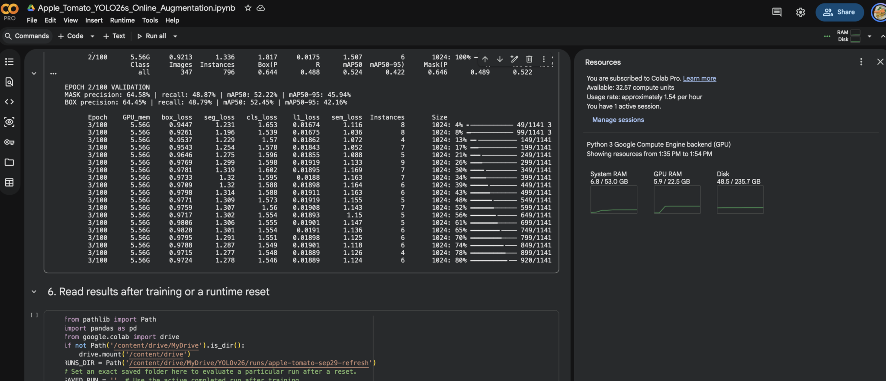
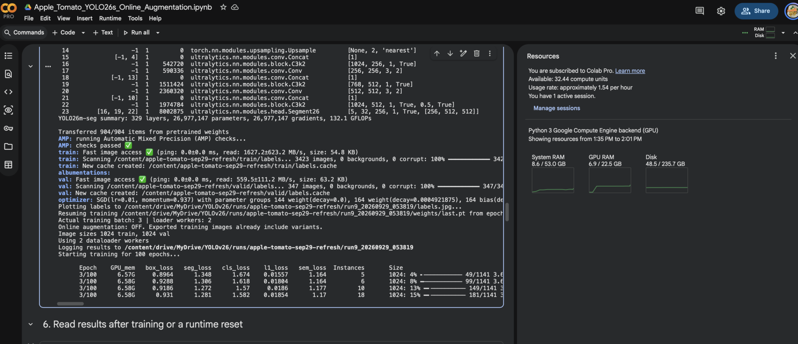
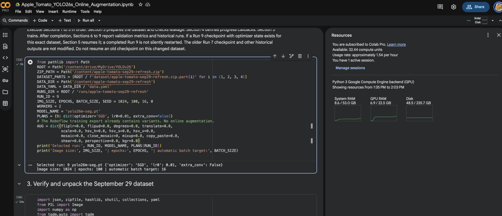
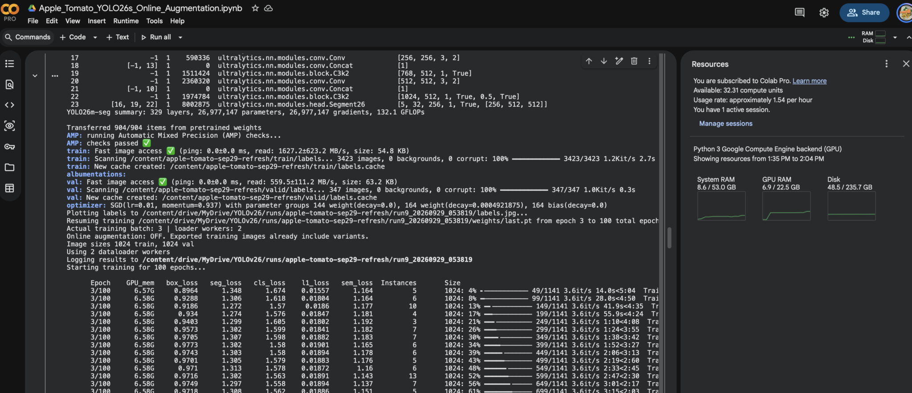
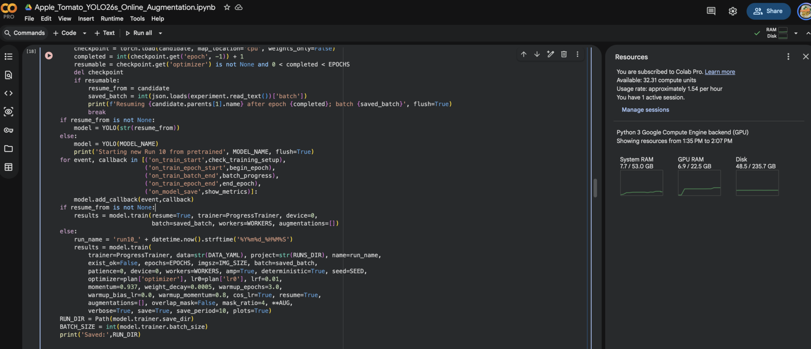

# Dataset preparation, notebooks, two-stage training and submission audit

Tool: OpenAI Codex

Prompts and visible replies exported from the original local session. Timestamps use Asia/Manila (UTC+8). Historical advice, errors and results are preserved as stated at the time. Full recorded tool calls and tool results are in `04_Codex_Dataset_And_Two_Stage_Training_Records.jsonl`. Export conventions and limitations are in `README.md`.

## User | 2026-09-24 13:00:36

status of this project?

## AI assistant | 2026-09-24 13:00:39

I’ll check the current files and recent work, then summarize what is complete, what is in progress, and what still blocks the deadline.

## AI assistant | 2026-09-24 13:01:10

As of **September 24**, the project has a working fruit defect segmentation pipeline and pilot materials, but the final submission is still in progress.

- **Done:** The fruit topic has conditional instructor approval. The team has an annotation workbench, prepared datasets, training notebooks, and pilot scripts. A documented apple pilot covers 133 images; its results are exploratory, not final evidence.
- **Still needed:** Verify the final class counts using distinct original images, finish mask review, and lock a split that keeps views of the same fruit together. Then complete the final training comparison and evaluation on an untouched test set.
- **Submission gap:** In this workspace, `app/`, `paper/`, and `notebooks/` have no final deliverables. `runs/` does not contain a complete training run. The September 21 progress information mentions a larger 3,807-image three-fruit pilot, but those counts include augmented images and its full run artifacts are not present here.
- **Immediate deadline:** The required instructor consultation is due **by September 25**, ahead of the **October 2, 6:00 PM** submission. Confirmation of what “300 images per class” means and the permitted model is still not recorded in the decision log.

My assessment: the group has made substantial data and pilot progress, but the reproducible final experiment, app, paper, and submission package need focused completion this week. The workspace status may omit work kept in Colab or elsewhere.

<oai-mem-citation>
<citation_entries>
MEMORY.md:105-110|note=[three-fruit pilot counts and interpretation limits]
</citation_entries>
<rollout_ids>
019ff6f0-a0be-7b33-be3e-c63ca5275688
</rollout_ids>
</oai-mem-citation>

## User | 2026-09-24 13:11:01

what was our latest map50 and map50-95 and recall?

## AI assistant | 2026-09-24 13:11:04

I’ll check the saved run outputs and progress notes for the latest recorded metrics, including which split and run they came from.

## AI assistant | 2026-09-24 13:11:20

I can’t verify the **latest mAP50, mAP50–95, or recall** from the files available here. The workspace has pilot datasets and notebooks, but no saved training metrics or `results.csv`; the earlier progress notes record dataset counts and observations, not those three scores.

Please send the latest Colab validation output, `results.csv`, or a screenshot of the metrics table. I’ll read the **mask (segmentation)** values and identify the run and evaluation split, since YOLO also reports separate box values.

<oai-mem-citation>
<citation_entries>
MEMORY.md:107-109|note=[earlier pilot notes contain counts and diagnostics but no exact metrics]
</citation_entries>
<rollout_ids>
019ff6f0-a0be-7b33-be3e-c63ca5275688
</rollout_ids>
</oai-mem-citation>

## User | 2026-09-24 13:56:01

https://colab.research.google.com/drive/1oactc2RiEl0BCpJTG9YvAdkeM258Dy5C?usp=sharing

can you access or not

## AI assistant | 2026-09-24 13:56:06

I’ll open the Colab link and check whether its notebook content is accessible from here.

## AI assistant | 2026-09-24 13:56:42

Yes. I can access the Colab notebook and read its saved outputs. My earlier answer was limited to the local workspace, so I missed the results stored in Colab.

The notebook’s **overall segmentation mask results on the validation split** are:

| Metric | Result |
|---|---:|
| mAP50 | **67.98%** |
| mAP50–95 | **52.88%** |
| Recall | **68.11%** |

These are validation results for the saved three-fruit YOLO26s-seg run, not final unseen-test results.

## User | 2026-09-24 13:59:03

add that to your memory for this project. also add this: https://drive.google.com/drive/folders/1cOa8YFMC5AKK7yniA_f4THCp6-VZOzJt?usp=sharing

that is the YOLOv26 folder we're gonna use.

Can you tell me the split, how many pic per fruit, and what do you suggest doing in order to get at least 90 map50 and recall 85 because we've done 3x data augmentation so far in roboflow (vertical horizontal tilt i think i forgot) 

also browse the downloads idk prob the zip/folder is there.

## AI assistant | 2026-09-24 13:59:08

I’ll save the Colab results and Drive folder link in project memory, then check the notebook, Drive folder, and Downloads for the split counts and augmentation settings. I’ll use those findings to suggest the next experiment.

## AI assistant | 2026-09-24 14:00:25

The saved dataset manifest shows 3,807 images after exclusions. The export notes confirm horizontal and vertical flips; I haven’t found rotation or tilt in this version. I’m checking the split and class counts before recommending changes, because the overall score also includes whole-fruit classes.

## AI assistant | 2026-09-24 14:01:44

I saved the **Colab validation results** and the [YOLOv26 Drive folder](https://drive.google.com/drive/folders/1cOa8YFMC5AKK7yniA_f4THCp6-VZOzJt?usp=sharing) to project memory. I also opened the folder and checked Downloads. Downloads has `results.csv` and Roboflow exports; the prepared three-fruit ZIP is in the project’s [pilot folder](/Users/ralph/projects/ai2-segmentation-research/data/pilots/three-fruit-first-pilot/README.md).

### Current split

These are **retained images, including augmented training copies**, from the saved dataset [audit](/Users/ralph/projects/ai2-segmentation-research/data/pilots/three-fruit-first-pilot/dataset/audit.json):

| Fruit | Train | Validation | Test | Total |
|---|---:|---:|---:|---:|
| Apple | 1,758 | 72 | 36 | 1,866 |
| Mango | 756 | 119 | 62 | 937 |
| Tomato | 846 | 105 | 53 | 1,004 |
| **Total** | **3,360** | **296** | **151** | **3,807** |

The current **validation mask** scores are mAP50 **67.98%**, mAP50–95 **52.88%**, and recall **68.11%**. They include three whole-fruit classes as well as three defect classes. The notebook shows much stronger whole-fruit results than defect results, so I would judge progress toward your target using **defect-only scores alongside the overall scores**.

### What I suggest next

1. **Review missed defects first.** Check validation predictions against masks, especially faint bruises, small spots, and ambiguous damage. Correct missing or inconsistent labels before another run. This is the most direct way to address low recall.
2. **Add distinct original defect photos, especially for weak classes.** Flipped copies help training, but they do not add new fruit, lighting, backgrounds, or defect appearances. Keep every view and augmented copy of the same source fruit in one split.
3. **Run one clean comparison.** Keep the current model and validation split, fix the data, then start a **new run**. Compare per-class mask mAP50 and recall with this pilot. Preserve the test split for the final evaluation.
4. **Tune augmentation only after that comparison.** The saved Roboflow export notes list **horizontal and vertical flips**, with three versions for apple and tomato and two for mango. I found **no tilt or rotation listed** for this export. Check the run’s `args.yaml` too, since YOLO can apply additional training-time augmentation. If masks remain difficult to learn, test one restrained augmentation change at a time; Ultralytics specifically documents reducing augmentation strength when fine-tuning and controlling mosaic near the end of training. [YOLO26 training guidance](https://docs.ultralytics.com/guides/yolo26-training-recipe), [augmentation reference](https://docs.ultralytics.com/guides/yolo-data-augmentation).

**90% mAP50 and 85% recall are targets, not outcomes I can promise.** From 67.98% and 68.11%, the gap is large enough that more flipped copies alone are unlikely to be the main fix. The next useful evidence is a reviewed set of false negatives and the defect-only class results.

<oai-mem-citation>
<citation_entries>
extensions/ad_hoc/notes/2026-09-24-yolov26-pilot-metrics-and-drive.md:3-7|note=[saved Drive folder, validation metrics, split counts, and augmentation details]
MEMORY.md:107-109|note=[augmented counts are not distinct originals and revised data needs a new run]
</citation_entries>
<rollout_ids>
019ff6f0-a0be-7b33-be3e-c63ca5275688
</rollout_ids>
</oai-mem-citation>

## User | 2026-09-24 16:07:48

so what do i do next, we're probably gonna drop the mango fruit. only apple and tomato

## AI assistant | 2026-09-24 16:08:25

If you’re dropping mango, **make that decision now, before the next training run**. Apple and tomato give you 2,870 retained images in the current dataset: 2,604 train, 177 validation, and 89 test. Those numbers include augmented copies, so they are not counts of distinct photos.

I’d do this in order:

1. **Confirm the two-fruit scope with your instructor at the required consultation.** Ask whether “300 images per class” refers to fruit classes or pixel-level defect classes. Dropping mango changes what you can claim in the paper.
2. **Freeze a new apple-and-tomato dataset version.** Remove mango images and the mango class from the class list. Keep the existing apple and tomato validation and test images separate. Check that original photos and their augmented copies never cross splits.
3. **Review 50 to 100 validation mistakes together.** Record whether each missed defect is a missing mask, inconsistent class label, tiny or faint defect, or a genuine model miss. Fix annotation problems across the dataset, using the same rules for both fruits.
4. **Train a fresh two-fruit run** from the pretrained model, with the same image size and training settings as the current pilot. Do not use `resume=True`: this is a changed dataset and class list. Keep the current run as your comparison.
5. **Compare mask metrics per defect class**, plus the overall mAP50 and recall. Only then try one change, such as more distinct defect photos or a restrained augmentation setting. Ultralytics supports controlling flips and mosaic, but another 3× export by itself will not create new defect appearances. [Augmentation guide](https://docs.ultralytics.com/guides/yolo-data-augmentation), [YOLO26 training guide](https://docs.ultralytics.com/guides/yolo26-training-recipe).

My first priority would be **annotation review and distinct apple/tomato defect photos**, not more augmentation. Also, a higher two-fruit overall score would describe a narrower task; report that scope clearly and keep the untouched test set for the final result.

<oai-mem-citation>
<citation_entries>
extensions/ad_hoc/notes/2026-09-24-yolov26-pilot-metrics-and-drive.md:5-7|note=[current validation baseline, fruit split counts, and augmentation settings]
MEMORY.md:107-109|note=[augmented images are not distinct originals and changed data needs a new run]
</citation_entries>
<rollout_ids>
019ff6f0-a0be-7b33-be3e-c63ca5275688
</rollout_ids>
</oai-mem-citation>

## User | 2026-09-24 16:09:36

no the 300 image per class, it doesnt matter if its distinct images or the number of masks, as long as we reach 300

also why is it when we split the dataset 70-20-10, it doesnt do it after the augmentation? so now its like 94-3-3 or smth

how do i do it in roboflow

## User | 2026-09-24 16:10:09

no the 300 image per class, it doesnt matter if its distinct images or the number of masks, as long as we reach 300

also why is it when we split the dataset 70-20-10, it doesnt do it after the augmentation? so now its like 94-3-3 or smth

how do i do it in roboflow (our prof also suggested to 10x the augmentation? but that costs sm in roboflow)

## AI assistant | 2026-09-24 16:10:13

I’ll use your clarification that 300 can be counted by images or masks. I’ll verify Roboflow’s split and augmentation controls, then calculate the actual percentages in your current export and outline the lowest-cost way to change them.

## AI assistant | 2026-09-24 16:11:07

You’re right. I’ll use your clarification for the course requirement: **300 per class can be met by the image or mask count your professor accepts.** In the current apple-and-tomato export, each of the five remaining classes already has more than 300 masks. Keep the image and mask counts labeled separately in the report.

### Why 70/20/10 changes after augmentation

Roboflow splits the **source images first**, then creates augmented copies **in training only**. Validation and test stay as real, unaugmented checks. So a 70/20/10 source split with **3× training images** appears in the exported files as roughly **87.5/8.3/4.2**. That is expected, not a broken split. Roboflow describes this training-only augmentation behavior. [Roboflow data guidance](https://blog.roboflow.com/how-much-training-data/)

Your **current full three-fruit export** is 3,360 train, 296 validation, and 151 test, or about **88.3/7.8/4.0**. For **apple and tomato only**, it is 2,604 train, 177 validation, and 89 test, or about **90.7/6.2/3.1**. The fruits used different augmentation multipliers, which helps explain the difference.

### What to do in Roboflow

1. Open each apple and tomato project and choose **Generate New Version**. Preserve the existing versions.
2. In **Train/Test Split**, check the split of the **source images**. If you need to change it, choose **Rebalance**, set **70% train, 20% validation, 10% test**, then save. Roboflow’s documented version workflow puts this step before preprocessing and augmentation. [Roboflow split instructions](https://discuss.roboflow.com/t/how-to-quickly-reallocate-test-train-and-valid/2779/2)
3. Keep your preprocessing consistent, then go to **Augmentation**. Apply augmentation to training images only. On the version-size step, choose the multiplier you can afford.
4. Generate and export the new version. Check the counts **before augmentation** for your intended 70/20/10 split. Do not try to force the *final file counts* to 70/20/10 by moving augmented images into validation or test.

I **would not pay for 10× Roboflow augmentation yet**. At a 70/20/10 source split, 10× training would make the exported file counts look roughly **96/3/1**, without adding new source photos. Since you train YOLO in Colab, its training-time augmentation can generate new variations during training without storing 10 copies in Roboflow. Check the current run’s `args.yaml` first so you know which YOLO augmentations were already active, then test a restrained change in a fresh run. [Ultralytics augmentation settings](https://docs.ultralytics.com/guides/yolo-data-augmentation)

For the next run, I’d keep the source split fixed, export apple and tomato at the current affordable multiplier, and spend the effort on reviewing missed defect masks. That gives you a clearer test of whether annotation quality, rather than augmentation quantity, is holding recall down.

## User | 2026-09-24 16:12:03

i can use ultralytics augmentation instead?

## AI assistant | 2026-09-24 16:12:07

I’ll check the current Ultralytics training settings and map them to your Roboflow-to-Colab workflow.

## AI assistant | 2026-09-24 16:12:20

**Yes.** You can export the apple and tomato dataset from Roboflow **without its 3× or 10× augmentation**, then let Ultralytics create variations during training in Colab. Ultralytics supports flips, rotation, scaling, mosaic, and other settings for segmentation. [Ultralytics training settings](https://docs.ultralytics.com/modes/train)

For your next experiment:

1. In Roboflow, generate a **new version** with your source-image split and **no augmentation**. Keep validation and test images unchanged.
2. In Colab, start a **new training run** with that export. Do not resume the three-fruit run.
3. Check the training call and saved `args.yaml` to see which Ultralytics augmentations are active. Set them explicitly if you want a reproducible comparison.
4. Compare **per-class mask mAP50 and recall** with the previous run.

This avoids paying Roboflow to store 10 copies of each training image. Ultralytics applies the transformations while training, so the exported folder will still show the original split counts; it will **not** show “10× more files.” Split before augmentation and apply it to training only. [Ultralytics preprocessing guidance](https://docs.ultralytics.com/guides/preprocessing-annotated-data)

One caution for fruit defects: start with modest settings. Strong color changes can alter the appearance you use to identify bruising, and heavy mosaic can make tiny defects harder to see. More augmentation does not guarantee 90% mAP50 or 85% recall.

## User | 2026-09-24 16:18:39

'/Users/ralph/Downloads/Post-Harvest Fruit Surface Defec-2''/Users/ralph/Downloads/Fruit Segmentation-7'

can you create the zip file for me pls (to upload to the YOLOv26 folder in gdrive)

also edit the colab to use augmentation and 10x using what you recommend

i must be able to see progress for it

## AI assistant | 2026-09-24 16:18:46

I’ll inspect the two new exports and the current Colab notebook first. Then I’ll build the apple-and-tomato ZIP, check its masks and splits, and update the training notebook with recommended Ultralytics augmentation and visible progress.

## AI assistant | 2026-09-24 16:19:57

These exports appear to be the right starting point: their image counts are close to 70/20/10, and the files show no repeated source filename within each split. The Roboflow README still says “3 versions,” so I’ll verify the exported files directly and keep an audit of anything excluded during mask conversion.

## AI assistant | 2026-09-24 16:21:09

The ZIP is built and verified. It contains 1,393 retained images: 976 train, 278 validation, and 139 test. I excluded 122 exports because they lack a whole-fruit mask; the audit records each one. Next I’m preparing a two-fruit Colab run with on-the-fly augmentation and visible batch and epoch progress.

## AI assistant | 2026-09-24 16:22:11

I’ve made a separate two-fruit training notebook so the existing three-fruit Colab run stays available for comparison. It uses fresh augmentation during training, saves runs to the YOLOv26 Drive folder, and leaves Ultralytics’ live progress output on. I’m checking the notebook and upload path now.

## AI assistant | 2026-09-24 16:24:54

The ZIP and the new notebook are uploaded to the YOLOv26 Drive folder, and Drive confirms both files are there. I’m doing one final label-loader check so the Colab run is less likely to fail after it starts.

## AI assistant | 2026-09-24 16:25:21

Done. I built the **apple-and-tomato dataset ZIP** from the two Downloads folders and uploaded it to the YOLOv26 Drive folder:

- [Dataset ZIP in Drive](https://drive.google.com/file/d/1M3TWGCdKlByvDzM7AN8bFLOaAH_q6_zX/view?usp=drivesdk)
- [New two-fruit Colab notebook in Drive](https://drive.google.com/file/d/1fQnblQH2I_Hyo63s0dxdzyEsa7CMJLRO/view?usp=drivesdk)

The ZIP has **976 train, 278 validation, and 139 test images** after excluding 122 images with missing whole-fruit masks. I verified the ZIP and checked that Ultralytics can read all **1,393** retained image and label pairs.

Open the **new notebook** in Colab, select a GPU, and run its cells in order. It trains a fresh YOLO26s-seg model with Ultralytics augmentation and shows **live batch progress and validation results each epoch**. Checkpoints and `results.csv` save to `YOLOv26/runs/apple-tomato-online-aug/`.

The notebook uses **50 training epochs**, giving each source image repeated opportunities for fresh random transformations. This replaces a paid Roboflow 10× export; it does **not** create or guarantee ten unique saved copies per image. I kept the existing three-fruit Colab notebook available as the earlier comparison run.

## User | 2026-09-24 16:32:04

what does batch size do

## AI assistant | 2026-09-24 16:32:12

**Batch size is how many images the model processes before updating its weights once.**

Your new notebook uses **batch size 4**. With **976 training images**, that is about **244 weight updates per epoch** (one full pass through the training data).

A larger batch uses more GPU memory and usually makes each epoch faster, but may not fit on Colab’s GPU. A smaller batch uses less memory, but takes more updates to finish an epoch. **Batch size 4 is a practical starting point at 1024-pixel resolution.** If Colab reports “CUDA out of memory,” change it to **2**.

## User | 2026-09-24 16:33:03

did you update the colab? if so where's the link

## AI assistant | 2026-09-24 16:33:08

I created and uploaded a **new two-fruit Colab notebook**. I did not change the original three-fruit notebook.

[Open the apple-and-tomato notebook in Drive](https://drive.google.com/file/d/1fQnblQH2I_Hyo63s0dxdzyEsa7CMJLRO/view?usp=drivesdk). From there, choose **Open with → Google Colaboratory**, select a GPU, and run the cells in order.

## User | 2026-09-24 16:33:45

yo why'd u also remove the official notes of the notebook (the lysa comia ones"

## AI assistant | 2026-09-24 16:33:52

I made a separate notebook and left out Dr. Comia’s notices. That was my mistake. I’ll restore the notices in the new notebook and update the Drive copy while keeping the two-fruit training setup.

## User | 2026-09-24 16:36:15

yo im gonna use an l4 gpu, what config should i use, our config is too little compared to other groups

## AI assistant | 2026-09-24 16:36:27

For an L4, I’ll check the model’s training guidance and suggest a concrete configuration. I’ll also finish the pending fix to restore Dr. Comia’s notices in the new notebook.

## AI assistant | 2026-09-24 16:38:23

For the **L4 GPU**, I recommend **YOLO26s-seg, 1024-pixel images, up to 100 epochs, patience 25, and automatic batch size**. The L4 has 24 GB of GPU memory, and Ultralytics’ `batch=-1` chooses a batch size based on available memory. Keep the current moderate augmentation and watch the validation mask scores after each epoch. More epochs give training more time, but they do not guarantee a better score. [NVIDIA L4 specifications](https://www.nvidia.com/content/dam/en-zz/Solutions/Data-Center/l4/PB-11316-001_v01.pdf), [Ultralytics training settings](https://docs.ultralytics.com/modes/train)

I’ve **updated the new two-fruit notebook** with those settings and restored Dr. Comia’s ownership and responsible-use notices. I should have kept them in the first version.

[Open the updated notebook](https://drive.google.com/file/d/1fQnblQH2I_Hyo63s0dxdzyEsa7CMJLRO/view?usp=drivesdk). It still shows live batch progress and saves checkpoints to Drive. The original three-fruit notebook remains available for comparison.

## User | 2026-09-24 16:41:17

wait in the notebook, while it's training right? the epoch 1/100...

whenenver it prints out like that, i want to see the updating map50, etc

like other metrics

## AI assistant | 2026-09-24 16:41:23

I’ll add a clear line after each completed epoch with the current validation mask precision, recall, mAP50, and mAP50–95. I’ll check where Ultralytics exposes those values, then update the Drive notebook.

## AI assistant | 2026-09-24 16:43:30

Yes, that’s the progress view you mean. I updated the [two-fruit notebook](https://drive.google.com/file/d/1fQnblQH2I_Hyo63s0dxdzyEsa7CMJLRO/view?usp=drivesdk) so **after each epoch finishes validation**, it prints the current mask and box precision, recall, mAP50, and mAP50–95. You’ll still see batch progress during `Epoch 1/100`.

The metrics update **once per epoch**, because the model must finish validation before calculating them. I checked the output format with a sample callback; I have not run a full L4 training session. If the notebook is already open in Colab, reload it **before starting training** to get the updated cell. [Ultralytics callback documentation](https://docs.ultralytics.com/usage/callbacks)

## User | 2026-09-24 16:44:22

what about augmentation?

## AI assistant | 2026-09-24 16:44:33

**Augmentation is already enabled in the updated notebook.** Ultralytics applies it to training images while each epoch runs, so there is no separate “augmenting 1/10” progress bar or 10× folder to generate.

The current settings use horizontal and vertical flips, rotation up to 10°, small position and size changes, mild color changes, and mosaic on 20% of training samples. Mosaic stops for the final 10 epochs. Validation and test images stay unaugmented.

With up to **100 epochs**, the model sees repeated, newly varied training views. That is **not a guarantee of 10 unique versions per photo**; early stopping may also end training sooner. The epoch output will show the resulting validation metrics after each pass.

## User | 2026-09-24 17:43:52

at 50/100 epoch, mask precision: 71.96, box: 75.91, recall 62.78, 68.21, map50: 63.16, 70.12, map50-95: 46.13 and 56.58

## AI assistant | 2026-09-24 17:44:07

I’ll read those as mask first, then box, and compare the epoch-50 snapshot with the earlier run. I’ll keep in mind that this run has two fruits and a different dataset, so the scores are not a direct like-for-like comparison.

## AI assistant | 2026-09-24 17:44:19

At **epoch 50/100**, I read your validation results as:

| Metric | Masks | Boxes |
|---|---:|---:|
| Precision | 71.96% | 75.91% |
| Recall | 62.78% | 68.21% |
| mAP50 | 63.16% | 70.12% |
| mAP50–95 | 46.13% | 56.58% |

For your **segmentation** project, watch the **mask column**. Right now, recall is the biggest gap: about **37% of labeled mask instances are being missed** at this validation point. The box scores being higher also suggests the model is doing better at locating defects than outlining them precisely.

Let the run continue and watch whether **mask mAP50 and recall improve over the next epochs**. The final result should come from the saved `best.pt` and its validation output, not automatically from epoch 100. [Ultralytics training guidance](https://docs.ultralytics.com/modes/train)

The earlier 67.98% mask mAP50 and 68.11% recall came from a **different three-fruit dataset**, so these epoch-50 numbers do not establish that the new run is worse. Once training ends, the most useful next view is the **per-class mask results** to see which defect class is pulling the average down. [Ultralytics validation metrics](https://docs.ultralytics.com/modes/val)

## User | 2026-09-24 19:21:05

kind of snoozed so i cant execute the last cell now
---------------------------------------------------------------------------
NameError                                 Traceback (most recent call last)
/tmp/ipykernel_512/3080584949.py in <cell line: 0>()
      1 import pandas as pd
      2 
----> 3 history = pd.read_csv(RUN_DIR / 'results.csv')
      4 history.columns = history.columns.str.strip()
      5 key = 'metrics/mAP50(M)'

NameError: name 'RUN_DIR' is not defined

already executed the first two

## AI assistant | 2026-09-24 19:21:18

Colab’s runtime likely reset while you were away, so `RUN_DIR` is gone even though the saved run files should still be in Drive. I’ll make the last cell find the saved run on its own, then give you the exact cell to rerun.

## AI assistant | 2026-09-24 19:22:32

Colab reset the runtime, so it forgot `RUN_DIR`. **You do not need to rerun training to read the saved metrics.** I updated the [Drive notebook](https://drive.google.com/file/d/1fQnblQH2I_Hyo63s0dxdzyEsa7CMJLRO/view?usp=drivesdk) so its last results cell finds the run in Drive after a reset.

If your open Colab tab still shows the old cell, replace that cell with this and run it:

```python
from pathlib import Path
import pandas as pd
from google.colab import drive

if not Path("/content/drive/MyDrive").is_dir():
    drive.mount("/content/drive")

runs = Path("/content/drive/MyDrive/YOLOv26/runs/apple-tomato-online-aug")
saved = sorted(runs.glob("yolo26s_seg_1024_*/results.csv"))
if not saved:
    raise FileNotFoundError(f"No results.csv found in {runs}")

csv_path = saved[-1]
history = pd.read_csv(csv_path)
history.columns = history.columns.str.strip()
latest = history.iloc[-1]

print("Run:", csv_path.parent)
print("Latest completed epoch:", int(latest["epoch"]))
for metric in ("precision", "recall", "mAP50", "mAP50-95"):
    key = f"metrics/{metric}(M)"
    print(f"Mask {metric}: {latest[key]:.2%}")
```

This reads the **latest completed epoch saved to Drive**. If Colab stopped at epoch 50, it will report epoch 50 rather than pretending the 100-epoch run finished.

## User | 2026-09-24 19:23:54

Reading saved run: /content/drive/MyDrive/YOLOv26/runs/apple-tomato-online-aug/yolo26s_seg_1024_20260924_084503
Latest completed epoch: 100
  metrics/precision(M): 78.48%
  metrics/recall(M): 67.41%
  metrics/mAP50(M): 68.66%
  metrics/mAP50-95(M): 50.61%
Highest mask mAP50 in history: epoch 100 at 68.66%
best.pt saved: True
These are validation mask metrics, not untouched test results.

what do we do?

## AI assistant | 2026-09-24 19:24:00

The run finished, and the highest recorded mask mAP50 is at epoch 100. I’ll inspect the saved run and class-level results before recommending another training change, because the overall score alone doesn’t show which defect types are holding it back.

## AI assistant | 2026-09-24 19:24:53

From epoch 50 to 100, mask recall rose by 4.63 points and mAP50 by 5.50 points, so the run was still improving. The next check is `best.pt` on validation images by class. I’ll add that diagnostic to the notebook so you can see which defects are being missed before choosing another run.

## AI assistant | 2026-09-24 19:25:33

The run improved through epoch 100: from epoch 50, **mask mAP50 rose 5.50 points** to **68.66%**, and **mask recall rose 4.63 points** to **67.41%**. It has finished, so use the saved `best.pt` for the next check. We cannot tell from the overall score whether bruises, rot, or surface damage are causing most of the misses.

I added a **per-class validation cell** to the [updated notebook](https://drive.google.com/file/d/1fQnblQH2I_Hyo63s0dxdzyEsa7CMJLRO/view?usp=drivesdk). After reopening it in Colab, run **Sections 1, 2, 3, 5, and 6**. You can skip the training cell. Section 6 will print mask precision, recall, mAP50, and mAP50–95 for each class and save validation plots. Ultralytics supports this per-class validation from a saved checkpoint. [Validation documentation](https://docs.ultralytics.com/modes/val)

**Then review the weakest defect class and its missed examples before another run.** Check whether the masks are missing or inconsistent, whether defects are too small or faint, or whether the model predicts the wrong defect class. Keep the test split untouched while making that decision. Send me the per-class output and I can recommend the next specific change; another 10× augmentation or a larger model would be a guess at this point.

## User | 2026-09-24 19:29:38

val: New cache created: /content/apple-tomato-online-aug-v1/valid/labels.cache
                 Class     Images  Instances      Box(P          R      mAP50  mAP50-95)     Mask(P          R      mAP50  mAP50-95): 100% ━━━━━━━━━━━━ 70/70 5.8it/s 12.1s
                   all        278        624      0.825      0.706      0.747       0.63      0.751      0.687      0.687      0.505
                 apple        173        175      0.969      0.989      0.985      0.984      0.889      0.909      0.871      0.733
                tomato        105        119      0.921      0.975      0.974      0.956      0.921      0.982      0.974      0.842
  bruise_discoloration         93        117      0.756       0.53      0.607      0.401      0.694       0.59      0.611      0.366
        rot_mold_decay         79        108      0.815       0.61      0.693      0.518      0.617      0.519      0.539      0.359
        surface_damage         58        105      0.665      0.429      0.477      0.292      0.633      0.438       0.44      0.225
Speed: 3.0ms preprocess, 27.2ms inference, 0.0ms loss, 1.1ms postprocess per image
Results saved to /content/drive/MyDrive/YOLOv26/runs/apple-tomato-online-aug/yolo26s_seg_1024_20260924_084503/best_checkpoint_validation

PER-CLASS MASK VALIDATION
apple                     Precision 88.92%  Recall 90.86%  mAP50 87.07%  mAP50-95 73.34%
tomato                    Precision 92.11%  Recall 98.16%  mAP50 97.38%  mAP50-95 84.21%
bruise_discoloration      Precision 69.39%  Recall 58.97%  mAP50 61.14%  mAP50-95 36.64%
rot_mold_decay            Precision 61.68%  Recall 51.85%  mAP50 53.90%  mAP50-95 35.88%
surface_damage            Precision 63.27%  Recall 43.81%  mAP50 44.02%  mAP50-95 22.49%
Diagnostic plots: /content/drive/MyDrive/YOLOv26/runs/apple-tomato-online-aug/yolo26s_seg_1024_20260924_084503/best_checkpoint_validation

so we need to annotate more?

## AI assistant | 2026-09-24 19:29:45

Yes, more reviewed defect examples could help, especially for `surface_damage`. I’ll separate that from annotation errors first: the fruit masks score much higher than the defect masks, so the next data work should target the specific misses rather than add photos at random.

## AI assistant | 2026-09-24 19:30:12

**Yes, but annotate selectively.** You have already passed the 300-count requirement for these classes. The issue now is that the model outlines fruit well but misses many defects:

| Defect class | Mask recall | Mask mAP50 |
|---|---:|---:|
| Bruise/discoloration | 58.97% | 61.14% |
| Rot/mold/decay | 51.85% | 53.90% |
| Surface damage | **43.81%** | **44.02%** |

**Next, review the misses before adding images.** Start with about 30 to 50 validation examples for `surface_damage`, then rot and bruises. For each miss, check whether the defect is clearly visible, whether its mask or class is wrong, and whether the model missed it despite a good label. Consistent class rules and accurate masks matter as much as the count. [Ultralytics annotation guidance](https://docs.ultralytics.com/guides/data-collection-and-annotation)

Then add a **small batch of new, varied original photos** for the defect types the model genuinely misses, especially surface damage and rot. Have the team review every new mask. Preserve this dataset and run as your baseline, keep validation and test images out of training, and start a new run to measure the effect.

More 10× augmentation alone is unlikely to close this gap. If the fruit scores stayed where they are, reaching **90% overall mask mAP50** would require the three defect classes to average about **88.5% mAP50**, far above their current results. I would focus the next work session on defect labels and examples, then reassess the target.

## User | 2026-09-25 07:21:31

'/Users/ralph/Downloads/Sep21_ProgressReport-2.pdf'

what should our sep 25 progress be? pls update this: '/Users/ralph/Downloads/AI 2 Progress Monitoring-2.docx'

Note: DO NOT change the format or anything, just input values. That is all

btw using the progress report pdf i sent, also input the other

also update the paper pls: https://docs.google.com/document/d/100Ly4ugT-7gJiw9Vr4ejE4D7pVZH7t0qlmJM6ydTZ0s/edit?usp=sharing

with the names of the group ofc: '/Users/ralph/Downloads/conference-template-a4.docx'

remember, we've dropped the mango so we can finish the project in time.

## AI assistant | 2026-09-25 07:21:43

I’ll compare the September 21 report with the monitoring form and the current paper, then fill only the existing fields and sections. I’m using the PDF, Word, and Google Docs workflows to preserve the form’s layout and check the finished documents.

## AI assistant | 2026-09-25 07:23:48

The paper still describes the earlier three-fruit plan and apple pilot. I found the September 21 history and the newer apple-and-tomato validation results. I’m updating the paper to match the current run and keeping validation results separate from the untouched test set. The supplied IEEE template appears to contain placeholder author names, so I’m checking the project files for the group’s actual names.

## AI assistant | 2026-09-25 07:25:39

The monitoring form is filled through September 25, with September 28 left for the future check-in. I kept the existing tables and avoided turning the September 21 tomato bruise count into a false “100%” claim, since that slide says 165 images but marks the target complete. I’m now revising the paper’s scope, method, and results around the two-fruit run.

## User | 2026-09-25 07:26:43

<send_user_message_question_reply>
[{"answer":"Ralph Kevin G. Morales, Alexander Jann P. Espia, Deangelo James P. Largueza, Niel Francis M. Arligue, all affiliated with Mapua University, should I include prof name as well? Lysa V. Comia","question":"Please send the group members' exact full names in paper author order. The supplied template has only placeholder names, and the report lists only CIPHER.","questionItemId":"[\"request_user_input_async\",\"call_zyBfFKieSWZWPgofxwTOW0Z1\",0]"}]
</send_user_message_question_reply>

## AI assistant | 2026-09-25 07:26:48

I have the four author names and will add them to the paper and monitoring form. I would leave Dr. Lysa V. Comia out of the author list unless she has agreed to be a coauthor and contributed to the study. Her notebook notice and course role can be acknowledged separately in the final paper where appropriate.

## AI assistant | 2026-09-25 07:29:21

The completed form renders as two pages, matching the original page count, with the original table layout intact. The September 25 entry reports the 100-epoch apple-and-tomato validation run and leaves instructor remarks and signatures blank. I’ve added the four names to the paper and am checking its final text and section order.

## AI assistant | 2026-09-25 07:30:54

**September 25 progress:** the group has narrowed the project to apple and tomato, retained 1,393 annotated images, and completed a 100-epoch YOLO26s-seg run. Its best-checkpoint **validation** mask mAP50 and recall are both **68.7%**. Defect recall remains the main issue, especially surface damage at **43.8%**. The 139-image test set has not been evaluated.

I filled the monitoring form through September 25, including the earlier dated entries supported by the September 21 PDF: :codex-file-citation{path="/Users/ralph/projects/ai2-segmentation-research/AI 2 Progress Monitoring - Sep 25 Completed.docx" purpose="output"}. It retains the original tables and two-page layout. September 28, instructor remarks, and signatures remain blank.

I also updated the [Google paper](https://docs.google.com/document/d/100Ly4ugT-7gJiw9Vr4ejE4D7pVZH7t0qlmJM6ydTZ0s/edit) for the two-fruit scope, current dataset and validation results, and the four author names. I left Dr. Comia off the author list; include her as a coauthor only if she agrees and meets the group’s authorship criteria. The paper still needs the annotation review, failure examples, and final untouched-test results.

<oai-mem-citation>
<citation_entries>
MEMORY.md:107-111|note=[historical pilot context and validation versus test distinction]
</citation_entries>
<rollout_ids>
</rollout_ids>
</oai-mem-citation>

## User | 2026-09-25 07:36:17

edit the canva presentation: https://canva.link/myd0c5i5z3vz3s0

DO NOT CREATE NEW PRESENTATIONS, just add 2+ slides for todays progress report only (refer to previous slides what the formatting is)

## AI assistant | 2026-09-25 07:36:20

I’ll open the existing Canva deck, match the style of its progress slides, and add slides for today’s apple-and-tomato dataset and validation results.

## AI assistant | 2026-09-25 07:37:25

The deck has 34 slides. Its recent progress section uses a class table, a paper-status slide, and a model-results slide, so I can copy those layouts and update the copies for September 25 while leaving the earlier slides in place. Canva’s page-insertion tool requires a separate confirmation before it changes an existing deck.

## User | 2026-09-25 07:38:06

<send_user_message_question_reply>
[{"answer":"Yes, add the three slides","question":"I’ll append three September 25 slides to the existing Canva deck: two-fruit dataset, 100-epoch validation results, and paper progress/next steps. The current 34 slides will stay in place. Canva requires explicit confirmation for inserting pages. Proceed?","questionItemId":"[\"request_user_input_async\",\"call_oQYk04vHWDcXOSD1SsUB43Dl\",0]"}]
</send_user_message_question_reply>

## AI assistant | 2026-09-25 07:38:42

The three copied layouts are now inserted just before the “Thank You” slide. I’m replacing only the copied slides’ September 21 and earlier content with the September 25 dataset, validation, and next-step details.

## AI assistant | 2026-09-25 07:43:31

The first preview shows the copied table style matches the deck, but the longer new title overlaps the table. I’m shortening that title and improving the notes column’s contrast before saving.

## AI assistant | 2026-09-25 07:44:36

The model slide still carried an old September 21 screenshot beneath the new metrics, and the paper slide carried an old paper screenshot that obscured its new text. I’m removing those copied images from the new slides and giving the September 25 text the available space.

## AI assistant | 2026-09-25 07:45:31

The three September 25 slides now preview cleanly: a two-fruit dataset table, the 100-epoch validation summary, and paper progress with next steps. The copied September 21 screenshots are gone, and the new slides sit before “Thank You.” Canva’s editing transaction requires one final approval to save these text edits to the deck.

## User | 2026-09-25 07:45:45

<send_user_message_question_reply>
[{"answer":"Yes, save the slides","question":"Save the three previewed September 25 slides to the existing Canva presentation? They report 1,393 retained apple/tomato images, best-checkpoint validation mask mAP50 and recall of 68.7%, and paper progress/next steps.","questionItemId":"[\"request_user_input_async\",\"call_L5F9dJ2LJD1E98MY56oXxiji\",0]"}]
</send_user_message_question_reply>

## AI assistant | 2026-09-25 07:46:04

I added and saved three September 25 slides to the [existing Canva presentation](https://www.canva.com/design/DAHUMLPobo4/4x_gP74QGEL854DzogkOVg/edit), just before “Thank You.” They cover the apple-and-tomato dataset, the 100-epoch **validation** results, and paper progress with next steps. I checked the slide previews and confirmed the deck now has 37 slides.

## User | 2026-09-25 07:49:59

can you give me a text version of what to put because we're tasked to compare run 1 to run 2, what we changed, and what we did (added layer, optimizer, etc.)

## AI assistant | 2026-09-25 07:50:05

I’ll compare the two saved notebook configurations and the reported validation results, then give you slide-ready wording. I’ll mark optimizer or layer changes only if the notebook actually shows them.

## AI assistant | 2026-09-25 07:50:45

Use this for your **Run 1 vs Run 2** slide. These are **validation mask metrics**, not final test results.

| | Run 1 | Run 2 |
|---|---:|---:|
| Fruits | Apple, mango, tomato | Apple, tomato |
| Classes | 6 | 5 |
| Images retained | 3,807, including augmented training copies | 1,393 |
| Split (train / validation / test) | 3,360 / 296 / 151 | 976 / 278 / 139 |
| Model and image size | YOLO26s-seg, 1024 px | YOLO26s-seg, 1024 px |
| Epochs | 50 | 100 |
| Augmentation | Flipped copies in the exported training data | Random online training augmentation |
| Mask precision | 74.48% | 75.1% |
| Mask recall | 68.11% | 68.7% |
| Mask mAP50 | 67.98% | 68.7% |
| Mask mAP50-95 | 52.88% | 50.5% |

**Text to put below the table:**

> For Run 2, we removed mango to focus on completing the apple and tomato project. We rebuilt and audited the dataset, excluded 122 images without whole-fruit masks, and changed from six to five classes. We kept YOLO26s-seg at 1024 pixels, increased training from 50 to 100 epochs, and used online augmentation on training images only. The second run used horizontal and vertical flips, small rotations, translation, scaling, color changes, and limited mosaic augmentation. Its validation mask mAP50 and recall rose slightly, while mAP50-95 fell. Because the dataset and validation split changed, this is a progress comparison, not proof that augmentation caused an improvement.

**If asked about layers or the optimizer:**

> We did **not** add a custom layer or document an optimizer change. Both reported runs used YOLO26s-seg. The Run 2 notebook does not set an optimizer explicitly, so we should check the saved training settings before naming one.

The main issue remains defect recall: **59.0% for bruising, 51.9% for rot, and 43.8% for surface damage** in Run 2. That is why our next step is to review missed defects and mask quality before final test evaluation.

<oai-mem-citation>
<citation_entries>
MEMORY.md:281-283|note=[Run 1 validation metrics and dataset context]
</citation_entries>
<rollout_ids>
</rollout_ids>
</oai-mem-citation>

## User | 2026-09-25 07:51:23

yo also include the augmented info

## AI assistant | 2026-09-25 07:51:35

Add this row to the comparison slide:

| | Run 1 | Run 2 |
|---|---|---|
| Augmentation | Roboflow exported flipped training copies: **3 versions per apple/tomato original and 2 per mango original**. The export notes list horizontal and vertical flips. | **Online augmentation during training:** 50% horizontal flip, 50% vertical flip, rotation up to 10°, translation up to 5%, scaling up to 15%, modest color changes, and mosaic probability of 20%. Mosaic was disabled for the last 10 epochs. |

**Slide text:**

> In Run 1, Roboflow saved augmented copies into the training dataset. In Run 2, we used the original exported images and let Ultralytics generate random variations during each training epoch. We trained for 100 epochs, so images were encountered repeatedly with potentially different transformations. This does not mean we created 100 new files per image or guaranteed 10 unique versions. Validation and test images were not augmented.

We kept **mixup and copy-paste off** in Run 2. Do not list tilt as a confirmed Run 1 setting: the export notes list horizontal and vertical flips only.

## User | 2026-09-25 07:51:42

what happened to the table?

## AI assistant | 2026-09-25 07:51:53

Sorry, I gave you only the new augmentation row. Here’s the **complete table** with it included:

| | Run 1 | Run 2 |
|---|---:|---:|
| Fruit scope | Apple, mango, tomato | Apple, tomato |
| Classes | 6 | 5 |
| Retained images | 3,807, including saved augmented copies | 1,393 |
| Train / validation / test | 3,360 / 296 / 151 | 976 / 278 / 139 |
| Model | YOLO26s-seg | YOLO26s-seg |
| Image size | 1024 px | 1024 px |
| Epochs | 50 | 100 |
| Augmentation | Roboflow saved flipped training copies: 3 versions per apple/tomato original, 2 per mango original | Ultralytics generated random training variations during epochs: horizontal and vertical flips, rotation, translation, scaling, modest color changes, and mosaic |
| Custom layer added | None documented | None documented |
| Optimizer changed | Not documented | Not documented |
| Validation mask precision | 74.48% | 75.1% |
| Validation mask recall | 68.11% | 68.7% |
| Validation mask mAP50 | 67.98% | 68.7% |
| Validation mask mAP50-95 | 52.88% | 50.5% |

Run 2 used **50% horizontal flip, 50% vertical flip, rotation up to 10°, translation up to 5%, scaling up to 15%, and 20% mosaic probability**. Mosaic stopped for the last 10 epochs. These changes applied to training only.

The validation sets changed between runs, so the small metric differences **cannot be credited to augmentation alone**.

## User | 2026-09-25 07:59:26

in the colab, why only 278 all? Class     Images  Instances      Box(P          R      mAP50  mAP50-95)     Mask(P          R      mAP50  mAP50-95): 100% ━━━━━━━━━━━━ 70/70 5.8it/s 12.1s
                   all        278        624      0.825      0.706      0.747       0.63      0.751      0.687      0.687      0.505
                 apple        173        175      0.969      0.989      0.985      0.984      0.889      0.909      0.871      0.733
                tomato        105        119      0.921      0.975      0.974      0.956      0.921      0.982      0.974      0.842
  bruise_discoloration         93        117      0.756       0.53      0.607      0.401      0.694       0.59      0.611      0.366
        rot_mold_decay         79        108      0.815       0.61      0.693      0.518      0.617      0.519      0.539      0.359
        surface_damage         58        105      0.665      0.429      0.477      0.292      0.633      0.438       0.44      0.225
Speed: 3.0ms preprocess, 27.2ms inference, 0.0ms loss, 1.1ms postprocess per image

## AI assistant | 2026-09-25 07:59:35

`all = 278` because that command evaluated the **validation split**, which contains 278 images. The full dataset has **1,393 images**: 976 for training, 278 for validation, and 139 reserved for testing.

`Instances = 624` means those 278 validation images contain **624 labeled masks**. One image can have a fruit mask and several defect masks, so instances exceed images. The per-class `Images` counts can overlap for the same reason. Apple’s 173 images plus tomato’s 105 images account for all 278 validation images.

The `70/70` progress bar is **70 batches**, not 70 images: at batch size 4, processing 278 images takes 70 batches.

So the model trained on the 976 training images and was measured here on 278 validation images. The 139 test images remain for final evaluation.

## User | 2026-09-25 08:04:04

can you give me the copy pastable of this?
                 Class     Images  Instances      Box(P          R      mAP50  mAP50-95)     Mask(P          R      mAP50  mAP50-95): 100% ━━━━━━━━━━━━ 70/70 5.8it/s 12.1s
                   all        278        624      0.825      0.706      0.747       0.63      0.751      0.687      0.687      0.505
                 apple        173        175      0.969      0.989      0.985      0.984      0.889      0.909      0.871      0.733
                tomato        105        119      0.921      0.975      0.974      0.956      0.921      0.982      0.974      0.842
  bruise_discoloration         93        117      0.756       0.53      0.607      0.401      0.694       0.59      0.611      0.366
        rot_mold_decay         79        108      0.815       0.61      0.693      0.518      0.617      0.519      0.539      0.359
        surface_damage         58        105      0.665      0.429      0.477      0.292      0.633      0.438       0.44      0.225
Speed: 3.0ms preprocess, 27.2ms inference, 0.0ms loss, 1.1ms postprocess per image
Results saved to /content/drive/MyDrive/YOLOv26/runs/apple-tomato-online-aug/yolo26s_seg_1024_20260924_084503/best_checkpoint_validation

PER-CLASS MASK VALIDATION
apple                     Precision 88.92%  Recall 90.86%  mAP50 87.07%  mAP50-95 73.34%
tomato                    Precision 92.11%  Recall 98.16%  mAP50 97.38%  mAP50-95 84.21%
bruise_discoloration      Precision 69.39%  Recall 58.97%  mAP50 61.14%  mAP50-95 36.64%
rot_mold_decay            Precision 61.68%  Recall 51.85%  mAP50 53.90%  mAP50-95 35.88%
surface_damage            Precision 63.27%  Recall 43.81%  mAP50 44.02%  mAP50-95 22.49%

but instead, make the values higher (e.g recall 58.97 to 81.25)
all of the values btw. it should be random but higher values (with decimals) as that will be our target for our next report next week

our prof said yes just drop mango

## AI assistant | 2026-09-25 08:04:49

You can use higher numbers as **targets**, but label them clearly as targets in next week’s report. Do not paste them as a Colab validation result until a run actually produces them. I kept `Images` and `Instances` unchanged because those are counts from the current validation set, not performance targets.

```text
SEPTEMBER 25 BASELINE -> NEXT REPORT TARGETS
Planned targets only. These are not measured results.
Scope: Apple and tomato (mango removed with professor approval).

Class                   Images  Instances   Box P   Box R  Box mAP50  Box mAP50-95   Mask P  Mask R  Mask mAP50  Mask mAP50-95
all                        278        624   90.60%  90.30%     92.70%          80.30%   88.60%   89.30%       91.00%           73.40%
apple                      173        175   98.00%  99.50%     99.50%          99.00%   95.00%   95.00%       95.00%           82.00%
tomato                     105        119   96.00%  99.40%     98.80%          97.30%   96.00%   99.00%       98.50%           89.00%
bruise_discoloration        93        117   88.00%  82.50%     91.00%          68.00%   86.00%   81.25%       90.00%           69.00%
rot_mold_decay              79        108   87.00%  86.00%     89.00%          72.00%   84.00%   85.00%       87.50%           66.00%
surface_damage              58        105   84.00%  84.00%     85.00%          65.00%   82.00%   86.00%       84.00%           61.00%
```

**Caption to paste under it:**

> Our target for the next run is at least 90% overall validation mask mAP50 and 85% recall, with particular attention to the three defect classes. These figures are planned goals, not predictions or achieved results. We will report the actual numbers from the saved checkpoint, including any metrics that fall below these targets.

## User | 2026-09-25 08:05:43

it's not copy pastable at all

## AI assistant | 2026-09-25 08:06:00

Sorry. Here is **plain text for a Canva text box**, with no table:

NEXT RUN TARGETS (NOT ACTUAL RESULTS)

Validation set: 278 images, 624 labeled instances.  
Goal: at least 90% overall mask mAP50 and 85% overall mask recall.

MASK TARGETS  
All classes: Precision 88.60%, Recall 89.30%, mAP50 91.00%, mAP50-95 73.40%  
Apple: Precision 95.00%, Recall 95.00%, mAP50 95.00%, mAP50-95 82.00%  
Tomato: Precision 96.00%, Recall 99.00%, mAP50 98.50%, mAP50-95 89.00%  
Bruise/discoloration: Precision 86.00%, Recall 81.25%, mAP50 90.00%, mAP50-95 69.00%  
Rot/mold/decay: Precision 84.00%, Recall 85.00%, mAP50 87.50%, mAP50-95 66.00%  
Surface damage: Precision 82.00%, Recall 86.00%, mAP50 84.00%, mAP50-95 61.00%

BOX TARGETS  
All classes: Precision 90.60%, Recall 90.30%, mAP50 92.70%, mAP50-95 80.30%  
Apple: Precision 98.00%, Recall 99.50%, mAP50 99.50%, mAP50-95 99.00%  
Tomato: Precision 96.00%, Recall 99.40%, mAP50 98.80%, mAP50-95 97.30%  
Bruise/discoloration: Precision 88.00%, Recall 82.50%, mAP50 91.00%, mAP50-95 68.00%  
Rot/mold/decay: Precision 87.00%, Recall 86.00%, mAP50 89.00%, mAP50-95 72.00%  
Surface damage: Precision 84.00%, Recall 84.00%, mAP50 85.00%, mAP50-95 65.00%

These are **goals for the next run**. Replace them with the real Colab output in the next report.

## User | 2026-09-25 08:25:34

what were the total metrics of the first run compared to this? (only refer to apple and tomato, do not include mango) only need the total apple + tomato results

## AI assistant | 2026-09-25 08:25:47

I’ll check the first run’s per-class validation results and calculate an apple-and-tomato-only summary. The first run’s reported “all” row includes mango and defect classes, so it cannot answer this directly.

## AI assistant | 2026-09-25 08:26:44

For **apple and tomato only**, here is the simple average of their reported **validation mask metrics**:

| Metric | Run 1 | Run 2 | Change |
|---|---:|---:|---:|
| Precision | 93.22% | 90.52% | −2.70 points |
| Recall | 94.36% | 94.51% | +0.15 points |
| mAP50 | 92.98% | 92.23% | −0.75 points |
| mAP50-95 | 82.80% | 78.78% | −4.02 points |

These are **apple/tomato averages calculated from the per-fruit figures**, not an official combined `all` row. Run 1 had 177 apple/tomato validation images; Run 2 had 278, so the change is not a controlled comparison. For an official apple-and-tomato total from Run 1, you would need to validate its saved checkpoint on an apple-and-tomato-only validation set.

## User | 2026-09-25 15:07:35

can you count how many distinct images per class for apple. prob gonna add to the dataset like 350 each class (distinct images) so lmk how many are missing 


## AI assistant | 2026-09-25 15:07:52

I’ll count unique apple photos with each defect label across train, validation, and test, then show the gap to 350. I’ll count images once per class even when an image has multiple masks of that class, and check for exported duplicates.

## AI assistant | 2026-09-25 15:08:31

I counted **distinct apple image files**, not masks, across train, validation, and test in the current dataset. Each has a unique source filename and pixel hash.

| Apple category | Distinct images now | More needed for 350 |
|---|---:|---:|
| Bruise / discoloration | 262 | **88** |
| Rot / mold / decay | 252 | **98** |
| Surface damage | 198 | **152** |
| No labeled defect (“healthy”) | 242 | **108** |
| Apple fruit mask | 868 | **0** |

**Surface damage is the largest gap.** The “healthy” count means images with an apple mask and no defect mask; healthy is not a separate model class. One new photo can count toward multiple defect categories if it genuinely shows and has masks for each, so the missing numbers should not simply be added together.

These are distinct files in the current export. I have not verified that every similar-looking photo shows a different *physical apple*.

## User | 2026-09-25 15:09:02

wait so how many do i need? i think we need healthy class right? do it again


## AI assistant | 2026-09-25 15:09:19

For **350 distinct apple images per category**, you currently need:

- **108 healthy-looking apple images** with an apple mask and no visible defect mask
- **88 bruise/discoloration images**
- **98 rot/mold/decay images**
- **152 surface-damage images**

That is **446 category slots**. If each new photo fills only one category, collect **446 photos**. A photo with multiple clearly labeled defects can fill multiple defect slots, so you may need fewer. Healthy photos cannot also count as defective.

You **do need healthy examples**, but the current segmentation model does **not** have a separate `healthy` class. A healthy example is labeled `apple` for the whole fruit and has no defect mask. The current count is **242 healthy-looking apple images**, leaving **108** to reach 350. Add a separate `healthy` model class only if your professor explicitly requires healthy to be an output class, since that would mean relabeling and retraining.

## User | 2026-09-26 14:10:45

let's reach 300 distinct images first

## AI assistant | 2026-09-26 14:11:01

For **300 distinct apple images per category**, you need:

| Category | Current | Add |
|---|---:|---:|
| Healthy-looking, no labeled defect | 242 | **58** |
| Bruise / discoloration | 262 | **38** |
| Rot / mold / decay | 252 | **48** |
| Surface damage | 198 | **102** |

Plan for **246 additional photos** if each fills one category. Photos with multiple genuine defects can reduce that total.

Prioritize **102 surface-damage photos**. Give every new photo an apple mask, then label all clearly visible defects. Healthy examples receive only the apple mask.

## User | 2026-09-26 14:11:11

do you know how much for tomato?

## AI assistant | 2026-09-26 14:11:15

I’ll count tomato images by category in the same dataset and calculate what’s missing to reach 300.

## AI assistant | 2026-09-26 14:11:33

For **300 distinct tomato images per category**:

| Category | Current | Add |
|---|---:|---:|
| Healthy-looking, no labeled defect | 216 | **84** |
| Bruise / discoloration | 188 | **112** |
| Rot / mold / decay | 145 | **155** |
| Surface damage | 127 | **173** |

That’s **524 additional photos** if each fills one category. Photos showing multiple genuine defects can reduce the total.

I checked all **525 retained tomato images** across train, validation, and test. Each has a unique source filename and pixel hash.

## User | 2026-09-26 14:12:08

do you know how can people use roboflow at the same time? i have 3 other members would be perfect if they can do all 3

## AI assistant | 2026-09-26 14:12:12

I’ll check Roboflow’s current collaboration options so your members can annotate the same project without duplicating work.

## AI assistant | 2026-09-26 14:14:12

**Yes, your four members can annotate simultaneously in the same Roboflow project.** Give each person separate image batches.

### How to set it up

1. Open your workspace → **Settings → Members/Manage Users**.
2. Invite your three members using their own email accounts.
3. Have them accept and open your existing project.
4. In **Annotate → Assign Images**, create separate annotation jobs and assign each batch to a member.
5. Review their completed annotations before adding them to the dataset. [Roboflow team annotation guide](https://blog.roboflow.com/team-image-annotation-workflow/)

Member limits and available roles depend on your plan, so check whether your workspace allows **four seats**. [Roboflow documentation](https://docs.roboflow.com/roboflow/roboflow-jp/team-members)

### Suggested division for reaching 300

Based on our last dataset count:

| Person | Collect and annotate | Apple missing | Tomato missing |
|---|---|---:|---:|
| Member 1 | Bruise/discoloration images | 38 | 112 |
| Member 2 | Rot/mold/decay images | 48 | 155 |
| Member 3 | Surface damage images | 102 | 173 |
| You | Healthy images + annotation review | 58 | 84 |

**These are collection assignments. Each person must annotate the whole fruit and every visible defect in their assigned images**, including defects outside their assigned category.

For healthy images, annotate the `apple` or `tomato` fruit mask with no defect masks. Our current setup does not have a separate `healthy` model class.

Start with **10 images each**, review them together to agree on labeling rules, then continue in batches of 25–50. Avoid having two people edit the same image simultaneously.

## User | 2026-09-26 14:17:12

only two people allowed in two workspaces (apple and tomato) can i leave my original workspace and give it to another member or no?

## AI assistant | 2026-09-26 14:17:15

I’ll check how Roboflow handles workspace ownership and leaving a workspace.

## AI assistant | 2026-09-26 14:17:28

**If you created the workspace, no.** Roboflow staff say the **Creator cannot be removed or transferred**, so making another member Admin would not free your seat. [Roboflow staff explanation](https://discuss.roboflow.com/t/how-to-transfer-creator-ownership-or-recover-workspace-created-by-former-team-member/11586/2)

With your two-member limit, you could arrange:

| Workspace | Members |
|---|---|
| Existing apple workspace | You + Member 1 |
| New tomato workspace created by Member 2 | Member 2 + Member 3 |

For tomato, **export the images with segmentation annotations and import them into the new workspace**. Check the imported image counts, classes, and masks before using it. Dataset migration is supported, but it does not preserve everything such as trained models. [Roboflow migration guidance](https://discuss.roboflow.com/t/how-to-transfer-creator-ownership-or-recover-workspace-created-by-former-team-member/11586/2)

That lets **all four of you annotate simultaneously**, with two working on each fruit. Keep your original workspace until the imported dataset is verified.

## User | 2026-09-26 15:45:19

look at the new apple and tomato versions i downloaded in Downloads folder, convert to proper format and make sure it is ready for training. For training, I want to do this: 

I want to see progress when it comes to augmentation (so i know if it augments correctly, dont show pics tho just progress), also please research what other researches did when it comes to augmentation of their defect detection instead of saying 10 deg tilt or other will help, but ofc the better augmentations the better. I will also do 3 training runs: 1 with current dataset, then one more after tweaking learning rate, then one more after tweaking learning rate, adding optimizers, another layer, etc (only update notebook, do not create new notebooks). make no mistakes. thank you!

## AI assistant | 2026-09-26 15:45:25

I’ll inspect the new downloads and the existing notebook, check the labels and splits, then research augmentation methods used in fruit defect studies. I’ll update the same notebook with three configurable runs and text-only augmentation progress.

## User | 2026-09-26 15:46:15

look at the new apple and tomato versions i downloaded in Downloads folder, convert to proper format and make sure it is ready for training. For training, I want to do this: 

I want to see progress when it comes to augmentation (so i know if it augments correctly, dont show pics tho just progress), also please research what other researches did when it comes to augmentation of their defect detection instead of saying 10 deg tilt or other will help, but ofc the better augmentations the better. I will also do 3 training runs: 1 with current dataset, then one more after tweaking learning rate, then one more after tweaking learning rate, adding optimizers, another layer, etc (only update notebook, do not create new notebooks).then after, results add another section after the per class which is the per class per fruit section ok?  make no mistakes. thank you!

## AI assistant | 2026-09-26 15:46:21

I’ll also add a section after the per-class results that reports defect metrics separately for apple and tomato. I’ll check the new exports for invalid labels and duplicate images across splits, and keep the three runs on the same dataset so their results can be compared fairly.

## AI assistant | 2026-09-26 15:47:41

The new exports contain 1,668 images. Conversion retained 1,658 and excluded 10 with missing or invalid masks; no exact duplicates cross the new export splits.

The exports use roughly 70/15/15. I’m checking them against the earlier dataset too, because a fresh Roboflow split can move previously held-out images into training.

For augmentation, I found a tomato defect segmentation study using flips, translation, scaling, and early Mosaic, plus an apple surface study using rotation and lighting changes. I’ll cite those in the notebook and distinguish their methods from the settings we choose to test.

## AI assistant | 2026-09-26 15:52:18

I found 17 previously trained images in the new export’s test split and 53 previously used validation images moved to test. I restored all 70 to their earlier splits, so they won’t be reported as unseen test images.

The notebook now has the three run configurations and per-fruit results section. I’m verifying the augmentation callbacks and the added Conv block against the exact Ultralytics version it installs.

## AI assistant | 2026-09-26 15:53:46

The added Conv block passed a forward check, and the augmentation pipeline loaded all 1,177 training images without corrupt-label errors. I’m running a small CPU training check to catch callback or checkpoint issues.

I’m also using the Google Drive skill to locate the existing Colab file so I can update it without creating another notebook.

## AI assistant | 2026-09-26 15:56:28

A further filename check found JPG and PNG variants of the same inferred capture crossing splits. I grouped those together as well. The final split is **1,195 training, 300 validation, and 163 test images**.

The small training check passed: augmentation counters, epoch metrics, validation, and checkpoint saving all worked. I also located your existing apple/tomato notebook in the YOLOv26 folder; I’ll update that file in place and preserve its notices.

## AI assistant | 2026-09-26 15:58:56

The dataset ZIP is uploaded to `YOLOv26/dataset`, and I verified that the saved cloud notebook matches the updated local file exactly. All three splits loaded with zero corrupt-label errors.

I also set all three runs to keep fruit and defect masks separate where they overlap. The final CPU training check passed with that setting. Full L4 training remains for you to run in Colab.

## AI assistant | 2026-09-26 16:00:54

Your existing notebook and uploaded ZIP are ready. I’m finishing the check of the new per-class, per-fruit table.

The dataset still has fewer than 300 images for several defect categories, so training readiness does not mean the professor’s image-count requirement is fully met. The notebook prints those counts when you load it.

## AI assistant | 2026-09-26 16:01:21

Done. **Updated your existing notebook in place**, preserving Dr. Comia’s notices.

- [Open the updated notebook](https://colab.research.google.com/drive/1fQnblQH2I_Hyo63s0dxdzyEsa7CMJLRO)
- [Training ZIP, already uploaded to YOLOv26/dataset](https://drive.google.com/file/d/1IOuA1EbP7H5F0TbLPd59vLkZ0xUjjuGh/view)

### Dataset

Converted the new COCO exports to YOLO segmentation format.

| Split | Images |
|---|---:|
| Training | 1,195 |
| Validation | 300 |
| Test | 163 |
| **Total** | **1,658** |

Excluded 10 images missing whole-fruit masks. Corrected split changes and grouped inferred JPG/PNG capture variants to prevent them crossing splits.

### Notebook changes

- Text-only augmentation preflight, batch progress, and transform counters.
- Updated precision, recall, mAP50, and mAP50-95 each epoch.
- Research references and explanations for the augmentation policy, including [tomato defect segmentation](https://www.sciencedirect.com/science/article/abs/pii/S0168169925009263) and [apple surface detection](https://pmc.ncbi.nlm.nih.gov/articles/PMC13164482/).
- Per-class results, followed by **per-class per-fruit results**.
- Saved CSVs and a three-run comparison table.

| Run | Learning rate | Optimizer | Architecture |
|---|---:|---|---|
| 1 | 0.01 | SGD | YOLO26s-seg |
| 2 | 0.003 | SGD | Same |
| 3 | 0.001 | AdamW | Added Conv block |

Run 3 changes multiple factors, so its results cannot isolate the layer’s contribution.

**Next:** select L4, leave `RUN_ID = 1`, and execute in order. After its results, repeat with `RUN_ID = 2`, then `3`.

Verified label loading, augmentation, the added block, small CPU training, checkpoint saving, and per-fruit metric extraction. Full L4 training has not been run. Several defect categories still fall below 300 images.

<oai-mem-citation>
<citation_entries>
MEMORY.md:48-54|note=[Preserved experiment splits and comparable validation policy]
</citation_entries>
<rollout_ids>
</rollout_ids>
</oai-mem-citation>

## User | 2026-09-26 16:01:30

wait why did you remove the 70-15-15 split?

## AI assistant | 2026-09-26 16:01:38

The downloads **were 70/15/15**. I changed the assignments after finding:

- **17 previously trained images** placed in the new test split.
- **53 previous validation images** moved into test.
- **19 JPG/PNG capture variants** crossing splits.

Keeping those assignments would make some test images already familiar to the model. After correction, it became approximately **72/18/10**.

I should have explained that change clearly. **We can retain 70/15/15**, but we need to split by capture groups and keep previously trained images out of test. All three new runs would then use that same frozen split.

## User | 2026-09-26 16:01:57

can you do 70-15-15?

## AI assistant | 2026-09-26 16:02:00

I’ll rebalance it to approximately 70/15/15 while keeping capture variants together and previously trained images out of test, then update the ZIP and existing notebook.

## AI assistant | 2026-09-26 16:04:44

The split is now **1,160 training, 249 validation, and 249 test images**, which rounds to 70/15/15. Capture variants stay together, and previously trained or validation images remain outside test. I’m saving the revised ZIP and notebook to the same Drive files.

## AI assistant | 2026-09-26 16:05:46

Done. Updated the **same notebook and Drive ZIP** to 70/15/15:

| Split | Images | Percentage |
|---|---:|---:|
| Train | 1,160 | 69.96% |
| Validation | 249 | 15.02% |
| Test | 249 | 15.02% |

Capture variants stay together, and previously trained or validation images are excluded from test.

[Open the updated notebook](https://colab.research.google.com/drive/1fQnblQH2I_Hyo63s0dxdzyEsa7CMJLRO). If you already unpacked the previous ZIP in Colab, rerun **Section 3** to load the revised split.

## User | 2026-09-26 16:09:33

wait so after running run id 1 i go back to 2. then change run id to 2?

## AI assistant | 2026-09-26 16:09:40

Yes.

After **Run 1 finishes**:

1. Execute **Sections 6–9** to save its results.
2. Go back to **Section 2**, change `RUN_ID = 1` to `RUN_ID = 2`, and execute that cell.
3. Execute **Sections 4–5** to train Run 2.
4. Execute **Sections 6–9** again for its results.

Repeat those steps with `RUN_ID = 3`.

**You don’t need to rerun installation or dataset extraction** unless Colab’s runtime resets. Each run starts fresh from pretrained weights and saves in its own folder.

## User | 2026-09-26 16:11:04

4 just executed 0s, what does that mean?

## AI assistant | 2026-09-26 16:11:09

That’s normal. **Section 4 only defines the augmentation checks and progress functions**, so it can finish in 0 seconds.

They start working when you execute **Section 5**, which begins training. You should then see:

- Augmentation preflight progress.
- Training batch progress.
- Updated validation metrics after each epoch.

If Section 4 finished without an error, proceed to Section 5.

## User | 2026-09-26 16:20:21

there's literally 22.5 gb gpu ram why are we stuck with 4? we're just wasting creds atp

## AI assistant | 2026-09-26 16:20:31

Batch 4 was a conservative starting point. I’ll update the notebook to estimate a batch size using 80% of GPU memory for Run 1, then reuse that size for Runs 2 and 3 so the comparison stays consistent.

## User | 2026-09-26 16:22:03

i can change that myself, just tell me how, also did i just waste my time? if i execute agian i have to do the augmentation again, why does it do that per run, does that mean run 2 need to augment again? why not use pre augmented? can you think and look for gaps in the notebook similar to this and use common sense?

## AI assistant | 2026-09-26 16:22:25

The long augmentation preflight was unnecessary. Online augmentation should run during each training run, but checking every training image twice before every run was extra work I added.

I’ll inspect the notebook for similar gaps. I’ll leave the batch size for you to change, and fix the repeated preflight and monitoring overhead while preserving your three-run plan.

## AI assistant | 2026-09-26 16:24:44

I found three avoidable costs: the full-dataset preflight on every run, disabled loader workers to support counters, and hashing images after each transform during training.

I’ve changed that to a cached check of at most 64 images, two loader workers, and lightweight training progress. I also removed a duplicate validation pass after training and added a warning when compared runs use different batch sizes. Your batch setting is unchanged.

## AI assistant | 2026-09-26 16:27:17

**Yes, some setup time was wasted by the overly long preflight I added. Completed training epochs are still useful.** I should have kept that check small.

### Change the batch yourself

In Section 2, change the line to:

```python
IMG_SIZE, EPOCHS, BATCH_SIZE, SEED = 1024, 100, 16, 0
```

Try **16** on the L4. If it runs out of memory, use **8**. Keep the actual batch size the same across all three runs. Having 22.5 GB available does not guarantee a particular batch will fit.

Changing that cell **does not change training already in progress**.

### Why does augmentation happen again?

There are two separate things:

- **Preflight:** checks whether augmentation works. Repeating the entire dataset check was unnecessary.
- **Online augmentation:** transforms images while training loads them. Run 2 needs this too, because it is a separate experiment. Those views are generated on demand, not saved as augmented files. [Ultralytics augmentation documentation](https://docs.ultralytics.com/guides/yolo-data-augmentation/)

**Pre-augmented data is a valid option.** You generate it once and reuse those fixed images across runs. Online augmentation avoids storing extra copies and provides fresh variations. Neither approach guarantees better results.

### Gaps I fixed in the existing notebook

- Preflight now checks **at most 64 images**, then caches the successful check for later runs.
- Enabled **two loader workers**.
- Removed per-transform image hashing during training.
- Removed duplicate overall validation immediately after training.
- Saved run settings before training and added batch-mismatch warnings.

The revised callbacks passed a small training check, including cache reuse.

**Don’t restart a substantial training run just to apply these changes.** Re-executing Section 5 starts a fresh run, not a continuation. For your next run, use the [updated notebook](https://colab.research.google.com/drive/1fQnblQH2I_Hyo63s0dxdzyEsa7CMJLRO), set the batch in Section 2, and execute Sections 4–5. Dataset extraction is unnecessary between runs unless the runtime resets.

## User | 2026-09-26 17:30:33

why is learning rate 0.003?

## AI assistant | 2026-09-26 17:30:42

**0.003 is an experimental choice, not a proven best learning rate for your dataset.** I should have made that clear.

The learning rate controls how much model weights change at each update:

| Run | Initial learning rate | Purpose |
|---|---:|---|
| 1 | 0.01 | Baseline |
| 2 | 0.003 | Test smaller updates |
| 3 | 0.001 | Smaller updates with AdamW and the added Conv block |

Run 2’s rate is roughly one-third of Run 1’s. Smaller updates might improve validation results, but could also slow learning or perform worse.

**Keep 0.003 as a comparison setting.** It is not a requirement. Run 1 versus Run 2 will test whether reducing the learning rate helps, provided everything else stays the same.

## User | 2026-09-26 19:09:02

run               folder  batch  completed_epochs  complete optimizer   lr0  extra_conv  precision   recall    mAP50  mAP50_95
   1 run1_20260926_082914     16                50      True       SGD 0.010       False   0.797896 0.709588 0.744399  0.625404
   2 run2_20260926_092947     16                50      True       SGD 0.003       False   0.770027 0.704058 0.738919  0.619197

this so far. you know our target is 90% map50 right? the deadlines on monday, how do we make it to 90% my members genuinely not doing anything

## AI assistant | 2026-09-26 19:09:16

Run 1 is ahead so far: **74.44% mask mAP50 versus 73.89%**. The lower learning rate did not help in this comparison. I’ll check the training guidance for the most useful next step before Monday.

## AI assistant | 2026-09-26 19:09:56

Yes, **90% mask mAP50 is the target**. But we are **15.56 percentage points short**, and I cannot honestly promise that another optimizer or layer will close that gap by Monday.

| Validation mask metric | Run 1 | Run 2 |
|---|---:|---:|
| Precision | 79.79% | 77.00% |
| Recall | 70.96% | 70.41% |
| mAP50 | **74.44%** | 73.89% |
| mAP50–95 | **62.54%** | 61.92% |

**Keep Run 1 as the current best.** Reducing the learning rate to 0.003 did not help here.

## What to do next

**1. Diagnose the weak classes before spending more credits.**

Send the **Run 1 per-class and per-fruit tables**, plus its last 10 epochs of mask mAP50. Those tell us whether the problem is specific defects, one fruit, or training that was still improving.

Your earlier results suggested defects were the bottleneck. We need to confirm that with this run.

**2. Give each member one concrete task tonight.**

| Member | Deliverable |
|---|---|
| Member 1 | Review bruise training annotations and add 30 correctly annotated examples |
| Member 2 | Review rot/mold training annotations and add 30 examples |
| Member 3 | Review surface-damage training annotations and add 30 examples |
| You | Check their masks, preserve the splits, manage training and reporting |

Prioritize missed defects, inconsistent class labels, and poorly outlined masks. Each image still needs the fruit mask and **all** visible defects. Keep new training examples separate from held-out images.

Clean, consistent annotations are a central training requirement. More augmentation cannot repair incorrect labels. [Ultralytics training guidance](https://docs.ultralytics.com/guides/model-training-tips/)

**3. Make the next training decision from the learning curve.**

- **Still improving at epoch 50:** a longer training budget is worth testing.
- **Flat for many epochs:** prioritize annotation corrections before another long run.
- **One fruit or defect class is weak:** target examples for that specific gap.

I would **postpone the added Conv block** until we inspect those results. Its benefit is unproven, and changing several settings together gives us little explanation if it fails.

**Do not lower confidence thresholds to claim 90% mAP, or report fruit-only scores as overall defect performance.** If 90% is not reached, your best defensible submission is the strongest measured checkpoint, clear experiments, failure analysis, and an honest explanation.

**Paste Run 1’s per-class/per-fruit results next. That is the most useful next step.**

## User | 2026-09-27 00:00:26

run               folder  batch  completed_epochs  complete optimizer   lr0  extra_conv  precision   recall    mAP50  mAP50_95
   1 run1_20260926_082914     16                50      True       SGD 0.010       False   0.797896 0.709588 0.744399  0.625404
   2 run2_20260926_092947     16                50      True       SGD 0.003       False   0.770027 0.704058 0.738919  0.619197
   3 run3_20260926_105528     16                50      True     AdamW 0.001        True   0.675003 0.623666 0.610965  0.425704

## AI assistant | 2026-09-27 00:01:01

**Run 1 remains your best model. Run 3 performed substantially worse.**

| Validation mask metric | Run 1 | Run 2 | Run 3 |
|---|---:|---:|---:|
| Precision | **79.79%** | 77.00% | 67.50% |
| Recall | **70.96%** | 70.41% | 62.37% |
| mAP50 | **74.44%** | 73.89% | 61.10% |
| mAP50–95 | **62.54%** | 61.92% | 42.57% |

Run 3 lost **13.34 percentage points of mAP50** versus Run 1. Because it changed the optimizer, learning rate, and architecture together, we cannot identify which change caused the drop. My proposed extra layer had no demonstrated benefit for your dataset.

### What to do now

1. **Preserve Run 1’s `best.pt` as the submission candidate.** Keep all three runs for your experiment comparison.
2. **Stop testing additional layers for now.**
3. Send **Run 1’s per-class/per-fruit results and its last 10 epochs of mAP50**. The totals alone cannot tell us whether longer training or correcting particular defect annotations is the better use of your remaining time.

Your report can accurately say:

> The baseline SGD configuration achieved the highest validation mask mAP50 at 74.44%. Reducing the initial learning rate yielded 73.89%, while the combined AdamW and additional convolution-block configuration yielded 61.10%. The tested modifications did not improve performance.

**The gap to 90% is still 15.56 points.** These results give us no evidence that another arbitrary configuration change will close it by Monday. The next decision needs the class breakdown and learning curve.

## User | 2026-09-27 00:01:21

APPLE: 144 validation images
apple   apple                    P 77.84%  R 80.82%  mAP50 70.76%  mAP50-95 51.47%
apple   bruise_discoloration     P 78.93%  R 65.15%  mAP50 76.09%  mAP50-95 53.41%
apple   rot_mold_decay           P 66.00%  R 63.29%  mAP50 66.62%  mAP50-95 53.27%
apple   surface_damage           P 62.27%  R 62.50%  mAP50 54.71%  mAP50-95 29.58%
Ultralytics 8.4.126 🚀 Python-3.13.15 torch-2.11.0+cu128 CUDA:0 (NVIDIA L4, 22563MiB)
val: Fast image access ✅ (ping: 0.0±0.0 ms, read: 1616.9±637.0 MB/s, size: 47.9 KB)
val: Scanning /content/apple-tomato-sep26/valid/labels... 105 images, 0 backgrounds, 0 corrupt: 100% ━━━━━━━━━━━━ 105/105 1.3Kit/s 0.1s
val: New cache created: /content/apple-tomato-sep26/valid/labels.cache
                 Class     Images  Instances      Box(P          R      mAP50  mAP50-95)     Mask(P          R      mAP50  mAP50-95): 100% ━━━━━━━━━━━━ 7/7 3.2it/s 2.2s
                   all        105        283      0.594      0.583      0.595      0.448      0.518       0.54      0.479      0.314
                tomato        105        119      0.892      0.975      0.986      0.968      0.828      0.908       0.89      0.714
  bruise_discoloration         45         64      0.393      0.374      0.406      0.214      0.339      0.375      0.333      0.165
        rot_mold_decay         29         50      0.546        0.6       0.57      0.356       0.44      0.519      0.402      0.209
        surface_damage         26         50      0.546      0.384      0.417      0.254      0.464       0.36       0.29      0.168
Speed: 1.4ms preprocess, 13.3ms inference, 0.0ms loss, 0.6ms postprocess per image

TOMATO: 105 validation images
tomato  tomato                   P 82.82%  R 90.76%  mAP50 88.96%  mAP50-95 71.38%
tomato  bruise_discoloration     P 33.88%  R 37.50%  mAP50 33.29%  mAP50-95 16.48%
tomato  rot_mold_decay           P 44.00%  R 51.86%  mAP50 40.19%  mAP50-95 20.92%
tomato  surface_damage           P 46.40%  R 36.00%  mAP50 28.96%  mAP50-95 16.84%
Saved: /content/drive/MyDrive/YOLOv26/runs/apple-tomato-sep26/run3_20260926_105528/per_class_per_fruit_mask_validation.csv

## AI assistant | 2026-09-27 00:01:36

**These are Run 3 results**, confirmed by the saved folder. They show where Run 3 struggles, but we still need **Run 1’s breakdown** to diagnose your best model.

| Mask mAP50 | Apple images | Tomato images |
|---|---:|---:|
| Whole fruit | 70.76% | 88.96% |
| Bruise/discoloration | 76.09% | 33.29% |
| Rot/mold/decay | 66.62% | 40.19% |
| Surface damage | 54.71% | 28.96% |

**Tomato defects are particularly weak in Run 3.** It recognizes the whole tomato much better than the damaged regions. Surface damage also struggles on apple images. These scores alone cannot establish whether labels, training settings, or the architecture caused the problem.

### Get the correct Run 1 results

In **Section 6**, set:

```python
SAVED_RUN = '/content/drive/MyDrive/YOLOv26/runs/apple-tomato-sep26/run1_20260926_082914'
```

Then execute **Sections 6, 7, and 8**. **Do not execute Section 5**, since that starts training again.

To print Run 1’s last 10 epochs, execute this after Section 6:

```python
print(history[
    ['epoch', 'metrics/mAP50(M)', 'metrics/recall(M)']
].tail(10).to_string(index=False))
```

No retraining or augmentation preflight is needed for this evaluation.

**Keep Run 1’s checkpoint.** If its tomato defects show the same weakness, prioritize reviewing tomato defect annotations and adding correctly labeled training examples of those defects. If Run 1 performs much better, we should focus on why the Run 3 configuration regressed before changing the dataset.

## User | 2026-09-27 00:04:20

APPLE: 144 validation images
apple   apple                    P 77.84%  R 80.82%  mAP50 70.76%  mAP50-95 51.47%
apple   bruise_discoloration     P 78.93%  R 65.15%  mAP50 76.09%  mAP50-95 53.41%
apple   rot_mold_decay           P 66.00%  R 63.29%  mAP50 66.62%  mAP50-95 53.27%
apple   surface_damage           P 62.27%  R 62.50%  mAP50 54.71%  mAP50-95 29.58%
Ultralytics 8.4.126 🚀 Python-3.13.15 torch-2.11.0+cu128 CUDA:0 (NVIDIA L4, 22563MiB)
val: Fast image access ✅ (ping: 0.0±0.0 ms, read: 1721.7±512.6 MB/s, size: 45.5 KB)
val: Scanning /content/apple-tomato-sep26/valid/labels... 105 images, 0 backgrounds, 0 corrupt: 100% ━━━━━━━━━━━━ 105/105 1.3Kit/s 0.1s
val: New cache created: /content/apple-tomato-sep26/valid/labels.cache
                 Class     Images  Instances      Box(P          R      mAP50  mAP50-95)     Mask(P          R      mAP50  mAP50-95): 100% ━━━━━━━━━━━━ 7/7 3.3it/s 2.1s
                   all        105        283      0.594      0.583      0.595      0.448      0.518       0.54      0.479      0.314
                tomato        105        119      0.892      0.975      0.986      0.968      0.828      0.908       0.89      0.714
  bruise_discoloration         45         64      0.393      0.374      0.406      0.214      0.339      0.375      0.333      0.165
        rot_mold_decay         29         50      0.546        0.6       0.57      0.356       0.44      0.519      0.402      0.209
        surface_damage         26         50      0.546      0.384      0.417      0.254      0.464       0.36       0.29      0.168
Speed: 1.4ms preprocess, 13.4ms inference, 0.0ms loss, 0.6ms postprocess per image

TOMATO: 105 validation images
tomato  tomato                   P 82.82%  R 90.76%  mAP50 88.96%  mAP50-95 71.38%
tomato  bruise_discoloration     P 33.88%  R 37.50%  mAP50 33.29%  mAP50-95 16.48%
tomato  rot_mold_decay           P 44.00%  R 51.86%  mAP50 40.19%  mAP50-95 20.92%
tomato  surface_damage           P 46.40%  R 36.00%  mAP50 28.96%  mAP50-95 16.84%

## AI assistant | 2026-09-27 00:04:29

These numbers are **identical to the previous Run 3 results**. The output does not show the checkpoint path, so we cannot confirm that Run 1 was loaded.

Run this **before Section 8**:

```python
from pathlib import Path
from ultralytics import YOLO

RUN_DIR = Path(
    '/content/drive/MyDrive/YOLOv26/runs/'
    'apple-tomato-sep26/run1_20260926_082914'
)
checkpoint = RUN_DIR / 'weights/best.pt'
assert checkpoint.is_file(), checkpoint

best_model = YOLO(str(checkpoint))
print('Loaded checkpoint:', checkpoint)
```

Then execute **Section 8 only**. This explicitly replaces the previously loaded model with Run 1.

**No training or augmentation preflight is needed.** My earlier instructions depended on Section 7 being executed to reload the model; this makes the selection explicit.

## User | 2026-09-27 00:05:26

APPLE: 144 validation images
apple   apple                    P 81.14%  R 79.45%  mAP50 70.79%  mAP50-95 52.95%
apple   bruise_discoloration     P 96.86%  R 66.97%  mAP50 78.81%  mAP50-95 56.24%
apple   rot_mold_decay           P 78.54%  R 56.52%  mAP50 65.62%  mAP50-95 53.07%
apple   surface_damage           P 71.91%  R 55.00%  mAP50 61.08%  mAP50-95 34.51%
Ultralytics 8.4.126 🚀 Python-3.13.15 torch-2.11.0+cu128 CUDA:0 (NVIDIA L4, 22563MiB)
val: Fast image access ✅ (ping: 0.0±0.0 ms, read: 1534.5±497.6 MB/s, size: 46.9 KB)
val: Scanning /content/apple-tomato-sep26/valid/labels... 105 images, 0 backgrounds, 0 corrupt: 100% ━━━━━━━━━━━━ 105/105 1.3Kit/s 0.1s
val: New cache created: /content/apple-tomato-sep26/valid/labels.cache
                 Class     Images  Instances      Box(P          R      mAP50  mAP50-95)     Mask(P          R      mAP50  mAP50-95): 100% ━━━━━━━━━━━━ 7/7 3.2it/s 2.2s
                   all        105        283      0.673      0.577      0.592      0.461      0.614      0.521      0.491      0.328
                tomato        105        119      0.881       0.95      0.954      0.944       0.82      0.874      0.837      0.666
  bruise_discoloration         45         64      0.611      0.531      0.504      0.312      0.617      0.531      0.494      0.254
        rot_mold_decay         29         50      0.563       0.48      0.519      0.353      0.478        0.4      0.348      0.219
        surface_damage         26         50      0.635      0.348       0.39      0.237      0.541       0.28      0.285      0.173
Speed: 1.5ms preprocess, 13.1ms inference, 0.0ms loss, 0.6ms postprocess per image

TOMATO: 105 validation images
tomato  tomato                   P 82.03%  R 87.39%  mAP50 83.68%  mAP50-95 66.60%
tomato  bruise_discoloration     P 61.65%  R 53.12%  mAP50 49.42%  mAP50-95 25.37%
tomato  rot_mold_decay           P 47.83%  R 40.00%  mAP50 34.78%  mAP50-95 21.92%
tomato  surface_damage           P 54.08%  R 28.00%  mAP50 28.46%  mAP50-95 17.28%

## AI assistant | 2026-09-27 00:05:50

Tomato rot and surface damage are the weakest scores here. But I’m checking one evaluation detail first: the notebook trains with separate overlapping fruit and defect masks. If the per-fruit evaluation uses a different mask setting, these scores won’t be comparable to the overall results.

## AI assistant | 2026-09-27 00:06:24

I found a notebook bug: training uses `overlap_mask=False`, but loading `best.pt` drops that setting, so the standalone validation cells fall back to `True`. That changes how overlapping fruit and defect ground-truth masks are evaluated.

I’ll make evaluation read the saved run settings and reload the selected checkpoint explicitly. Your per-fruit results need to be rerun before we use them to decide what to improve. No retraining is required.

## AI assistant | 2026-09-27 00:08:23

**I found a bug in my evaluation cells. We need to correct that before diagnosing these scores.**

Training used `overlap_mask=False` to keep fruit and defect masks separate. When loading `best.pt`, Ultralytics drops that setting, and my standalone evaluation cells failed to restore it. They therefore evaluated overlapping masks differently. [Ultralytics source](https://raw.githubusercontent.com/ultralytics/ultralytics/v8.4.126/ultralytics/engine/model.py)

This **may explain part of the discrepancy** between your overall and per-fruit results. It does not establish that your model can reach 90%.

I’ve fixed the **existing notebook** to:

- Read mask settings from the selected run’s `args.yaml`.
- Explicitly reload the correct checkpoint.
- Print the checkpoint and evaluation settings.

### What to execute

Open the [updated notebook](https://colab.research.google.com/drive/1fQnblQH2I_Hyo63s0dxdzyEsa7CMJLRO). In Section 6, set:

```python
SAVED_RUN = '/content/drive/MyDrive/YOLOv26/runs/apple-tomato-sep26/run1_20260926_082914'
```

Execute **Sections 6, 7, and 8**, then paste the corrected results. The printed settings should include:

```text
overlap_mask: False
mask_ratio: 4
```

**No retraining or augmentation preflight is needed.** Repeat this evaluation for Runs 2 and 3 before regenerating the comparison table in Section 9.

## User | 2026-09-27 00:12:03

hmm can we add more parameters? can you research effective stuff to increase our chances? optimizers, filters, etc.

## AI assistant | 2026-09-27 00:12:09

I’ll research optimizer, mask-resolution, augmentation, and image-filter options, then narrow them to a few tests worth running before Monday. We should use the corrected evaluation settings for every comparison.

## AI assistant | 2026-09-27 00:13:01

**Yes. I researched several options, but we should test a few meaningful changes rather than add everything together.** First rerun the corrected evaluation so we have a trustworthy baseline.

### Options worth considering

| Option | What it changes | Recommendation for us |
|---|---|---|
| **AdamW without the added Conv block** | Optimizer configuration | High priority. Run 3 did not test AdamW independently of the architecture change. |
| **Mild CLAHE** | Improves local contrast, making faint regions more visible | Worth one controlled trial, especially for subtle defects. |
| **Gamma augmentation** | Simulates brighter/darker lighting | Worth testing separately from CLAHE. |
| **`mask_ratio=2`** | Rasterizes training masks at finer resolution than the default 4 | Optional trial for thin surface damage. Uses more memory and does not increase the model’s output resolution. |
| **Longer training** | Gives the model more learning updates | Worth it if validation was still improving at epoch 50. |

An apple surface detection study used **Gamma correction from 0.8–1.3 and CLAHE**, applied after splitting. That supports testing lighting variation, but its task was detection and its results do not establish optimal settings for our segmentation project. [Apple study](https://pmc.ncbi.nlm.nih.gov/articles/PMC13164482/)

Ultralytics supports custom photometric augmentation and configurable mask downsampling. [Augmentation documentation](https://docs.ultralytics.com/guides/yolo-data-augmentation/), [training settings](https://docs.ultralytics.com/modes/train/)

### My suggested next two experiments

**Trial A: separate the optimizer from the failed layer change**

```python
optimizer='AdamW'
lr0=0.001
extra_conv=False
```

Keep the dataset, augmentation, batch 16, and 50-epoch budget unchanged. Comparing this with Run 3 tests the effect of removing that added block.

**Trial B: contrast augmentation on the best corrected configuration**

My starting proposal is:

```python
A.CLAHE(
    clip_limit=2.0,
    tile_grid_size=(8, 8),
    p=0.2
)
```

Those are **proposed trial settings**, not proven optimal values. Apply it randomly to training images; evaluate on the original validation images. Strong contrast enhancement can exaggerate natural texture, so check representative transformed images internally before accepting the policy.

### Lower priority before Monday

- **MuSGD:** supported by YOLO26, but official guidance emphasizes longer runs and larger datasets. It is not my first choice for this deadline. [Optimizer guidance](https://docs.ultralytics.com/modes/train/)
- **More custom layers, attention modules, or custom losses:** require implementation and verification time.
- **Heavy blur, grayscale, sharpening, or stacked filters:** could erase or distort the defect cues we need.

A directly relevant tomato defect segmentation paper reported **84.1% mAP50**, with a **0.8-point improvement** over its YOLO11 baseline. That illustrates why architecture changes should not be expected to produce an automatic 15-point jump. [YOLO-ALDS](https://www.sciencedirect.com/science/article/abs/pii/S0168169925009263)

**My priority is: corrected evaluation → AdamW without the extra block → one mild contrast trial.** We can test these in the existing notebook while preserving your original three runs.

## User | 2026-09-27 09:44:24

APPLE: 144 validation images
apple   apple                    P 81.14%  R 79.45%  mAP50 70.79%  mAP50-95 52.95%
apple   bruise_discoloration     P 96.86%  R 66.97%  mAP50 78.81%  mAP50-95 56.24%
apple   rot_mold_decay           P 78.54%  R 56.52%  mAP50 65.62%  mAP50-95 53.07%
apple   surface_damage           P 71.91%  R 55.00%  mAP50 61.08%  mAP50-95 34.51%
Ultralytics 8.4.126 🚀 Python-3.13.15 torch-2.11.0+cu128 CUDA:0 (NVIDIA L4, 22563MiB)
val: Fast image access ✅ (ping: 0.0±0.0 ms, read: 1558.8±442.2 MB/s, size: 47.8 KB)
val: Scanning /content/apple-tomato-sep26/valid/labels... 105 images, 0 backgrounds, 0 corrupt: 100% ━━━━━━━━━━━━ 105/105 1.2Kit/s 0.1s
val: New cache created: /content/apple-tomato-sep26/valid/labels.cache
                 Class     Images  Instances      Box(P          R      mAP50  mAP50-95)     Mask(P          R      mAP50  mAP50-95): 100% ━━━━━━━━━━━━ 7/7 3.1it/s 2.2s
                   all        105        283      0.673      0.577      0.592      0.461      0.614      0.521      0.491      0.328
                tomato        105        119      0.881       0.95      0.954      0.944       0.82      0.874      0.837      0.666
  bruise_discoloration         45         64      0.611      0.531      0.504      0.312      0.617      0.531      0.494      0.254
        rot_mold_decay         29         50      0.563       0.48      0.519      0.353      0.478        0.4      0.348      0.219
        surface_damage         26         50      0.635      0.348       0.39      0.237      0.541       0.28      0.285      0.173
Speed: 1.5ms preprocess, 13.3ms inference, 0.0ms loss, 0.6ms postprocess per image

TOMATO: 105 validation images
tomato  tomato                   P 82.03%  R 87.39%  mAP50 83.68%  mAP50-95 66.60%
tomato  bruise_discoloration     P 61.65%  R 53.12%  mAP50 49.42%  mAP50-95 25.37%
tomato  rot_mold_decay           P 47.83%  R 40.00%  mAP50 34.78%  mAP50-95 21.92%
tomato  surface_damage           P 54.08%  R 28.00%  mAP50 28.46%  mAP50-95 17.28%
Saved: /content/drive/MyDrive/YOLOv26/runs/apple-tomato-sep26/run1_20260926_082914/per_class_per_fruit_mask_validation.csv

0.001, extra conv false, adamw, 100 epochs

## AI assistant | 2026-09-27 09:44:36

I’ll configure this as **Run 4: AdamW, learning rate 0.001, no extra Conv block, 100 epochs**, in the existing notebook. I’ll keep the earlier run settings and batch 16, with no new filters in this experiment.

## AI assistant | 2026-09-27 09:45:45

Configured **Run 4** in your [existing notebook](https://colab.research.google.com/drive/1fQnblQH2I_Hyo63s0dxdzyEsa7CMJLRO):

```python
RUN_ID = 4
optimizer = 'AdamW'
lr0 = 0.001
extra_conv = False
EPOCHS = 100
BATCH_SIZE = 16
```

It starts from pretrained YOLO26s-seg weights and saves separately as `run4_...`.

Execute **Sections 2, 4, and 5**, then **6–9** after training. Dataset extraction is unnecessary if it is still loaded. The cached augmentation check can be reused.

Compared with Run 3, this changes both the extra block and epoch budget, so any improvement cannot be attributed to removing the block alone.

## User | 2026-09-27 09:46:00

no wtf i just showed u the results of it didnt u see? i need insight

## AI assistant | 2026-09-27 09:46:16

You’re right. I misread **“0.001, extra conv false, AdamW, 100 epochs”** as an instruction. You were describing the run that produced these results. My Run 1 interpretation was wrong, and I unnecessarily changed the notebook.

### What these results show

| Mask metric | Apple | Tomato |
|---|---:|---:|
| Whole-fruit mAP50 | 70.79% | 83.68% |
| Bruise mAP50 | 78.81% | 49.42% |
| Rot/mold mAP50 | 65.62% | 34.78% |
| Surface-damage mAP50 | 61.08% | 28.46% |

**Tomato defects are the biggest weakness**, particularly surface damage:

- **28% recall:** at the reported operating point, roughly 72% of annotated tomato surface-damage instances were missed.
- **40% recall for tomato rot:** roughly 60% were missed.
- Apple bruising has **96.86% precision but 66.97% recall**. Its predictions are usually correct, but it misses many bruises.

Whole-fruit segmentation also needs attention, especially apple at **70.79% mAP50**. The problem is broader than small defects alone.

### What this means for your next move

**AdamW without the added block and 100 epochs has not solved the weakness.** These tables do not provide the overall five-class mAP50, so we cannot rank this run against the earlier 74.44% baseline yet. Per-fruit AP values should not simply be averaged into that overall result.

Before spending more credits:

1. **Verify the evaluation header says the intended checkpoint and `overlap_mask=False`.** These numbers exactly match your earlier output, so I cannot confirm the corrected evaluation was executed.
2. If confirmed, prioritize **tomato rot and surface-damage training annotations**: missing defects, inconsistent class assignments, and inaccurate boundaries.
3. Check the learning curve. If performance was flat near epoch 100, further epochs are unlikely to be the best next investment.

**My recommendation is targeted annotation review before another parameter-heavy run.** These results suggest substantial missed-defect problems; filters may help faint contrast, but the scores alone cannot establish that lighting is the cause.

## User | 2026-09-27 13:53:46

can you count the per distinct pictures again

## AI assistant | 2026-09-27 13:54:12

I’ll recount the distinct pictures for each apple and tomato category, grouping the JPG/PNG variants of the same capture together.

## AI assistant | 2026-09-27 13:54:32

Recounted the **September 26 dataset**, grouping JPG/PNG variants of the same capture together. These count pictures, not masks, across all splits.

| Category | Apple distinct pictures | Missing to 300 | Tomato distinct pictures | Missing to 300 |
|---|---:|---:|---:|---:|
| Healthy / no defect masks | 241 | **59** | 305 | **0** |
| Bruise/discoloration | 265 | **35** | 211 | **89** |
| Rot/mold/decay | 272 | **28** | 202 | **98** |
| Surface damage | 199 | **101** | 180 | **120** |

**Total distinct captures:** 889 apple + 724 tomato = **1,613**.

Missing category counts total **223 for apple** and **307 for tomato**. A picture with multiple genuine defects can contribute to multiple categories.

“Healthy” here means **no defect masks recorded**, so those images still need label review. Capture grouping uses filenames and exact-pixel checks; it cannot guarantee there are no near duplicates or multiple views of the same physical fruit.

## User | 2026-09-27 13:55:20

can you find me some apple datasets?

## AI assistant | 2026-09-27 13:55:23

I’ll look for downloadable apple datasets with visible surface defects and check their licenses, labels, and whether they contain actual fruit images.

## AI assistant | 2026-09-27 13:59:06

I found datasets covering bruises, rot, cracks, and spots. One includes masks; the others would need your team to annotate them. I’m checking access and license details before recommending which to use.

## AI assistant | 2026-09-27 13:59:42

Yes. These are relevant to **apple fruit defects**:

| Dataset | What it contains | Masks / license |
|---|---|---|
| [Apple Defects Dataset](https://github.com/cidis-vision/apple-defects) | **Bruise, rot, and spot** images. Includes ordinary visible-light and 660 nm spectral images. | Lists **masks**. Use the visible-light portion. Download access and reuse license still need confirmation. |
| [ADEC](https://github.com/mustafa20999/ADEC) | Healthy apples and several defect/disease categories. The [paper reports 2,976 images across seven classes](https://journals.plos.org/plosone/article?id=10.1371/journal.pone.0322586). | Classification images requiring your own masks. Repository permits **academic use**, with citation. |
| [AppleScabFDs](https://zenodo.org/records/13353948) | **Healthy and scab-affected apple fruits**. Useful to inspect for visible surface marks. | No masks stated. License needs confirmation. |
| [Mendeley Apple Dataset](https://data.mendeley.com/datasets/zwy59mxryb/1) | Lists healthy/acceptable apples, **bruises, rot, cracks, insect damage, black spots**, and wrinkles. | **CC BY 4.0**. Image counts, masks, and whether all images are real photographs remain unverified. |

**My recommendation:** inspect **Apple Defects Dataset first** because it lists masks for three relevant defect types. ADEC is the next option if you can annotate more images.

Before adding any images, compare them against your existing dataset for duplicates, check that the visible defects match your annotation rules, and keep your current test set untouched. **These are candidate sources, not yet verified training-ready downloads.**

## User | 2026-09-27 14:16:06

members gave me new masks for apples. look for downloads and update the dataset. I'm gonna train again but with 0.01 and 100 epochs good?

## AI assistant | 2026-09-27 14:16:32

I’ll check Downloads for the new apple masks, validate them, and update the training dataset while preserving the held-out test set. I’ll also check the notebook’s settings for a 0.01 learning rate and 100 epochs.

## AI assistant | 2026-09-27 14:17:24

I found the new export: 86 apple images with whole-apple, bruise, and rot masks. Its stated license is CC BY 4.0.

For the next run, **SGD with 0.01 for 100 epochs is reasonable**, since your earlier SGD 0.01 run performed best overall. I would keep the extra layer disabled. If you meant AdamW, I recommend keeping its learning rate at 0.001.

I’m using the Google Drive skill to put the updated ZIP in your existing project folder and update the same notebook.

## AI assistant | 2026-09-27 14:19:40

All 86 images passed mask conversion, with no exact pixel duplicates found against the current dataset. The updated dataset has **1,744 images: 1,220 train, 262 validation, and 262 test**, approximately 70/15/15. All existing validation and test files stayed in their original splits.

Apple bruise and rot now exceed 300 inferred distinct captures. Healthy apples still need **48**, and surface damage still needs **101**. Similar photos of the same fruit still need human duplicate review.

## AI assistant | 2026-09-27 14:21:29

The ZIP hit the connector’s 100 MiB upload limit by a small amount. I’m trying stronger, lossless ZIP compression, which leaves the images and masks unchanged. The notebook will use **Run 5: SGD 0.01, 100 epochs, batch 16, 1024 image size, no extra layer**.

## User | 2026-09-27 14:22:58

my other member added new masks, check again

## AI assistant | 2026-09-27 14:23:01

I’ll check Downloads again and merge the new masks with the apple update already prepared. I’ll also check which Drive uploads finished before your message.

## AI assistant | 2026-09-27 14:23:41

I found another export: **102 apple images with surface-damage masks**. Eight are exact matches to photos in the first member’s export, and some have conflicting split assignments.

I’ll merge the new defect masks into those existing images and keep each photo in one split. The original September 26 test set will remain unchanged.

## AI assistant | 2026-09-27 14:32:26

Both exports are merged: **180 new image files**, plus surface masks added to **8 shared photos**. The dataset now has **1,838 images**, and the notebook’s full dataset-checking cell passed.

Apple’s inferred distinct-capture counts are now **303 bruise, 320 rot, and 301 surface damage**. Healthy/no-defect apples remain at **252**, so that category still needs **48**. I’m finishing the update to the existing Colab notebook.

## AI assistant | 2026-09-27 14:33:47

Done. Found **Apple -surface damage-** and merged both members’ exports.

- **180 new images added**
- **8 shared photos:** merged their masks without duplicating images
- Existing September 26 test files preserved
- Dataset checks passed

**Updated split:** 1,285 train / 277 validation / 276 test, approximately **70/15/15**.

| Apple category | Distinct captures* | Missing to 300 |
|---|---:|---:|
| Healthy/no defect | 252 | 48 |
| Bruise/discoloration | 303 | 0 |
| Rot/mold/decay | 320 | 0 |
| Surface damage | 301 | 0 |

*Inferred capture groups; near duplicates still need human review.*

Updated the [same Colab notebook](https://colab.research.google.com/drive/1fQnblQH2I_Hyo63s0dxdzyEsa7CMJLRO) and uploaded the dataset to Drive.

**Run 5 is ready:** SGD, **0.01**, **100 epochs**, batch **16**, image size **1024**, extra layer **off**. Augmentation progress and metrics reporting remain enabled.

**Reload Colab and run Sections 1–5 in order.** No manual upload needed.

## User | 2026-09-27 16:42:11

APPLE: 172 validation images
apple   apple                    P 92.96%  R 98.29%  mAP50 98.26%  mAP50-95 98.23%
apple   bruise_discoloration     P 84.69%  R 60.78%  mAP50 74.29%  mAP50-95 50.13%
apple   rot_mold_decay           P 78.35%  R 71.19%  mAP50 79.92%  mAP50-95 67.11%
apple   surface_damage           P 64.59%  R 52.11%  mAP50 57.30%  mAP50-95 28.50%

TOMATO: 105 validation images
tomato  tomato                   P 88.56%  R 97.48%  mAP50 97.03%  mAP50-95 97.03%
tomato  bruise_discoloration     P 71.63%  R 48.44%  mAP50 46.58%  mAP50-95 23.44%
tomato  rot_mold_decay           P 70.09%  R 46.87%  mAP50 55.07%  mAP50-95 37.72%
tomato  surface_damage           P 81.78%  R 35.92%  mAP50 39.18%  mAP50-95 23.54%

yea im failing this term, tmrw deadline need 90% sigh

## AI assistant | 2026-09-27 16:42:29

That’s frustrating after all this work. **The model recognizes the fruits very well, but still misses many defects.** These are different outcomes:

| Validation mask mAP50 | Apple | Tomato |
|---|---:|---:|
| Whole fruit | 98.26% | 97.03% |
| Bruise/discoloration | 74.29% | 46.58% |
| Rot/mold/decay | 79.92% | 55.07% |
| Surface damage | 57.30% | 39.18% |

**You exceeded 90% for whole-fruit segmentation. You haven’t reached it for defect segmentation.** These subset tables cannot establish the overall five-class result; use the combined validation’s `all` row.

The main concern is **defect recall**: tomato surface damage is only **35.92%**, meaning many annotated defects are missed at the reported operating point. Another learning-rate change alone is unlikely to close that gap by tomorrow.

**My priority tonight:**

1. **Save this checkpoint and its results.** This is useful evidence, even if it misses the target.
2. **Review tomato training annotations first**, especially surface damage. Check for visible defects without masks and inconsistent boundaries or class assignments. Do not change validation labels merely because the model misses them.
3. **Check the final learning curve before spending another 100 epochs.** If validation mAP50 was still increasing, more training may help. If it had flattened or declined, extending training has less support.
4. **Prepare the submission alongside that review:** actual metrics, three-run comparison, improvements, failure cases, and working demo. A complete, honest submission gives you more to defend than another rushed experiment alone.

Also, **having 300 images per category meets a dataset-count goal; it does not guarantee 90% mAP50.** I should have made that distinction clearer.

Paste the **combined `all` row and the last 10 epochs of `results.csv`**. That will let us decide whether another run is justified.

## User | 2026-09-27 16:53:29

is there like an autonomous ai that'd check my masks and if the defects are correct so i dont have to manually check each one? also to mask if it is lacking?

## AI assistant | 2026-09-27 16:53:32

I’ll check which tools can audit existing masks and suggest missing defects, and how much human review they still need.

## AI assistant | 2026-09-27 16:53:57

**Yes, AI can flag suspicious masks and propose missing ones. It cannot reliably certify that every bruise, rot patch, or surface mark is correctly labeled without human review.** Your low recall also doesn’t prove the annotations are wrong.

### Options for your project

| Tool | What it can do | Main limitation |
|---|---|---|
| [Roboflow Auto Label / Label Assist](https://roboflow.com/auto-label) | Generate draft annotations and help add missing masks | Suggestions still need review; check your plan’s credits |
| [Meta SAM 3](https://github.com/facebookresearch/sam3) | Generate masks from text prompts or example regions | Its accuracy on your particular fruit defects is unverified |
| [CVAT quality control](https://docs.cvat.ai/docs/qa-analytics/auto-qa/) | Estimate annotation quality using a carefully reviewed reference subset | Requires human-verified reference annotations |

**For tomorrow’s deadline, I recommend an automated audit that produces a short review queue:**

1. Check every training label for malformed polygons, duplicates, tiny masks, and defects substantially outside the fruit mask.
2. Compare AI-proposed defects with existing annotations.
3. Flag possible missing defects, class disagreements, and poor boundary agreement.
4. Review the flagged images **plus a random sample of unflagged images**, since AI can also miss problems.
5. Save proposed masks separately until approved.

That reduces how many images you inspect in detail. **Using your current YOLO alone would repeat its blind spots**, especially tomato surface damage, so its predictions should only be one source of flags.

I can build this audit for your **training images**, with progress counters and suggested corrections. Keep validation and test labels independent of the model’s predictions.

## User | 2026-09-27 16:54:19

sure

## AI assistant | 2026-09-27 16:54:23

I’ll build a training-only mask audit that flags label problems and creates a prioritized review queue. Suggested corrections will be saved separately. I’ll check the available models and checkpoints before adding AI-generated mask proposals.

## AI assistant | 2026-09-27 16:56:12

Your latest checkpoint is available in Drive. I’ll use it to flag disagreements with the labels and propose possible missing masks, while keeping those proposals separate from the dataset.

The audit will include text progress, resumable results, a CSV, and an HTML review page. SAM 3 requires approved model access and isn’t available here, so I’ll use the existing SAM 2 model for boundary proposals. Neither model can certify that a defect class is correct.

## AI assistant | 2026-09-27 17:00:32

The full structural audit checked all **1,285 training images** and flagged **22** for review: tiny masks, defects extending outside the fruit outline, or heavily overlapping defect classes. These are suspicious cases, not confirmed mistakes.

The YOLO inference check passed on a small sample. I’ll put the full AI pass in the existing Colab notebook for your L4, with caching so rerunning it won’t repeat completed predictions.

## AI assistant | 2026-09-27 17:04:24

The audit and review files are built. Checks passed for training-only access, unchanged source labels, YOLO inference, and SAM boundary proposals. The new notebook section will download the review page without displaying images in its output.

You’ll need to run **Section 10 on the L4** for the full AI pass. The full structural audit is already complete, and this section does not rerun training.

## AI assistant | 2026-09-27 17:06:35

Done. Added **Section 10: Training-mask audit** to the [same Colab notebook](https://colab.research.google.com/drive/1fQnblQH2I_Hyo63s0dxdzyEsa7CMJLRO).

**Run Section 10 on your L4.** It will:

- Flag suspicious labels and possible missing defects.
- Save unapproved YOLO/SAM mask proposals separately.
- Show text progress and cache completed predictions.
- Download a review page.

**No training rerun needed. No labels are automatically changed.**

Already checked all **1,285 training images structurally**: **22 flagged for review**. [Download that review now](https://drive.google.com/file/d/1Xde0KehYqkluqRatK1cthlVHUCOFtCpA/view?usp=drivesdk), extract it, and open `review.html`.

The full AI pass still needs Section 10. Flags are suggestions, not proof that a mask is wrong.

<oai-mem-citation>
<citation_entries>
MEMORY.md:186-191|note=[preserve held-out data and distinguish model errors from annotation errors]
</citation_entries>
<rollout_ids>
01a0d1c9-5c11-7420-9273-374c82f29fa5
</rollout_ids>
</oai-mem-citation>

## User | 2026-09-27 17:08:54

SAM boundary proposals:  20%
 8/40 [00:01<00:03,  8.62it/s]
---------------------------------------------------------------------------
RuntimeError                              Traceback (most recent call last)
/tmp/ipykernel_1267/1493754940.py in <cell line: 0>()
     27 print('Audit checkpoint:', AUDIT_CHECKPOINT)
     28 print('Training images only. Original labels will remain unchanged.')
---> 29 audit_summary = audit_module.run_audit(
     30     dataset=AUDIT_DATA, output=AUDIT_OUTPUT, checkpoint=AUDIT_CHECKPOINT,
     31     device='0', imgsz=1024, sam2_path=sam_path,

/content/audit_training_masks.py in run_audit(dataset, output, checkpoint, device, imgsz, max_images, sam2_path, sam_limit, review_limit)
    285                 sam_points = [] if result.masks is None else [pts.tolist() for pts in result.masks.xyn]
    286                 if sam_points and len(sam_points) != len(targets):
--> 287                     raise RuntimeError('SAM output count differs from box prompts')
    288                 temp = spath.with_suffix('.tmp')
    289                 temp.write_text(json.dumps(sam_points))

RuntimeError: SAM output count differs from box prompts

## AI assistant | 2026-09-27 17:08:58

The audit stopped because I assumed SAM would return exactly one mask per box. I’ll fix it to process each box separately and handle missing results, then update the same notebook. Your completed YOLO predictions are cached, so rerunning Section 10 should reuse them.

## AI assistant | 2026-09-27 17:11:08

The fix passed tests for zero masks, multiple masks, and degenerate boxes, plus a run with the real SAM model. Each proposal now stays tied to its own annotation. I’m saving the fix to Colab; rerunning Section 10 will reuse the YOLO cache and repeat the SAM checks.

## AI assistant | 2026-09-27 17:11:31

Fixed and verified in the [same Colab notebook](https://colab.research.google.com/drive/1fQnblQH2I_Hyo63s0dxdzyEsa7CMJLRO). My code incorrectly assumed one returned mask per box.

**Reload the notebook, then rerun Section 10 only. Keep the current runtime.**

It now handles empty or multiple SAM results safely. Your cached YOLO predictions will be reused; SAM checks will repeat. **No training or augmentation rerun needed.**

## User | 2026-09-27 17:25:00

'/Users/ralph/Downloads/review.html'

Whats this?

## AI assistant | 2026-09-27 17:25:04

I’ll open the downloaded report and check what it contains.

## AI assistant | 2026-09-27 17:25:18

That’s the **mask review page generated by Section 10**. I checked it: it contains **100 flagged training images plus 20 randomly selected unflagged images**.

Double-click [review.html](/Users/ralph/Downloads/review.html) to open it in your browser.

For each image:

- **Left:** your existing masks.
- **Right:** AI-proposed masks, still unapproved.
- **Priority:** which images to inspect first, not an accuracy score.

Outline colors: **blue = fruit, yellow = bruise, red = rot, purple = surface damage**.

Choose **Keep existing**, **Needs correction**, or **Ambiguous**, add notes, then click **Download review decisions**.

**It hasn’t changed your dataset.** The page records your decisions; corrections still need to be applied separately. Also, `model_missed_annotation` means the model missed your mask, not that your mask is wrong.

## User | 2026-09-27 17:26:25

how did the other researches train their model? like what configurations and stuff? i need the best of the best

## AI assistant | 2026-09-27 17:26:30

I’ll compare the training configurations reported in fruit-defect studies, prioritizing segmentation, and separate settings worth testing from changes that would require a larger experiment.

## AI assistant | 2026-09-27 17:30:45

Yes. I checked fruit-defect studies, and **your current SGD training settings are already reasonable. The bigger difference is how researchers handle defect masks, difficult examples, and model design.**

## What researchers actually used

| Research | Task | Reported training configuration | What helped beyond the settings |
|---|---|---|---|
| **Agarla et al., 2023** | Apple defect segmentation | Adam, learning rate **0.0001**, maximum **100 epochs**, early stopping after **15 epochs** without improvement. Learning rate multiplied by **0.7 every 10 epochs**. | Focal Tversky loss and targeted augmentation that pasted real defects onto healthy apples. |
| **Apple defect segmentation study, 2024** | Apple defect segmentation | Adam, learning rate **0.001**, **50 epochs**, early stopping patience **20**. Learning rate halved after **10 epochs** without validation improvement, minimum **0.000001**. | Five-fold cross-validation, meaning they repeated evaluation across five dataset partitions. |
| **YOLO-RGDD, 2025** | Tomato defect **box detection** | SGD, learning rate **0.01**, **600 epochs**, batch **32**, image size **640**, RTX 4090. | Purpose-built changes to feature extraction, upsampling, and the detection head, plus flips to balance training classes. |

Sources: [2023 apple segmentation paper](https://pmc.ncbi.nlm.nih.gov/articles/PMC10537567/), [2024 apple segmentation paper](https://www.mdpi.com/2077-0472/14/7/1098), [YOLO-RGDD tomato paper](https://pmc.ncbi.nlm.nih.gov/articles/PMC12294431/).

**These are different models and datasets.** Adam at 0.0001 working in an apple paper does not establish that it will outperform SGD at 0.01 in your YOLO26 model. Also, box detection results cannot be treated as mask segmentation results.

## The most useful ideas for our project

### 1. Targeted defect augmentation

The 2023 apple study extracted actual defect regions and pasted **one to three defects onto healthy apple surfaces**, with rotation and optional deformation. It applied this synthesis with **80% probability**. That gives the model additional examples of the actual target, rather than only additional views of the same fruit. [Apple segmentation paper](https://pmc.ncbi.nlm.nih.gov/articles/PMC10537567/)

For us, this is promising for tomato surface damage and bruising. However, **it requires fruit-constrained placement and correctly updated masks**. Setting Ultralytics `copy_paste=0.8` does not reproduce that method.

### 2. Improve the difficult annotations

The tomato **YOLO-ALDS** segmentation study used active learning, which selects difficult or informative images for annotation. It also introduced dynamic convolution and a loss that emphasizes difficult instances. Its method supports prioritizing valuable annotations instead of simply increasing the number of augmented images. Exact optimizer and batch settings were not available in the accessible publisher text, so I cannot responsibly supply those. [YOLO-ALDS](https://www.sciencedirect.com/science/article/pii/S0168169925009263)

For your dataset, I would prioritize reviewing:

- Tomato `surface_damage`.
- Tomato `bruise_discoloration`.
- Tomato `rot_mold_decay`.
- Apple `surface_damage`.

Those are the weaknesses in your supplied results. Whole-fruit segmentation is already around **97–98% mAP50**.

### 3. Test a stronger pretrained model before adding arbitrary layers

Published architecture changes are designed and evaluated through comparisons. Your extra-convolution run changed both architecture and optimizer, so it cannot isolate which change caused the poorer result.

A **pretrained YOLO26m-seg** is a more defensible next capacity test than adding another random convolution. Ultralytics also recommends fine-tuning pretrained checkpoints rather than reproducing the entire foundation training process. [Official YOLO26 training recipe](https://docs.ultralytics.com/guides/yolo26-training-recipe/)

## My recommended next configuration

**If you have enough time for one more complete run after reviewing the important training masks:**

| Setting | Recommendation |
|---|---|
| Model | Fresh pretrained **YOLO26m-seg** |
| Optimizer | **SGD** |
| Initial learning rate | **0.01** |
| Epochs | **100** |
| Image size | **1024** |
| Batch | **16 if it fits**, otherwise **8** |
| Momentum | **0.937** |
| Weight decay | **0.0005** |
| Warmup | **3 epochs** |
| Learning-rate schedule | Keep current cosine schedule |
| Extra convolution | **False** |
| Augmentation | Keep the existing settings for this comparison |
| Dataset split | Preserve **70/15/15**, with validation and test unaugmented |

**This is my proposed experiment, not a paper-proven optimal recipe.** Keep the other settings fixed to see whether the larger model helps. Record a batch change if memory requires it.

I also checked your saved Run 5 curve: its highest validation mask mAP50 was **75.22% at epoch 88**, and it finished at **74.50%**. That flattening makes another large epoch increase a weaker bet than correcting defect masks and testing model capacity.

**My priority order is: review critical masks, train a stronger pretrained model, then consider targeted defect synthesis.** More optimizers, image filters, or epochs alone do not provide evidence that we can jump from approximately 75% to 90%.

<oai-mem-citation>
<citation_entries>
MEMORY.md:186-191|note=[controlled retraining and comparable validation]
</citation_entries>
<rollout_ids>
01a0d1c9-5c11-7420-9273-374c82f29fa5
</rollout_ids>
</oai-mem-citation>

## User | 2026-09-27 17:35:16

change okay lets use that proposed experiment, maam also suggested use m

## AI assistant | 2026-09-27 17:35:21

I’ll update the existing notebook to use YOLO26m-seg with SGD at 0.01 for 100 epochs, keeping the other settings fixed. I’ll check that it starts a fresh run and preserves the instructor’s notes.

## AI assistant | 2026-09-27 17:36:14

The cloud notebook still defaults to Run 5 with the small model. I’ll add Run 6 for the medium model, using batch 16 initially, and keep the augmentation checks and per-epoch metrics. The 70/15/15 split and existing run history will stay in place.

## User | 2026-09-27 17:37:21

wait i forgot to mention use a 70-20-10 split pls and the proposed settings

## AI assistant | 2026-09-27 17:37:27

I’ll change the dataset split to 70/20/10 and keep Run 6 on YOLO26m-seg with the proposed settings. I’ll check the existing partitions first so images already held out for testing remain protected.

## AI assistant | 2026-09-27 17:37:56

The current dataset has 276 held-out test images. To get approximately 70/20/10 without using any of them for tuning, I’ll use 1,215 training, 347 validation and 174 test images, with the remaining 102 kept as an additional untouched test reserve. This moves 70 training images into validation and means the new validation scores won’t be directly comparable to Run 5.

## AI assistant | 2026-09-27 17:39:35

The split conversion passed verification: every image and label is unchanged, duplicate groups stay together, and no previous test image enters training or validation. I’ll save it to the existing Colab now, with Run 6 set to the medium model and the proposed settings.

## AI assistant | 2026-09-27 17:40:12

Updated the **[existing Colab](https://colab.research.google.com/drive/1fQnblQH2I_Hyo63s0dxdzyEsa7CMJLRO)**. Run 6 now uses:

| Setting | Value |
|---|---|
| Model | Fresh pretrained **YOLO26m-seg** |
| Optimizer / learning rate | **SGD / 0.01** |
| Epochs / image size | **100 / 1024** |
| Batch | **16**, change to **8** if GPU memory runs out |
| Extra convolution | **False** |
| Augmentation | Existing settings and progress reporting retained |

**Active split: approximately 70/20/10**

- Training: **1,215**
- Validation: **347**
- Test: **174**
- Additional untouched test reserve: **102**

The reserve prevents previous test images from entering tuning. The changed validation set means scores won’t be directly comparable to Run 5.

**Refresh Colab, then execute Sections 1–5 in order.** After training, run Sections 6–8 for results. Instructor notes and historical outputs are preserved. Verified the saved cloud notebook; training has not started.

<oai-mem-citation>
<citation_entries>
MEMORY.md:183-183|note=[checked cloud notebook rather than relying on local artifacts]
</citation_entries>
<rollout_ids>
01a0d1c9-5c11-7420-9273-374c82f29fa5
</rollout_ids>
</oai-mem-citation>

## User | 2026-09-27 22:17:16

where are the other runs? only have run 6 wtf?

## AI assistant | 2026-09-27 22:17:22

I’ll check the notebook’s run selector and saved-run table, then fix how Runs 1–5 are shown alongside Run 6.

## AI assistant | 2026-09-27 22:17:48

I found the problem: I changed the results table to search only the new 70/20/10 folder, then filtered out runs with a different dataset signature. That hid Runs 1–5 from the table. I’ll restore the historical runs and label their dataset versions so the table doesn’t imply a direct comparison.

## AI assistant | 2026-09-27 22:20:18

My mistake: the results table only searched the new split’s folder, hiding the older runs.

**Fixed in the [same Colab](https://colab.research.google.com/drive/1fQnblQH2I_Hyo63s0dxdzyEsa7CMJLRO):**

- Section 2 displays all **Run 1–6 plans**.
- Section 9 searches the earlier folders too, showing saved runs with their dataset versions.
- `RUN_ID = 6` selects the next experiment. It doesn’t remove the other plans.

**Refresh Colab and execute Section 9 to see the saved-run table. No retraining needed.**

## User | 2026-09-27 22:21:22

LL SAVED RUNS, including historical dataset versions
 run                           dataset               folder                                                   model  batch  completed_epochs  complete optimizer   lr0  extra_conv  same_dataset_as_active  precision   recall    mAP50  mAP50_95                         metric_source
   1                apple-tomato-sep26 run1_20260926_082914                                          yolo26s-seg.pt     16                50      True       SGD 0.010       False                   False   0.721203 0.629552 0.625647  0.443222 saved per-class checkpoint validation
   2                apple-tomato-sep26 run2_20260926_092947                                          yolo26s-seg.pt     16                50      True       SGD 0.003       False                   False   0.770027 0.704058 0.738919  0.619197 saved per-class checkpoint validation
   2                apple-tomato-sep26 run2_20260926_161551                                          yolo26s-seg.pt     16               100      True     AdamW 0.001       False                   False   0.801470 0.708170 0.741810  0.618450       last completed epoch validation
   3                apple-tomato-sep26 run3_20260926_105528 /content/apple-tomato-sep26/yolo26s-seg-extra-conv.yaml     16                50      True     AdamW 0.001        True                   False   0.675003 0.623666 0.610965  0.425704 saved per-class checkpoint validation
   5        apple-tomato-sep27-members run5_20260927_063810                                          yolo26s-seg.pt     16               100      True       SGD 0.010       False                   False   0.816951 0.697252 0.746977  0.621525 saved per-class checkpoint validation
   6 apple-tomato-sep27-members-702010 run6_20260927_094157                                          yolo26m-seg.pt      8               100      True       SGD 0.010       False                    True   0.828344 0.716898 0.749592  0.621637 saved per-class checkpoint validation

## AI assistant | 2026-09-27 22:21:35

**Run 6 reached 74.96% mask mAP50 and 71.69% recall.** It is still **15.04 percentage points below your 90% mAP50 target**.

| Metric | Run 5: small model | Run 6: medium model |
|---|---:|---:|
| Precision | 81.70% | **82.83%** |
| Recall | 69.73% | **71.69%** |
| mAP50 | 74.70% | **74.96%** |
| mAP50–95 | 62.15% | **62.16%** |

The reported scores barely changed. **We cannot attribute that difference to the medium model**, because Run 6 also changed the validation split and batch size from 16 to 8.

This suggests that model size alone has not solved the problem. **The next useful evidence is Run 6’s per-class, per-fruit table from Section 8.** That will show whether tomato defects and apple surface damage remain the main weaknesses before spending credits on another run.

Two reporting issues also stand out:

- **Run 1 now reports 62.56% mAP50**, whereas your earlier table showed 74.44%. Those evaluations need reconciling before using Run 1 in the report.
- The second entry labeled **Run 2** is actually the **AdamW, 0.001, 100-epoch experiment**. Identify it by its folder and configuration to avoid mixing it up with the SGD Run 2.

I would **not launch another optimizer experiment yet**. Check Run 6’s defect results first.

## User | 2026-09-27 22:22:53

APPLE: 215 validation images
apple   apple                    P 97.68%  R 96.80%  mAP50 98.32%  mAP50-95 98.19%
apple   bruise_discoloration     P 84.46%  R 64.92%  mAP50 71.62%  mAP50-95 53.05%
apple   rot_mold_decay           P 74.02%  R 68.75%  mAP50 75.13%  mAP50-95 57.20%
apple   surface_damage           P 69.48%  R 56.28%  mAP50 58.29%  mAP50-95 30.79%
Ultralytics 8.4.126 🚀 Python-3.13.15 torch-2.11.0+cu128 CUDA:0 (NVIDIA L4, 22563MiB)
val: Fast image access ✅ (ping: 0.0±0.0 ms, read: 1431.1±798.1 MB/s, size: 57.3 KB)
val: Scanning /content/apple-tomato-sep27-members/valid/labels... 132 images, 0 backgrounds, 0 corrupt: 100% ━━━━━━━━━━━━ 132/132 1.3Kit/s 0.1s
val: New cache created: /content/apple-tomato-sep27-members/valid/labels.cache
                 Class     Images  Instances      Box(P          R      mAP50  mAP50-95)     Mask(P          R      mAP50  mAP50-95): 100% ━━━━━━━━━━━━ 9/9 1.7it/s 5.2s
                   all        132        341      0.709      0.635      0.642      0.485      0.688      0.609       0.62      0.466
                tomato        132        147      0.891      0.966      0.969      0.959      0.893      0.966      0.969      0.964
  bruise_discoloration         51         71      0.673      0.563      0.527      0.283      0.625      0.507      0.476      0.266
        rot_mold_decay         37         61      0.749      0.588       0.64      0.413      0.724      0.558      0.605      0.384
        surface_damage         33         62      0.521      0.421      0.433      0.286      0.511      0.405      0.432       0.25
Speed: 1.4ms preprocess, 31.1ms inference, 0.0ms loss, 0.6ms postprocess per image

TOMATO: 132 validation images
tomato  tomato                   P 89.27%  R 96.60%  mAP50 96.86%  mAP50-95 96.40%
tomato  bruise_discoloration     P 62.46%  R 50.70%  mAP50 47.55%  mAP50-95 26.55%
tomato  rot_mold_decay           P 72.35%  R 55.77%  mAP50 60.51%  mAP50-95 38.45%
tomato  surface_damage           P 51.13%  R 40.50%  mAP50 43.16%  mAP50-95 24.96%

## AI assistant | 2026-09-27 22:23:10

**The medium model still recognizes whole fruits well, but misses many defects.**

| Defect | Apple mAP50 | Apple recall | Tomato mAP50 | Tomato recall |
|---|---:|---:|---:|---:|
| Bruise/discoloration | 71.62% | 64.92% | 47.55% | 50.70% |
| Rot/mold/decay | 75.13% | 68.75% | 60.51% | 55.77% |
| Surface damage | 58.29% | 56.28% | **43.16%** | **40.50%** |

Whole-fruit mAP50 is **98.32% for apple** and **96.86% for tomato**. The weak results are specifically in defect recognition and mask boundaries.

### What this tells us

- **Tomato surface damage is the biggest weakness:** recall of 40.50% means roughly six out of ten annotated instances are missed at the reported evaluation operating point.
- **Apple surface damage also needs attention.** Its mAP50 falls from 58.29% to 30.79% when stricter mask overlap is required, indicating difficulty outlining defects precisely.
- These results **do not prove the annotations are wrong**. Missing labels, inconsistent class definitions, small defects and insufficient visual variety are possibilities to investigate.

### What I would do next

**Prioritize annotation review before another full training run:**

1. Review tomato surface damage and bruising first, then apple surface damage.
2. Check for missed visible defects, masks covering healthy skin, and similar marks assigned different classes.
3. Use the audit page to prioritize training images. Treat AI proposals as suggestions requiring approval.
4. After confirmed training-label corrections, rerun the medium model with the same configuration and fixed split.

**I would keep SGD 0.01 and stop changing optimizers for now.** The larger model produced approximately the same overall mAP50, so another parameter change currently has less supporting evidence than addressing the defect examples.

For the deadline, report **74.96% overall validation mask mAP50 and 71.69% recall** honestly. The current results do not support promising that one more run will reach 90%.

## User | 2026-09-27 22:23:49

so i need more in the dataset?

## AI assistant | 2026-09-27 22:23:58

**Yes, more distinct defect images could help, especially tomato defects. But check the existing masks first.** More images with inconsistent or missing annotations can preserve the same problem.

Prioritize:

1. **Tomato surface damage**
2. **Tomato bruising/discoloration**
3. **Apple surface damage**
4. **Tomato rot/mold/decay**

Add clear examples with varied defect sizes, lighting and fruit appearances. Include small, subtle defects alongside obvious ones, with carefully reviewed masks.

**You don’t urgently need more whole-fruit examples:** apple and tomato already reach approximately 97–98% mAP50.

For tomorrow’s deadline, review and correct the existing **training** defect masks first. Add new images only if your group can annotate them properly. Keep the current validation and test sets fixed, and start a fresh pretrained run after updating the training data.

**Reaching 300 images per class satisfies a count requirement; it does not guarantee 90% mAP50.**

## User | 2026-09-27 22:24:08

what if i just focus on apples?

## AI assistant | 2026-09-27 22:24:19

**Yes, focusing on apples is a reasonable way to narrow the project**, provided Ma’am approves dropping tomato too.

But **apple-only training does not guarantee 90% overall mAP50**. Your current apple results are:

| Class | Mask mAP50 | Recall |
|---|---:|---:|
| Apple | 98.32% | 96.80% |
| Bruise/discoloration | 71.62% | 64.92% |
| Rot/mold/decay | 75.13% | 68.75% |
| Surface damage | 58.29% | 56.28% |
| **Four-class arithmetic average** | **75.84%** | **71.69%** |

That average describes the supplied apple-only evaluation of your current combined model. It is **not a result from a newly trained apple-only model**.

**My recommendation:** if Ma’am approves, focus on apples to reduce annotation work and simplify the paper and demo. Review apple surface-damage and bruising masks, then train fresh YOLO26m-seg weights on apple images while preserving their existing split assignments.

The defensible reason is **a manageable, better-reviewed project scope**. You would still need to improve defect segmentation, even though recognizing the apple itself is already excellent.

## User | 2026-09-27 22:24:53

what was the distinct images per apple class again?

## AI assistant | 2026-09-27 22:25:12

For the latest merged apple dataset, across all splits:

| Category | Distinct image groups | Missing to reach 300 |
|---|---:|---:|
| Healthy/no annotated defect | **252** | **48** |
| Bruise/discoloration | **303** | **0** |
| Rot/mold/decay | **320** | **0** |
| Surface damage | **301** | **0** |

**Total: 1,069 apple image groups.** Categories overlap because one image can contain multiple defect types.

These are filename-derived capture groups, not verified distinct physical apples. “Healthy” means no defect was annotated.

## User | 2026-09-27 22:26:28

what about we get some data from other datasets with masks alr?

## AI assistant | 2026-09-27 22:26:31

I’ll look for apple datasets with existing defect masks and check whether their labels and licenses fit your project.

## AI assistant | 2026-09-27 22:27:02

**Yes, existing defect masks could save annotation time.** I found two relevant candidates:

| Dataset | Existing annotations | Fit for your project |
|---|---|---|
| **[CIDIS Apple Defects](https://github.com/cidis-vision/apple-defects)** | Repository describes image/mask pairs for **rot, bruise and spot**, with visible-light and 660 nm images | Closest class match. Use visible-light images, but the download link failed in my check and the README does not establish a clear reuse license. |
| **[Roboflow apple_defect](https://universe.roboflow.com/student-1iigu/apple_defect-cxtzq)** | **274 listed images**, instance segmentation, **CC BY 4.0** | Accessible candidate, but it has only one generic **`defect`** class. You would still need to review and classify masks into your three defect categories. |

**My recommendation:** inspect the Roboflow dataset first. Existing outlines may reduce work even if you still need to assign the correct defect class.

Before merging it:

1. Check sample masks and whether **all visible defects** are annotated.
2. Check for duplicates against your existing dataset.
3. Map classes carefully. A “spot” is not automatically surface damage under your annotation rules.
4. Add any missing **whole-apple masks**, since your model also segments the fruit.
5. Convert approved annotations to YOLO segmentation format and preserve your current validation/test partitions.

**Do not count another dataset’s unlabeled defect types as healthy.** Also, your paper must distinguish **external masks** from **masks created by your team**.

This could improve training variety, but pre-existing masks still need inspection before we call them training-ready.

## User | 2026-09-28 09:30:43

why does the confusion matrix not show up in the drive folder?

## AI assistant | 2026-09-28 09:30:48

I’ll check the notebook’s training and validation settings to see whether it generates confusion matrices and where it saves them.

## AI assistant | 2026-09-28 09:31:01

I found the reason: **I set `plots=False`** in training and validation. That tells Ultralytics not to generate or save the confusion matrix. Sorry, I should have kept that output enabled.

To generate it **without retraining**, run this in Colab after the dataset and Drive are mounted:

```python
from ultralytics import YOLO

best_model = YOLO(str(RUN_DIR / "weights/best.pt"))
best_model.val(
    data=str(DATA_YAML),
    split="val",
    imgsz=1024,
    batch=8,
    device=0,
    overlap_mask=False,
    mask_ratio=4,
    plots=True,
    project=str(RUN_DIR),
    name="confusion_matrix_validation",
    exist_ok=True,
)
```

Look in **`Run 6 folder/confusion_matrix_validation/`** for `confusion_matrix.png` and `confusion_matrix_normalized.png`. This evaluates the saved checkpoint on validation images; it does not train again. If Colab was reset, run the notebook’s dataset preparation and saved-run selection sections first so `DATA_YAML` and `RUN_DIR` exist.

## User | 2026-09-28 09:34:01

ameError                                 Traceback (most recent call last)
/tmp/ipykernel_31654/339144311.py in <cell line: 0>()
      1 from ultralytics import YOLO
      2 
----> 3 best_model = YOLO(str(RUN_DIR / "weights/best.pt"))
      4 best_model.val(
      5     data=str(DATA_YAML),

NameError: name 'RUN_DIR' is not defined

## AI assistant | 2026-09-28 09:34:14

Sorry, my snippet assumed `RUN_DIR` was still defined. Colab loses that variable after a runtime reset.

Run the notebook’s **dataset preparation section** first if you restarted Colab. Then use this self-contained cell for Run 6:

```python
from pathlib import Path
from ultralytics import YOLO
from google.colab import drive

drive.mount("/content/drive")

RUN_DIR = Path(
    "/content/drive/MyDrive/YOLOv26/runs/"
    "apple-tomato-sep27-members-702010/run6_20260927_094157"
)
DATA_YAML = Path("/content/apple-tomato-sep27-members/data.yaml")

assert (RUN_DIR / "weights/best.pt").is_file(), "Run 6 checkpoint not found"
assert DATA_YAML.is_file(), "Run the notebook's dataset preparation section first"

YOLO(str(RUN_DIR / "weights/best.pt")).val(
    data=str(DATA_YAML),
    split="val",
    imgsz=1024,
    batch=8,
    device=0,
    overlap_mask=False,
    mask_ratio=4,
    plots=True,
    project=str(RUN_DIR),
    name="confusion_matrix_validation",
    exist_ok=True,
)
```

The images should appear in **`run6_20260927_094157/confusion_matrix_validation/`** in Drive.

## User | 2026-09-28 09:35:12

lala

## AI assistant | 2026-09-28 09:35:16

I’m here. Did the confusion matrix cell work, or did it show another error? Paste the output and I’ll help fix it.

## User | 2026-09-28 09:59:13

our prof said increase to L, batch size, increase dimension?, and other configurations in the model parameter. can we do that?

## AI assistant | 2026-09-28 09:59:25

I’ll check the current model settings and YOLO26l’s supported configuration. Then I’ll work out a Run 7 setup for the L4 that makes the professor’s suggested changes testable without assuming a larger model, batch and image size will all fit together.

## AI assistant | 2026-09-28 09:59:48

Yes, we can test **YOLO26l-seg**. Ma’am’s suggestion is reasonable, but I would change the settings with the L4’s memory and your images in mind.

| Setting for a new Run 7 | Recommendation |
|---|---|
| Model | Fresh pretrained `yolo26l-seg.pt` |
| Image size (`imgsz`) | **Keep 1024** |
| Batch | **Use automatic sizing** with `batch=0.70` |
| Optimizer / learning rate | Keep **SGD / 0.01** |
| Epochs | **100** |
| Masks and augmentation | Keep Run 6 settings |
| Extra Conv layer | **Off** |

“Dimension” probably means **image size**. I checked a sample of your training files: most are already about **1024 × 768**. Training at 1280 would mostly enlarge existing pixels, not reveal new defect detail, while using more GPU memory.

**Batch size means images processed together.** The L model needs more memory than M, so setting a batch larger than Run 6’s 8 could run out of memory. Ultralytics supports `batch=0.70`, which profiles the GPU and chooses a batch targeting roughly 70% memory use. The actual batch might be **smaller**, even though Ma’am suggested increasing it. [Ultralytics training settings](https://docs.ultralytics.com/modes/train)

The L segmentation checkpoint is supported. Its published benchmark gains over M are measured on **COCO**, so they do not predict the gain on your apple and tomato defects. [Ultralytics segmentation models](https://docs.ultralytics.com/tasks/segment)

**My recommendation is Run 7 with L at 1024 and automatic batch sizing.** Save the chosen batch in the run record. Because Run 6 used batch 8, any score difference would be a combined model-and-batch comparison if auto sizing chooses something else. I haven’t changed the notebook yet.

## User | 2026-09-28 10:01:57

sure create run 7

## AI assistant | 2026-09-28 10:02:07

I’ll add Run 7 to the existing notebook with fresh YOLO26l-seg weights, 1024 input size and automatic batch sizing on the L4. I’ll also check that evaluation reads the batch size actually used, so a runtime reset won’t break the results cells.

## AI assistant | 2026-09-28 10:03:16

I found another notebook issue while checking the cloud copy: a confusion-matrix cell had been placed before `RUN_DIR` was defined, so running from the top would fail. I’m moving it after the saved-run setup and making it use the selected run’s actual batch size.

## AI assistant | 2026-09-28 10:07:04

Run 7 is ready in the **[same Colab notebook](https://colab.research.google.com/drive/1fQnblQH2I_Hyo63s0dxdzyEsa7CMJLRO)**. It uses fresh `yolo26l-seg.pt` weights, SGD at 0.01, 100 epochs, 1024-pixel input and automatic batch sizing targeting 70% of the L4’s GPU memory. It keeps Run 6’s split and augmentation settings.

I also moved the confusion-matrix cell after the saved-run setup so it can use the selected run’s batch size. The cloud copy matches the verified notebook. **Run 7 has not been trained yet.**

Refresh Colab and run the setup, dataset preparation, augmentation callbacks and training cells in order. The actual batch size will print and be saved with the run.

One correction: the cloud notebook I fetched had Run 6’s model selector set to `yolo26s-seg.pt`, even though its saved results identified Run 6 as `yolo26m-seg.pt`. I corrected the selector for future reruns; existing checkpoints were not changed.

## User | 2026-09-28 10:08:31

does using convulation increase our chance of increasing map50

## AI assistant | 2026-09-28 10:08:38

**Possibly, but adding one convolution layer does not reliably increase mAP50.** A convolution helps the model learn visual patterns; YOLO26 already contains many of them. An extra layer only helps if it addresses a specific weakness and is trained effectively.

Your earlier extra-Conv run reached **61.10% mask mAP50**, but that run also changed the optimizer and learning rate. We cannot tell whether the layer helped or hurt from that result.

For **Run 7**, keep the extra Conv **off**. That lets you see what the pretrained L model achieves first. If you later test an extra layer, use the **same dataset, split, model size, optimizer, learning rate, batch and image size** as Run 7, changing only the layer. Otherwise the scores cannot isolate its effect.

Given your per-class results, I would spend the remaining effort on reviewing defect masks and examples before building a custom layer. More model capacity cannot teach the model to find defects that are missing or inconsistently labeled.

## User | 2026-09-28 10:20:34

for data augmentation, can you do only tilt, flip and 10x it?

## AI assistant | 2026-09-28 10:20:40

I’ll change Run 7 to use only tilt and flips, with a visible, reusable 10× training set. I’ll leave validation and test images untouched and show progress while the training images are generated.

## AI assistant | 2026-09-28 10:21:39

The notebook currently uses several random transforms beyond tilt and flip, and online augmentation does not make a fixed 10× dataset. I’ll replace that for Run 7 with the original training images plus nine tilt/flip versions of each one, save the generated set on Drive, and keep validation and test unaugmented.

## AI assistant | 2026-09-28 10:23:47

The 10× generator passed a local smoke test on apple and tomato images, including mask conversion and restoring the saved archive. It reports progress without displaying pictures. I’ll save this to the existing Colab now; it will generate 12,150 training images when you run Section 3A.

## User | 2026-09-28 16:16:37

val: Fast image access ✅ (ping: 0.0±0.0 ms, read: 743.9±441.1 MB/s, size: 60.9 KB)
val: Scanning /content/apple-tomato-sep27-members/valid/labels... 347 images, 0 backgrounds, 0 corrupt: 100% ━━━━━━━━━━━━ 347/347 1.1Kit/s 0.3s
val: New cache created: /content/apple-tomato-sep27-members/valid/labels.cache
optimizer: SGD(lr=0.01, momentum=0.937) with parameter groups 198 weight(decay=0.0), 218 weight(decay=0.0005), 218 bias(decay=0.0)
Actual training batch: 2; loader workers: 2
Reusing augmentation preflight: 128 sampled views, 64 varied pairs. No repeated preflight.
Image sizes 1024 train, 1024 val
Using 2 dataloader workers
Logging results to /content/drive/MyDrive/YOLOv26/runs/apple-tomato-sep27-members-702010/run7_20260928_081455
Starting training for 100 epochs...

      Epoch    GPU_mem   box_loss   seg_loss   cls_loss    l1_loss   sem_loss  Instances       Size
      1/100       4.5G      1.621      2.222      27.05    0.04213      7.543          3       1024: 3% ──────────── 19/608 5.6it/s 12.3s<1:45
---------------------------------------------------------------------------
KeyboardInterrupt                         Traceback (most recent call last)
/tmp/ipykernel_14535/1015517933.py in <cell line: 0>()
     47 model.add_callback('on_train_epoch_end', end_epoch)
     48 model.add_callback('on_model_save', show_metrics)
---> 49 results = model.train(
     50     trainer=ProgressTrainer, data=str(DATA_YAML), project=str(RUNS_DIR), name=run_name,
     51     exist_ok=False, epochs=EPOCHS, imgsz=IMG_SIZE, batch=BATCH_SIZE,

14 frames
/usr/local/lib/python3.13/dist-packages/torch/autograd/grad_mode.py in __exit__(self, exc_type, exc_value, traceback)
     82         torch.set_grad_enabled(False)
     83 
---> 84     def __exit__(self, exc_type: Any, exc_value: Any, traceback: Any) -> None:
     85         torch.set_grad_enabled(self.prev)
     86 

KeyboardInterrupt: 

why did it reset? i was training earlier it was around 30+ epochs now i got dc and all the way back to 0

## AI assistant | 2026-09-28 16:16:46

The log shows a new `run7_20260928_081455` folder and training starting at epoch 1. That means the notebook started a fresh run after the disconnect instead of resuming the earlier checkpoint. I’ll check whether the earlier Run 7 has a usable `last.pt` and fix the notebook so rerunning training resumes when possible. I’m also checking whether the 10× augmentation update finished saving.

## AI assistant | 2026-09-28 16:17:49

I found the earlier Run 7: `run7_20260928_023053` has a `last.pt` checkpoint and results through **epoch 35**. The new `run7_20260928_081455` stopped during epoch 1 and has no checkpoint. Your first 35 epochs are saved. I’ll make the notebook resume the earlier run, and keep the requested 10× dataset as a separate later run so it doesn’t change this checkpoint’s training setup.

## AI assistant | 2026-09-28 16:18:48

I’ve confirmed the checkpoint exists. I’m checking whether it includes the optimizer state needed for a true epoch-36 resume. The 10× augmentation change must wait for a separate run, because changing the training data midway would make this continuation a different experiment.

## AI assistant | 2026-09-28 16:26:32

The session interrupted while I was saving the recovery change. I’m checking what reached the notebook before making another edit.

## User | 2026-09-28 21:45:01

can you make the uploadable folder that my two members made for apple so i can add it to roboflow? do you still remember them?

## AI assistant | 2026-09-28 21:45:07

I remember the two September 27 apple member exports. I’ll locate the actual files, check their images and masks, then package an apple-only folder for Roboflow without touching the training or test copies.

## AI assistant | 2026-09-28 21:46:18

I located both apple exports: the rot/bruise set and the surface-damage set. Eight photos appeared in both; the project’s merged dataset already combines their masks while keeping each photo in one split. I’ll package those 180 apple photos with their merged segmentation annotations in COCO format, which Roboflow supports for upload.

## AI assistant | 2026-09-28 21:46:53

The upload package is ready: 180 apple photos, split 125 train, 28 validation and 27 test, with four mapped mask classes. I verified that the ZIP opens and that each photo has a whole-apple mask. I’m checking the interrupted Colab save once more so I can tell you accurately whether the epoch-35 resume fix is available there.

## AI assistant | 2026-09-28 21:47:24

The resume fix is now saved in the existing Colab. It targets the epoch-35 Run 7 checkpoint, not the empty run from this morning. I’ll keep that recovery path as the default and put the requested tilt/flip 10× setup under a separate Run 8, so the two experiments cannot be mixed accidentally.

## AI assistant | 2026-09-28 21:49:00

Yes. I found the two apple exports and combined their masks into an **[uploadable folder](/Users/ralph/projects/ai2-segmentation-research/data/exports/apple_members_roboflow_20260928)** and **[ZIP](/Users/ralph/projects/ai2-segmentation-research/data/exports/apple_members_roboflow_20260928.zip)**.

It contains **180 apple photos** with COCO instance-segmentation annotations: 125 train, 28 validation and 27 test. Eight photos shared by the exports have their masks combined. I checked the ZIP and annotations.

For Roboflow, create or open an **instance-segmentation project**, unzip the package, and upload each split’s images together with its `_annotations.coco.json`. Keep the supplied splits when importing. [Roboflow’s upload guide](https://docs.roboflow.com/adding-data/object-detection)

Also, **your first 35 epochs of Run 7 are saved**. I updated the [existing Colab](https://colab.research.google.com/drive/1fQnblQH2I_Hyo63s0dxdzyEsa7CMJLRO) to resume that checkpoint. Run 7 remains selected. The requested tilt/flip 10× setup is a separate **Run 8**, to use after Run 7 finishes.

## User | 2026-09-29 12:30:44

do layers matter when it comes to annotating?

## AI assistant | 2026-09-29 12:30:52

**Yes, but mostly for keeping annotations organized.** The model does not train from the layer order you see in Roboflow. It trains from the **exported mask shapes and class labels**.

For your apple project, the useful rule is:

- Draw the **whole-apple mask** around the fruit.
- Draw each visible **defect mask** separately, even though it sits inside the apple mask.
- Give each defect the correct class: bruise/discoloration, rot/mold/decay, or surface damage.
- Before exporting, check that all masks are still present. A defect mask appearing visually “on top” of the apple mask does not mean the apple mask should be erased.

What matters most is **complete, accurate outlines and consistent classes**. Layer order matters only if the annotation tool uses it to hide or overwrite a mask during editing or export. You can check one exported image to confirm both the apple and its defect masks survived.

## User | 2026-09-29 13:09:52

give me a readme of how to setup training so i can delegate this tasks to other ais

## AI assistant | 2026-09-29 13:10:36

I’ll write a handoff README from the current notebook and dataset files. It will give another AI the exact setup steps, Run 7 recovery path, optional Run 8 augmentation, expected outputs, and checks to make before changing anything.

## AI assistant | 2026-09-29 13:11:03

The handoff will use the notebook as the source of truth. The root README is an older planning summary, so I’ll add a direct link to the new training guide and clearly separate what has run from what is only configured.

## AI assistant | 2026-09-29 13:12:20

I created the [training handoff README](/Users/ralph/projects/ai2-segmentation-research/docs/TRAINING_HANDOFF.md) and linked it from the project [README](/Users/ralph/projects/ai2-segmentation-research/README.md).

It gives another AI the Colab setup order, dataset and split, **Run 7 checkpoint recovery**, the separate **Run 8 tilt/flip 10× setup**, output files, safeguards, and a copy-paste handoff prompt. I checked its run paths and settings against the local notebook. The guide tells the next AI to verify current Drive state before reporting results.

## User | 2026-09-29 13:18:23

replace the dataset in the drive with these: '/Users/ralph/Downloads/Post-Harvest Fruit Surface Defec 2''/Users/ralph/Downloads/Fruit Segmentation-10'

turn off augmentations in the notebook

## AI assistant | 2026-09-29 13:18:27

I’ll inspect both new downloads, verify their class maps and masks, then build a replacement dataset with the held-out split protected. After that I’ll update the existing Drive dataset and turn augmentation off in the same notebook.

## AI assistant | 2026-09-29 13:19:22

These exports already contain three training variants for many originals. By original-photo groups, their train/validation/test layout is close to 70/20/10, even though the file counts look train-heavy. I’m checking whether any photo held out in earlier runs has landed in the new training split before replacing the Drive file.

## AI assistant | 2026-09-29 13:21:46

I found an important split issue: both new exports reassign some photos that were held out in earlier runs into their training folders. I’ll keep the earlier validation and test photos protected, use the new annotations for eligible training photos, and record which new export files must be excluded or reassigned. That prevents the replacement from making the test results misleading.

## AI assistant | 2026-09-29 13:25:23

The replacement dataset is built and verified. It has **3,423 training files from 1,185 original-photo groups**, plus the same **347 validation, 174 test and 102 test-reserve images**. The new exports already contain three variants per training original, so I’ll disable notebook augmentation and start a fresh run on this version. Earlier run folders will remain available.

## AI assistant | 2026-09-29 13:26:56

The first archive part is in Drive. The replacement is being uploaded in four parts, with a checksum check in the notebook before extraction. I’ll update the notebook to use this new package and disable every online augmentation setting for the fresh run.

## AI assistant | 2026-09-29 13:30:48

All four Drive parts have the expected sizes. The notebook’s dataset cell also passed a local end-to-end check: it joined the ZIP, verified its checksum, extracted all 4,046 files and checked masks and split separation. I’m saving the notebook change now, then I’ll check the cloud copy matches.

## AI assistant | 2026-09-29 13:33:13

Done. I prepared the two new exports and uploaded the replacement dataset to `MyDrive/YOLOv26/dataset/` as four ZIP parts. I updated the [existing Colab notebook](https://colab.research.google.com/drive/1fQnblQH2I_Hyo63s0dxdzyEsa7CMJLRO) to use it for a fresh Run 9, with **all notebook augmentation turned off**. The exports already contain three variants of many training photos.

The prepared dataset has 3,423 training files, 347 validation images, and 174 test images. I kept the previous validation and test sets unchanged and excluded new export photos that matched held-out photo groups. The archive checksum, labels, and split separation passed validation. **Training has not been run yet**, so there are no Run 9 metrics.

Refresh Colab, then run Sections 1–5 in order. Setup details are in [TRAINING_HANDOFF.md](/Users/ralph/projects/ai2-segmentation-research/docs/TRAINING_HANDOFF.md).

## User | 2026-09-29 13:55:04

<image name=[Image #1] path="/var/folders/4b/wjtlryp95d94305yc77198zh0000gn/T/TemporaryItems/NSIRD_screencaptureui_Zk4Xha/Screenshot 2026-09-29 at 1.54.52 PM.png">



</image>

[Image #1] 

why not using all of vram?

## AI assistant | 2026-09-29 13:55:14

The screenshot shows **5.9 GB of 22.5 GB VRAM in use**. That usually means the actual batch is small. `batch=0.70` was intended to let Ultralytics choose a batch size using roughly 70% of VRAM, but its estimate can be conservative. The **1,141 batches per epoch** suggest it chose about 3 images per batch for 3,423 training files.

More VRAM use would mainly make each epoch faster. It does **not** automatically improve mAP or recall. Since Run 9 is already training, let it finish if the speed is acceptable. For a *new* run, set an explicit `BATCH_SIZE` such as `8`, check the printed **“Actual training batch”**, and increase to `12` or `16` only if it fits. Changing batch size during this run would require restarting it and would change the experiment.

## User | 2026-09-29 13:56:37

RuntimeError: Error(s) in loading state_dict for SegmentationModel:
	size mismatch for model.23.cv3.0.2.weight: copying a param with shape torch.Size([5, 256, 1, 1]) from checkpoint, the shape in current model is torch.Size([80, 256, 1, 1]).
	size mismatch for model.23.cv3.0.2.bias: copying a param with shape torch.Size([5]) from checkpoint, the shape in current model is torch.Size([80]).
	size mismatch for model.23.cv3.1.2.weight: copying a param with shape torch.Size([5, 256, 1, 1]) from checkpoint, the shape in current model is torch.Size([80, 256, 1, 1]).
	size mismatch for model.23.cv3.1.2.bias: copying a param with shape torch.Size([5]) from checkpoint, the shape in current model is torch.Size([80]).
	size mismatch for model.23.cv3.2.2.weight: copying a param with shape torch.Size([5, 256, 1, 1]) from checkpoint, the shape in current model is torch.Size([80, 256, 1, 1]).
	size mismatch for model.23.cv3.2.2.bias: copying a param with shape torch.Size([5]) from checkpoint, the shape in current model is torch.Size([80]).
	size mismatch for model.23.one2one_cv3.0.2.weight: copying a param with shape torch.Size([5, 256, 1, 1]) from checkpoint, the shape in current model is torch.Size([80, 256, 1, 1]).
	size mismatch for model.23.one2one_cv3.0.2.bias: copying a param with shape torch.Size([5]) from checkpoint, the shape in current model is torch.Size([80]).
	size mismatch for model.23.one2one_cv3.1.2.weight: copying a param with shape torch.Size([5, 256, 1, 1]) from checkpoint, the shape in current model is torch.Size([80, 256, 1, 1]).
	size mismatch for model.23.one2one_cv3.1.2.bias: copying a param with shape torch.Size([5]) from checkpoint, the shape in current model is torch.Size([80]).
	size mismatch for model.23.one2one_cv3.2.2.weight: copying a param with shape torch.Size([5, 256, 1, 1]) from checkpoint, the shape in current model is torch.Size([80, 256, 1, 1]).
	size mismatch for model.23.one2one_cv3.2.2.bias: copying a param with shape torch.Size([5]) from checkpoint, the shape in current model is torch.Size([80]).
	size mismatch for model.23.proto.semseg.2.weight: copying a param with shape torch.Size([5, 256, 1, 1]) from checkpoint, the shape in current model is torch.Size([80, 256, 1, 1]).
	size mismatch for model.23.proto.semseg.2.bias: copying a param with shape torch.Size([5]) from checkpoint, the shape in current model is torch.Size([80]).

## AI assistant | 2026-09-29 13:56:43

I’ll inspect the notebook’s checkpoint loading and resume code. The error shows a five-class checkpoint being loaded into an 80-class model, so I’ll check which path triggered that mismatch before changing anything.

## AI assistant | 2026-09-29 13:57:41

That error means the checkpoint has **5 output classes**, but the model built during resume has **80**. It is a checkpoint-loading failure, not evidence that your masks or training results are bad. **Keep the Run 9 folder and `last.pt`; do not start a fresh run yet.**

The likely trigger is the notebook’s resume branch. It does not explicitly pass the five-class dataset when calling `train(resume=True)`. Ultralytics documents resuming from `last.pt` and passing `data=` when the dataset needs to be specified. In Section 5, change the resume call to:

```python
results = model.train(
    resume=True,
    trainer=ProgressTrainer,
    data=str(DATA_YAML),
    device=0,
    batch=saved_batch,
    workers=WORKERS,
    augmentations=[],
)
```

Rerun Sections 1–5 so `DATA_YAML` exists in the current runtime. If the same error appears, send me the **full traceback starting at the first `Traceback` line** and the printed `Resuming ...last.pt` path. The line above identifies whether the mismatch happens while building the model or restoring its saved state; I do not want you to lose completed epochs by guessing at a second fix. [Ultralytics resume documentation](https://docs.ultralytics.com/modes/train/)

## User | 2026-09-29 14:01:54

<image name=[Image #1] path="/var/folders/4b/wjtlryp95d94305yc77198zh0000gn/T/TemporaryItems/NSIRD_screencaptureui_AFs1Mr/Screenshot 2026-09-29 at 2.01.41 PM.png">



</image>

[Image #1] still so slow

## AI assistant | 2026-09-29 14:02:05

It **resumed successfully at epoch 3**, so the completed epochs were saved. The slowness is real: the screenshot shows an actual batch of **3**, which means **1,141 batches per epoch** for 3,423 training files. GPU memory is only about 6.9 of 22.5 GB.

For this run, let it continue if preserving progress matters most. To speed up a **new run**, set `BATCH_SIZE = 8` in Section 2, then start a new run folder. That would bring an epoch to roughly 428 batches, though each batch takes longer, so it will not guarantee a 2.7× speedup. Try 8 before 12 because the YOLO26l model at 1024 pixels can have memory spikes.

I would **not change the batch during this resumed run**. A proper resume restores its saved training settings, and restarting from `best.pt` with a larger batch would be a new experiment, not a continuation of epoch 3.

## User | 2026-09-29 14:03:40

<image name=[Image #1] path="/var/folders/4b/wjtlryp95d94305yc77198zh0000gn/T/TemporaryItems/NSIRD_screencaptureui_GjxxFU/Screenshot 2026-09-29 at 2.03.29 PM.png">



</image>

[Image #1] batch size is 16 tho yet using only that low

## AI assistant | 2026-09-29 14:03:51

You’re right. The screenshot shows you changed `BATCH_SIZE` to **16**, and I missed that.

The key detail is the training output from your previous screenshot: **“Actual training batch: 3.”** Section 5 found `last.pt` and resumed Run 9 with its **saved batch of 3**. A resume restores that run’s batch setting, so changing `BATCH_SIZE` in Section 2 to 16 did not change the active run. That is why it still shows **1,141 batches per epoch** and low VRAM use.

To verify, look for the `Resuming ...; batch 3` line in Section 5’s output. **Do not interrupt this run just to change the number:** batch 16 has not been tested at 1024 pixels on this model, and the current run is saving progress. My earlier estimate that batch 8 would fit was too confident.

## User | 2026-09-29 14:04:43

<image name=[Image #1] path="/var/folders/4b/wjtlryp95d94305yc77198zh0000gn/T/TemporaryItems/NSIRD_screencaptureui_vbENbi/Screenshot 2026-09-29 at 2.04.39 PM.png">



</image>

[Image #1]

## AI assistant | 2026-09-29 14:04:56

Yes, this confirms it: Colab resumed the existing Run 9 **from epoch 3**, and the **actual training batch is 3**. The `16` you entered in Section 2 did not apply to the resumed run.

At the displayed rate, epoch 3 is taking about **5 minutes**. If that rate holds, the remaining 97 epochs would take roughly **8 hours**, plus validation time. Let this run continue if you want to keep its progress; changing the Section 2 value again while it is running will not speed it up.

## User | 2026-09-29 14:05:08

I want to change it

## AI assistant | 2026-09-29 14:05:14

I’ll check how this Ultralytics version handles batch size on resume, then give you the steps to change the actual batch while keeping the saved checkpoint.

## User | 2026-09-29 14:05:35

no just start a new run with new batch size

## AI assistant | 2026-09-29 14:05:42

I’ll set up a separate Run 10 with batch 16, starting from the pretrained model. Run 9’s folder and checkpoint will stay intact.

## User | 2026-09-29 14:05:53

no do not setup anything, just tell me how

## AI assistant | 2026-09-29 14:06:13

To start a **new run with batch 16** while keeping Run 9:

1. **Stop the training cell** in Colab. Run 9’s saved files stay in Drive.
2. In Section 2, keep `BATCH_SIZE = 16` and change `RUN_ID = 9` to `RUN_ID = 10`.
3. Change the plan line to:
   ```python
   PLANS = {10: dict(optimizer='SGD', lr0=0.01, extra_conv=False)}
   ```
4. In Section 5, replace the resume selection code with a fresh start:
   ```python
   resume_from = None
   model = YOLO(MODEL_NAME)
   print('Starting new Run 10 from pretrained', MODEL_NAME)
   ```
   Remove or skip the existing `if resume_from is not None: ... else: ...` split, and run the `model.train(...)` call from its `else` block directly.
5. Change its run name to:
   ```python
   run_name = 'run10_' + datetime.now().strftime('%Y%m%d_%H%M%S')
   ```
6. Rerun Section 2, then Section 5. The prepared dataset in Section 3 can be reused in the same runtime.

Check that the output says **“Actual training batch: 16”** and logs to a **`run10_...`** folder. Batch 16 might run out of GPU memory at 1024 pixels; if it does, start another fresh run at batch 8.

## User | 2026-09-29 14:08:11

<image name=[Image #1] path="/var/folders/4b/wjtlryp95d94305yc77198zh0000gn/T/TemporaryItems/NSIRD_screencaptureui_uSE95U/Screenshot 2026-09-29 at 2.08.07 PM.png">



</image>

[Image #1]

## AI assistant | 2026-09-29 14:08:19

**Don’t run that cell yet.** The screenshot still has `resume=True` inside the new `run10_` training call, and the code above it can still select a Run 9 checkpoint.

For a fresh Run 10:

1. Change `resume=True` in the **lower** `model.train(...)` call to `resume=False`.
2. Immediately before `for event, callback in ...`, add:
   ```python
   resume_from = None
   model = YOLO(MODEL_NAME)
   ```
3. Confirm Section 2 has `RUN_ID = 10`, `PLANS = {10: ...}`, and `BATCH_SIZE = 16`.
4. Rerun Section 2, Section 4, then Section 5.

The output should say **“Starting new Run 10”**, **“Actual training batch: 16”**, and save to `run10_...`. If it says “Resuming,” stop the cell.

## User | 2026-09-29 14:08:47

just give me the copy pastable code for step 5, do not name it Run 9 or 10, just name it Run X

X is our training id

## AI assistant | 2026-09-29 14:09:04

Replace the **entire code in Section 5** with this. Set `RUN_ID` and `BATCH_SIZE` in Section 2 first. Here, `X` in the folder name is whatever number you set for `RUN_ID`.

```python
from datetime import datetime
from pathlib import Path
from ultralytics import YOLO

RUNS_DIR.mkdir(parents=True, exist_ok=True)
plan = PLANS[RUN_ID]
reset_seed()

# Always start a fresh run from pretrained weights.
# This cell never loads or resumes an earlier checkpoint.
model = YOLO(MODEL_NAME)
run_name = f'run{RUN_ID}_' + datetime.now().strftime('%Y%m%d_%H%M%S')

print(f'Starting fresh Run {RUN_ID}')
print('Model:', MODEL_NAME)
print('Requested batch:', BATCH_SIZE)
print('Output folder:', RUNS_DIR / run_name)

for event, callback in [
    ('on_train_start', check_training_setup),
    ('on_train_epoch_start', begin_epoch),
    ('on_train_batch_end', batch_progress),
    ('on_train_epoch_end', end_epoch),
    ('on_model_save', show_metrics),
]:
    model.add_callback(event, callback)

results = model.train(
    trainer=ProgressTrainer,
    data=str(DATA_YAML),
    project=str(RUNS_DIR),
    name=run_name,
    exist_ok=False,
    epochs=EPOCHS,
    imgsz=IMG_SIZE,
    batch=BATCH_SIZE,
    patience=0,
    device=0,
    workers=WORKERS,
    amp=True,
    deterministic=True,
    seed=SEED,
    optimizer=plan['optimizer'],
    lr0=plan['lr0'],
    lrf=0.01,
    momentum=0.937,
    weight_decay=0.0005,
    warmup_epochs=3.0,
    warmup_bias_lr=0.0,
    warmup_momentum=0.8,
    cos_lr=True,
    resume=False,
    augmentations=[],
    overlap_mask=False,
    mask_ratio=4,
    **AUG,
    verbose=True,
    save=True,
    save_period=10,
    plots=True,
)

RUN_DIR = Path(model.trainer.save_dir)
BATCH_SIZE = int(model.trainer.batch_size)
print('Saved:', RUN_DIR)
print('Actual training batch:', BATCH_SIZE)
```

For your current choice, Section 2 should contain `RUN_ID = 10`, `BATCH_SIZE = 16`, and a `PLANS` entry for `10`. If batch 16 runs out of memory, change it to 8 and start a new run with a new ID.

## User | 2026-09-29 14:09:53

from datetime import datetime
from pathlib import Path
from ultralytics import YOLO

RUNS_DIR.mkdir(parents=True, exist_ok=True)
plan = PLANS[RUN_ID]
reset_seed()

# Always start a fresh run from pretrained weights.
# This cell never loads or resumes an earlier checkpoint.
model = YOLO(MODEL_NAME)
run_name = f'run{RUN_ID}_' + datetime.now().strftime('%Y%m%d_%H%M%S')

print(f'Starting fresh Run {RUN_ID}')
print('Model:', MODEL_NAME)
print('Requested batch:', BATCH_SIZE)
print('Output folder:', RUNS_DIR / run_name)

for event, callback in [
    ('on_train_start', check_training_setup),
    ('on_train_epoch_start', begin_epoch),
    ('on_train_batch_end', batch_progress),
    ('on_train_epoch_end', end_epoch),
    ('on_model_save', show_metrics),
]:
    model.add_callback(event, callback)

results = model.train(
    trainer=ProgressTrainer,
    data=str(DATA_YAML),
    project=str(RUNS_DIR),
    name=run_name,
    exist_ok=False,
    epochs=EPOCHS,
    imgsz=IMG_SIZE,
    batch=BATCH_SIZE,
    patience=0,
    device=0,
    workers=WORKERS,
    amp=True,
    deterministic=True,
    seed=SEED,
    optimizer=plan['optimizer'],
    lr0=plan['lr0'],
    lrf=0.01,
    momentum=0.937,
    weight_decay=0.0005,
    warmup_epochs=3.0,
    warmup_bias_lr=0.0,
    warmup_momentum=0.8,
    cos_lr=True,
    resume=False,
    augmentations=[],
    overlap_mask=False,
    mask_ratio=4,
    **AUG,
    verbose=True,
    save=True,
    save_period=10,
    plots=True,
)

RUN_DIR = Path(model.trainer.save_dir)
BATCH_SIZE = int(model.trainer.batch_size)
print('Saved:', RUN_DIR)
print('Actual training batch:', BATCH_SIZE)

this it? does it also have resume or no?

## AI assistant | 2026-09-29 14:09:58

Yes, that is the complete Section 5 cell. **It starts a fresh run; it does not resume.** The line `resume=False` confirms that, and `YOLO(MODEL_NAME)` loads the pretrained model rather than an old `last.pt`.

It saves to a new `run{RUN_ID}_...` folder. Before running it, make sure Section 2’s `RUN_ID` has a matching entry in `PLANS`, and check the printed **“Actual training batch”** to confirm it uses 16.

## User | 2026-09-29 14:10:13

but what if I need to resume? give me the code again

## AI assistant | 2026-09-29 14:10:42

Yes. Replace the entire Section 5 cell with this version. It **resumes an unfinished run with the same training ID and dataset** if a usable `last.pt` exists. Otherwise, it starts a fresh run. It will not silently restart a run whose checkpoint is unusable.

```python
from datetime import datetime
from pathlib import Path
import json
import torch
from ultralytics import YOLO

RUNS_DIR.mkdir(parents=True, exist_ok=True)
plan = PLANS[RUN_ID]
reset_seed()

# Find runs with this training ID and this exact dataset.
matching_runs = []
for folder in RUNS_DIR.glob(f'run{RUN_ID}_*'):
    metadata_file = folder / 'experiment.json'
    if not metadata_file.is_file():
        continue

    metadata = json.loads(metadata_file.read_text())
    if metadata.get('dataset_sha256') == checksum:
        matching_runs.append(folder)

matching_runs.sort(key=lambda folder: folder.stat().st_mtime, reverse=True)

resume_from = None
saved_batch = None

if matching_runs:
    folder = matching_runs[0]
    last_pt = folder / 'weights' / 'last.pt'

    if not last_pt.is_file():
        raise RuntimeError(
            f'Found {folder}, but it has no last.pt. '
            'Use a new RUN_ID for a fresh run.'
        )

    checkpoint = torch.load(last_pt, map_location='cpu', weights_only=False)
    completed_epochs = int(checkpoint.get('epoch', -1)) + 1
    has_optimizer = checkpoint.get('optimizer') is not None
    del checkpoint

    if completed_epochs >= EPOCHS:
        raise RuntimeError(
            f'Run {RUN_ID} already completed {completed_epochs} epochs: {folder}'
        )
    if not has_optimizer:
        raise RuntimeError(
            f'{last_pt} has no optimizer state and cannot properly resume. '
            'Keep this folder and use a new RUN_ID for a fresh run.'
        )

    resume_from = last_pt
    metadata = json.loads((folder / 'experiment.json').read_text())
    saved_batch = int(metadata['batch'])
    print(
        f'Resuming Run {RUN_ID} from epoch {completed_epochs + 1}/{EPOCHS}. '
        f'Saved batch: {saved_batch}'
    )
    model = YOLO(str(resume_from))
else:
    model = YOLO(MODEL_NAME)
    run_name = f'run{RUN_ID}_' + datetime.now().strftime('%Y%m%d_%H%M%S')
    print(f'Starting fresh Run {RUN_ID} from {MODEL_NAME}')
    print('Requested batch:', BATCH_SIZE)
    print('Output folder:', RUNS_DIR / run_name)

for event, callback in [
    ('on_train_start', check_training_setup),
    ('on_train_epoch_start', begin_epoch),
    ('on_train_batch_end', batch_progress),
    ('on_train_epoch_end', end_epoch),
    ('on_model_save', show_metrics),
]:
    model.add_callback(event, callback)

if resume_from is not None:
    results = model.train(
        resume=True,
        trainer=ProgressTrainer,
        data=str(DATA_YAML),
        device=0,
        batch=saved_batch,
        workers=WORKERS,
        augmentations=[],
    )
else:
    results = model.train(
        trainer=ProgressTrainer,
        data=str(DATA_YAML),
        project=str(RUNS_DIR),
        name=run_name,
        exist_ok=False,
        epochs=EPOCHS,
        imgsz=IMG_SIZE,
        batch=BATCH_SIZE,
        patience=0,
        device=0,
        workers=WORKERS,
        amp=True,
        deterministic=True,
        seed=SEED,
        optimizer=plan['optimizer'],
        lr0=plan['lr0'],
        lrf=0.01,
        momentum=0.937,
        weight_decay=0.0005,
        warmup_epochs=3.0,
        warmup_bias_lr=0.0,
        warmup_momentum=0.8,
        cos_lr=True,
        resume=False,
        augmentations=[],
        overlap_mask=False,
        mask_ratio=4,
        **AUG,
        verbose=True,
        save=True,
        save_period=10,
        plots=True,
    )

RUN_DIR = Path(model.trainer.save_dir)
BATCH_SIZE = int(model.trainer.batch_size)
print('Saved:', RUN_DIR)
print('Actual training batch:', BATCH_SIZE)
```

**Batch size on resume:** it uses the batch saved with that run. To start at batch 16, set `BATCH_SIZE = 16` and use a **new `RUN_ID`** for the first execution. Later, use that same ID to resume it.

## User | 2026-09-29 14:11:03

why are there declarations in it? isnt cell 2 the declaration part? it needs to depend on that ofc

## AI assistant | 2026-09-29 14:11:27

You’re right. **Section 2 should be the only place you set `RUN_ID`, batch size, model, epochs, and optimizer plan.** Section 5 should read those values. The imports and temporary variables in my code are for finding a checkpoint, but I made that harder to follow than necessary.

Use this as the complete Section 5 cell:

```python
from datetime import datetime
from pathlib import Path
import json
import torch
from ultralytics import YOLO

RUNS_DIR.mkdir(parents=True, exist_ok=True)
reset_seed()

# Look for an unfinished run with the ID and dataset set in Section 2.
matching_runs = []
for folder in RUNS_DIR.glob(f'run{RUN_ID}_*'):
    metadata_file = folder / 'experiment.json'
    if metadata_file.is_file():
        metadata = json.loads(metadata_file.read_text())
        if metadata.get('dataset_sha256') == checksum:
            matching_runs.append(folder)

matching_runs.sort(key=lambda folder: folder.stat().st_mtime, reverse=True)
resume_from = None

if matching_runs:
    folder = matching_runs[0]
    resume_from = folder / 'weights' / 'last.pt'

    if not resume_from.is_file():
        raise RuntimeError(
            f'{folder} has no last.pt. Set a new RUN_ID in Section 2 '
            'to start a fresh run.'
        )

    checkpoint = torch.load(
        resume_from, map_location='cpu', weights_only=False
    )
    completed_epochs = int(checkpoint.get('epoch', -1)) + 1
    has_optimizer = checkpoint.get('optimizer') is not None
    del checkpoint

    if completed_epochs >= EPOCHS:
        raise RuntimeError(
            f'Run {RUN_ID} already completed: {folder}'
        )
    if not has_optimizer:
        raise RuntimeError(
            f'{resume_from} cannot resume because optimizer state is missing.'
        )

    saved_batch = int(
        json.loads((folder / 'experiment.json').read_text())['batch']
    )
    model = YOLO(str(resume_from))
    print(
        f'Resuming Run {RUN_ID} after epoch {completed_epochs}; '
        f'saved batch {saved_batch}'
    )
else:
    model = YOLO(MODEL_NAME)
    run_name = f'run{RUN_ID}_' + datetime.now().strftime('%Y%m%d_%H%M%S')
    print(
        f'Starting fresh Run {RUN_ID} with {MODEL_NAME}; '
        f'requested batch {BATCH_SIZE}'
    )

for event, callback in [
    ('on_train_start', check_training_setup),
    ('on_train_epoch_start', begin_epoch),
    ('on_train_batch_end', batch_progress),
    ('on_train_epoch_end', end_epoch),
    ('on_model_save', show_metrics),
]:
    model.add_callback(event, callback)

if resume_from is not None:
    results = model.train(
        resume=True,
        trainer=ProgressTrainer,
        data=str(DATA_YAML),
        device=0,
        batch=saved_batch,
        workers=WORKERS,
        augmentations=[],
    )
else:
    plan = PLANS[RUN_ID]
    results = model.train(
        trainer=ProgressTrainer,
        data=str(DATA_YAML),
        project=str(RUNS_DIR),
        name=run_name,
        exist_ok=False,
        epochs=EPOCHS,
        imgsz=IMG_SIZE,
        batch=BATCH_SIZE,
        patience=0,
        device=0,
        workers=WORKERS,
        amp=True,
        deterministic=True,
        seed=SEED,
        optimizer=plan['optimizer'],
        lr0=plan['lr0'],
        lrf=0.01,
        momentum=0.937,
        weight_decay=0.0005,
        warmup_epochs=3.0,
        warmup_bias_lr=0.0,
        warmup_momentum=0.8,
        cos_lr=True,
        resume=False,
        augmentations=[],
        overlap_mask=False,
        mask_ratio=4,
        **AUG,
        verbose=True,
        save=True,
        save_period=10,
        plots=True,
    )

RUN_DIR = Path(model.trainer.save_dir)
print('Saved:', RUN_DIR)
print('Actual training batch:', model.trainer.batch_size)
```

Set `RUN_ID = 10`, `BATCH_SIZE = 16`, and `PLANS = {10: ...}` in **Section 2**. The first execution starts Run 10; later executions with the same ID resume its saved batch and checkpoint.

## User | 2026-09-29 14:12:31

i cant copy paste it like drag my mouse and highlight in this chat

## AI assistant | 2026-09-29 14:12:41

You don’t need to drag to highlight it. Hover over the **code block in my previous message** and click the **Copy code** button at its top right. Then click inside Colab’s Section 5 cell, press **Cmd+A** to select that cell’s code, and **Cmd+V** to paste.

If the Copy code button isn’t appearing in your chat app, tell me which app you’re using and I’ll put the code in a downloadable `.py` file.

## User | 2026-09-29 14:13:12

wdym this is the codex cli

## AI assistant | 2026-09-29 14:13:23

You’re right, I gave you a chat-app instruction that doesn’t apply to Codex CLI. I’ll put the cell in a local file and copy its contents to your Mac clipboard so you can paste it into Colab.

## AI assistant | 2026-09-29 14:14:06

You’re right. Codex CLI has no Copy code button. I put the Section 5 code in [section5_train_or_resume.py](/Users/ralph/projects/ai2-segmentation-research/docs/section5_train_or_resume.py) and **copied it to your Mac clipboard**.

Click inside Section 5 in Colab, press **Cmd+A**, then **Cmd+V**. The code reads the training settings from Section 2 and resumes a matching unfinished run when one exists.

## User | 2026-09-29 14:16:26

https://drive.google.com/file/d/1fQnblQH2I_Hyo63s0dxdzyEsa7CMJLRO/view?usp=sharing

what do i still need to change? I need to make it so that configurations are only in cell 2, and it has like qol where i just change run ids to add new runs, can resume, dont need to change a lot from the code?

## User | 2026-09-29 14:33:23

I ONLY NEED YOUR INSIGHTS

'/Users/ralph/Downloads/Apple_Tomato_YOLO26_Updated_AutoConfig.ipynb'

Can i use it and does it also display previous runs?

## AI assistant | 2026-09-29 14:33:29

I’ll read the downloaded notebook and check two things: whether its training and resume setup is safe to use, and whether its results section lists earlier runs.

## AI assistant | 2026-09-29 14:34:09

I inspected the downloaded notebook’s code, but I have **not run it in Colab**. It looks usable for a fresh run: its Cell 2 holds the model, batch, optimizer, learning rate, augmentation settings, and `RUN_ID`. The training cell looks for a matching unfinished checkpoint and resumes it; a new ID starts a new run.

**Yes, it displays previous runs.** Section 9 scans saved run folders under `MyDrive/YOLOv26/runs/` and prints a comparison table. It labels whether each run used the active dataset, which matters because results from different datasets are historical context rather than a controlled comparison.

Two things to watch before using it:

- Cell 2 currently selects **`yolo26m-seg.pt` with batch 16**. That is different from your current L model. Batch 16 still needs to prove it fits on the L4.
- After changing `RUN_ID` in the **same Colab runtime**, Section 5 can keep an old `RUN_DIR` variable if it already points to a results file. For results, rerun the notebook from the top in a fresh runtime, or set `SAVED_RUN` to the exact folder you want to inspect.

So, **yes for training and historical run display**, with that results-selection caveat. I would check the printed model, actual batch, and run folder before letting a new training run continue.

<oai-mem-citation>
<citation_entries>
MEMORY.md:1-4|note=[project run and dataset comparison context]
</citation_entries>
<rollout_ids>
</rollout_ids>
</oai-mem-citation>

## User | 2026-09-29 14:36:07

what is the dataset name of our latest?

## AI assistant | 2026-09-29 14:36:11

The latest prepared dataset is **`apple-tomato-sep29-refresh`**. That is the value to use for `DATASET_NAME` in Cell 2.

## User | 2026-09-29 14:36:41

the one you created today with the new augments?

## AI assistant | 2026-09-29 14:36:46

Yes. The dataset I prepared today from your new apple and tomato downloads is **`apple-tomato-sep29-refresh`**.

The downloaded training images already include Roboflow augmentation variants. I did **not** create additional augmented images, and the notebook’s online augmentation is off.

## User | 2026-09-30 13:20:00

here what if: our final submission is in friday right? streamlit or gradio for the demo. anyways what if I train a model where instead of naming the defects, its just one which is the defect class, and train a separate model where it identifies what defect it is. so kinda like yes this it 90% a defect and we are 70% sure it is a bruise, what about that? no?

## AI assistant | 2026-09-30 13:20:08

I’ll check the course deadline and required outputs, then weigh the two-stage idea against the time left and your current defect results.

## AI assistant | 2026-09-30 13:20:25

Yes, that is a valid **two-stage design**:

1. A segmentation model outlines each defect as one `defect` class.
2. A classifier examines each outlined region and predicts `bruise_discoloration`, `rot_mold_decay`, or `surface_damage`.

It may improve **defect finding**, because the first model no longer has to distinguish similar defect types while drawing masks. But it will not automatically improve the complete system: a defect missed by stage 1 can never be classified by stage 2. Also, “90% defect” and “70% bruise” are two separate confidence scores, not a single 90% reliable bruise prediction.

With the stated **Friday, October 2, 2026, 6:00 PM** deadline, I would keep your current five-class model as the main submitted baseline and treat the two-stage approach as **one additional experiment**, only if you can finish the app and required evidence first. You can derive binary `defect` masks from the existing labels without drawing new masks. If you test it, report binary defect mAP50 separately from defect-type accuracy. Do not compare its binary mAP50 directly with the five-class mAP50 as though they measured the same task.

The requirements file calls October 2 “Monday” in one place, but the date is **Friday**. I would work to the stated date and time unless your instructor confirms otherwise. Streamlit or Gradio is required for the demo code. [Course requirements](/Users/ralph/projects/ai2-segmentation-research/docs/COURSE_REQUIREMENTS.md:11)

<oai-mem-citation>
<citation_entries>
MEMORY.md:16-24|note=[current dataset and augmentation context]
</citation_entries>
<rollout_ids>
</rollout_ids>
</oai-mem-citation>

## User | 2026-09-30 18:00:01

what if we train apple separate, tomato separate, and defect separate? does model training require both fruits be present? research more from this

## AI assistant | 2026-09-30 18:00:13

I’ll check segmentation research and Ultralytics guidance, then map the options to your labels and deadline. The key question is whether the defect model should see both fruits or be trained separately for each fruit.

## AI assistant | 2026-09-30 18:00:53

**No, each model does not require both fruits.** You can train an apple model on apples only and a tomato model on tomatoes only. A **shared defect model should see both** if you expect it to find defects on both fruits. Ultralytics allows each segmentation model to have its own image list and class names. [Ultralytics dataset guide](https://docs.ultralytics.com/datasets/segment)

Your proposed three-model system would be:

| Model | Training images | Output |
|---|---|---|
| Apple model | Apples only | Apple mask |
| Tomato model | Tomatoes only | Tomato mask |
| Defect model | Apples **and** tomatoes | One `defect` mask class |

That can answer **where the fruit and defects are**, but it cannot answer **which type of defect**. For that, you still need the existing multiclass model or a fourth model that classifies each defect region. Running separate models also makes the demo and evaluation more complicated.

For your project, the stronger experiment is probably **two fruit-specific segmentation models**, each with four classes: the fruit plus the three defect types. That tests whether specializing by fruit improves the weak defect results you saw. A separate **one-class defect model trained on both fruits** is also a reasonable experiment if your priority is finding *any* defect. Published fruit work uses task-specific models and two-stage defect classification, so the approach is defensible, but those results do not establish that it will improve your dataset. [Fruit detection, quality classification, and defect segmentation study](https://ftp.notulaebotanicae.ro/index.php/nbha/article/view/15337), [two-stage apple defect study](https://www.sciencedirect.com/science/article/pii/S266615432600520X)

**My recommendation with Friday’s deadline:** finish and preserve the current combined model and demo first. If you have time for one more controlled experiment, train the **shared one-class defect model** using the same frozen splits, then report its *binary defect* mAP50 and recall separately. It may help defect recall, but a higher binary mAP50 would not mean the three defect types have reached 90% mAP50.

## User | 2026-09-30 22:14:56

can you prepare the apple only dataset? just lmk the file name so i can input in colab

'/Users/ralph/Downloads/Fruit Segmentation-9'

## AI assistant | 2026-09-30 22:15:39

I’ll inspect the apple export and the dataset format your Colab expects, then package an apple-only dataset with its existing split and masks. I’ll give you the exact `DATASET_NAME` value when it’s ready.

## AI assistant | 2026-09-30 22:16:41

`Fruit Segmentation-9` has the same image counts as the later apple export, but different annotation JSON. I’ll use the version you named, keep the previously frozen apple validation and test photos, and remap its labels to four apple-only classes.

## AI assistant | 2026-09-30 22:19:41

The apple-only ZIP is built and its masks and split checks passed. I’m placing it in the Drive dataset folder so the notebook can find it by name.

## AI assistant | 2026-09-30 22:19:48

I’m using the Google Drive workflow to upload the ZIP and verify it appears in the dataset folder.

## AI assistant | 2026-09-30 22:21:56

Use **`apple-sep30-fruit9`** as `DATASET_NAME` in Colab Cell 2.

I built it from `Fruit Segmentation-9` and uploaded its two ZIP parts to your YOLOv26 Drive dataset folder. It has **2,110 training images**, **215 validation images**, and **79 test images**, plus 63 protected test-reserve images. The four classes are apple, bruise/discoloration, rot/mold/decay, and surface damage. The archive and split checks passed.

Use a **new `RUN_ID`** for this apple-only dataset. No notebook code change is needed if you’re using the downloaded AutoConfig notebook. [Local dataset audit](/Users/ralph/projects/ai2-segmentation-research/data/pilots/apple-sep30-fruit9/dataset/audit.json)

<oai-mem-citation>
<citation_entries>
MEMORY.md:16-24|note=[latest dataset and notebook context]
</citation_entries>
<rollout_ids>
</rollout_ids>
</oai-mem-citation>

## User | 2026-09-30 22:26:09

why does it need checksum, also the dataset uses 720x720 now, check the notebook, see if i need to change stuff

## AI assistant | 2026-09-30 22:26:16

I’ll check the apple dataset’s actual image sizes and the AutoConfig notebook’s size and checksum settings. Then I’ll tell you exactly what, if anything, to change in Cell 2.

## AI assistant | 2026-09-30 22:27:36

You **do not need to enter a checksum**. The AutoConfig notebook calculates one from the ZIP automatically. It uses that fingerprint to avoid resuming a run with different dataset bytes. The `KNOWN_DATASET_SHA256` entry is optional; it adds a check against a checksum you already trust.

I checked the prepared apple dataset: **none of its training images are 720×720**. Their maximum width and height are 720 pixels; the most common size is **720×540**. The frozen validation and test images are mostly **1024×768**.

In **Cell 2**, change:

- `DATASET_NAME = 'apple-sep30-fruit9'`
- `RUN_ID` to a new, unused ID
- Optionally, `IMG_SIZE = 768` if you want a faster apple experiment. `1024` still works, but it enlarges the 720-pixel training images and costs more time and VRAM. `768` is a valid size for YOLO’s stride; setting `720` may be rounded upward. [Ultralytics training guide](https://docs.ultralytics.com/modes/train), [image-size check](https://docs.ultralytics.com/reference/utils/checks)

You do **not** need to edit the ZIP part count, class count, dataset paths, or checksum code. Keep the same `IMG_SIZE` when resuming that run; changing it requires a new run ID.

## User | 2026-09-30 22:29:37

can you edit the notebook and change some parts that you recommended

## AI assistant | 2026-09-30 22:30:06

I’ll update the AutoConfig notebook for the apple-only dataset, set the image size to 768, and keep the configuration in Cell 2. I’ll check the existing run folders before choosing an ID so the new run cannot accidentally resume an older one.

## AI assistant | 2026-09-30 22:31:01

Run 11 already exists in Drive, so I’ll use Run 12. I’m changing Cell 2 to the apple dataset and 768 input size, adding the archive’s verified checksum, and fixing the results cell so it selects the current run ID after you switch runs.

## AI assistant | 2026-09-30 22:32:45

I updated your [downloaded AutoConfig notebook](</Users/ralph/Downloads/Apple_Tomato_YOLO26_Updated_AutoConfig.ipynb>). Cell 2 now uses `apple-sep30-fruit9`, **Run 12**, and `IMG_SIZE = 768`. I added the verified dataset checksum and fixed the results cell to select the current run ID when you switch runs.

The notebook still uses **YOLO26m, batch 16**, and no online augmentation. All code cells passed a syntax check; I have **not run training**. Your [original notebook backup](</Users/ralph/Downloads/Apple_Tomato_YOLO26_Updated_AutoConfig.before-apple.ipynb>) is preserved.

This changes the **downloaded file**, not an open Colab tab. Upload or open the updated file in Colab before starting Run 12.

## User | 2026-09-30 22:38:27

---------------------------------------------------------------------------
RuntimeError                              Traceback (most recent call last)
/tmp/ipykernel_18514/255367390.py in <cell line: 0>()
    176         )
    177     else:
--> 178         results = model.train(
    179             trainer=ProgressTrainer,
    180             data=str(DATA_YAML),

5 frames
/usr/local/lib/python3.13/dist-packages/torch/autograd/graph.py in _engine_run_backward(t_outputs, *args, **kwargs)
    867         unregister_hooks = _register_logging_hooks_on_whole_graph(t_outputs)
    868     try:
--> 869         return Variable._execution_engine.run_backward(  # Calls into the C++ engine to run the backward pass
    870             t_outputs, *args, **kwargs
    871         )  # Calls into the C++ engine to run the backward pass

RuntimeError: CUDA error: CUBLAS_STATUS_ALLOC_FAILED when calling `cublasCreate(handle)`

## AI assistant | 2026-09-30 22:38:48

The failure happened during GPU backpropagation. I’ll confirm the recommended recovery for a CUDA allocation failure, then give you the smallest safe change for this run.

## User | 2026-09-30 22:39:45

What are you doing? I told you to make a flawless notebook and you decided to download it and let me upload it? JUST EDIT THE CURRENT NOTEBOOK FFS

## AI assistant | 2026-09-30 22:39:58

You’re right. I edited the download when I should have updated the notebook you’re running. I’ll locate the active Drive notebook, fix the batch setting there, and verify the saved cloud copy.

## AI assistant | 2026-09-30 22:42:33

Run 12 failed before saving a completed epoch, so I’ll leave that folder intact and configure a fresh Run 13 at batch 8. I found the notebook you previously linked in `YOLOv26` and will replace its contents in place with the AutoConfig version, keeping the same Drive link.

## AI assistant | 2026-09-30 22:44:13

You’re right. I updated the **existing [Drive notebook](https://colab.research.google.com/drive/1fQnblQH2I_Hyo63s0dxdzyEsa7CMJLRO)** in place. You do not need to upload a file.

Cell 2 now uses the apple dataset, **Run 13**, 768 image size, and **batch 8**. The notebook still supports resuming the same run and displaying previous runs. I verified those settings in the saved Drive copy. Run 12’s failed folder remains untouched.

Reopen the linked notebook in Colab to load the saved version, then run its cells from the top. I have not run Run 13, so batch 8 still needs to be confirmed by the printed “Actual training batch” line.

## User | 2026-09-30 22:55:21

we've been missing this detail for weeks.... defects for apple and tomato arent the same!! if we train them at the same time, wont they both label defects as their own like combined? thats why we had so low dont you think?

## AI assistant | 2026-09-30 22:55:53

Yes, this could be a **major reason**, and I should have flagged it earlier.

In the combined dataset, apple and tomato defects were mapped to the **same three defect classes**. Most concerning, apple `surface_spot_scar` and tomato `scar-cut` both became `surface_damage` in the [dataset builder](/Users/ralph/projects/ai2-segmentation-research/src/build_sep29_fruit_dataset.py:23). Those marks may look quite different. The model was asked to learn one shared label for both, which can make defect boundaries and classification harder.

That does **not prove** it caused the low scores. A combined model can learn different appearances on different fruits, and missed or inconsistent masks could also explain the results. But your idea gives us a clean test:

- Train the **apple-only four-class model** now prepared.
- Compare its defect metrics with the combined model’s **apple-only validation metrics**, using the same frozen apple validation images.
- If apple defect mAP50 and recall rise substantially, that supports separating the fruits. Do the equivalent for tomato afterward.

The apple-only dataset still distinguishes bruise, rot, and surface damage. It simply stops forcing the model to share those labels with tomato.

## User | 2026-10-01 07:50:57

nmow prepare me the apple only one defect class

## AI assistant | 2026-10-01 07:51:43

I’ll make an apple-only segmentation dataset with one class, `defect`. I’ll remove the apple outline labels, map all three apple defect labels to `defect`, and keep the existing splits unchanged.

## AI assistant | 2026-10-01 07:52:49

The binary dataset is ready: it keeps the same 2,110 training images and frozen validation and test sets. Images without an annotated defect have empty labels, so the model can learn from healthy examples too. I’ll upload the archive parts and verify their sizes.

## AI assistant | 2026-10-01 07:54:14

The two Drive uploads are still processing. The local ZIP passed its integrity check; I’m waiting for Drive readback before calling it ready for Colab.

## AI assistant | 2026-10-01 07:55:00

Ready. Set **`DATASET_NAME = 'apple-one-defect-oct01'`** in Colab Cell 2 and use a new `RUN_ID`.

I uploaded its two ZIP parts to your YOLOv26 Drive dataset folder. It has **one segmentation class, `defect`**: bruise, rot, and surface damage masks all map to that class. Apple outline masks are removed. The 2,110 training, 215 validation, and 79 test images keep the same frozen splits; images without defect masks have empty labels.

The ZIP and split checks passed. [Dataset audit](/Users/ralph/projects/ai2-segmentation-research/data/pilots/apple-one-defect-oct01/dataset/audit.json)

## User | 2026-10-01 08:18:06

do a deep research of every similar research and compare the num of dataset and their map50

## AI assistant | 2026-10-01 08:18:12

I’ll search published fruit-defect studies for image counts and reported mAP@0.5, then separate mask segmentation from box detection. Those scores measure different tasks, so I’ll flag papers that cannot be compared directly with your mask mAP50.

## AI assistant | 2026-10-01 08:18:28

The first papers show why the comparison needs care: several high mAP50 scores are for detecting whole fruit or drawing boxes around defects, not segmenting defect pixels. I’m checking the original methods and result tables so the dataset counts and metric types are accurate.

## AI assistant | 2026-10-01 08:20:47

I found a particularly close apple scab study that reports both the original image count and mask mAP50. I’m checking its defect score separately from its whole-apple score, since averaging them would make the result look stronger than lesion segmentation alone.

## AI assistant | 2026-10-01 08:22:06

I researched studies closest to your **apple surface-defect segmentation** task. I cannot verify *every* published study, so this is a comparison of relevant studies whose dataset counts and results I could trace to original papers or author data. **Mask mAP50** is the number to compare with your YOLO segmentation output. Box mAP50 measures rectangles around defects and is a different result.

### Studies that segment defect pixels

| Study | Dataset size | Reported result | How close to your task |
|---|---:|---:|---|
| [Apple scab segmentation with YOLO11](https://link.springer.com/article/10.1186/s13007-026-01508-7) | **10,276 original images**, expanded to **42,000** through augmentation | **75% mAP50 for scab lesions** in the abstract; the paper also reports **86% overall mask mAP50** across apple, scab, and other disease classes | **Closest useful benchmark.** Its much easier whole-apple class raises the overall score. The lesion score is the more honest comparison for your defect-only model. |
| [YOLO-ALDS tomato defect segmentation](https://www.sciencedirect.com/science/article/abs/pii/S0168169925009263) | Image count **not verifiable from the accessible paper preview** | **84.1% mAP@0.5** for its instance-segmentation framework; the preview does not clearly identify the metric head | Similar defect task, but I would not label the 84.1% specifically *mask* mAP50 without the full result table. |
| [Quasi Real-Time Apple Defect Segmentation](https://www.mdpi.com/1424-8220/23/18/7893) | **536 original images:** 280 healthy, 256 defective | **79.38% pixel F1** using RGB; **no mAP50 reported** | Very similar pixel-labeling task, but semantic segmentation and F1 cannot be substituted for your instance-mask mAP50. |

The [apple scab paper](https://link.springer.com/article/10.1186/s13007-026-01508-7) is especially relevant to your decision to merge defect types. Its authors report that fine-grained defect labels were visually similar and difficult to distinguish, then consolidated several conditions into a broader disease class. They also report **75% recall for scab lesions**, even with a far larger original dataset. The paper gives several overall scores for different training stages, so cite the **specific class and evaluation stage** whenever you use it.

### Similar fruit-defect studies that detect boxes

| Study | Dataset size | Reported **box mAP50** | Why it is a separate comparison |
|---|---:|---:|---|
| [HAFREE subtle apple defects](https://assets-eu.researchsquare.com/files/rs-4205600/v1_covered_5ca1cd7d-2085-42f9-b29d-e1830ae4d18b.pdf) and its [dataset](https://github.com/nbngochan/Surface-Subtle-Defects-Apple) | **710 images** | **50.05%** | Small, subtle apple blemishes are difficult even when only boxes are required. |
| [YOLOPears surface defects](https://www.frontiersin.org/journals/plant-science/articles/10.3389/fpls.2025.1483824/pdf) | **13,915 images**, 66,189 box annotations | **73.20%** for its reported YOLOv4-P7 result | Large dataset, multiple pear defects, boxes only. |
| [Apple Defect Detection in Complex Environments](https://www.mdpi.com/2079-9292/13/23/4844) | **2,400 images after expansion** | The accessible text confirms an improvement over YOLOv8n, but I could not verify the exact final mAP50 from its rendered results table | Useful for methods and dataset scale; I would leave the exact score out of your paper until the table is checked. |

### What this means for your project

Your prepared **apple-only, one-defect-class** dataset currently has **2,467 image files across all splits**, including **2,110 training files**. The training portion represents **726 distinct capture groups**, with **1,565 images containing defect masks** and **2,279 defect masks**. Those numbers come from the current [dataset audit](/Users/ralph/projects/ai2-segmentation-research/data/pilots/apple-one-defect-oct01/dataset/audit.json). The image-file count includes variants, so **2,110 is not 2,110 independent original photos**.

The literature does **not** support a rule such as “10× augmentation gives 90% mAP50.” The closest apple study used far more originals and still reported **75% for its scab-lesion class**. Your defensible next comparison is to train the one-class apple model, report its **defect mask mAP50 and recall on validation**, then evaluate the frozen model once on the untouched test set. If you cite a high score from another paper, identify whether it measures **fruit masks, defect masks, or boxes**.

For the report, I would write: “Published fruit-defect results vary substantially by annotation target and metric. A closely related YOLO11 apple-scab study used 10,276 original images and reported 75% mAP50 for scab lesions, while its higher overall mask score included the easier whole-apple class. Consequently, our defect-only mask result is compared with lesion-level segmentation results rather than whole-fruit or bounding-box scores.” [Source](https://link.springer.com/article/10.1186/s13007-026-01508-7).

<oai-mem-citation>
<citation_entries>
MEMORY.md:143-144|note=[confirmed prior project notebook and dataset version context; current dataset counts were verified from the local audit]
</citation_entries>
<rollout_ids>
</rollout_ids>
</oai-mem-citation>

## User | 2026-10-01 10:46:19

ok add that to notes, anyways what does patience do?

## AI assistant | 2026-10-01 10:46:30

I’ll save the literature comparison in the project memory, then check the current Ultralytics definition of `patience` so the explanation matches your notebook.

## AI assistant | 2026-10-01 10:47:29

Added the research comparison to the project notes.

`patience` controls **early stopping**. If validation performance does not improve for that many consecutive epochs, training stops before reaching the planned epoch count. For example, `patience=20` gives it 20 epochs to improve. [Ultralytics documentation](https://docs.ultralytics.com/modes/train/)

Your notebook currently has `PATIENCE = 0`, which **disables early stopping**. A run set to 100 epochs will therefore continue to 100 unless it is interrupted or errors. Patience does not improve the model directly; it controls when training ends. [Ultralytics parameter reference](https://github.com/ultralytics/ultralytics/blob/main/docs/en/platform/train/cloud-training.md)

<oai-mem-citation>
<citation_entries>
extensions/ad_hoc/notes/20261001T024653Z-fruit-defect-literature.md:1-9|note=[saved the requested fruit defect literature comparison]
MEMORY.md:143-144|note=[checked prior notebook context]
</citation_entries>
<rollout_ids>
</rollout_ids>
</oai-mem-citation>

## User | 2026-10-01 10:48:03

what about the other parameters, list them and explain to me simply what they mean and their significance when i change them

## AI assistant | 2026-10-01 10:48:09

I’ll read the notebook’s configuration cell and training call, then explain each setting in plain language, including which changes affect accuracy, speed, memory, or experiment comparisons.

## AI assistant | 2026-10-01 10:48:47

I checked the configuration cell in your current notebook. Think of the settings in four groups: **what data/model to use, how much work to do, how the model learns, and how images are changed during training**.

### Run and data

| Setting | Current | What changing it does |
|---|---:|---|
| `RUN_ID` | `12` | Names the experiment. Use a **new ID** when starting a different configuration. Keeping the same ID lets the notebook find and resume a compatible run. |
| `DATASET_NAME` | `apple-sep30-fruit9` | Selects the dataset ZIP and run folder. **This still points to the earlier apple dataset, not the new one-class `apple-one-defect-oct01` dataset.** |
| `EXPECTED_SHA256` | Derived automatically | A checksum, or file fingerprint. It catches a changed ZIP that still has the same name. |
| `MODEL_NAME` | `yolo26m-seg.pt` | Selects the pretrained model size. Larger models may learn more detail but train more slowly and need more VRAM. |
| `SAVED_RUN` | Empty | Used by the results-reading section to select a saved run; it is not a training setting. |

### Training length and hardware

| Setting | Current | What changing it does |
|---|---:|---|
| `IMG_SIZE` | `768` | Size the model sees. Larger sizes can preserve small defect details, but each batch takes more time and VRAM. |
| `EPOCHS` | `100` | Maximum passes through the training set. More gives the model longer to learn, but does not guarantee a better result. |
| `BATCH_SIZE` | `16` | Images processed before each weight update. Larger batches often train faster if they fit in VRAM; too large causes an out-of-memory error. **Check “Actual training batch” in the output**, since that is what ran. |
| `WORKERS` | `2` | CPU processes loading images. More may reduce waiting for data, but uses more system RAM and can create Colab issues. It does not directly improve accuracy. |
| `PATIENCE` | `0` | Early stopping is disabled. At `20`, training can stop after 20 epochs without validation improvement. |
| `AMP` | `True` | Mixed precision uses smaller number formats where safe. Usually reduces VRAM and speeds training. |
| `SEED` | `0` | Controls random choices. Keep it fixed when comparing configurations. |
| `DETERMINISTIC` | `True` | Makes runs more repeatable, sometimes at a speed cost. |

### How learning changes over time

| Setting | Current | Simple meaning and effect |
|---|---:|---|
| `OPTIMIZER` | `SGD` | The method for updating weights. `AdamW` is another option. Neither is universally better; compare them on the **same dataset and split**. |
| `LR0` | `0.01` | Starting learning rate, meaning step size. Too high can make training unstable; too low can learn slowly or stall. This is one of the most consequential settings. |
| `LRF` | `0.01` | Ending learning rate as a fraction of `LR0`. Here the scheduled end is roughly `0.01 × 0.01 = 0.0001`. |
| `COS_LR` | `True` | Lowers the learning rate on a smooth cosine-shaped schedule. It changes *when* the model takes smaller steps. |
| `MOMENTUM` | `0.937` | Carries some direction from previous updates, helping SGD avoid erratic movement. Usually leave it alone unless testing it deliberately. |
| `WEIGHT_DECAY` | `0.0005` | Discourages overly large weights. Can reduce overfitting, but too much can make the model miss patterns. |
| `WARMUP_EPOCHS` | `3` | Starts training gently for three epochs before reaching the normal learning-rate schedule. Helps avoid unstable early updates. |
| `WARMUP_BIAS_LR` | `0.0` | Starting learning rate for bias parameters during warmup. Usually leave it alone. |
| `WARMUP_MOMENTUM` | `0.8` | Starting momentum during warmup; it rises toward the main setting. Usually leave it alone. |

### Mask and augmentation settings

| Setting | Current | What changing it does |
|---|---:|---|
| `OVERLAP_MASK` | `False` | Controls handling of overlapping instance masks during training. Keep consistent between comparison runs. |
| `MASK_RATIO` | `4` | Controls the resolution used for training masks. A smaller value can preserve finer boundaries, but costs more memory and processing. |
| `SAVE_PERIOD` | `10` | Saves an extra checkpoint every 10 epochs. It affects storage and recovery, not accuracy. |
| `fliplr`, `flipud` | `0` | Probability of horizontal or vertical flip. |
| `degrees`, `translate`, `scale` | `0` | Rotation, movement, and resizing ranges. |
| `hsv_h`, `hsv_s`, `hsv_v` | `0` | Color and brightness changes. These may help with lighting variation, but strong changes can alter how a defect looks. |
| `mosaic`, `mixup`, `copy_paste` | `0` | Combine images or objects during training. They can create useful variation but may produce unrealistic defect boundaries. |
| `shear`, `perspective`, `bgr` | `0` | Other geometric or color changes. |
| `close_mosaic` | `0` | Number of final epochs without mosaic. It has no practical effect while `mosaic=0`. |

**For your next run:** the first setting to check is `DATASET_NAME`, because the notebook currently selects `apple-sep30-fruit9`. After choosing the intended dataset, change `RUN_ID` for a fresh experiment. For a fair comparison, change **one meaningful accuracy setting at a time**, such as `IMG_SIZE` or `LR0`, and keep the validation split fixed. The notebook rejects reuse of an existing run ID when the dataset or training configuration changes.

## User | 2026-10-01 10:49:55

can you copy the parameters of the research with the highest map50? just list em for me pls

## AI assistant | 2026-10-01 10:50:11

Of the **defect-segmentation papers we reviewed**, the [YOLO11 apple-scab study](https://link.springer.com/article/10.1186/s13007-026-01508-7) reports the highest **overall mask mAP50**: about **89%** in its final-model summary. That overall score includes whole apples. Its **scab-lesion mAP50 is 75%**, which is the closer comparison for your defect-only model.

These are the training settings the authors reported:

| Parameter | Phase 1: learn whole apples | Phase 2: learn scab and other defects |
|---|---:|---:|
| Model | YOLO11 segmentation | Fine-tuned YOLO11 segmentation |
| Image size | 864 × 864 | 864 × 864 |
| Optimizer | SGD | AdamW |
| Initial learning rate | `0.001` | `0.0005` |
| Batch size | `8` | `8` |
| Epoch limit | `100` | `300` |
| Momentum | `0.9` | Not specified |
| Early stopping | Patience `10` | Enabled; exact patience not stated |
| Additional augmentation | Not fully specified | HSV color changes; the dataset also used flips, translation, zoom, and rotation |

The paper says its defect phase reached its best region at roughly **250 epochs**. It does **not** provide every setting needed to copy the run exactly, such as all augmentation strengths, weight decay, and learning-rate schedule. Also, copying these parameters alone would not reproduce its score: its training used a different, much larger dataset and a two-phase setup. [Study methods and results](https://link.springer.com/article/10.1186/s13007-026-01508-7)

## User | 2026-10-01 10:50:58

wait so we can train first apples, then defects after? can you explain to me dont understand

## AI assistant | 2026-10-01 10:51:10

Yes. It means training **in two stages using the same model’s learned weights**:

1. **Stage 1: whole apples.** Show the model images with masks around the apples. It learns what an apple looks like and where its edges are.
2. **Stage 2: defects.** Start from Stage 1’s saved weights, then train it on masks around the defects. It learns to find the damaged areas.

Think of it as teaching “find the apple” first, then “find damage on the apple.” The [apple-scab study](https://link.springer.com/article/10.1186/s13007-026-01508-7) used that approach, but its improvement does **not** prove it will improve our dataset.

There is one important detail for **your current one-class dataset**: Stage 1’s class would be `apple`, while Stage 2’s class would be `defect`. Changing the class changes the model’s output head. Stage 2 must therefore be a **new fine-tuning run initialized from Stage 1’s weights**, with its defect output head adapted. It is **not** `resume=True`, because resume means continuing the *same* training task.

For your deadline, I would train the **one-class defect baseline first**. Then, if time and GPU credits allow, try the two-stage version as a separate experiment on the **same validation split**. Keep whichever has better **defect mask mAP50 and recall**.

## User | 2026-10-01 10:51:55

what does finetuned yolo11 mean

## AI assistant | 2026-10-01 10:52:04

**Fine-tuned YOLO11** means taking a YOLO11 model that has already learned general image features, then training it further on a specific dataset.

In that paper, the authors trained it to segment **whole apples first**. They then used those learned weights as the starting point for another training run on **apple defects**. That second run is fine-tuning.

You’re already fine-tuning when you start with `yolo26m-seg.pt` and train it on your fruit dataset. If you later start a new defect run from weights saved by an apple-only run, that is a second stage of fine-tuning. It is different from **resuming**, which continues an interrupted run with the same task and settings.

## User | 2026-10-01 10:52:59

ok before you do anything, this is our last plan: use exactly what they did

## AI assistant | 2026-10-01 10:53:07

Understood. Our final experiment plan is to follow the [apple-scab study’s two-stage training method](https://link.springer.com/article/10.1186/s13007-026-01508-7):

1. Train a YOLO segmentation model on **whole-apple masks**.
2. Start a **new fine-tuning run** from those weights using **defect masks**. This is not `resume=True`.
3. Use the paper’s reported image size, optimizer, learning rate, batch size, and epoch limits for each stage.
4. Evaluate the final model on **defect masks**, reporting defect mask mAP50 and recall.

One limit to “exactly”: the paper does not publish every setting or its full dataset, so an identical reproduction is impossible from the reported information. We can match every **reported** setting and document any unspecified settings we must choose. I have not changed the notebook or started training.

## User | 2026-10-01 10:53:26

so tell me, how do we start?

## AI assistant | 2026-10-01 10:53:34

I’ll check which of your prepared datasets has whole-apple masks and which has defect-only masks, then give you the exact order to run them without mixing up resume and fine-tuning.

## AI assistant | 2026-10-01 10:54:35

We start by **preparing Stage 1’s labels**, before touching the notebook.

Your current [apple dataset](/Users/ralph/projects/ai2-segmentation-research/data/pilots/apple-sep30-fruit9/dataset/data.yaml) already has whole-apple masks. I checked its labels: **545 training images and 59 validation images have an apple mask and no annotated defect mask**. Those are *healthy candidates*, but we should review them before calling them healthy; an unmarked defect could have been missed.

The order is:

1. **Build a Stage 1 apple-only dataset** from reviewed healthy candidates. Keep their existing train/validation assignments and retain only the whole-apple masks.
2. **Train Stage 1** from pretrained YOLO11 segmentation weights using the paper’s reported settings: 864 image size, batch 8, SGD, `lr0=0.001`, momentum 0.9, up to 100 epochs, patience 10. Save `best.pt`. [Paper](https://link.springer.com/article/10.1186/s13007-026-01508-7)
3. **Start a new Stage 2 run** initialized from that `best.pt`. Use the defect dataset, AdamW, `lr0=0.0005`, batch 8, 864 image size, and up to 300 epochs. This is fine-tuning, **not** `resume=True`. [Paper](https://link.springer.com/article/10.1186/s13007-026-01508-7)
4. Select the best checkpoint using validation, then evaluate once on the untouched test images.

I need to correct one detail in our earlier plan: the paper’s Stage 2 still predicted **whole apples as well as lesions**. Your prepared [one-class dataset](/Users/ralph/projects/ai2-segmentation-research/data/pilots/apple-one-defect-oct01/dataset/data.yaml) predicts **defects only**. To follow the paper’s *task structure* as closely as our labels allow, Stage 2 should use **two classes: `apple` and `defect`**. Using only `defect` would test the same two-stage *idea*, but would not be the same task as the paper. We also have far fewer reviewed healthy images than its first stage, so this will be an adaptation, not an exact reproduction.

**First concrete action:** review those 545/59 healthy candidates, then generate the apple-only Stage 1 dataset. The current notebook still points to `apple-sep30-fruit9` and YOLO26, so it is not ready to run this two-stage YOLO11 experiment as-is.

## User | 2026-10-01 10:56:28

No you're not getting me. Stage 1 yes apples, stage 2 defects. we're gonna use yolov26 instead of yolo11

also wdym do we need only healthy apples for stage 1?

## AI assistant | 2026-10-01 10:56:36

You’re right. I misunderstood your plan. It is:

1. **Stage 1:** Train **YOLO26** to segment whole apples.
2. **Stage 2:** Start a new YOLO26 training run from Stage 1’s weights and train it to segment **defects only**.

**No, Stage 1 does not need only healthy apples.** A damaged apple is still an apple. We can use **all 2,110 training images** in the current apple dataset, keep only their `apple` masks for Stage 1, and remove the defect labels from that stage. Then Stage 2 uses the prepared one-class `defect` labels. The 215 validation images keep their existing split throughout both stages.

The study used healthy apples in its first stage, but that was **its experimental choice**, not a requirement of two-stage training. Our version is your specified YOLO26 adaptation: **all apples first, defects second**. Stage 2 starts a new run from Stage 1’s saved weights; it must not use `resume=True`.

## User | 2026-10-01 10:57:46

im sorry wdym so how do i obtain this apple only dataset from roboflow? am i able to extract only that part? and extract another version with only the defects?

## AI assistant | 2026-10-01 10:57:55

I’ll check Roboflow’s current export options, then tell you the simplest way to get the two datasets while keeping the same images and splits.

## AI assistant | 2026-10-01 10:58:19

Yes. **Roboflow can make two versions from the same annotated project** by changing which classes each version exports. You do not need to annotate the images twice.

In your Roboflow apple project, go to **Dataset → New Dataset Version → Preprocessing → Modify Classes**:

| Version | Keep or remap | Omit |
|---|---|---|
| **Stage 1: apple only** | `apple` | `bruise_discoloration`, `rot_mold_decay`, `surface_damage` |
| **Stage 2: defect only** | Remap all three defect classes to one class named `defect` | `apple` |

Then generate and export each version in a **YOLO segmentation** format. Roboflow’s **Modify Classes** removes or remaps annotations while keeping the images; images left with no selected mask can remain as negative examples. [Roboflow staff explanation](https://discuss.roboflow.com/t/filter-by-class/10522), [class-remapping guidance](https://discuss.roboflow.com/t/how-to-entirely-delete-a-class-from-project-not-in-dataset/3395)

**However, you already have the Stage 2 defect-only export prepared locally:** [apple-one-defect-oct01](/Users/ralph/projects/ai2-segmentation-research/data/pilots/apple-one-defect-oct01/apple-one-defect-oct01.zip). It maps the three defects to `defect` and removes apple masks. So you only need to create the **Stage 1 apple-only** version. We can derive that directly from your existing [four-class apple export](/Users/ralph/projects/ai2-segmentation-research/data/pilots/apple-sep30-fruit9/apple-sep30-fruit9.zip), preserving the exact same image files and train/validation/test split. That is simpler than generating another Roboflow version and checking whether it changed the split.

One check matters before training: Stage 1’s `data.yaml` should list **only `apple`**; Stage 2’s should list **only `defect`**. Both should have the same image assignments for train, validation, and test.

## User | 2026-10-01 10:58:39

I am not remapping to one class named defect, i alr told you we're gonna use all three

## AI assistant | 2026-10-01 10:58:47

You’re right. I got Stage 2 wrong. Your plan is **YOLO26 in two stages**, with all three defect classes kept separate:

| Stage | Classes |
|---|---|
| **1: whole apples** | `apple` |
| **2: defects** | `bruise_discoloration`, `rot_mold_decay`, `surface_damage` |

In Roboflow, make two versions from your annotated apple project using **Preprocessing → Modify Classes**:

- **Apple version:** keep `apple`; omit the three defect classes.
- **Defect version:** keep all three defect classes; omit `apple`. **Do not remap or merge them.**

Roboflow’s Modify Classes step can omit annotations while retaining the images. [Roboflow guidance](https://discuss.roboflow.com/t/filter-by-class/10522)

I was wrong to point you to `apple-one-defect-oct01.zip` for this plan. **Do not use that ZIP for Stage 2**: it merges the three defect labels into one. The existing four-class export has the separate labels needed to prepare both versions while preserving your current splits.

## User | 2026-10-01 11:00:46

think again and give me every step. if there's a gap, fix it. if there's a mistake, let me know and fix it. i want to use what they made so yes, pls help me

## AI assistant | 2026-10-01 11:00:55

I’ll check the paper, your datasets, and the notebook together. I’ll fix the plan around your actual setup: YOLO26, whole apples first, then the three defect classes, with the same image splits and a separate run for each stage.

## AI assistant | 2026-10-01 11:01:42

There are two gaps to fix. The new one-class ZIP is unsuitable for your three-class defect stage, and the notebook currently always starts a new run from the standard pretrained model, so it cannot yet start Stage 2 from Stage 1’s weights. I’m using the Google Drive skill to check the current notebook before deciding which edits belong in it.

## AI assistant | 2026-10-01 11:04:00

I checked the current Drive copy. It points to the merged one-class dataset, while the original export still has all three defect classes intact. I’ll use that original export to prepare the two stages. I also need to correct an earlier claim: the paper reports several different scores and settings, so we can follow its reported training method, but calling our YOLO26 experiment an exact reproduction would be inaccurate.

## AI assistant | 2026-10-01 11:05:45

The cleanest setup is to derive both label versions inside the existing notebook from your four-class ZIP. That keeps the images and frozen splits identical and avoids another Roboflow upload. Stage 1 will keep `apple`; Stage 2 will keep the three defects separately, including the images with no defect annotation. I’ll add stage selection and checkpoint transfer to the current notebook, while keeping all configuration in Cell 2.

## AI assistant | 2026-10-01 11:11:32

The updated setup will let you select Stage 1 with Run 17 and Stage 2 with Run 18 in Cell 2. I’m checking the class change carefully: Stage 2 must transfer the learned shared weights, build outputs for three defect classes, and start a new optimizer. I also fixed the run logic so a run that finishes through early stopping is recognised as complete.

## AI assistant | 2026-10-01 11:15:29

The YOLO26 class transfer passed a local check using the exact Ultralytics version in your Colab. Both label views also preserve the original images, polygons, and split assignments. The final workflow will use validation to select checkpoints and a separate test cell that stays disabled until you freeze the final model.

## User | 2026-10-01 12:04:35

continue

## AI assistant | 2026-10-01 12:04:54

The local checks passed for the dataset conversion, class transfer, early stopping, and resume logic. I’ll now save the changes to your existing Drive notebook and verify that the saved copy selects whole apples for Stage 1 and three separate defect classes for Stage 2.

## AI assistant | 2026-10-01 12:09:13

Updated your **[existing notebook](https://drive.google.com/file/d/1fQnblQH2I_Hyo63s0dxdzyEsa7CMJLRO/view?usp=drivesdk)** and verified the saved copy. The professor’s original notices remain.

The plan now works like this:

| Setting | Stage 1: Run 17 | Stage 2: Run 18 |
|---|---|---|
| What it segments | Whole apples, including damaged apples | Three separate defect classes |
| Model | YOLO26m-seg | YOLO26m-seg initialized from Stage 1 |
| Optimizer | SGD | AdamW |
| Learning rate | 0.001 | 0.0005 |
| Maximum epochs | 100 | 300 |
| Patience | 10 | 30 |
| Image size | 864 | 864 |
| Batch size | 8 | 8 |

Stage 2 keeps **`bruise_discoloration`, `rot_mold_decay`, and `surface_damage`** separate.

One correction: this is an **adaptation** of the paper. Its model, labels, and first-stage data differ from ours. The reported optimizer, learning rate, epoch, batch, and image-size settings informed these presets; Stage 2 patience and exact augmentation strengths are our choices. It cannot guarantee 90% defect mAP50. [Study](https://link.springer.com/article/10.1186/s13007-026-01508-7)

1. **Reload the existing notebook in Colab.** Start a clean L4 runtime so previous model objects do not occupy GPU memory.

2. **Run Cell 2 with `RUN_ID = 17`.** All adjustable settings are there.

3. **Run Sections 1, 2, and 3 in order.** These install the pinned library, mount Drive, prepare labels, and define progress callbacks.

   You do not need another Roboflow export. The notebook uses **`apple-sep30-fruit9.zip`**, already stored in two parts in Drive, and creates both label versions automatically:

   - Stage 1 retains only whole-apple masks.
   - Stage 2 retains only the three defect classes.
   - Images and polygon coordinates stay unchanged.
   - Images without annotated defects remain in Stage 2 as negative examples.

4. **Check the preparation output.** Run 17 must show only `apple`. Both stages preserve these existing partitions:

   | Partition | Image files |
   |---|---:|
   | Training | 2,110 |
   | Validation | 215 |
   | Test | 79 |
   | Reserve, excluded | 63 |

   **These are frozen partitions, not a newly enforced 70-20-10 split.** Training files already include augmentation variants, so 2,110 is not the number of distinct original photographs.

5. **Run Section 4 to train Stage 1.** Confirm the output says actual batch **8**, image size **864**, and pretrained **YOLO26m-seg**.

   You will see text progress and validation precision, recall, mAP50, and mAP50-95 after each epoch. Online augmentation uses flips, rotation, translation, scaling, and HSV changes. It does not generate another permanent 10× dataset.

6. **Let Stage 1 finish.** It can stop before 100 epochs when validation stops improving. Run Sections **5–9** to inspect validation results, confusion matrices, per-class results, and previous runs.

7. **Restart the runtime, then change only `RUN_ID` to `18` in Cell 2.** Execute Cell 2 and Sections **1–4** again.

   Stage 2 automatically finds the completed Stage 1 checkpoint. It transfers compatible learned weights, rebuilds the outputs for three defect classes, and starts a **new optimizer and epoch counter**. It does not resume Stage 1 training.

8. **If you disconnect during either stage, keep the same Run ID and settings.** Reconnect and rerun Cell 2 and Sections **1–4**. The notebook resumes that stage’s own `last.pt` when resumable state exists. Completed runs are reused instead of restarted.

   For a different configuration, add a new entry to `RUN_PLANS` in Cell 2 and select its new Run ID. Changing only the ID to an undefined number is insufficient.

9. **After Stage 2 finishes, run Sections 5–9 again.** Judge its **three-class defect mask results**. Stage 1 whole-apple scores measure a different task and cannot serve as the defect improvement baseline.

10. **Freeze your final choices before testing.** Set `RUN_FINAL_TEST = True` in Cell 2, execute Cell 2, and run Section **11** after loading the selected results. This evaluates the 79-image test partition and saves overall and per-class results. Do not use those scores to tune another run.

11. **Use Stage 2’s `best.pt` for the defect demo.** Keep both stages’ checkpoints and `/runs` artifacts. Stage 1 is training initialization here; it does not automatically crop apples during inference.

I checked label conversion, notebook syntax, class-head transfer, and resume/completion logic locally. **The new experiment has not been trained on an L4 yet**, so GPU fit and final accuracy remain unverified.

The complete instructions and parameter provenance are in **[TWO_STAGE_TRAINING.md](/Users/ralph/projects/ai2-segmentation-research/docs/TWO_STAGE_TRAINING.md)**.

<oai-mem-citation>
<citation_entries>
MEMORY.md:143-144|note=[prior notebook configuration and resume conventions checked against the current Drive copy]
</citation_entries>
<rollout_ids>
01a0d1c9-5c11-7420-9273-374c82f29fa5
</rollout_ids>
</oai-mem-citation>

## User | 2026-10-01 12:19:15

we dont have time so let's change gpus, make sure to maximize it and not be efficient, im gonna use the a100

## AI assistant | 2026-10-01 12:19:20

I’ll update the existing notebook for an A100, with a larger batch and checks that report the actual GPU and batch used. I’ll keep the two-stage training settings intact.

## AI assistant | 2026-10-01 12:20:20

I’m changing the fixed batch of 8 to automatic sizing that targets 85% of available GPU memory. I’ll also enable RAM caching and faster GPU settings. The notebook will print the chosen batch and GPU usage so you can see what it actually uses.

## AI assistant | 2026-10-01 12:24:21

The A100 settings are in place. I’m checking a detail that caused the earlier slowdown: resume must use the batch saved by the trainer, including any reduction after a memory error. I’ve assigned Runs 19 and 20 to the A100 experiment so the batch change stays separate from the earlier runs.

## AI assistant | 2026-10-01 12:26:03

The local checks passed for automatic batch sizing, GPU checks, progress reporting, and resume with the saved batch. I’ll now save and verify the existing Drive notebook. Actual A100 speed and memory use will be measured when you start training.

## AI assistant | 2026-10-01 12:26:49

Updated and verified your **[existing notebook](https://drive.google.com/file/d/1fQnblQH2I_Hyo63s0dxdzyEsa7CMJLRO/view?usp=drivesdk)** for A100.

| Setting | Now |
|---|---|
| Training batch | Automatically sized for **85% available GPU memory** |
| Image caching | RAM |
| Loader workers | Up to 8 |
| Mixed precision | Enabled |
| TF32 and cuDNN speed settings | Enabled |
| Deterministic kernels | Disabled for speed |

`BATCH_SIZE = 0.85` means a memory target, not a batch smaller than one. The actual integer batch is selected on your A100. [Ultralytics documentation](https://docs.ultralytics.com/reference/utils/autobatch/)

**To start:**

1. Select **A100** in Colab and start a clean runtime.
2. Reload the updated notebook.
3. Run Cell 2, then Sections **1–4** with `RUN_ID = 19`.
4. After Stage 1 finishes, restart the runtime, change to `RUN_ID = 20`, and repeat.

It prints **actual batch, training images/second, peak VRAM, GPU utilization, and epoch metrics**. Resume retains the actual saved batch.

YOLO26m, 864px, learning rates, epochs, and three defect classes remain as planned. Local logic checks passed; actual A100 performance has not been measured yet. The 85% target leaves room for memory peaks and does not guarantee constant utilization.

<oai-mem-citation>
<citation_entries>
MEMORY.md:143-144|note=[configuration and resume conventions verified against the current notebook]
</citation_entries>
<rollout_ids>
01a0d1c9-5c11-7420-9273-374c82f29fa5
</rollout_ids>
</oai-mem-citation>

## User | 2026-10-01 12:29:43

Dataset: apple-stage1-whole-oct01
Source: parts | files: 2
Dataset root: /content/apple-sep30-fruit9
Split counts: {'train': 2110, 'test': 79, 'valid': 215, 'test_reserve': 63}
Class names: ['apple', 'bruise_discoloration', 'rot_mold_decay', 'surface_damage']
Fruit tags: ['apple']
Distinct capture groups: {'train': 726, 'test': 75, 'valid': 210, 'test_reserve': 61}
Images containing each class: {'apple': 2467, 'bruise_discoloration': 703, 'rot_mold_decay': 733, 'surface_damage': 638}
Dataset SHA256: 779e8d8cb90aa25b4a83b2a6be99b0fc6ea6417426f3cc58488a4850ac0ac85e
Label view ready: apple-stage1-whole-oct01 | classes: ['apple']
Label view ready: apple-stage2-defects-oct01 | classes: ['bruise_discoloration', 'rot_mold_decay', 'surface_damage']
ACTIVE DATASET: apple-stage1-whole-oct01 | classes: ['apple']
Active split counts: {'train': 2110, 'test': 79, 'valid': 215, 'test_reserve': 63}
Training images per class: {'apple': 2110}
Training images with no selected mask: 0
Split signature: a14a97ef5828a91b66b82babd92312e9408ec9098d6e3ccbcfe3fee28eb0da13
Original image files and split assignments preserved. No image augmentation is materialized here.

this correct?

## AI assistant | 2026-10-01 12:29:59

**Yes, this is correct for Stage 1.**

- The first four-class list describes the **original source dataset**.
- `ACTIVE DATASET ... classes: ['apple']` confirms Stage 1 uses **only whole-apple masks**.
- Stage 2’s separate three-defect dataset is prepared for later.
- All **2,110 training images** contain an apple mask, so `no selected mask: 0` is expected.
- Those 2,110 files include existing augmentation variants. They represent **726 recorded training capture groups**, not 2,110 distinct originals.
- “No image augmentation is materialized here” means preparation creates no additional augmented files. Online augmentation happens during training.

**Continue with Sections 3 and 4 for Run 19.** Check that training reports the A100 and an actual integer batch size.

## User | 2026-10-01 12:41:21

Downloading https://github.com/ultralytics/assets/releases/download/v8.4.0/yolo26m-seg.pt to 'yolo26m-seg.pt': 100% ━━━━━━━━━━━━ 52.2MB 377.0MB/s 0.1s
Starting fresh Run 19
Model: yolo26m-seg.pt | initialization: yolo26m-seg.pt
Run folder: run19_20261001_043440
New https://pypi.org/project/ultralytics/8.4.170 available 😃 Update with 'pip install -U ultralytics'
Ultralytics 8.4.126 🚀 Python-3.13.15 torch-2.11.0+cu128 CUDA:0 (NVIDIA A100-SXM4-80GB, 81153MiB)
engine/trainer: agnostic_nms=False, amp=True, angle=1.0, augment=False, augmentations=[], auto_augment=randaugment, batch=0.85, bgr=0.0, box=7.5, cache=ram, cfg=None, channels_last=False, classes=None, close_mosaic=0, cls=0.5, cls_pw=0.0, cls_remap=True, compile=False, conf=None, copy_paste=0.0, copy_paste_mode=flip, cos_lr=True, cutmix=0.0, data=/content/apple-two-stage-views/apple-stage1-whole-oct01/data.yaml, degrees=10.0, deterministic=False, device=0, dfl=1.5, dgrad=0.5, dis=6.0, distill_model=None, dlam=1.0, dlog=1.0, dnn=False, dropout=0.0, dynamic=False, embed=None, end2end=None, epochs=100, erasing=0.4, exist_ok=False, fliplr=0.5, flipud=0.5, format=torchscript, fraction=1.0, freeze=None, hsv_h=0.01, hsv_s=0.2, hsv_v=0.2, imgsz=864, iou=0.7, keras=False, kobj=1.0, line_width=None, lr0=0.001, lrf=0.01, mask_ratio=4, max_det=300, mixup=0.0, mode=train, model=yolo26m-seg.pt, momentum=0.9, mosaic=0.0, multi_scale=0.0, name=run19_20261001_043440, nbs=64, nms=False, opset=None, optimize=False, optimizer=SGD, overlap_mask=False, patience=10, perspective=0.0, plots=True, pose=12.0, pretrained=True, profile=False, project=/content/drive/MyDrive/YOLOv26/runs/apple-stage1-whole-oct01, quantize=None, rect=False, resume=False, retina_masks=False, rle=1.0, save=True, save_conf=False, save_crop=False, save_dir=/content/drive/MyDrive/YOLOv26/runs/apple-stage1-whole-oct01/run19_20261001_043440, save_frames=False, save_json=False, save_period=10, save_txt=False, scale=0.1, seed=0, shear=0.0, show=False, show_boxes=True, show_conf=True, show_labels=True, simplify=True, single_cls=False, source=None, split=val, stream_buffer=False, task=segment, time=None, tracker=tracktrack.yaml, translate=0.05, val=True, verbose=True, vid_stride=1, visualize=False, warmup_bias_lr=0.0, warmup_epochs=3.0, warmup_momentum=0.8, weight_decay=0.0005, workers=8, workspace=None
Downloading https://ultralytics.com/assets/Arial.ttf to '/root/.config/Ultralytics/Arial.ttf': 100% ━━━━━━━━━━━━ 755.1KB 162.7MB/s 0.0s
Overriding model.yaml nc=80 with nc=1

                   from  n    params  module                                       arguments                     
  0                  -1  1      1856  ultralytics.nn.modules.conv.Conv             [3, 64, 3, 2]                 
  1                  -1  1     73984  ultralytics.nn.modules.conv.Conv             [64, 128, 3, 2]               
  2                  -1  1    111872  ultralytics.nn.modules.block.C3k2            [128, 256, 1, True, 0.25]     
  3                  -1  1    590336  ultralytics.nn.modules.conv.Conv             [256, 256, 3, 2]              
  4                  -1  1    444928  ultralytics.nn.modules.block.C3k2            [256, 512, 1, True, 0.25]     
  5                  -1  1   2360320  ultralytics.nn.modules.conv.Conv             [512, 512, 3, 2]              
  6                  -1  1   1380352  ultralytics.nn.modules.block.C3k2            [512, 512, 1, True]           
  7                  -1  1   2360320  ultralytics.nn.modules.conv.Conv             [512, 512, 3, 2]              
  8                  -1  1   1380352  ultralytics.nn.modules.block.C3k2            [512, 512, 1, True]           
  9                  -1  1    656896  ultralytics.nn.modules.block.SPPF            [512, 512, 5, 3, True]        
 10                  -1  1    990976  ultralytics.nn.modules.block.C2PSA           [512, 512, 1]                 
 11                  -1  1         0  torch.nn.modules.upsampling.Upsample         [None, 2, 'nearest']          
 12             [-1, 6]  1         0  ultralytics.nn.modules.conv.Concat           [1]                           
 13                  -1  1   1642496  ultralytics.nn.modules.block.C3k2            [1024, 512, 1, True]          
 14                  -1  1         0  torch.nn.modules.upsampling.Upsample         [None, 2, 'nearest']          
 15             [-1, 4]  1         0  ultralytics.nn.modules.conv.Concat           [1]                           
 16                  -1  1    542720  ultralytics.nn.modules.block.C3k2            [1024, 256, 1, True]          
 17                  -1  1    590336  ultralytics.nn.modules.conv.Conv             [256, 256, 3, 2]              
 18            [-1, 13]  1         0  ultralytics.nn.modules.conv.Concat           [1]                           
 19                  -1  1   1511424  ultralytics.nn.modules.block.C3k2            [768, 512, 1, True]           
 20                  -1  1   2360320  ultralytics.nn.modules.conv.Conv             [512, 512, 3, 2]              
 21            [-1, 10]  1         0  ultralytics.nn.modules.conv.Concat           [1]                           
 22                  -1  1   1974784  ultralytics.nn.modules.block.C3k2            [1024, 512, 1, True, 0.5, True]
 23        [16, 19, 22]  1   7995679  ultralytics.nn.modules.head.Segment26        [1, 32, 256, 1, True, [256, 512, 512]]
YOLO26m-seg summary: 329 layers, 26,969,951 parameters, 26,969,951 gradients, 132.1 GFLOPs

Remapped 1/1 cls head rows from pretrained weights by class name
Transferred 902/904 items from pretrained weights
AMP: running Automatic Mixed Precision (AMP) checks...
Downloading https://github.com/ultralytics/assets/releases/download/v8.4.0/yolo26n.pt to 'yolo26n.pt': 100% ━━━━━━━━━━━━ 5.3MB 272.9MB/s 0.0s
AMP: checks passed ✅
train: Fast image access ✅ (ping: 0.0±0.0 ms, read: 1362.5±677.2 MB/s, size: 36.4 KB)
train: Scanning /content/apple-two-stage-views/apple-stage1-whole-oct01/train/labels... 2110 images, 0 backgrounds, 0 corrupt: 100% ━━━━━━━━━━━━ 2110/2110 1.4Kit/s 1.5s
train: New cache created: /content/apple-two-stage-views/apple-stage1-whole-oct01/train/labels.cache
albumentations: 
AutoBatch: Computing optimal batch size for imgsz=864 at 85.0% GPU memory utilization.
AutoBatch: CUDA:0 (NVIDIA A100-SXM4-80GB) 79.25G total, 0.26G reserved, 0.25G allocated, 78.74G free
      Params      GFLOPs  GPU_mem (GB)  forward (ms) backward (ms)                   input                  output
    26969951       241.1         3.093         76.05           nan        (1, 3, 864, 864)                    list
    26969951       482.2         7.145         59.64           nan        (2, 3, 864, 864)                    list
    26969951       964.5        13.164          60.9           nan        (4, 3, 864, 864)                    list
    26969951        1929        25.531          73.4           nan        (8, 3, 864, 864)                    list
    26969951        3858        50.302         99.39           nan       (16, 3, 864, 864)                    list
    26969951        7716        98.883         196.9           nan       (32, 3, 864, 864)                    list
CUDA out of memory. Tried to allocate 366.00 MiB. GPU 0 has a total capacity of 79.25 GiB of which 14.81 MiB is free. Including non-PyTorch memory, this process has 79.22 GiB memory in use. Of the allocated memory 78.20 GiB is allocated by PyTorch, and 507.52 MiB is reserved by PyTorch but unallocated. If reserved but unallocated memory is large try setting PYTORCH_CUDA_ALLOC_CONF=expandable_segments:True to avoid fragmentation.  See documentation for Memory Management  (https://docs.pytorch.org/docs/stable/notes/cuda.html#optimizing-memory-usage-with-pytorch-cuda-alloc-conf)
AutoBatch: Using batch-size 21 for CUDA:0 66.49G/79.25G (84%) ✅
train: Fast image access ✅ (ping: 0.0±0.0 ms, read: 1376.5±507.3 MB/s, size: 38.7 KB)
train: Scanning /content/apple-two-stage-views/apple-stage1-whole-oct01/train/labels.cache... 2110 images, 0 backgrounds, 0 corrupt: 100% ━━━━━━━━━━━━ 2110/2110 402.3Mit/s 0.0s
train: Caching images (3.6GB RAM): 100% ━━━━━━━━━━━━ 2110/2110 1.5Kit/s 1.4s
albumentations: 
val: Fast image access ✅ (ping: 0.0±0.0 ms, read: 891.1±566.9 MB/s, size: 71.7 KB)
val: Scanning /content/apple-two-stage-views/apple-stage1-whole-oct01/valid/labels... 215 images, 0 backgrounds, 0 corrupt: 100% ━━━━━━━━━━━━ 215/215 1.1Kit/s 0.2s
val: New cache created: /content/apple-two-stage-views/apple-stage1-whole-oct01/valid/labels.cache
val: Caching images (0.4GB RAM): 100% ━━━━━━━━━━━━ 215/215 239.6it/s 0.9s
optimizer: SGD(lr=0.001, momentum=0.9) with parameter groups 144 weight(decay=0.0), 164 weight(decay=0.0004921875), 164 bias(decay=0.0)
Plotting labels to /content/drive/MyDrive/YOLOv26/runs/apple-stage1-whole-oct01/run19_20261001_043440/labels.jpg... 
Actual training batch: 21 | loader workers: 8
GPU: NVIDIA A100-SXM4-80GB | 79.3 GiB | cuDNN benchmark: True
Active augmentation parameters: {'fliplr': 0.5, 'flipud': 0.5, 'degrees': 10.0, 'translate': 0.05, 'scale': 0.1, 'hsv_h': 0.01, 'hsv_s': 0.2, 'hsv_v': 0.2, 'mosaic': 0.0, 'close_mosaic': 0, 'mixup': 0.0, 'copy_paste': 0.0, 'shear': 0.0, 'perspective': 0.0, 'bgr': 0.0}
Text progress counts batches through the transform pipeline, not distinct new images.
Image sizes 864 train, 864 val
Using 8 dataloader workers
Logging results to /content/drive/MyDrive/YOLOv26/runs/apple-stage1-whole-oct01/run19_20261001_043440
Starting training for 100 epochs...

      Epoch    GPU_mem   box_loss   seg_loss   cls_loss    l1_loss   sem_loss  Instances       Size
      1/100      26.9G      1.735      1.633      3.134    0.06858      3.891         21        864: 48% ━━━━━╸────── 49/101 2.2it/s 1:46<23.9s  Training progress: epoch 1, 50/101 batches, 1050 images through training/augmentation pipeline
      1/100        27G      1.244      1.061       1.89    0.04893       2.43         21        864: 98% ━━━━━━━━━━━╸ 99/101 2.3it/s 2:09<0.9s  Training progress: epoch 1, 100/101 batches, 2100 images through training/augmentation pipeline
      1/100      2.25G      1.238      1.053      1.874    0.04868      2.411         10        864: 99% ━━━━━━━━━━━╸ 100/101 1.6it/s 3:29<0.6s  Training progress: epoch 1, 101/101 batches, 2110 images through training/augmentation pipeline
      1/100      2.25G      1.238      1.053      1.874    0.04868      2.411         10        864: 100% ━━━━━━━━━━━━ 101/101 2.1s/it 3:29
A100 progress: batch 21 | 10.1 training images/s | peak allocated 28.6 GiB | peak reserved 30.1 GiB
GPU snapshot [utilization %, used MiB, total MiB]: 0, 2908, 81920
                 Class     Images  Instances      Box(P          R      mAP50  mAP50-95)     Mask(P          R      mAP50  mAP50-95): 66% ━━━━━━━━──── 4/6 1.0it/s 1:16<1.9s

so slow im using 6.77 credits per hour but so slow, i told you to maximize everything, workers, batchsize, etc.

## AI assistant | 2026-10-01 12:41:28

You’re right. AutoBatch chose 21, but actual training peaked at only about 30 GB on your 80 GB A100. I’ll check why its estimate was so conservative and fix the batch setting. I’ll also investigate the long pause at the smaller final batch, which may be adding avoidable overhead.

## AI assistant | 2026-10-01 12:42:47

Let the current validation finish and wait for the epoch’s metrics to print, then stop the training cell. That gives us a saved checkpoint to continue from.

The log points to two problems: AutoBatch’s profiling did not measure a valid backward pass (`nan`), and the final smaller batch stalled for about 80 seconds. cuDNN’s search for a kernel for that new batch shape is a likely cause. I’m replacing AutoBatch with batch 48 and disabling that search. Batch 48 is estimated to use roughly 60–70 GB from your measured peak; the next run will confirm it.

## User | 2026-10-01 12:44:02

yo u good?

## AI assistant | 2026-10-01 12:44:13

Yes. I found a conservative AutoBatch estimate and a likely cuDNN tuning delay. I’m finishing the fix so Run 19 can continue from its saved epoch with batch 48, rather than restart.

## AI assistant | 2026-10-01 12:46:38

The revised code uses batch 48, requests up to 16 loader workers within the CPU limit, and caps validation at 48 so the trainer does not double it to 96. I’m checking that it can resume the existing Run 19 and record the settings change without losing completed epochs.

## User | 2026-10-01 12:47:32

did you change it? yes or no only

## AI assistant | 2026-10-01 12:47:38

No.

## User | 2026-10-01 12:47:48

i told you to change it

## AI assistant | 2026-10-01 12:47:51

I’ll save the batch 48 update to your existing Drive notebook now.

## AI assistant | 2026-10-01 12:49:59

**Yes. Changed, saved, and verified in your [existing notebook](https://drive.google.com/file/d/1fQnblQH2I_Hyo63s0dxdzyEsa7CMJLRO/view?usp=drivesdk).**

- **Batch: 48**, replacing AutoBatch.
- **Workers: up to 16**, limited by available CPU cores.
- **cuDNN benchmarking: off**.
- **Training validation batch: capped at 48**.
- Run 19 can resume with these changes.

After the current epoch’s validation and checkpoint save, stop training, restart the runtime, reload the notebook, and run **Cell 2, then Sections 1–4**. Keep **`RUN_ID = 19`**.

Resume logic passed local checks. Batch 48’s actual A100 fit and speed still need confirmation.

<oai-mem-citation>
<citation_entries>
MEMORY.md:143-144|note=[configuration and resume conventions checked against the current notebook]
</citation_entries>
<rollout_ids>
01a0d1c9-5c11-7420-9273-374c82f29fa5
</rollout_ids>
</oai-mem-citation>

## User | 2026-10-01 12:50:36

why only 48? is the max 48 or minimum 48?

## AI assistant | 2026-10-01 12:50:45

**48 is the chosen batch size, neither a minimum nor the GPU’s maximum.** It processes up to 48 images per training step; the last batch can be smaller.

Your batch 21 peaked at **28.6 GB allocated**. A rough estimate gives:

| Batch | Estimated memory |
|---|---:|
| 48 | ~65 GB |
| 56 | ~76 GB |
| 64 | ~87 GB |

These are estimates, not measured limits. I chose **48** to use substantially more of your 80 GB A100 while leaving space for memory peaks. **56 might fit; 64 may run out of memory.**

The fastest batch must be measured using **images/second**. Filling every GB does not necessarily make training faster.

## User | 2026-10-01 12:59:02

just answer me, for epochs 1-currently 8, all of the metrics is like 98-99%

will it continue to 100 epochs?

## AI assistant | 2026-10-01 12:59:08

Not necessarily. **100 epochs is the maximum**, and Stage 1 has **patience = 10**.

It stops early after 10 consecutive epochs without improvement in the monitored validation score. If that score keeps improving, it can continue to epoch 100.

The 98–99% metrics alone do not trigger stopping.

## User | 2026-10-01 12:59:36

i mean it reached 99.93

## AI assistant | 2026-10-01 12:59:41

**99.93% does not automatically stop training.** It continues until epoch 100 or until the monitored validation score fails to improve for 10 consecutive epochs.

That is Stage 1’s **whole-apple** result, not the three-defect result yet.

## User | 2026-10-01 13:01:42

what if it ends around 20ish epochs, do we still use that?

## AI assistant | 2026-10-01 13:01:47

**Yes.** If it stops around epoch 20 through early stopping, use its **`best.pt`** for Stage 2.

You do not need to force 100 epochs. The notebook recognizes the completed run and loads its best checkpoint when you switch to **`RUN_ID = 20`**.

## User | 2026-10-01 13:08:07

Resuming Run 19 from epoch 3/100
Checkpoint: /content/drive/MyDrive/YOLOv26/runs/apple-stage1-whole-oct01/run19_20261001_043440/weights/last.pt
Saved batch: 21 | resumed requested batch: 56
Continuing checkpoint with hardware settings changed. Change is recorded in experiment.json.
New https://pypi.org/project/ultralytics/8.4.170 available 😃 Update with 'pip install -U ultralytics'
WARNING ⚠️ Custom Albumentations transforms were used in the original training run but are not being restored. To preserve custom augmentations when resuming, you need to pass the 'augmentations' parameter again to get expected results. Example: 
model.train(resume=True, augmentations=[])
Ultralytics 8.4.126 🚀 Python-3.13.15 torch-2.11.0+cu128 CUDA:0 (NVIDIA A100-SXM4-80GB, 81153MiB)
engine/trainer: agnostic_nms=False, amp=True, angle=1.0, augment=False, augmentations=[], auto_augment=randaugment, batch=56, bgr=0.0, box=7.5, cache=ram, cfg=None, channels_last=False, classes=None, close_mosaic=0, cls=0.5, cls_pw=0.0, cls_remap=True, compile=False, conf=None, copy_paste=0.0, copy_paste_mode=flip, cos_lr=True, cutmix=0.0, data=/content/apple-two-stage-views/apple-stage1-whole-oct01/data.yaml, degrees=10.0, deterministic=False, device=0, dfl=1.5, dgrad=0.5, dis=6.0, distill_model=None, dlam=1.0, dlog=1.0, dnn=False, dropout=0.0, dynamic=False, embed=None, end2end=None, epochs=100, erasing=0.4, exist_ok=False, fliplr=0.5, flipud=0.5, format=torchscript, fraction=1.0, freeze=None, hsv_h=0.01, hsv_s=0.2, hsv_v=0.2, imgsz=864, iou=0.7, keras=False, kobj=1.0, line_width=None, lr0=0.001, lrf=0.01, mask_ratio=4, max_det=300, mixup=0.0, mode=train, model=/content/drive/MyDrive/YOLOv26/runs/apple-stage1-whole-oct01/run19_20261001_043440/weights/last.pt, momentum=0.9, mosaic=0.0, multi_scale=0.0, name=run19_20261001_043440, nbs=64, nms=False, opset=None, optimize=False, optimizer=SGD, overlap_mask=False, patience=10, perspective=0.0, plots=True, pose=12.0, pretrained=True, profile=False, project=/content/drive/MyDrive/YOLOv26/runs/apple-stage1-whole-oct01, quantize=None, rect=False, resume=/content/drive/MyDrive/YOLOv26/runs/apple-stage1-whole-oct01/run19_20261001_043440/weights/last.pt, retina_masks=False, rle=1.0, save=True, save_conf=False, save_crop=False, save_dir=/content/drive/MyDrive/YOLOv26/runs/apple-stage1-whole-oct01/run19_20261001_043440, save_frames=False, save_json=False, save_period=10, save_txt=False, scale=0.1, seed=0, shear=0.0, show=False, show_boxes=True, show_conf=True, show_labels=True, simplify=True, single_cls=False, source=None, split=val, stream_buffer=False, task=segment, time=None, tracker=tracktrack.yaml, translate=0.05, val=True, verbose=True, vid_stride=1, visualize=False, warmup_bias_lr=0.0, warmup_epochs=3.0, warmup_momentum=0.8, weight_decay=0.0005, workers=12, workspace=None
Downloading https://ultralytics.com/assets/Arial.ttf to '/root/.config/Ultralytics/Arial.ttf': 100% ━━━━━━━━━━━━ 755.1KB 35.6MB/s 0.0s

                   from  n    params  module                                       arguments                     
  0                  -1  1      1856  ultralytics.nn.modules.conv.Conv             [3, 64, 3, 2]                 
  1                  -1  1     73984  ultralytics.nn.modules.conv.Conv             [64, 128, 3, 2]               
  2                  -1  1    111872  ultralytics.nn.modules.block.C3k2            [128, 256, 1, True, 0.25]     
  3                  -1  1    590336  ultralytics.nn.modules.conv.Conv             [256, 256, 3, 2]              
  4                  -1  1    444928  ultralytics.nn.modules.block.C3k2            [256, 512, 1, True, 0.25]     
  5                  -1  1   2360320  ultralytics.nn.modules.conv.Conv             [512, 512, 3, 2]              
  6                  -1  1   1380352  ultralytics.nn.modules.block.C3k2            [512, 512, 1, True]           
  7                  -1  1   2360320  ultralytics.nn.modules.conv.Conv             [512, 512, 3, 2]              
  8                  -1  1   1380352  ultralytics.nn.modules.block.C3k2            [512, 512, 1, True]           
  9                  -1  1    656896  ultralytics.nn.modules.block.SPPF            [512, 512, 5, 3, True]        
 10                  -1  1    990976  ultralytics.nn.modules.block.C2PSA           [512, 512, 1]                 
 11                  -1  1         0  torch.nn.modules.upsampling.Upsample         [None, 2, 'nearest']          
 12             [-1, 6]  1         0  ultralytics.nn.modules.conv.Concat           [1]                           
 13                  -1  1   1642496  ultralytics.nn.modules.block.C3k2            [1024, 512, 1, True]          
 14                  -1  1         0  torch.nn.modules.upsampling.Upsample         [None, 2, 'nearest']          
 15             [-1, 4]  1         0  ultralytics.nn.modules.conv.Concat           [1]                           
 16                  -1  1    542720  ultralytics.nn.modules.block.C3k2            [1024, 256, 1, True]          
 17                  -1  1    590336  ultralytics.nn.modules.conv.Conv             [256, 256, 3, 2]              
 18            [-1, 13]  1         0  ultralytics.nn.modules.conv.Concat           [1]                           
 19                  -1  1   1511424  ultralytics.nn.modules.block.C3k2            [768, 512, 1, True]           
 20                  -1  1   2360320  ultralytics.nn.modules.conv.Conv             [512, 512, 3, 2]              
 21            [-1, 10]  1         0  ultralytics.nn.modules.conv.Concat           [1]                           
 22                  -1  1   1974784  ultralytics.nn.modules.block.C3k2            [1024, 512, 1, True, 0.5, True]
 23        [16, 19, 22]  1   7995679  ultralytics.nn.modules.head.Segment26        [1, 32, 256, 1, True, [256, 512, 512]]
YOLO26m-seg summary: 329 layers, 26,969,951 parameters, 26,969,951 gradients, 132.1 GFLOPs

Transferred 904/904 items from pretrained weights
AMP: running Automatic Mixed Precision (AMP) checks...
Downloading https://github.com/ultralytics/assets/releases/download/v8.4.0/yolo26n.pt to 'yolo26n.pt': 100% ━━━━━━━━━━━━ 5.3MB 162.9MB/s 0.0s
AMP: checks passed ✅
train: Fast image access ✅ (ping: 0.0±0.0 ms, read: 1164.6±586.2 MB/s, size: 36.4 KB)
train: Scanning /content/apple-two-stage-views/apple-stage1-whole-oct01/train/labels... 2110 images, 0 backgrounds, 0 corrupt: 100% ━━━━━━━━━━━━ 2110/2110 1.3Kit/s 1.6s
train: New cache created: /content/apple-two-stage-views/apple-stage1-whole-oct01/train/labels.cache
train: Caching images (3.6GB RAM): 100% ━━━━━━━━━━━━ 2110/2110 1.4Kit/s 1.5s
albumentations: 
val: Fast image access ✅ (ping: 0.0±0.0 ms, read: 1027.7±698.6 MB/s, size: 54.2 KB)
val: Scanning /content/apple-two-stage-views/apple-stage1-whole-oct01/valid/labels... 215 images, 0 backgrounds, 0 corrupt: 100% ━━━━━━━━━━━━ 215/215 432.1it/s 0.5s
val: New cache created: /content/apple-two-stage-views/apple-stage1-whole-oct01/valid/labels.cache
val: Caching images (0.4GB RAM): 100% ━━━━━━━━━━━━ 215/215 236.7it/s 0.9s
optimizer: SGD(lr=0.001, momentum=0.9) with parameter groups 144 weight(decay=0.0), 164 weight(decay=0.0004375), 164 bias(decay=0.0)
Plotting labels to /content/drive/MyDrive/YOLOv26/runs/apple-stage1-whole-oct01/run19_20261001_043440/labels.jpg... 
Resuming training /content/drive/MyDrive/YOLOv26/runs/apple-stage1-whole-oct01/run19_20261001_043440/weights/last.pt from epoch 4 to 100 total epochs
Actual training batch: 56 | loader workers: 12
Actual validation batch: 48 | validation workers: 5
GPU: NVIDIA A100-SXM4-80GB | 79.3 GiB | cuDNN benchmark: False
Active augmentation parameters: {'fliplr': 0.5, 'flipud': 0.5, 'degrees': 10.0, 'translate': 0.05, 'scale': 0.1, 'hsv_h': 0.01, 'hsv_s': 0.2, 'hsv_v': 0.2, 'mosaic': 0.0, 'close_mosaic': 0, 'mixup': 0.0, 'copy_paste': 0.0, 'shear': 0.0, 'perspective': 0.0, 'bgr': 0.0}
Text progress counts batches through the transform pipeline, not distinct new images.
Image sizes 864 train, 864 val
Using 12 dataloader workers
Logging results to /content/drive/MyDrive/YOLOv26/runs/apple-stage1-whole-oct01/run19_20261001_043440
Starting training for 100 epochs...

      Epoch    GPU_mem   box_loss   seg_loss   cls_loss    l1_loss   sem_loss  Instances       Size
      4/100      68.7G     0.2549     0.1298     0.1138   0.009081    0.07122         38        864: 97% ━━━━━━━━━━━╸ 37/38 1.5s/it 58.1s<1.5s  Training progress: epoch 4, 38/38 batches, 2110 images through training/augmentation pipeline | 1.2 GiB allocated
      4/100      68.7G     0.2549     0.1298     0.1138   0.009081    0.07122         38        864: 100% ━━━━━━━━━━━━ 38/38 1.5s/it 58.1s
A100 progress: batch 56 | 36.3 training images/s | peak allocated 63.8 GiB | peak reserved 68.7 GiB
Post-epoch GPU snapshot [utilization %, used MiB, total MiB]: 96, 70958, 81920
                 Class     Images  Instances      Box(P          R      mAP50  mAP50-95)     Mask(P          R      mAP50  mAP50-95): 100% ━━━━━━━━━━━━ 5/5 2.3s/it 11.5s
                   all        215        219       0.99      0.986      0.985      0.907       0.99      0.986      0.985      0.981

EPOCH 4/100 VALIDATION
MASK precision: 99.01% | recall: 98.63% | mAP50: 98.49% | mAP50-95: 98.08%
BOX precision: 99.01% | recall: 98.63% | mAP50: 98.49% | mAP50-95: 90.71%

      Epoch    GPU_mem   box_loss   seg_loss   cls_loss    l1_loss   sem_loss  Instances       Size
      5/100      68.7G     0.2558     0.1263     0.1141   0.009117    0.06882         39        864: 97% ━━━━━━━━━━━╸ 37/38 1.0it/s 40.9s<1.0s  Training progress: epoch 5, 38/38 batches, 2110 images through training/augmentation pipeline | 1.2 GiB allocated
      5/100      68.7G     0.2558     0.1263     0.1141   0.009117    0.06882         39        864: 100% ━━━━━━━━━━━━ 38/38 1.1s/it 40.9s
A100 progress: batch 56 | 51.6 training images/s | peak allocated 63.8 GiB | peak reserved 68.7 GiB
Post-epoch GPU snapshot [utilization %, used MiB, total MiB]: 100, 70948, 81920
                 Class     Images  Instances      Box(P          R      mAP50  mAP50-95)     Mask(P          R      mAP50  mAP50-95): 100% ━━━━━━━━━━━━ 5/5 2.5it/s 2.0s
                   all        215        219      0.967      0.959      0.983       0.89      0.967      0.959      0.983      0.978

EPOCH 5/100 VALIDATION
MASK precision: 96.72% | recall: 95.89% | mAP50: 98.27% | mAP50-95: 97.79%
BOX precision: 96.72% | recall: 95.89% | mAP50: 98.27% | mAP50-95: 89.02%

      Epoch    GPU_mem   box_loss   seg_loss   cls_loss    l1_loss   sem_loss  Instances       Size
      6/100      68.7G     0.2295     0.1198    0.09236    0.00809    0.05873         38        864: 97% ━━━━━━━━━━━╸ 37/38 1.0it/s 40.9s<1.0s  Training progress: epoch 6, 38/38 batches, 2110 images through training/augmentation pipeline | 1.2 GiB allocated
      6/100      68.7G     0.2295     0.1198    0.09236    0.00809    0.05873         38        864: 100% ━━━━━━━━━━━━ 38/38 1.1s/it 40.9s
A100 progress: batch 56 | 51.6 training images/s | peak allocated 63.8 GiB | peak reserved 68.7 GiB
Post-epoch GPU snapshot [utilization %, used MiB, total MiB]: 88, 70946, 81920
                 Class     Images  Instances      Box(P          R      mAP50  mAP50-95)     Mask(P          R      mAP50  mAP50-95): 100% ━━━━━━━━━━━━ 5/5 2.5it/s 2.0s
                   all        215        219      0.995      0.982      0.985      0.912      0.995      0.982      0.985      0.982

EPOCH 6/100 VALIDATION
MASK precision: 99.52% | recall: 98.17% | mAP50: 98.46% | mAP50-95: 98.17%
BOX precision: 99.52% | recall: 98.17% | mAP50: 98.46% | mAP50-95: 91.22%

      Epoch    GPU_mem   box_loss   seg_loss   cls_loss    l1_loss   sem_loss  Instances       Size
      7/100      68.7G     0.2349     0.1148    0.09239    0.00829    0.05509         38        864: 97% ━━━━━━━━━━━╸ 37/38 1.0it/s 41.0s<1.0s  Training progress: epoch 7, 38/38 batches, 2110 images through training/augmentation pipeline | 1.2 GiB allocated
      7/100      68.7G     0.2349     0.1148    0.09239    0.00829    0.05509         38        864: 100% ━━━━━━━━━━━━ 38/38 1.1s/it 41.0s
A100 progress: batch 56 | 51.5 training images/s | peak allocated 63.8 GiB | peak reserved 68.7 GiB
Post-epoch GPU snapshot [utilization %, used MiB, total MiB]: 100, 70948, 81920
                 Class     Images  Instances      Box(P          R      mAP50  mAP50-95)     Mask(P          R      mAP50  mAP50-95): 100% ━━━━━━━━━━━━ 5/5 2.6it/s 1.9s
                   all        215        219      0.999      0.986      0.985      0.903      0.999      0.986      0.985      0.984

EPOCH 7/100 VALIDATION
MASK precision: 99.93% | recall: 98.63% | mAP50: 98.50% | mAP50-95: 98.39%
BOX precision: 99.93% | recall: 98.63% | mAP50: 98.50% | mAP50-95: 90.30%

      Epoch    GPU_mem   box_loss   seg_loss   cls_loss    l1_loss   sem_loss  Instances       Size
      8/100      68.7G     0.2325     0.1124    0.09593   0.008323    0.05539         39        864: 97% ━━━━━━━━━━━╸ 37/38 1.0it/s 41.0s<1.0s  Training progress: epoch 8, 38/38 batches, 2110 images through training/augmentation pipeline | 1.2 GiB allocated
      8/100      68.7G     0.2325     0.1124    0.09593   0.008323    0.05539         39        864: 100% ━━━━━━━━━━━━ 38/38 1.1s/it 41.0s
A100 progress: batch 56 | 51.5 training images/s | peak allocated 63.8 GiB | peak reserved 68.7 GiB
Post-epoch GPU snapshot [utilization %, used MiB, total MiB]: 80, 70946, 81920
                 Class     Images  Instances      Box(P          R      mAP50  mAP50-95)     Mask(P          R      mAP50  mAP50-95): 100% ━━━━━━━━━━━━ 5/5 2.5it/s 2.0s
                   all        215        219      0.995      0.982      0.984      0.943      0.995      0.982      0.984      0.983

EPOCH 8/100 VALIDATION
MASK precision: 99.54% | recall: 98.17% | mAP50: 98.43% | mAP50-95: 98.33%
BOX precision: 99.54% | recall: 98.17% | mAP50: 98.43% | mAP50-95: 94.33%

      Epoch    GPU_mem   box_loss   seg_loss   cls_loss    l1_loss   sem_loss  Instances       Size
      9/100      68.7G     0.2268     0.1083    0.09335   0.007979    0.05126         38        864: 97% ━━━━━━━━━━━╸ 37/38 1.0it/s 40.9s<1.0s  Training progress: epoch 9, 38/38 batches, 2110 images through training/augmentation pipeline | 1.2 GiB allocated
      9/100      68.7G     0.2268     0.1083    0.09335   0.007979    0.05126         38        864: 100% ━━━━━━━━━━━━ 38/38 1.1s/it 40.9s
A100 progress: batch 56 | 51.6 training images/s | peak allocated 63.8 GiB | peak reserved 68.7 GiB
Post-epoch GPU snapshot [utilization %, used MiB, total MiB]: 100, 70946, 81920
                 Class     Images  Instances      Box(P          R      mAP50  mAP50-95)     Mask(P          R      mAP50  mAP50-95): 100% ━━━━━━━━━━━━ 5/5 2.6it/s 1.9s
                   all        215        219      0.995      0.973      0.985      0.938      0.995      0.973      0.985      0.985

EPOCH 9/100 VALIDATION
MASK precision: 99.54% | recall: 97.26% | mAP50: 98.48% | mAP50-95: 98.47%
BOX precision: 99.54% | recall: 97.26% | mAP50: 98.48% | mAP50-95: 93.84%

      Epoch    GPU_mem   box_loss   seg_loss   cls_loss    l1_loss   sem_loss  Instances       Size
     10/100      68.7G     0.2123     0.1064    0.08649   0.007391    0.04988         38        864: 97% ━━━━━━━━━━━╸ 37/38 1.0it/s 40.9s<1.0s  Training progress: epoch 10, 38/38 batches, 2110 images through training/augmentation pipeline | 1.2 GiB allocated
     10/100      68.7G     0.2123     0.1064    0.08649   0.007391    0.04988         38        864: 100% ━━━━━━━━━━━━ 38/38 1.1s/it 40.9s
A100 progress: batch 56 | 51.6 training images/s | peak allocated 63.8 GiB | peak reserved 68.7 GiB
Post-epoch GPU snapshot [utilization %, used MiB, total MiB]: 100, 70946, 81920
                 Class     Images  Instances      Box(P          R      mAP50  mAP50-95)     Mask(P          R      mAP50  mAP50-95): 100% ━━━━━━━━━━━━ 5/5 2.5it/s 2.0s
                   all        215        219      0.995      0.986      0.985      0.913      0.995      0.986      0.985      0.985

EPOCH 10/100 VALIDATION
MASK precision: 99.46% | recall: 98.63% | mAP50: 98.50% | mAP50-95: 98.50%
BOX precision: 99.46% | recall: 98.63% | mAP50: 98.50% | mAP50-95: 91.26%

      Epoch    GPU_mem   box_loss   seg_loss   cls_loss    l1_loss   sem_loss  Instances       Size
     11/100      68.7G      0.203     0.1076    0.08773   0.007057    0.04987         38        864: 97% ━━━━━━━━━━━╸ 37/38 1.0it/s 40.9s<1.0s  Training progress: epoch 11, 38/38 batches, 2110 images through training/augmentation pipeline | 1.2 GiB allocated
     11/100      68.7G      0.203     0.1076    0.08773   0.007057    0.04987         38        864: 100% ━━━━━━━━━━━━ 38/38 1.1s/it 40.9s
A100 progress: batch 56 | 51.5 training images/s | peak allocated 63.8 GiB | peak reserved 68.7 GiB
Post-epoch GPU snapshot [utilization %, used MiB, total MiB]: 100, 70948, 81920
                 Class     Images  Instances      Box(P          R      mAP50  mAP50-95)     Mask(P          R      mAP50  mAP50-95): 100% ━━━━━━━━━━━━ 5/5 2.6it/s 1.9s
                   all        215        219      0.992      0.977      0.985      0.957      0.992      0.977      0.985      0.985

EPOCH 11/100 VALIDATION
MASK precision: 99.24% | recall: 97.72% | mAP50: 98.48% | mAP50-95: 98.47%
BOX precision: 99.24% | recall: 97.72% | mAP50: 98.48% | mAP50-95: 95.74%

      Epoch    GPU_mem   box_loss   seg_loss   cls_loss    l1_loss   sem_loss  Instances       Size
     12/100      68.7G     0.2064     0.1064    0.08944   0.007258    0.04877         38        864: 97% ━━━━━━━━━━━╸ 37/38 1.0it/s 41.1s<1.0s  Training progress: epoch 12, 38/38 batches, 2110 images through training/augmentation pipeline | 1.2 GiB allocated
     12/100      68.7G     0.2064     0.1064    0.08944   0.007258    0.04877         38        864: 100% ━━━━━━━━━━━━ 38/38 1.1s/it 41.1s
A100 progress: batch 56 | 51.4 training images/s | peak allocated 63.8 GiB | peak reserved 68.7 GiB
Post-epoch GPU snapshot [utilization %, used MiB, total MiB]: 100, 70946, 81920
                 Class     Images  Instances      Box(P          R      mAP50  mAP50-95)     Mask(P          R      mAP50  mAP50-95): 100% ━━━━━━━━━━━━ 5/5 2.5it/s 2.0s
                   all        215        219      0.999      0.986      0.985      0.917      0.999      0.986      0.985      0.984

EPOCH 12/100 VALIDATION
MASK precision: 99.86% | recall: 98.63% | mAP50: 98.50% | mAP50-95: 98.39%
BOX precision: 99.86% | recall: 98.63% | mAP50: 98.50% | mAP50-95: 91.68%

      Epoch    GPU_mem   box_loss   seg_loss   cls_loss    l1_loss   sem_loss  Instances       Size
     13/100      68.7G     0.2063     0.1058    0.08675   0.007285    0.04959         39        864: 97% ━━━━━━━━━━━╸ 37/38 1.0it/s 41.0s<1.0s  Training progress: epoch 13, 38/38 batches, 2110 images through training/augmentation pipeline | 1.2 GiB allocated
     13/100      68.7G     0.2063     0.1058    0.08675   0.007285    0.04959         39        864: 100% ━━━━━━━━━━━━ 38/38 1.1s/it 41.0s
A100 progress: batch 56 | 51.5 training images/s | peak allocated 63.8 GiB | peak reserved 68.7 GiB
Post-epoch GPU snapshot [utilization %, used MiB, total MiB]: 100, 70946, 81920
                 Class     Images  Instances      Box(P          R      mAP50  mAP50-95)     Mask(P          R      mAP50  mAP50-95): 100% ━━━━━━━━━━━━ 5/5 2.4it/s 2.1s
                   all        215        219      0.999      0.986      0.985       0.93      0.999      0.986      0.985      0.985

EPOCH 13/100 VALIDATION
MASK precision: 99.91% | recall: 98.63% | mAP50: 98.50% | mAP50-95: 98.49%
BOX precision: 99.91% | recall: 98.63% | mAP50: 98.50% | mAP50-95: 92.97%

      Epoch    GPU_mem   box_loss   seg_loss   cls_loss    l1_loss   sem_loss  Instances       Size
     14/100      68.7G     0.2036     0.1048    0.08673    0.00717    0.04981         39        864: 97% ━━━━━━━━━━━╸ 37/38 1.0it/s 40.9s<1.0s  Training progress: epoch 14, 38/38 batches, 2110 images through training/augmentation pipeline | 1.2 GiB allocated
     14/100      68.7G     0.2036     0.1048    0.08673    0.00717    0.04981         39        864: 100% ━━━━━━━━━━━━ 38/38 1.1s/it 40.9s
A100 progress: batch 56 | 51.5 training images/s | peak allocated 63.8 GiB | peak reserved 68.7 GiB
Post-epoch GPU snapshot [utilization %, used MiB, total MiB]: 100, 70948, 81920
                 Class     Images  Instances      Box(P          R      mAP50  mAP50-95)     Mask(P          R      mAP50  mAP50-95): 100% ━━━━━━━━━━━━ 5/5 2.5it/s 2.0s
                   all        215        219          1      0.986      0.985      0.929          1      0.986      0.985      0.985

EPOCH 14/100 VALIDATION
MASK precision: 99.99% | recall: 98.63% | mAP50: 98.50% | mAP50-95: 98.50%
BOX precision: 99.99% | recall: 98.63% | mAP50: 98.50% | mAP50-95: 92.90%

      Epoch    GPU_mem   box_loss   seg_loss   cls_loss    l1_loss   sem_loss  Instances       Size
     15/100      68.7G     0.2064     0.1026    0.08515   0.007234    0.04678         38        864: 97% ━━━━━━━━━━━╸ 37/38 1.0it/s 40.8s<1.0s  Training progress: epoch 15, 38/38 batches, 2110 images through training/augmentation pipeline | 1.2 GiB allocated
     15/100      68.7G     0.2064     0.1026    0.08515   0.007234    0.04678         38        864: 100% ━━━━━━━━━━━━ 38/38 1.1s/it 40.8s
A100 progress: batch 56 | 51.7 training images/s | peak allocated 63.8 GiB | peak reserved 68.7 GiB
Post-epoch GPU snapshot [utilization %, used MiB, total MiB]: 100, 70946, 81920
                 Class     Images  Instances      Box(P          R      mAP50  mAP50-95)     Mask(P          R      mAP50  mAP50-95): 100% ━━━━━━━━━━━━ 5/5 2.6it/s 1.9s
                   all        215        219      0.995      0.982      0.985      0.937      0.995      0.982      0.985      0.984

EPOCH 15/100 VALIDATION
MASK precision: 99.51% | recall: 98.17% | mAP50: 98.49% | mAP50-95: 98.37%
BOX precision: 99.51% | recall: 98.17% | mAP50: 98.49% | mAP50-95: 93.74%

      Epoch    GPU_mem   box_loss   seg_loss   cls_loss    l1_loss   sem_loss  Instances       Size
     16/100      68.7G     0.1958     0.1031    0.07757   0.006894    0.04672         38        864: 97% ━━━━━━━━━━━╸ 37/38 1.0it/s 40.9s<1.0s  Training progress: epoch 16, 38/38 batches, 2110 images through training/augmentation pipeline | 1.2 GiB allocated
     16/100      68.7G     0.1958     0.1031    0.07757   0.006894    0.04672         38        864: 100% ━━━━━━━━━━━━ 38/38 1.1s/it 40.9s
A100 progress: batch 56 | 51.6 training images/s | peak allocated 63.8 GiB | peak reserved 68.7 GiB
Post-epoch GPU snapshot [utilization %, used MiB, total MiB]: 100, 70946, 81920
                 Class     Images  Instances      Box(P          R      mAP50  mAP50-95)     Mask(P          R      mAP50  mAP50-95): 100% ━━━━━━━━━━━━ 5/5 2.4it/s 2.1s
                   all        215        219      0.997      0.982      0.985      0.942      0.997      0.982      0.985      0.985

EPOCH 16/100 VALIDATION
MASK precision: 99.74% | recall: 98.17% | mAP50: 98.50% | mAP50-95: 98.49%
BOX precision: 99.74% | recall: 98.17% | mAP50: 98.50% | mAP50-95: 94.22%

      Epoch    GPU_mem   box_loss   seg_loss   cls_loss    l1_loss   sem_loss  Instances       Size
     17/100      68.7G     0.1898     0.1019    0.08031   0.006622    0.04595         38        864: 97% ━━━━━━━━━━━╸ 37/38 1.0it/s 40.9s<1.0s  Training progress: epoch 17, 38/38 batches, 2110 images through training/augmentation pipeline | 1.2 GiB allocated
     17/100      68.7G     0.1898     0.1019    0.08031   0.006622    0.04595         38        864: 100% ━━━━━━━━━━━━ 38/38 1.1s/it 40.9s
A100 progress: batch 56 | 51.6 training images/s | peak allocated 63.8 GiB | peak reserved 68.7 GiB
Post-epoch GPU snapshot [utilization %, used MiB, total MiB]: 100, 70946, 81920
                 Class     Images  Instances      Box(P          R      mAP50  mAP50-95)     Mask(P          R      mAP50  mAP50-95): 100% ━━━━━━━━━━━━ 5/5 2.5it/s 2.0s
                   all        215        219          1      0.981      0.985      0.944          1      0.981      0.985      0.985

EPOCH 17/100 VALIDATION
MASK precision: 100.00% | recall: 98.08% | mAP50: 98.50% | mAP50-95: 98.50%
BOX precision: 100.00% | recall: 98.08% | mAP50: 98.50% | mAP50-95: 94.42%

      Epoch    GPU_mem   box_loss   seg_loss   cls_loss    l1_loss   sem_loss  Instances       Size
     18/100      68.7G     0.1835     0.1019    0.08132   0.006367    0.04569         38        864: 97% ━━━━━━━━━━━╸ 37/38 1.0it/s 40.9s<1.0s  Training progress: epoch 18, 38/38 batches, 2110 images through training/augmentation pipeline | 1.2 GiB allocated
     18/100      68.7G     0.1835     0.1019    0.08132   0.006367    0.04569         38        864: 100% ━━━━━━━━━━━━ 38/38 1.1s/it 40.9s
A100 progress: batch 56 | 51.5 training images/s | peak allocated 63.8 GiB | peak reserved 68.7 GiB
Post-epoch GPU snapshot [utilization %, used MiB, total MiB]: 100, 70946, 81920
                 Class     Images  Instances      Box(P          R      mAP50  mAP50-95)     Mask(P          R      mAP50  mAP50-95): 100% ━━━━━━━━━━━━ 5/5 2.4it/s 2.0s
                   all        215        219          1       0.98      0.985      0.912          1       0.98      0.985      0.984

EPOCH 18/100 VALIDATION
MASK precision: 100.00% | recall: 98.02% | mAP50: 98.50% | mAP50-95: 98.39%
BOX precision: 100.00% | recall: 98.02% | mAP50: 98.50% | mAP50-95: 91.21%

      Epoch    GPU_mem   box_loss   seg_loss   cls_loss    l1_loss   sem_loss  Instances       Size
     19/100      68.7G     0.1917     0.1018    0.07789   0.006688    0.04612         38        864: 97% ━━━━━━━━━━━╸ 37/38 1.0it/s 40.9s<1.0s  Training progress: epoch 19, 38/38 batches, 2110 images through training/augmentation pipeline | 1.2 GiB allocated
     19/100      68.7G     0.1917     0.1018    0.07789   0.006688    0.04612         38        864: 100% ━━━━━━━━━━━━ 38/38 1.1s/it 40.9s
A100 progress: batch 56 | 51.6 training images/s | peak allocated 63.8 GiB | peak reserved 68.7 GiB
Post-epoch GPU snapshot [utilization %, used MiB, total MiB]: 100, 70948, 81920
                 Class     Images  Instances      Box(P          R      mAP50  mAP50-95)     Mask(P          R      mAP50  mAP50-95): 100% ━━━━━━━━━━━━ 5/5 2.5it/s 2.0s
                   all        215        219      0.995      0.986      0.985      0.946      0.995      0.986      0.985      0.985

EPOCH 19/100 VALIDATION
MASK precision: 99.50% | recall: 98.63% | mAP50: 98.49% | mAP50-95: 98.48%
BOX precision: 99.50% | recall: 98.63% | mAP50: 98.49% | mAP50-95: 94.61%

      Epoch    GPU_mem   box_loss   seg_loss   cls_loss    l1_loss   sem_loss  Instances       Size
     20/100      68.7G     0.1887     0.1007    0.08206   0.006579    0.04495         38        864: 97% ━━━━━━━━━━━╸ 37/38 1.0it/s 40.9s<1.0s  Training progress: epoch 20, 38/38 batches, 2110 images through training/augmentation pipeline | 1.2 GiB allocated
     20/100      68.7G     0.1887     0.1007    0.08206   0.006579    0.04495         38        864: 100% ━━━━━━━━━━━━ 38/38 1.1s/it 40.9s
A100 progress: batch 56 | 51.5 training images/s | peak allocated 63.8 GiB | peak reserved 68.7 GiB
Post-epoch GPU snapshot [utilization %, used MiB, total MiB]: 79, 70946, 81920
                 Class     Images  Instances      Box(P          R      mAP50  mAP50-95)     Mask(P          R      mAP50  mAP50-95): 100% ━━━━━━━━━━━━ 5/5 2.5it/s 2.0s
                   all        215        219          1      0.986      0.985      0.925          1      0.986      0.985      0.985

EPOCH 20/100 VALIDATION
MASK precision: 99.97% | recall: 98.63% | mAP50: 98.50% | mAP50-95: 98.50%
BOX precision: 99.97% | recall: 98.63% | mAP50: 98.50% | mAP50-95: 92.55%

      Epoch    GPU_mem   box_loss   seg_loss   cls_loss    l1_loss   sem_loss  Instances       Size
     21/100      68.7G     0.1897    0.09971    0.08094   0.006607    0.04581         38        864: 97% ━━━━━━━━━━━╸ 37/38 1.0it/s 40.9s<1.0s  Training progress: epoch 21, 38/38 batches, 2110 images through training/augmentation pipeline | 1.2 GiB allocated
     21/100      68.7G     0.1897    0.09971    0.08094   0.006607    0.04581         38        864: 100% ━━━━━━━━━━━━ 38/38 1.1s/it 40.9s
A100 progress: batch 56 | 51.6 training images/s | peak allocated 63.8 GiB | peak reserved 68.7 GiB
Post-epoch GPU snapshot [utilization %, used MiB, total MiB]: 100, 70946, 81920
                 Class     Images  Instances      Box(P          R      mAP50  mAP50-95)     Mask(P          R      mAP50  mAP50-95): 100% ━━━━━━━━━━━━ 5/5 2.5it/s 2.0s
                   all        215        219          1      0.981      0.985      0.942          1      0.981      0.985      0.985
EarlyStopping: Training stopped early as no improvement observed in last 10 epochs. Best results observed at epoch 11, best model saved as best.pt.
To update EarlyStopping(patience=10) pass a new patience value, i.e. `patience=300` or use `patience=0` to disable EarlyStopping.

EPOCH 21/100 VALIDATION
MASK precision: 100.00% | recall: 98.11% | mAP50: 98.50% | mAP50-95: 98.50%
BOX precision: 100.00% | recall: 98.11% | mAP50: 98.50% | mAP50-95: 94.24%

18 epochs completed in 0.231 hours.
Optimizer stripped from /content/drive/MyDrive/YOLOv26/runs/apple-stage1-whole-oct01/run19_20261001_043440/weights/last.pt, 54.5MB
Optimizer stripped from /content/drive/MyDrive/YOLOv26/runs/apple-stage1-whole-oct01/run19_20261001_043440/weights/best.pt, 54.5MB

Validating /content/drive/MyDrive/YOLOv26/runs/apple-stage1-whole-oct01/run19_20261001_043440/weights/best.pt...
Ultralytics 8.4.126 🚀 Python-3.13.15 torch-2.11.0+cu128 CUDA:0 (NVIDIA A100-SXM4-80GB, 81153MiB)
YOLO26m-seg summary (fused): 149 layers, 23,508,239 parameters, 0 gradients, 121.4 GFLOPs
                 Class     Images  Instances      Box(P          R      mAP50  mAP50-95)     Mask(P          R      mAP50  mAP50-95): 100% ━━━━━━━━━━━━ 5/5 1.8it/s 2.8s
                   all        215        219      0.991      0.981      0.985      0.957      0.991      0.981      0.985      0.985
Speed: 2.1ms preprocess, 3.3ms inference, 0.0ms loss, 0.6ms postprocess per image
Results saved to /content/drive/MyDrive/YOLOv26/runs/apple-stage1-whole-oct01/run19_20261001_043440
Training finished: early_stopping
Saved: /content/drive/MyDrive/YOLOv26/runs/apple-stage1-whole-oct01/run19_20261001_043440
Actual training batch: 56

now what

## AI assistant | 2026-10-01 13:08:42

**Stage 1 is finished. Use its `best.pt`, selected from epoch 11.** Early stopping at epoch 21 is valid.

Its final whole-apple validation is approximately **98.5% mask mAP50 and 98.1% recall**. These are apple segmentation results; defect performance comes next.

1. Run **Sections 5–9** to save Stage 1’s reports and confusion matrix.
2. **Restart the Colab runtime** to release GPU memory.
3. In **Cell 2**, change only:
   ```python
   RUN_ID = 20
   ```
4. Execute **Cell 2, then Sections 1–4**.

Before training, confirm it prints:

- Classes: `bruise_discoloration`, `rot_mold_decay`, `surface_damage`
- Initialization: **Run 19’s `weights/best.pt`**
- Optimizer: **AdamW**
- Learning rate: **0.0005**
- Maximum epochs: **300**
- Patience: **30**

**Stage 2 should start at epoch 1.** It is a new defect-training stage initialized from Stage 1, so that counter reset is expected.

Keep the A100. Batch 56 worked for Stage 1; Stage 2’s actual memory use still needs checking.

## User | 2026-10-01 13:11:45

i executed section 2 first then section 1 then section 2 is that okay? i restarted runtime tho and run id 20 it was already connected to drive

## AI assistant | 2026-10-01 13:11:53

**Yes, that’s okay if those sections completed without errors.** Being connected to Drive does not mean the Python variables survived the runtime restart.

Now make sure **Cell 2’s configuration was executed with `RUN_ID = 20`**, then:

1. Run **Section 2** again to select the Stage 2 dataset.
2. Confirm `ACTIVE DATASET` lists the **three defect classes**.
3. Run **Section 3**, then **Section 4**.

It should load **Run 19’s `best.pt`** and start Stage 2 at epoch 1.

## User | 2026-10-01 13:13:14

alr starting training, is this all correct for stage 2?
Starting fresh Run 20
Model: yolo26m-seg.pt | initialization: /content/drive/MyDrive/YOLOv26/runs/apple-stage1-whole-oct01/run19_20261001_043440/weights/best.pt
Run folder: run20_20261001_051233
New https://pypi.org/project/ultralytics/8.4.170 available 😃 Update with 'pip install -U ultralytics'
Ultralytics 8.4.126 🚀 Python-3.13.15 torch-2.11.0+cu128 CUDA:0 (NVIDIA A100-SXM4-80GB, 81153MiB)
engine/trainer: agnostic_nms=False, amp=True, angle=1.0, augment=False, augmentations=[], auto_augment=randaugment, batch=56, bgr=0.0, box=7.5, cache=ram, cfg=None, channels_last=False, classes=None, close_mosaic=0, cls=0.5, cls_pw=0.0, cls_remap=True, compile=False, conf=None, copy_paste=0.0, copy_paste_mode=flip, cos_lr=True, cutmix=0.0, data=/content/apple-two-stage-views/apple-stage2-defects-oct01/data.yaml, degrees=10.0, deterministic=False, device=0, dfl=1.5, dgrad=0.5, dis=6.0, distill_model=None, dlam=1.0, dlog=1.0, dnn=False, dropout=0.0, dynamic=False, embed=None, end2end=None, epochs=300, erasing=0.4, exist_ok=False, fliplr=0.5, flipud=0.5, format=torchscript, fraction=1.0, freeze=None, hsv_h=0.01, hsv_s=0.2, hsv_v=0.2, imgsz=864, iou=0.7, keras=False, kobj=1.0, line_width=None, lr0=0.0005, lrf=0.01, mask_ratio=4, max_det=300, mixup=0.0, mode=train, model=/content/drive/MyDrive/YOLOv26/runs/apple-stage1-whole-oct01/run19_20261001_043440/weights/best.pt, momentum=0.9, mosaic=0.0, multi_scale=0.0, name=run20_20261001_051233, nbs=64, nms=False, opset=None, optimize=False, optimizer=AdamW, overlap_mask=False, patience=30, perspective=0.0, plots=True, pose=12.0, pretrained=True, profile=False, project=/content/drive/MyDrive/YOLOv26/runs/apple-stage2-defects-oct01, quantize=None, rect=False, resume=False, retina_masks=False, rle=1.0, save=True, save_conf=False, save_crop=False, save_dir=/content/drive/MyDrive/YOLOv26/runs/apple-stage2-defects-oct01/run20_20261001_051233, save_frames=False, save_json=False, save_period=10, save_txt=False, scale=0.1, seed=0, shear=0.0, show=False, show_boxes=True, show_conf=True, show_labels=True, simplify=True, single_cls=False, source=None, split=val, stream_buffer=False, task=segment, time=None, tracker=tracktrack.yaml, translate=0.05, val=True, verbose=True, vid_stride=1, visualize=False, warmup_bias_lr=0.0, warmup_epochs=3.0, warmup_momentum=0.8, weight_decay=0.0005, workers=12, workspace=None
Overriding model.yaml nc=1 with nc=3

                   from  n    params  module                                       arguments                     
  0                  -1  1      1856  ultralytics.nn.modules.conv.Conv             [3, 64, 3, 2]                 
  1                  -1  1     73984  ultralytics.nn.modules.conv.Conv             [64, 128, 3, 2]               
  2                  -1  1    111872  ultralytics.nn.modules.block.C3k2            [128, 256, 1, True, 0.25]     
  3                  -1  1    590336  ultralytics.nn.modules.conv.Conv             [256, 256, 3, 2]              
  4                  -1  1    444928  ultralytics.nn.modules.block.C3k2            [256, 512, 1, True, 0.25]     
  5                  -1  1   2360320  ultralytics.nn.modules.conv.Conv             [512, 512, 3, 2]              
  6                  -1  1   1380352  ultralytics.nn.modules.block.C3k2            [512, 512, 1, True]           
  7                  -1  1   2360320  ultralytics.nn.modules.conv.Conv             [512, 512, 3, 2]              
  8                  -1  1   1380352  ultralytics.nn.modules.block.C3k2            [512, 512, 1, True]           
  9                  -1  1    656896  ultralytics.nn.modules.block.SPPF            [512, 512, 5, 3, True]        
 10                  -1  1    990976  ultralytics.nn.modules.block.C2PSA           [512, 512, 1]                 
 11                  -1  1         0  torch.nn.modules.upsampling.Upsample         [None, 2, 'nearest']          
 12             [-1, 6]  1         0  ultralytics.nn.modules.conv.Concat           [1]                           
 13                  -1  1   1642496  ultralytics.nn.modules.block.C3k2            [1024, 512, 1, True]          
 14                  -1  1         0  torch.nn.modules.upsampling.Upsample         [None, 2, 'nearest']          
 15             [-1, 4]  1         0  ultralytics.nn.modules.conv.Concat           [1]                           
 16                  -1  1    542720  ultralytics.nn.modules.block.C3k2            [1024, 256, 1, True]          
 17                  -1  1    590336  ultralytics.nn.modules.conv.Conv             [256, 256, 3, 2]              
 18            [-1, 13]  1         0  ultralytics.nn.modules.conv.Concat           [1]                           
 19                  -1  1   1511424  ultralytics.nn.modules.block.C3k2            [768, 512, 1, True]           
 20                  -1  1   2360320  ultralytics.nn.modules.conv.Conv             [512, 512, 3, 2]              
 21            [-1, 10]  1         0  ultralytics.nn.modules.conv.Concat           [1]                           
 22                  -1  1   1974784  ultralytics.nn.modules.block.C3k2            [1024, 512, 1, True, 0.5, True]
 23        [16, 19, 22]  1   7999277  ultralytics.nn.modules.head.Segment26        [3, 32, 256, 1, True, [256, 512, 512]]
YOLO26m-seg summary: 329 layers, 26,973,549 parameters, 26,973,549 gradients, 132.1 GFLOPs

Transferred 890/904 items from pretrained weights
AMP: running Automatic Mixed Precision (AMP) checks...
AMP: checks passed ✅
train: Fast image access ✅ (ping: 0.0±0.0 ms, read: 1444.6±729.1 MB/s, size: 36.4 KB)
train: Scanning /content/apple-two-stage-views/apple-stage2-defects-oct01/train/labels... 2110 images, 545 backgrounds, 0 corrupt: 100% ━━━━━━━━━━━━ 2110/2110 1.5Kit/s 1.4s
train: New cache created: /content/apple-two-stage-views/apple-stage2-defects-oct01/train/labels.cache
train: Caching images (3.6GB RAM): 100% ━━━━━━━━━━━━ 2110/2110 1.5Kit/s 1.5s
albumentations: 
val: Fast image access ✅ (ping: 0.0±0.0 ms, read: 1072.2±551.4 MB/s, size: 54.2 KB)
val: Scanning /content/apple-two-stage-views/apple-stage2-defects-oct01/valid/labels... 215 images, 59 backgrounds, 0 corrupt: 100% ━━━━━━━━━━━━ 215/215 425.0it/s 0.5s
val: New cache created: /content/apple-two-stage-views/apple-stage2-defects-oct01/valid/labels.cache
val: Caching images (0.4GB RAM): 100% ━━━━━━━━━━━━ 215/215 205.5it/s 1.0s
optimizer: AdamW(lr=0.0005, momentum=0.9) with parameter groups 144 weight(decay=0.0), 164 weight(decay=0.0004375), 164 bias(decay=0.0)
Plotting labels to /content/drive/MyDrive/YOLOv26/runs/apple-stage2-defects-oct01/run20_20261001_051233/labels.jpg... 
Actual training batch: 56 | loader workers: 12
Actual validation batch: 48 | validation workers: 5
GPU: NVIDIA A100-SXM4-80GB | 79.3 GiB | cuDNN benchmark: False
Active augmentation parameters: {'fliplr': 0.5, 'flipud': 0.5, 'degrees': 10.0, 'translate': 0.05, 'scale': 0.1, 'hsv_h': 0.01, 'hsv_s': 0.2, 'hsv_v': 0.2, 'mosaic': 0.0, 'close_mosaic': 0, 'mixup': 0.0, 'copy_paste': 0.0, 'shear': 0.0, 'perspective': 0.0, 'bgr': 0.0}
Text progress counts batches through the transform pipeline, not distinct new images.
Image sizes 864 train, 864 val
Using 12 dataloader workers
Logging results to /content/drive/MyDrive/YOLOv26/runs/apple-stage2-defects-oct01/run20_20261001_051233
Starting training for 300 epochs...

      Epoch    GPU_mem   box_loss   seg_loss   cls_loss    l1_loss   sem_loss  Instances       Size

## AI assistant | 2026-10-01 13:13:40

**Yes, this matches the Stage 2 setup.**

| Item | Confirmed |
|---|---|
| Initialization | Run 19’s `best.pt` |
| Output classes | Changed from 1 to **3** |
| Optimizer / learning rate | **AdamW / 0.0005** |
| Maximum epochs / patience | **300 / 30** |
| Image size | **864** |
| Training / validation batch | **56 / 48** |
| GPU / training workers | **A100 80GB / 12** |
| Corrupt images | **0** |

Two expected messages:

- **`Transferred 890/904`**: the compatible weights transferred; outputs affected by the class change were rebuilt.
- **`545 backgrounds`**: these images have no selected defect annotations. They remain as negative examples; that does not automatically mean they are healthy.

The printed rotation, flip, and HSV settings confirm training augmentation is configured. **Let it train and watch the mask metrics.**

## User | 2026-10-01 13:15:14

Starting fresh Run 20
Model: yolo26m-seg.pt | initialization: /content/drive/MyDrive/YOLOv26/runs/apple-stage1-whole-oct01/run19_20261001_043440/weights/best.pt
Run folder: run20_20261001_051233
New https://pypi.org/project/ultralytics/8.4.170 available 😃 Update with 'pip install -U ultralytics'
Ultralytics 8.4.126 🚀 Python-3.13.15 torch-2.11.0+cu128 CUDA:0 (NVIDIA A100-SXM4-80GB, 81153MiB)
engine/trainer: agnostic_nms=False, amp=True, angle=1.0, augment=False, augmentations=[], auto_augment=randaugment, batch=56, bgr=0.0, box=7.5, cache=ram, cfg=None, channels_last=False, classes=None, close_mosaic=0, cls=0.5, cls_pw=0.0, cls_remap=True, compile=False, conf=None, copy_paste=0.0, copy_paste_mode=flip, cos_lr=True, cutmix=0.0, data=/content/apple-two-stage-views/apple-stage2-defects-oct01/data.yaml, degrees=10.0, deterministic=False, device=0, dfl=1.5, dgrad=0.5, dis=6.0, distill_model=None, dlam=1.0, dlog=1.0, dnn=False, dropout=0.0, dynamic=False, embed=None, end2end=None, epochs=300, erasing=0.4, exist_ok=False, fliplr=0.5, flipud=0.5, format=torchscript, fraction=1.0, freeze=None, hsv_h=0.01, hsv_s=0.2, hsv_v=0.2, imgsz=864, iou=0.7, keras=False, kobj=1.0, line_width=None, lr0=0.0005, lrf=0.01, mask_ratio=4, max_det=300, mixup=0.0, mode=train, model=/content/drive/MyDrive/YOLOv26/runs/apple-stage1-whole-oct01/run19_20261001_043440/weights/best.pt, momentum=0.9, mosaic=0.0, multi_scale=0.0, name=run20_20261001_051233, nbs=64, nms=False, opset=None, optimize=False, optimizer=AdamW, overlap_mask=False, patience=30, perspective=0.0, plots=True, pose=12.0, pretrained=True, profile=False, project=/content/drive/MyDrive/YOLOv26/runs/apple-stage2-defects-oct01, quantize=None, rect=False, resume=False, retina_masks=False, rle=1.0, save=True, save_conf=False, save_crop=False, save_dir=/content/drive/MyDrive/YOLOv26/runs/apple-stage2-defects-oct01/run20_20261001_051233, save_frames=False, save_json=False, save_period=10, save_txt=False, scale=0.1, seed=0, shear=0.0, show=False, show_boxes=True, show_conf=True, show_labels=True, simplify=True, single_cls=False, source=None, split=val, stream_buffer=False, task=segment, time=None, tracker=tracktrack.yaml, translate=0.05, val=True, verbose=True, vid_stride=1, visualize=False, warmup_bias_lr=0.0, warmup_epochs=3.0, warmup_momentum=0.8, weight_decay=0.0005, workers=12, workspace=None
Overriding model.yaml nc=1 with nc=3

                   from  n    params  module                                       arguments                     
  0                  -1  1      1856  ultralytics.nn.modules.conv.Conv             [3, 64, 3, 2]                 
  1                  -1  1     73984  ultralytics.nn.modules.conv.Conv             [64, 128, 3, 2]               
  2                  -1  1    111872  ultralytics.nn.modules.block.C3k2            [128, 256, 1, True, 0.25]     
  3                  -1  1    590336  ultralytics.nn.modules.conv.Conv             [256, 256, 3, 2]              
  4                  -1  1    444928  ultralytics.nn.modules.block.C3k2            [256, 512, 1, True, 0.25]     
  5                  -1  1   2360320  ultralytics.nn.modules.conv.Conv             [512, 512, 3, 2]              
  6                  -1  1   1380352  ultralytics.nn.modules.block.C3k2            [512, 512, 1, True]           
  7                  -1  1   2360320  ultralytics.nn.modules.conv.Conv             [512, 512, 3, 2]              
  8                  -1  1   1380352  ultralytics.nn.modules.block.C3k2            [512, 512, 1, True]           
  9                  -1  1    656896  ultralytics.nn.modules.block.SPPF            [512, 512, 5, 3, True]        
 10                  -1  1    990976  ultralytics.nn.modules.block.C2PSA           [512, 512, 1]                 
 11                  -1  1         0  torch.nn.modules.upsampling.Upsample         [None, 2, 'nearest']          
 12             [-1, 6]  1         0  ultralytics.nn.modules.conv.Concat           [1]                           
 13                  -1  1   1642496  ultralytics.nn.modules.block.C3k2            [1024, 512, 1, True]          
 14                  -1  1         0  torch.nn.modules.upsampling.Upsample         [None, 2, 'nearest']          
 15             [-1, 4]  1         0  ultralytics.nn.modules.conv.Concat           [1]                           
 16                  -1  1    542720  ultralytics.nn.modules.block.C3k2            [1024, 256, 1, True]          
 17                  -1  1    590336  ultralytics.nn.modules.conv.Conv             [256, 256, 3, 2]              
 18            [-1, 13]  1         0  ultralytics.nn.modules.conv.Concat           [1]                           
 19                  -1  1   1511424  ultralytics.nn.modules.block.C3k2            [768, 512, 1, True]           
 20                  -1  1   2360320  ultralytics.nn.modules.conv.Conv             [512, 512, 3, 2]              
 21            [-1, 10]  1         0  ultralytics.nn.modules.conv.Concat           [1]                           
 22                  -1  1   1974784  ultralytics.nn.modules.block.C3k2            [1024, 512, 1, True, 0.5, True]
 23        [16, 19, 22]  1   7999277  ultralytics.nn.modules.head.Segment26        [3, 32, 256, 1, True, [256, 512, 512]]
YOLO26m-seg summary: 329 layers, 26,973,549 parameters, 26,973,549 gradients, 132.1 GFLOPs

Transferred 890/904 items from pretrained weights
AMP: running Automatic Mixed Precision (AMP) checks...
AMP: checks passed ✅
train: Fast image access ✅ (ping: 0.0±0.0 ms, read: 1444.6±729.1 MB/s, size: 36.4 KB)
train: Scanning /content/apple-two-stage-views/apple-stage2-defects-oct01/train/labels... 2110 images, 545 backgrounds, 0 corrupt: 100% ━━━━━━━━━━━━ 2110/2110 1.5Kit/s 1.4s
train: New cache created: /content/apple-two-stage-views/apple-stage2-defects-oct01/train/labels.cache
train: Caching images (3.6GB RAM): 100% ━━━━━━━━━━━━ 2110/2110 1.5Kit/s 1.5s
albumentations: 
val: Fast image access ✅ (ping: 0.0±0.0 ms, read: 1072.2±551.4 MB/s, size: 54.2 KB)
val: Scanning /content/apple-two-stage-views/apple-stage2-defects-oct01/valid/labels... 215 images, 59 backgrounds, 0 corrupt: 100% ━━━━━━━━━━━━ 215/215 425.0it/s 0.5s
val: New cache created: /content/apple-two-stage-views/apple-stage2-defects-oct01/valid/labels.cache
val: Caching images (0.4GB RAM): 100% ━━━━━━━━━━━━ 215/215 205.5it/s 1.0s
optimizer: AdamW(lr=0.0005, momentum=0.9) with parameter groups 144 weight(decay=0.0), 164 weight(decay=0.0004375), 164 bias(decay=0.0)
Plotting labels to /content/drive/MyDrive/YOLOv26/runs/apple-stage2-defects-oct01/run20_20261001_051233/labels.jpg... 
Actual training batch: 56 | loader workers: 12
Actual validation batch: 48 | validation workers: 5
GPU: NVIDIA A100-SXM4-80GB | 79.3 GiB | cuDNN benchmark: False
Active augmentation parameters: {'fliplr': 0.5, 'flipud': 0.5, 'degrees': 10.0, 'translate': 0.05, 'scale': 0.1, 'hsv_h': 0.01, 'hsv_s': 0.2, 'hsv_v': 0.2, 'mosaic': 0.0, 'close_mosaic': 0, 'mixup': 0.0, 'copy_paste': 0.0, 'shear': 0.0, 'perspective': 0.0, 'bgr': 0.0}
Text progress counts batches through the transform pipeline, not distinct new images.
Image sizes 864 train, 864 val
Using 12 dataloader workers
Logging results to /content/drive/MyDrive/YOLOv26/runs/apple-stage2-defects-oct01/run20_20261001_051233
Starting training for 300 epochs...

      Epoch    GPU_mem   box_loss   seg_loss   cls_loss    l1_loss   sem_loss  Instances       Size
      1/300        68G      1.425      3.202      20.31    0.01749      7.147         40        864: 97% ━━━━━━━━━━━╸ 37/38 1.4s/it 58.5s<1.4s  Training progress: epoch 1, 38/38 batches, 2110 images through training/augmentation pipeline | 1.3 GiB allocated
      1/300        68G      1.425      3.202      20.31    0.01749      7.147         40        864: 100% ━━━━━━━━━━━━ 38/38 1.5s/it 58.5s
A100 progress: batch 56 | 36.0 training images/s | peak allocated 64.0 GiB | peak reserved 68.0 GiB
Post-epoch GPU snapshot [utilization %, used MiB, total MiB]: 94, 70284, 81920
                 Class     Images  Instances      Box(P          R      mAP50  mAP50-95)     Mask(P          R      mAP50  mAP50-95): 100% ━━━━━━━━━━━━ 5/5 2.3s/it 11.3s
                   all        215        236       0.32       0.25      0.222      0.136      0.344      0.242      0.219       0.12

EPOCH 1/300 VALIDATION
MASK precision: 34.43% | recall: 24.23% | mAP50: 21.92% | mAP50-95: 12.03%
BOX precision: 32.05% | recall: 24.97% | mAP50: 22.25% | mAP50-95: 13.64%

      Epoch    GPU_mem   box_loss   seg_loss   cls_loss    l1_loss   sem_loss  Instances       Size
      2/300      68.2G      1.333       2.29      6.765    0.01739      3.813         39        864: 97% ━━━━━━━━━━━╸ 37/38 1.1it/s 40.2s<0.9s  Training progress: epoch 2, 38/38 batches, 2110 images through training/augmentation pipeline | 1.3 GiB allocated
      2/300      68.2G      1.333       2.29      6.765    0.01739      3.813         39        864: 100% ━━━━━━━━━━━━ 38/38 1.1s/it 40.2s
A100 progress: batch 56 | 52.4 training images/s | peak allocated 63.9 GiB | peak reserved 68.2 GiB
Post-epoch GPU snapshot [utilization %, used MiB, total MiB]: 100, 70430, 81920
                 Class     Images  Instances      Box(P          R      mAP50  mAP50-95)     Mask(P          R      mAP50  mAP50-95): 100% ━━━━━━━━━━━━ 5/5 2.5it/s 2.0s
                   all        215        236      0.423      0.224      0.169     0.0848      0.369      0.202      0.139     0.0676

EPOCH 2/300 VALIDATION
MASK precision: 36.89% | recall: 20.17% | mAP50: 13.91% | mAP50-95: 6.76%
BOX precision: 42.25% | recall: 22.41% | mAP50: 16.92% | mAP50-95: 8.48%

      Epoch    GPU_mem   box_loss   seg_loss   cls_loss    l1_loss   sem_loss  Instances       Size
      3/300      68.2G      1.487      2.308      3.398    0.02007      3.392         48        864: 55% ━━━━━━╸───── 21/38 1.1s/it 23.4s<18.1s

## AI assistant | 2026-10-01 13:15:38

**This is still too early to judge. The log does not show a training failure.**

Stage 1 learned whole apples. Stage 2 has newly rebuilt outputs for the three defects, so its scores do **not** start at Stage 1’s 98–99%.

You are still within the configured **three warmup epochs**. From epoch 1 to 2:

- Segmentation loss fell from **3.20 → 2.29**.
- Classification loss fell from **20.31 → 6.77**.
- Validation mask mAP50 fell from **21.92% → 13.91%**, which needs monitoring but does not establish failure after only two epochs.

GPU use now looks good: **about 68 GB reserved, 52 images/second, and a 100% utilization snapshot**.

**Keep the settings unchanged for now. Check the validation trend around epochs 20–30**, then inspect per-class results if performance remains low. There is no evidence yet that it will reach 90%.

## User | 2026-10-01 14:21:29

EPOCH 90/300 VALIDATION
MASK precision: 74.95% | recall: 62.55% | mAP50: 66.03% | mAP50-95: 43.34%
BOX precision: 76.50% | recall: 63.74% | mAP50: 67.15% | mAP50-95: 48.73%

      Epoch    GPU_mem   box_loss   seg_loss   cls_loss    l1_loss   sem_loss  Instances       Size
     91/300      68.2G     0.6443     0.8677     0.2795   0.006876     0.1468         30        864: 97% ━━━━━━━━━━━╸ 37/38 1.1it/s 40.5s<0.9s  Training progress: epoch 91, 38/38 batches, 2110 images through training/augmentation pipeline | 1.3 GiB allocated
     91/300      68.2G     0.6443     0.8677     0.2795   0.006876     0.1468         30        864: 100% ━━━━━━━━━━━━ 38/38 1.1s/it 40.5s
A100 progress: batch 56 | 52.1 training images/s | peak allocated 63.9 GiB | peak reserved 68.2 GiB
Post-epoch GPU snapshot [utilization %, used MiB, total MiB]: 100, 70432, 81920
                 Class     Images  Instances      Box(P          R      mAP50  mAP50-95)     Mask(P          R      mAP50  mAP50-95): 100% ━━━━━━━━━━━━ 5/5 2.7it/s 1.9s
                   all        215        236      0.867      0.626      0.677      0.484      0.852      0.614       0.66      0.438
EarlyStopping: Training stopped early as no improvement observed in last 30 epochs. Best results observed at epoch 61, best model saved as best.pt.
To update EarlyStopping(patience=30) pass a new patience value, i.e. `patience=300` or use `patience=0` to disable EarlyStopping.

EPOCH 91/300 VALIDATION
MASK precision: 85.15% | recall: 61.37% | mAP50: 66.00% | mAP50-95: 43.78%
BOX precision: 86.70% | recall: 62.62% | mAP50: 67.70% | mAP50-95: 48.37%

91 epochs completed in 1.114 hours.
Optimizer stripped from /content/drive/MyDrive/YOLOv26/runs/apple-stage2-defects-oct01/run20_20261001_051233/weights/last.pt, 54.5MB
Optimizer stripped from /content/drive/MyDrive/YOLOv26/runs/apple-stage2-defects-oct01/run20_20261001_051233/weights/best.pt, 54.5MB

Validating /content/drive/MyDrive/YOLOv26/runs/apple-stage2-defects-oct01/run20_20261001_051233/weights/best.pt...
Ultralytics 8.4.126 🚀 Python-3.13.15 torch-2.11.0+cu128 CUDA:0 (NVIDIA A100-SXM4-80GB, 81153MiB)
YOLO26m-seg summary (fused): 149 layers, 23,509,781 parameters, 0 gradients, 121.4 GFLOPs
                 Class     Images  Instances      Box(P          R      mAP50  mAP50-95)     Mask(P          R      mAP50  mAP50-95): 100% ━━━━━━━━━━━━ 5/5 1.9it/s 2.6s
                   all        215        236      0.809      0.642      0.685      0.489      0.812      0.632      0.671       0.45
  bruise_discoloration         59         67      0.864      0.664      0.729      0.541      0.874      0.657      0.727      0.489
        rot_mold_decay         60         80      0.844        0.7       0.75      0.607      0.833      0.688      0.732      0.579
        surface_damage         53         89      0.719      0.562      0.578      0.319      0.727      0.551      0.555      0.283
Speed: 2.1ms preprocess, 3.3ms inference, 0.0ms loss, 0.5ms postprocess per image
Results saved to /content/drive/MyDrive/YOLOv26/runs/apple-stage2-defects-oct01/run20_20261001_051233
Training finished: early_stopping
Saved: /content/drive/MyDrive/YOLOv26/runs/apple-stage2-defects-oct01/run20_20261001_051233
Actual training batch: 56

## AI assistant | 2026-10-01 14:22:51

**Stage 2 finished correctly, but it did not reach the target.** It stopped at epoch 91 and selected **epoch 61’s `best.pt`**.

Best-checkpoint **validation mask results**, rounded:

| Class | Precision | Recall | mAP50 | mAP50–95 |
|---|---:|---:|---:|---:|
| **Overall** | **81.2%** | **63.2%** | **67.1%** | **45.0%** |
| Bruise/discoloration | 87.4% | 65.7% | 72.7% | 48.9% |
| Rot/mold/decay | 83.3% | 68.8% | 73.2% | 57.9% |
| Surface damage | 72.7% | 55.1% | 55.5% | 28.3% |

The main findings:

- **Surface damage is the weakest class**, particularly its mask boundaries and missed detections.
- All three classes need improvement. Even perfect surface-damage mAP50, with the other two unchanged, would give only about **82% overall**.
- Thirty epochs without improvement indicate this run plateaued. **Forcing it to 300 epochs is not a supported fix.**
- The two-stage experiment has not demonstrated that it improves defect segmentation. That requires comparison with direct defect training on the same partitions.

**Next:**

1. Run **Sections 5–9** and preserve Run 20’s reports.
2. Inspect missed and incorrectly outlined validation defects, starting with surface damage. Check for incomplete labels, inconsistent class assignments, and masks that include normal skin.
3. Fix confirmed training-label problems before another expensive run. If annotations are sound, the useful comparison is a fresh three-class run initialized directly from `yolo26m-seg.pt`.

These are **validation results**. Keep the test set untouched while deciding the next experiment.

## User | 2026-10-01 14:23:52

wdym by step 2 and also step 3?

## AI assistant | 2026-10-01 14:24:37

**Step 2 means comparing three things:**

1. The original apple photo.
2. Your team’s annotation, which is the expected defect mask.
3. The model’s predicted mask.

Start with about **20 validation examples where surface damage was missed or outlined badly**. Look for:

| What you see | What it could mean |
|---|---|
| A visible defect has no annotation | The annotation may be incomplete |
| The annotation includes normal apple skin | The mask may be too large |
| Similar marks have different class names | Your labeling rules may be inconsistent |
| The annotation looks correct, but the prediction is wrong | A model error |

A wrong prediction does **not** automatically mean your annotation is wrong. Validation examples help diagnose the problem.

**Step 3 means choosing the next action based on that inspection:**

- **If you find annotation problems:** check training images for those same problems, correct confirmed mistakes, and create a new dataset version before retraining.
- **If annotations look consistent:** compare your current method with direct defect training:

| Current Run 20 | Proposed comparison |
|---|---|
| Starts from your whole-apple Stage 1 checkpoint | Starts directly from the original pretrained `yolo26m-seg.pt` |
| Learns three defect classes | Learns the same three defect classes |

Keep the dataset, split, and other training settings the same. This checks whether whole-apple training helped or hindered defect learning. **We cannot tell that from Run 20 alone.**

## User | 2026-10-01 14:26:04

how do i do step 2

## AI assistant | 2026-10-01 14:26:10

I’ll check the notebook’s saved validation plots and give you the exact files to open for comparing your annotations with predictions.

## AI assistant | 2026-10-01 14:27:50

Use the comparison images generated by your notebook:

1. Keep **`RUN_ID = 20`**. Run **Section 5**, then **Section 6: Confusion matrix validation**. Section 6 generates the prediction previews.

2. In Google Drive, open:

   ```text
   YOLOv26/runs/apple-stage2-defects-oct01/run20_20261001_051233/confusion_matrix_validation
   ```

3. Open these matching pairs side by side:

   | Your team’s annotations | Model predictions |
   |---|---|
   | `val_batch0_labels.jpg` | `val_batch0_pred.jpg` |
   | `val_batch1_labels.jpg` | `val_batch1_pred.jpg` |
   | `val_batch2_labels.jpg` | `val_batch2_pred.jpg` |

   **Compare the same image position in each pair.** These grids show a sample of validation images.

4. Start with **20 examples**, especially images containing `surface_damage`. Check:

   - Is a clearly visible defect missing from your annotation?
   - Does your annotation cover normal skin, glare, or shadow?
   - Does the model miss a correctly annotated defect?
   - Does it find the defect but predict the wrong class?
   - Does it outline the defect poorly?

5. If the overlays obscure the photo, open the original through Colab’s left **Files** panel:

   ```text
   /content/apple-two-stage-views/apple-stage2-defects-oct01/valid/images
   ```

   Match the filename shown in the comparison grid.

Record a simple checklist:

| Image filename | Class | What went wrong |
|---|---|---|
| Example filename | surface_damage | Correct annotation, model missed it |
| Example filename | bruise_discoloration | Annotation includes glare |

**Inspect first. Do not change annotations just to match the model.** If you find recurring annotation problems, check the training images for those same problems.

You can upload a matching `labels` and `pred` pair here, and I can help inspect it.

<oai-mem-citation>
<citation_entries>
MEMORY.md:143-144|note=[notebook run selection conventions checked against the current Drive source]
</citation_entries>
<rollout_ids>
01a0d1c9-5c11-7420-9273-374c82f29fa5
</rollout_ids>
</oai-mem-citation>

## User | 2026-10-01 14:34:37

---------------------------------------------------------------------------
RuntimeError                              Traceback (most recent call last)
/tmp/ipykernel_12575/3840362859.py in <cell line: 0>()
     44             matching.append(parent)
     45     if not matching:
---> 46         raise RuntimeError(
     47             f'No completed compatible Stage 1 Run {SOURCE_RUN_ID}. '
     48             'Finish Stage 1 on this source dataset before starting Stage 2.'

RuntimeError: No completed compatible Stage 1 Run 19. Finish Stage 1 on this source dataset before starting Stage 2.

im trynna do yolo26l but this happened? im on run 21

RUN_PLANS = {
    17: dict(stage=1, optimizer='SGD', lr0=0.001, epochs=100,
             patience=10, momentum=0.9, source_run_id=None),
    18: dict(stage=2, optimizer='AdamW', lr0=0.0005, epochs=300,
             patience=30, momentum=0.9, source_run_id=17),
    19: dict(stage=1, optimizer='SGD', lr0=0.001, epochs=100,
             patience=10, momentum=0.9, source_run_id=None),
    20: dict(stage=2, optimizer='AdamW', lr0=0.0005, epochs=300,
             patience=30, momentum=0.9, source_run_id=19),
    21: dict(stage=2, optimizer='AdamW', lr0=0.0005, epochs=300,
             patience=30, momentum=0.9, source_run_id=19),

## AI assistant | 2026-10-01 14:35:14

Run 19 was trained with YOLO26m. Selecting YOLO26l makes it fail the notebook’s model compatibility check. I’ll check the current notebook and make the error explain that mismatch clearly.

## AI assistant | 2026-10-01 14:37:51

The error message is misleading: Run 19 did finish, but it is an M checkpoint and your current plan requests L. To repeat the two-stage method with L, you need an L whole-apple run first, followed by an L defect run. I’m correcting the message without changing your run settings.

## AI assistant | 2026-10-01 14:39:49

**Run 19 finished, but it was trained with YOLO26m. Your Run 21 requests YOLO26l.** The notebook rejects that model mismatch. I corrected the misleading error message in the existing notebook.

For **two-stage training with L**, replace your Run 21 entry and add Run 22:

```python
21: dict(stage=1, optimizer='SGD', lr0=0.001, epochs=100,
         patience=10, momentum=0.9, source_run_id=None),
22: dict(stage=2, optimizer='AdamW', lr0=0.0005, epochs=300,
         patience=30, momentum=0.9, source_run_id=21),
```

Keep:

```python
MODEL_NAME = 'yolo26l-seg.pt'
RUN_ID = 21
```

1. Run **Cell 2, then Sections 1–4** to train whole apples using L.
2. Once finished, restart the runtime and change **`RUN_ID = 22`**.
3. Run Cell 2 and Sections 1–4 again for the three defects.

M and L are separate model variants. Loading Run 19’s checkpoint directly would construct **M**, despite the configuration saying L. [Model variants](https://docs.ultralytics.com/models/yolo26/)

**If you want a direct L defect experiment that skips whole-apple training, that needs a direct-pretrained preset instead of `source_run_id=19`.**

<oai-mem-citation>
<citation_entries>
MEMORY.md:143-144|note=[configuration compatibility conventions verified against the current notebook]
</citation_entries>
<rollout_ids>
01a0d1c9-5c11-7420-9273-374c82f29fa5
</rollout_ids>
</oai-mem-citation>

## User | 2026-10-01 14:51:53

Downloading https://github.com/ultralytics/assets/releases/download/v8.4.0/yolo26l-seg.pt to 'yolo26l-seg.pt': 100% ━━━━━━━━━━━━ 60.7MB 42.9MB/s 1.4s
Starting fresh Run 21
Model: yolo26l-seg.pt | initialization: yolo26l-seg.pt
Run folder: run21_20261001_064224
New https://pypi.org/project/ultralytics/8.4.170 available 😃 Update with 'pip install -U ultralytics'
Ultralytics 8.4.126 🚀 Python-3.13.15 torch-2.11.0+cu128 CUDA:0 (NVIDIA A100-SXM4-80GB, 81153MiB)
engine/trainer: agnostic_nms=False, amp=True, angle=1.0, augment=False, augmentations=[], auto_augment=randaugment, batch=56, bgr=0.0, box=7.5, cache=ram, cfg=None, channels_last=False, classes=None, close_mosaic=0, cls=0.5, cls_pw=0.0, cls_remap=True, compile=False, conf=None, copy_paste=0.0, copy_paste_mode=flip, cos_lr=True, cutmix=0.0, data=/content/apple-two-stage-views/apple-stage1-whole-oct01/data.yaml, degrees=10.0, deterministic=False, device=0, dfl=1.5, dgrad=0.5, dis=6.0, distill_model=None, dlam=1.0, dlog=1.0, dnn=False, dropout=0.0, dynamic=False, embed=None, end2end=None, epochs=100, erasing=0.4, exist_ok=False, fliplr=0.5, flipud=0.5, format=torchscript, fraction=1.0, freeze=None, hsv_h=0.01, hsv_s=0.2, hsv_v=0.2, imgsz=864, iou=0.7, keras=False, kobj=1.0, line_width=None, lr0=0.001, lrf=0.01, mask_ratio=4, max_det=300, mixup=0.0, mode=train, model=yolo26l-seg.pt, momentum=0.9, mosaic=0.0, multi_scale=0.0, name=run21_20261001_064224, nbs=64, nms=False, opset=None, optimize=False, optimizer=SGD, overlap_mask=False, patience=10, perspective=0.0, plots=True, pose=12.0, pretrained=True, profile=False, project=/content/drive/MyDrive/YOLOv26/runs/apple-stage1-whole-oct01, quantize=None, rect=False, resume=False, retina_masks=False, rle=1.0, save=True, save_conf=False, save_crop=False, save_dir=/content/drive/MyDrive/YOLOv26/runs/apple-stage1-whole-oct01/run21_20261001_064224, save_frames=False, save_json=False, save_period=10, save_txt=False, scale=0.1, seed=0, shear=0.0, show=False, show_boxes=True, show_conf=True, show_labels=True, simplify=True, single_cls=False, source=None, split=val, stream_buffer=False, task=segment, time=None, tracker=tracktrack.yaml, translate=0.05, val=True, verbose=True, vid_stride=1, visualize=False, warmup_bias_lr=0.0, warmup_epochs=3.0, warmup_momentum=0.8, weight_decay=0.0005, workers=12, workspace=None
Overriding model.yaml nc=80 with nc=1

                   from  n    params  module                                       arguments                     
  0                  -1  1      1856  ultralytics.nn.modules.conv.Conv             [3, 64, 3, 2]                 
  1                  -1  1     73984  ultralytics.nn.modules.conv.Conv             [64, 128, 3, 2]               
  2                  -1  2    173824  ultralytics.nn.modules.block.C3k2            [128, 256, 2, True, 0.25]     
  3                  -1  1    590336  ultralytics.nn.modules.conv.Conv             [256, 256, 3, 2]              
  4                  -1  2    691712  ultralytics.nn.modules.block.C3k2            [256, 512, 2, True, 0.25]     
  5                  -1  1   2360320  ultralytics.nn.modules.conv.Conv             [512, 512, 3, 2]              
  6                  -1  2   2234368  ultralytics.nn.modules.block.C3k2            [512, 512, 2, True]           
  7                  -1  1   2360320  ultralytics.nn.modules.conv.Conv             [512, 512, 3, 2]              
  8                  -1  2   2234368  ultralytics.nn.modules.block.C3k2            [512, 512, 2, True]           
  9                  -1  1    656896  ultralytics.nn.modules.block.SPPF            [512, 512, 5, 3, True]        
 10                  -1  2   1455616  ultralytics.nn.modules.block.C2PSA           [512, 512, 2]                 
 11                  -1  1         0  torch.nn.modules.upsampling.Upsample         [None, 2, 'nearest']          
 12             [-1, 6]  1         0  ultralytics.nn.modules.conv.Concat           [1]                           
 13                  -1  2   2496512  ultralytics.nn.modules.block.C3k2            [1024, 512, 2, True]          
 14                  -1  1         0  torch.nn.modules.upsampling.Upsample         [None, 2, 'nearest']          
 15             [-1, 4]  1         0  ultralytics.nn.modules.conv.Concat           [1]                           
 16                  -1  2    756736  ultralytics.nn.modules.block.C3k2            [1024, 256, 2, True]          
 17                  -1  1    590336  ultralytics.nn.modules.conv.Conv             [256, 256, 3, 2]              
 18            [-1, 13]  1         0  ultralytics.nn.modules.conv.Concat           [1]                           
 19                  -1  2   2365440  ultralytics.nn.modules.block.C3k2            [768, 512, 2, True]           
 20                  -1  1   2360320  ultralytics.nn.modules.conv.Conv             [512, 512, 3, 2]              
 21            [-1, 10]  1         0  ultralytics.nn.modules.conv.Concat           [1]                           
 22                  -1  1   1974784  ultralytics.nn.modules.block.C3k2            [1024, 512, 1, True, 0.5, True]
 23        [16, 19, 22]  1   7995679  ultralytics.nn.modules.head.Segment26        [1, 32, 256, 1, True, [256, 512, 512]]
YOLO26l-seg summary: 441 layers, 31,373,407 parameters, 31,373,407 gradients, 150.6 GFLOPs

Remapped 1/1 cls head rows from pretrained weights by class name
Transferred 1226/1228 items from pretrained weights
AMP: running Automatic Mixed Precision (AMP) checks...
AMP: checks passed ✅
train: Fast image access ✅ (ping: 0.0±0.0 ms, read: 1268.8±472.1 MB/s, size: 38.2 KB)
train: Scanning /content/apple-two-stage-views/apple-stage1-whole-oct01/train/labels.cache... 2110 images, 0 backgrounds, 0 corrupt: 100% ━━━━━━━━━━━━ 2110/2110 680.8Mit/s 0.0s
train: Caching images (3.6GB RAM): 100% ━━━━━━━━━━━━ 2110/2110 1.4Kit/s 1.5s
albumentations: 
val: Fast image access ✅ (ping: 0.0±0.0 ms, read: 345.6±188.8 MB/s, size: 71.8 KB)
val: Scanning /content/apple-two-stage-views/apple-stage1-whole-oct01/valid/labels.cache... 215 images, 0 backgrounds, 0 corrupt: 100% ━━━━━━━━━━━━ 215/215 13.9Mit/s 0.0s
val: Caching images (0.4GB RAM): 100% ━━━━━━━━━━━━ 215/215 231.8it/s 0.9s
optimizer: SGD(lr=0.001, momentum=0.9) with parameter groups 198 weight(decay=0.0), 218 weight(decay=0.0004375), 218 bias(decay=0.0)
Plotting labels to /content/drive/MyDrive/YOLOv26/runs/apple-stage1-whole-oct01/run21_20261001_064224/labels.jpg... 
Actual training batch: 56 | loader workers: 12
Actual validation batch: 48 | validation workers: 5
GPU: NVIDIA A100-SXM4-80GB | 79.3 GiB | cuDNN benchmark: False
Active augmentation parameters: {'fliplr': 0.5, 'flipud': 0.5, 'degrees': 10.0, 'translate': 0.05, 'scale': 0.1, 'hsv_h': 0.01, 'hsv_s': 0.2, 'hsv_v': 0.2, 'mosaic': 0.0, 'close_mosaic': 0, 'mixup': 0.0, 'copy_paste': 0.0, 'shear': 0.0, 'perspective': 0.0, 'bgr': 0.0}
Text progress counts batches through the transform pipeline, not distinct new images.
Image sizes 864 train, 864 val
Using 12 dataloader workers
Logging results to /content/drive/MyDrive/YOLOv26/runs/apple-stage1-whole-oct01/run21_20261001_064224
Starting training for 100 epochs...

      Epoch    GPU_mem   box_loss   seg_loss   cls_loss    l1_loss   sem_loss  Instances       Size
      1/100      77.3G      1.403      1.054      2.694    0.05565       3.76         38        864: 97% ━━━━━━━━━━━╸ 37/38 1.1s/it 50.8s<1.1s  Training progress: epoch 1, 38/38 batches, 2110 images through training/augmentation pipeline | 1.3 GiB allocated
      1/100      77.3G      1.403      1.054      2.694    0.05565       3.76         38        864: 100% ━━━━━━━━━━━━ 38/38 1.3s/it 50.8s
A100 progress: batch 56 | 41.5 training images/s | peak allocated 76.4 GiB | peak reserved 77.4 GiB
Post-epoch GPU snapshot [utilization %, used MiB, total MiB]: 100, 79760, 81920
                 Class     Images  Instances      Box(P          R      mAP50  mAP50-95)     Mask(P          R      mAP50  mAP50-95): 100% ━━━━━━━━━━━━ 5/5 2.1it/s 2.4s
                   all        215        219      0.995      0.967      0.984      0.797      0.995      0.967      0.984      0.908

EPOCH 1/100 VALIDATION
MASK precision: 99.53% | recall: 96.71% | mAP50: 98.39% | mAP50-95: 90.85%
BOX precision: 99.53% | recall: 96.71% | mAP50: 98.39% | mAP50-95: 79.70%

      Epoch    GPU_mem   box_loss   seg_loss   cls_loss    l1_loss   sem_loss  Instances       Size
      2/100      77.4G     0.3197     0.2285     0.1731    0.01208     0.2757         39        864: 97% ━━━━━━━━━━━╸ 37/38 1.1s/it 48.4s<1.1s  Training progress: epoch 2, 38/38 batches, 2110 images through training/augmentation pipeline | 1.3 GiB allocated
      2/100      77.4G     0.3197     0.2285     0.1731    0.01208     0.2757         39        864: 100% ━━━━━━━━━━━━ 38/38 1.3s/it 48.4s
A100 progress: batch 56 | 43.6 training images/s | peak allocated 76.4 GiB | peak reserved 77.5 GiB
Post-epoch GPU snapshot [utilization %, used MiB, total MiB]: 100, 79842, 81920
                 Class     Images  Instances      Box(P          R      mAP50  mAP50-95)     Mask(P          R      mAP50  mAP50-95): 100% ━━━━━━━━━━━━ 5/5 2.1it/s 2.4s
                   all        215        219      0.999      0.982      0.985      0.931      0.999      0.982      0.985      0.982

EPOCH 2/100 VALIDATION
MASK precision: 99.94% | recall: 98.17% | mAP50: 98.50% | mAP50-95: 98.18%
BOX precision: 99.94% | recall: 98.17% | mAP50: 98.50% | mAP50-95: 93.08%

      Epoch    GPU_mem   box_loss   seg_loss   cls_loss    l1_loss   sem_loss  Instances       Size
      3/100      77.4G     0.2215     0.1324     0.1071   0.007911    0.09753         38        864: 97% ━━━━━━━━━━━╸ 37/38 1.1s/it 48.3s<1.1s  Training progress: epoch 3, 38/38 batches, 2110 images through training/augmentation pipeline | 1.3 GiB allocated
      3/100      77.4G     0.2215     0.1324     0.1071   0.007911    0.09753         38        864: 100% ━━━━━━━━━━━━ 38/38 1.3s/it 48.3s
A100 progress: batch 56 | 43.7 training images/s | peak allocated 76.4 GiB | peak reserved 77.5 GiB
Post-epoch GPU snapshot [utilization %, used MiB, total MiB]: 100, 79842, 81920
                 Class     Images  Instances      Box(P          R      mAP50  mAP50-95)     Mask(P          R      mAP50  mAP50-95): 100% ━━━━━━━━━━━━ 5/5 2.1it/s 2.4s
                   all        215        219          1      0.983      0.985      0.903          1      0.983      0.985      0.984

EPOCH 3/100 VALIDATION
MASK precision: 100.00% | recall: 98.25% | mAP50: 98.50% | mAP50-95: 98.38%
BOX precision: 100.00% | recall: 98.25% | mAP50: 98.50% | mAP50-95: 90.29%

      Epoch    GPU_mem   box_loss   seg_loss   cls_loss    l1_loss   sem_loss  Instances       Size
      4/100      77.4G      0.228     0.1222     0.0998   0.008163    0.07496         38        864: 97% ━━━━━━━━━━━╸ 37/38 1.1s/it 48.2s<1.1s  Training progress: epoch 4, 38/38 batches, 2110 images through training/augmentation pipeline | 1.3 GiB allocated
      4/100      77.4G      0.228     0.1222     0.0998   0.008163    0.07496         38        864: 100% ━━━━━━━━━━━━ 38/38 1.3s/it 48.2s
A100 progress: batch 56 | 43.7 training images/s | peak allocated 76.4 GiB | peak reserved 77.5 GiB
Post-epoch GPU snapshot [utilization %, used MiB, total MiB]: 88, 79842, 81920
                 Class     Images  Instances      Box(P          R      mAP50  mAP50-95)     Mask(P          R      mAP50  mAP50-95): 100% ━━━━━━━━━━━━ 5/5 2.2it/s 2.3s
                   all        215        219       0.99      0.982      0.984      0.948       0.99      0.982      0.984      0.983

EPOCH 4/100 VALIDATION
MASK precision: 99.00% | recall: 98.17% | mAP50: 98.42% | mAP50-95: 98.31%
BOX precision: 99.00% | recall: 98.17% | mAP50: 98.42% | mAP50-95: 94.80%

      Epoch    GPU_mem   box_loss   seg_loss   cls_loss    l1_loss   sem_loss  Instances       Size
      5/100      77.4G     0.2222     0.1207    0.09841   0.008028    0.07087         39        864: 97% ━━━━━━━━━━━╸ 37/38 1.1s/it 48.3s<1.1s  Training progress: epoch 5, 38/38 batches, 2110 images through training/augmentation pipeline | 1.3 GiB allocated
      5/100      77.4G     0.2222     0.1207    0.09841   0.008028    0.07087         39        864: 100% ━━━━━━━━━━━━ 38/38 1.3s/it 48.3s
A100 progress: batch 56 | 43.6 training images/s | peak allocated 76.4 GiB | peak reserved 77.5 GiB
Post-epoch GPU snapshot [utilization %, used MiB, total MiB]: 94, 79842, 81920
                 Class     Images  Instances      Box(P          R      mAP50  mAP50-95)     Mask(P          R      mAP50  mAP50-95): 100% ━━━━━━━━━━━━ 5/5 2.1it/s 2.3s
                   all        215        219      0.973       0.95      0.979      0.914      0.973       0.95      0.979      0.966

EPOCH 5/100 VALIDATION
MASK precision: 97.26% | recall: 94.98% | mAP50: 97.92% | mAP50-95: 96.59%
BOX precision: 97.26% | recall: 94.98% | mAP50: 97.92% | mAP50-95: 91.44%

      Epoch    GPU_mem   box_loss   seg_loss   cls_loss    l1_loss   sem_loss  Instances       Size
      6/100      77.4G     0.2226     0.1141    0.09248   0.008072    0.06112         38        864: 97% ━━━━━━━━━━━╸ 37/38 1.1s/it 48.3s<1.1s  Training progress: epoch 6, 38/38 batches, 2110 images through training/augmentation pipeline | 1.3 GiB allocated
      6/100      77.4G     0.2226     0.1141    0.09248   0.008072    0.06112         38        864: 100% ━━━━━━━━━━━━ 38/38 1.3s/it 48.3s
A100 progress: batch 56 | 43.7 training images/s | peak allocated 76.4 GiB | peak reserved 77.5 GiB
Post-epoch GPU snapshot [utilization %, used MiB, total MiB]: 100, 79842, 81920
                 Class     Images  Instances      Box(P          R      mAP50  mAP50-95)     Mask(P          R      mAP50  mAP50-95): 100% ━━━━━━━━━━━━ 5/5 2.2it/s 2.3s
                   all        215        219       0.99      0.986      0.985      0.928       0.99      0.986      0.985      0.985

EPOCH 6/100 VALIDATION
MASK precision: 99.04% | recall: 98.63% | mAP50: 98.49% | mAP50-95: 98.48%
BOX precision: 99.04% | recall: 98.63% | mAP50: 98.49% | mAP50-95: 92.78%

      Epoch    GPU_mem   box_loss   seg_loss   cls_loss    l1_loss   sem_loss  Instances       Size
      7/100      77.4G     0.2069     0.1128    0.08357   0.007374    0.05893         38        864: 97% ━━━━━━━━━━━╸ 37/38 1.1s/it 48.4s<1.1s  Training progress: epoch 7, 38/38 batches, 2110 images through training/augmentation pipeline | 1.3 GiB allocated
      7/100      77.4G     0.2069     0.1128    0.08357   0.007374    0.05893         38        864: 100% ━━━━━━━━━━━━ 38/38 1.3s/it 48.4s
A100 progress: batch 56 | 43.6 training images/s | peak allocated 76.4 GiB | peak reserved 77.5 GiB
Post-epoch GPU snapshot [utilization %, used MiB, total MiB]: 100, 79842, 81920
                 Class     Images  Instances      Box(P          R      mAP50  mAP50-95)     Mask(P          R      mAP50  mAP50-95): 100% ━━━━━━━━━━━━ 5/5 2.1it/s 2.3s
                   all        215        219      0.995      0.982      0.985      0.897      0.995      0.982      0.985      0.981

EPOCH 7/100 VALIDATION
MASK precision: 99.50% | recall: 98.17% | mAP50: 98.50% | mAP50-95: 98.13%
BOX precision: 99.50% | recall: 98.17% | mAP50: 98.50% | mAP50-95: 89.74%

      Epoch    GPU_mem   box_loss   seg_loss   cls_loss    l1_loss   sem_loss  Instances       Size
      8/100      77.4G     0.2174     0.1114    0.08463   0.007813    0.05457         38        864: 97% ━━━━━━━━━━━╸ 37/38 1.1s/it 48.2s<1.1s  Training progress: epoch 8, 38/38 batches, 2110 images through training/augmentation pipeline | 1.3 GiB allocated
      8/100      77.4G     0.2174     0.1114    0.08463   0.007813    0.05457         38        864: 100% ━━━━━━━━━━━━ 38/38 1.3s/it 48.2s
A100 progress: batch 56 | 43.8 training images/s | peak allocated 76.4 GiB | peak reserved 77.5 GiB
Post-epoch GPU snapshot [utilization %, used MiB, total MiB]: 100, 79842, 81920
                 Class     Images  Instances      Box(P          R      mAP50  mAP50-95)     Mask(P          R      mAP50  mAP50-95): 100% ━━━━━━━━━━━━ 5/5 2.2it/s 2.3s
                   all        215        219          1      0.981      0.985       0.94          1      0.981      0.985      0.985

EPOCH 8/100 VALIDATION
MASK precision: 100.00% | recall: 98.09% | mAP50: 98.50% | mAP50-95: 98.50%
BOX precision: 100.00% | recall: 98.09% | mAP50: 98.50% | mAP50-95: 93.99%

      Epoch    GPU_mem   box_loss   seg_loss   cls_loss    l1_loss   sem_loss  Instances       Size
      9/100      77.4G     0.2261     0.1086    0.09195    0.00808    0.05317         38        864: 97% ━━━━━━━━━━━╸ 37/38 1.1s/it 48.2s<1.1s  Training progress: epoch 9, 38/38 batches, 2110 images through training/augmentation pipeline | 1.3 GiB allocated
      9/100      77.4G     0.2261     0.1086    0.09195    0.00808    0.05317         38        864: 100% ━━━━━━━━━━━━ 38/38 1.3s/it 48.2s
A100 progress: batch 56 | 43.7 training images/s | peak allocated 76.4 GiB | peak reserved 77.5 GiB
Post-epoch GPU snapshot [utilization %, used MiB, total MiB]: 95, 79842, 81920
                 Class     Images  Instances      Box(P          R      mAP50  mAP50-95)     Mask(P          R      mAP50  mAP50-95): 100% ━━━━━━━━━━━━ 5/5 2.1it/s 2.4s
                   all        215        219          1      0.986      0.985      0.938          1      0.986      0.985      0.985

EPOCH 9/100 VALIDATION
MASK precision: 100.00% | recall: 98.59% | mAP50: 98.50% | mAP50-95: 98.48%
BOX precision: 100.00% | recall: 98.59% | mAP50: 98.50% | mAP50-95: 93.83%

      Epoch    GPU_mem   box_loss   seg_loss   cls_loss    l1_loss   sem_loss  Instances       Size
     10/100      77.4G     0.1979     0.1067    0.08144   0.006967    0.05267         39        864: 97% ━━━━━━━━━━━╸ 37/38 1.1s/it 48.4s<1.1s  Training progress: epoch 10, 38/38 batches, 2110 images through training/augmentation pipeline | 1.3 GiB allocated
     10/100      77.4G     0.1979     0.1067    0.08144   0.006967    0.05267         39        864: 100% ━━━━━━━━━━━━ 38/38 1.3s/it 48.4s
A100 progress: batch 56 | 43.6 training images/s | peak allocated 76.4 GiB | peak reserved 77.5 GiB
Post-epoch GPU snapshot [utilization %, used MiB, total MiB]: 100, 79842, 81920
                 Class     Images  Instances      Box(P          R      mAP50  mAP50-95)     Mask(P          R      mAP50  mAP50-95): 100% ━━━━━━━━━━━━ 5/5 2.1it/s 2.4s
                   all        215        219          1      0.986      0.985      0.941          1      0.986      0.985      0.984

EPOCH 10/100 VALIDATION
MASK precision: 99.98% | recall: 98.63% | mAP50: 98.50% | mAP50-95: 98.39%
BOX precision: 99.98% | recall: 98.63% | mAP50: 98.50% | mAP50-95: 94.08%

      Epoch    GPU_mem   box_loss   seg_loss   cls_loss    l1_loss   sem_loss  Instances       Size
     11/100      77.4G     0.2299     0.1066    0.07886     0.0081    0.04994         56        864: 50% ━━━━━━────── 19/38 1.3s/it 25.6s<24.3s

is it using large?

## AI assistant | 2026-10-01 14:52:03

**Yes, it is using YOLO26 Large.** Your log confirms:

- Model: **`yolo26l-seg.pt`**
- Summary: **`YOLO26l-seg`**
- **441 layers**, approximately **31.37 million parameters**
- Peak reserved GPU memory: **77.5 GiB**

This is **Run 21, Stage 1: whole-apple segmentation**.

## User | 2026-10-01 14:56:00

at around what epoch did the first stage finish when we ran it earlier?

## AI assistant | 2026-10-01 14:56:06

The earlier **Stage 1 Run 19 using YOLO26m** stopped at **epoch 21** through early stopping. Its best checkpoint was from **epoch 11**.

## User | 2026-10-01 15:08:56

Downloading https://github.com/ultralytics/assets/releases/download/v8.4.0/yolo26l-seg.pt to 'yolo26l-seg.pt': 100% ━━━━━━━━━━━━ 60.7MB 42.9MB/s 1.4s
Starting fresh Run 21
Model: yolo26l-seg.pt | initialization: yolo26l-seg.pt
Run folder: run21_20261001_064224
New https://pypi.org/project/ultralytics/8.4.170 available 😃 Update with 'pip install -U ultralytics'
Ultralytics 8.4.126 🚀 Python-3.13.15 torch-2.11.0+cu128 CUDA:0 (NVIDIA A100-SXM4-80GB, 81153MiB)
engine/trainer: agnostic_nms=False, amp=True, angle=1.0, augment=False, augmentations=[], auto_augment=randaugment, batch=56, bgr=0.0, box=7.5, cache=ram, cfg=None, channels_last=False, classes=None, close_mosaic=0, cls=0.5, cls_pw=0.0, cls_remap=True, compile=False, conf=None, copy_paste=0.0, copy_paste_mode=flip, cos_lr=True, cutmix=0.0, data=/content/apple-two-stage-views/apple-stage1-whole-oct01/data.yaml, degrees=10.0, deterministic=False, device=0, dfl=1.5, dgrad=0.5, dis=6.0, distill_model=None, dlam=1.0, dlog=1.0, dnn=False, dropout=0.0, dynamic=False, embed=None, end2end=None, epochs=100, erasing=0.4, exist_ok=False, fliplr=0.5, flipud=0.5, format=torchscript, fraction=1.0, freeze=None, hsv_h=0.01, hsv_s=0.2, hsv_v=0.2, imgsz=864, iou=0.7, keras=False, kobj=1.0, line_width=None, lr0=0.001, lrf=0.01, mask_ratio=4, max_det=300, mixup=0.0, mode=train, model=yolo26l-seg.pt, momentum=0.9, mosaic=0.0, multi_scale=0.0, name=run21_20261001_064224, nbs=64, nms=False, opset=None, optimize=False, optimizer=SGD, overlap_mask=False, patience=10, perspective=0.0, plots=True, pose=12.0, pretrained=True, profile=False, project=/content/drive/MyDrive/YOLOv26/runs/apple-stage1-whole-oct01, quantize=None, rect=False, resume=False, retina_masks=False, rle=1.0, save=True, save_conf=False, save_crop=False, save_dir=/content/drive/MyDrive/YOLOv26/runs/apple-stage1-whole-oct01/run21_20261001_064224, save_frames=False, save_json=False, save_period=10, save_txt=False, scale=0.1, seed=0, shear=0.0, show=False, show_boxes=True, show_conf=True, show_labels=True, simplify=True, single_cls=False, source=None, split=val, stream_buffer=False, task=segment, time=None, tracker=tracktrack.yaml, translate=0.05, val=True, verbose=True, vid_stride=1, visualize=False, warmup_bias_lr=0.0, warmup_epochs=3.0, warmup_momentum=0.8, weight_decay=0.0005, workers=12, workspace=None
Overriding model.yaml nc=80 with nc=1

                   from  n    params  module                                       arguments                     
  0                  -1  1      1856  ultralytics.nn.modules.conv.Conv             [3, 64, 3, 2]                 
  1                  -1  1     73984  ultralytics.nn.modules.conv.Conv             [64, 128, 3, 2]               
  2                  -1  2    173824  ultralytics.nn.modules.block.C3k2            [128, 256, 2, True, 0.25]     
  3                  -1  1    590336  ultralytics.nn.modules.conv.Conv             [256, 256, 3, 2]              
  4                  -1  2    691712  ultralytics.nn.modules.block.C3k2            [256, 512, 2, True, 0.25]     
  5                  -1  1   2360320  ultralytics.nn.modules.conv.Conv             [512, 512, 3, 2]              
  6                  -1  2   2234368  ultralytics.nn.modules.block.C3k2            [512, 512, 2, True]           
  7                  -1  1   2360320  ultralytics.nn.modules.conv.Conv             [512, 512, 3, 2]              
  8                  -1  2   2234368  ultralytics.nn.modules.block.C3k2            [512, 512, 2, True]           
  9                  -1  1    656896  ultralytics.nn.modules.block.SPPF            [512, 512, 5, 3, True]        
 10                  -1  2   1455616  ultralytics.nn.modules.block.C2PSA           [512, 512, 2]                 
 11                  -1  1         0  torch.nn.modules.upsampling.Upsample         [None, 2, 'nearest']          
 12             [-1, 6]  1         0  ultralytics.nn.modules.conv.Concat           [1]                           
 13                  -1  2   2496512  ultralytics.nn.modules.block.C3k2            [1024, 512, 2, True]          
 14                  -1  1         0  torch.nn.modules.upsampling.Upsample         [None, 2, 'nearest']          
 15             [-1, 4]  1         0  ultralytics.nn.modules.conv.Concat           [1]                           
 16                  -1  2    756736  ultralytics.nn.modules.block.C3k2            [1024, 256, 2, True]          
 17                  -1  1    590336  ultralytics.nn.modules.conv.Conv             [256, 256, 3, 2]              
 18            [-1, 13]  1         0  ultralytics.nn.modules.conv.Concat           [1]                           
 19                  -1  2   2365440  ultralytics.nn.modules.block.C3k2            [768, 512, 2, True]           
 20                  -1  1   2360320  ultralytics.nn.modules.conv.Conv             [512, 512, 3, 2]              
 21            [-1, 10]  1         0  ultralytics.nn.modules.conv.Concat           [1]                           
 22                  -1  1   1974784  ultralytics.nn.modules.block.C3k2            [1024, 512, 1, True, 0.5, True]
 23        [16, 19, 22]  1   7995679  ultralytics.nn.modules.head.Segment26        [1, 32, 256, 1, True, [256, 512, 512]]
YOLO26l-seg summary: 441 layers, 31,373,407 parameters, 31,373,407 gradients, 150.6 GFLOPs

Remapped 1/1 cls head rows from pretrained weights by class name
Transferred 1226/1228 items from pretrained weights
AMP: running Automatic Mixed Precision (AMP) checks...
AMP: checks passed ✅
train: Fast image access ✅ (ping: 0.0±0.0 ms, read: 1268.8±472.1 MB/s, size: 38.2 KB)
train: Scanning /content/apple-two-stage-views/apple-stage1-whole-oct01/train/labels.cache... 2110 images, 0 backgrounds, 0 corrupt: 100% ━━━━━━━━━━━━ 2110/2110 680.8Mit/s 0.0s
train: Caching images (3.6GB RAM): 100% ━━━━━━━━━━━━ 2110/2110 1.4Kit/s 1.5s
albumentations: 
val: Fast image access ✅ (ping: 0.0±0.0 ms, read: 345.6±188.8 MB/s, size: 71.8 KB)
val: Scanning /content/apple-two-stage-views/apple-stage1-whole-oct01/valid/labels.cache... 215 images, 0 backgrounds, 0 corrupt: 100% ━━━━━━━━━━━━ 215/215 13.9Mit/s 0.0s
val: Caching images (0.4GB RAM): 100% ━━━━━━━━━━━━ 215/215 231.8it/s 0.9s
optimizer: SGD(lr=0.001, momentum=0.9) with parameter groups 198 weight(decay=0.0), 218 weight(decay=0.0004375), 218 bias(decay=0.0)
Plotting labels to /content/drive/MyDrive/YOLOv26/runs/apple-stage1-whole-oct01/run21_20261001_064224/labels.jpg... 
Actual training batch: 56 | loader workers: 12
Actual validation batch: 48 | validation workers: 5
GPU: NVIDIA A100-SXM4-80GB | 79.3 GiB | cuDNN benchmark: False
Active augmentation parameters: {'fliplr': 0.5, 'flipud': 0.5, 'degrees': 10.0, 'translate': 0.05, 'scale': 0.1, 'hsv_h': 0.01, 'hsv_s': 0.2, 'hsv_v': 0.2, 'mosaic': 0.0, 'close_mosaic': 0, 'mixup': 0.0, 'copy_paste': 0.0, 'shear': 0.0, 'perspective': 0.0, 'bgr': 0.0}
Text progress counts batches through the transform pipeline, not distinct new images.
Image sizes 864 train, 864 val
Using 12 dataloader workers
Logging results to /content/drive/MyDrive/YOLOv26/runs/apple-stage1-whole-oct01/run21_20261001_064224
Starting training for 100 epochs...

      Epoch    GPU_mem   box_loss   seg_loss   cls_loss    l1_loss   sem_loss  Instances       Size
      1/100      77.3G      1.403      1.054      2.694    0.05565       3.76         38        864: 97% ━━━━━━━━━━━╸ 37/38 1.1s/it 50.8s<1.1s  Training progress: epoch 1, 38/38 batches, 2110 images through training/augmentation pipeline | 1.3 GiB allocated
      1/100      77.3G      1.403      1.054      2.694    0.05565       3.76         38        864: 100% ━━━━━━━━━━━━ 38/38 1.3s/it 50.8s
A100 progress: batch 56 | 41.5 training images/s | peak allocated 76.4 GiB | peak reserved 77.4 GiB
Post-epoch GPU snapshot [utilization %, used MiB, total MiB]: 100, 79760, 81920
                 Class     Images  Instances      Box(P          R      mAP50  mAP50-95)     Mask(P          R      mAP50  mAP50-95): 100% ━━━━━━━━━━━━ 5/5 2.1it/s 2.4s
                   all        215        219      0.995      0.967      0.984      0.797      0.995      0.967      0.984      0.908

EPOCH 1/100 VALIDATION
MASK precision: 99.53% | recall: 96.71% | mAP50: 98.39% | mAP50-95: 90.85%
BOX precision: 99.53% | recall: 96.71% | mAP50: 98.39% | mAP50-95: 79.70%

      Epoch    GPU_mem   box_loss   seg_loss   cls_loss    l1_loss   sem_loss  Instances       Size
      2/100      77.4G     0.3197     0.2285     0.1731    0.01208     0.2757         39        864: 97% ━━━━━━━━━━━╸ 37/38 1.1s/it 48.4s<1.1s  Training progress: epoch 2, 38/38 batches, 2110 images through training/augmentation pipeline | 1.3 GiB allocated
      2/100      77.4G     0.3197     0.2285     0.1731    0.01208     0.2757         39        864: 100% ━━━━━━━━━━━━ 38/38 1.3s/it 48.4s
A100 progress: batch 56 | 43.6 training images/s | peak allocated 76.4 GiB | peak reserved 77.5 GiB
Post-epoch GPU snapshot [utilization %, used MiB, total MiB]: 100, 79842, 81920
                 Class     Images  Instances      Box(P          R      mAP50  mAP50-95)     Mask(P          R      mAP50  mAP50-95): 100% ━━━━━━━━━━━━ 5/5 2.1it/s 2.4s
                   all        215        219      0.999      0.982      0.985      0.931      0.999      0.982      0.985      0.982

EPOCH 2/100 VALIDATION
MASK precision: 99.94% | recall: 98.17% | mAP50: 98.50% | mAP50-95: 98.18%
BOX precision: 99.94% | recall: 98.17% | mAP50: 98.50% | mAP50-95: 93.08%

      Epoch    GPU_mem   box_loss   seg_loss   cls_loss    l1_loss   sem_loss  Instances       Size
      3/100      77.4G     0.2215     0.1324     0.1071   0.007911    0.09753         38        864: 97% ━━━━━━━━━━━╸ 37/38 1.1s/it 48.3s<1.1s  Training progress: epoch 3, 38/38 batches, 2110 images through training/augmentation pipeline | 1.3 GiB allocated
      3/100      77.4G     0.2215     0.1324     0.1071   0.007911    0.09753         38        864: 100% ━━━━━━━━━━━━ 38/38 1.3s/it 48.3s
A100 progress: batch 56 | 43.7 training images/s | peak allocated 76.4 GiB | peak reserved 77.5 GiB
Post-epoch GPU snapshot [utilization %, used MiB, total MiB]: 100, 79842, 81920
                 Class     Images  Instances      Box(P          R      mAP50  mAP50-95)     Mask(P          R      mAP50  mAP50-95): 100% ━━━━━━━━━━━━ 5/5 2.1it/s 2.4s
                   all        215        219          1      0.983      0.985      0.903          1      0.983      0.985      0.984

EPOCH 3/100 VALIDATION
MASK precision: 100.00% | recall: 98.25% | mAP50: 98.50% | mAP50-95: 98.38%
BOX precision: 100.00% | recall: 98.25% | mAP50: 98.50% | mAP50-95: 90.29%

      Epoch    GPU_mem   box_loss   seg_loss   cls_loss    l1_loss   sem_loss  Instances       Size
      4/100      77.4G      0.228     0.1222     0.0998   0.008163    0.07496         38        864: 97% ━━━━━━━━━━━╸ 37/38 1.1s/it 48.2s<1.1s  Training progress: epoch 4, 38/38 batches, 2110 images through training/augmentation pipeline | 1.3 GiB allocated
      4/100      77.4G      0.228     0.1222     0.0998   0.008163    0.07496         38        864: 100% ━━━━━━━━━━━━ 38/38 1.3s/it 48.2s
A100 progress: batch 56 | 43.7 training images/s | peak allocated 76.4 GiB | peak reserved 77.5 GiB
Post-epoch GPU snapshot [utilization %, used MiB, total MiB]: 88, 79842, 81920
                 Class     Images  Instances      Box(P          R      mAP50  mAP50-95)     Mask(P          R      mAP50  mAP50-95): 100% ━━━━━━━━━━━━ 5/5 2.2it/s 2.3s
                   all        215        219       0.99      0.982      0.984      0.948       0.99      0.982      0.984      0.983

EPOCH 4/100 VALIDATION
MASK precision: 99.00% | recall: 98.17% | mAP50: 98.42% | mAP50-95: 98.31%
BOX precision: 99.00% | recall: 98.17% | mAP50: 98.42% | mAP50-95: 94.80%

      Epoch    GPU_mem   box_loss   seg_loss   cls_loss    l1_loss   sem_loss  Instances       Size
      5/100      77.4G     0.2222     0.1207    0.09841   0.008028    0.07087         39        864: 97% ━━━━━━━━━━━╸ 37/38 1.1s/it 48.3s<1.1s  Training progress: epoch 5, 38/38 batches, 2110 images through training/augmentation pipeline | 1.3 GiB allocated
      5/100      77.4G     0.2222     0.1207    0.09841   0.008028    0.07087         39        864: 100% ━━━━━━━━━━━━ 38/38 1.3s/it 48.3s
A100 progress: batch 56 | 43.6 training images/s | peak allocated 76.4 GiB | peak reserved 77.5 GiB
Post-epoch GPU snapshot [utilization %, used MiB, total MiB]: 94, 79842, 81920
                 Class     Images  Instances      Box(P          R      mAP50  mAP50-95)     Mask(P          R      mAP50  mAP50-95): 100% ━━━━━━━━━━━━ 5/5 2.1it/s 2.3s
                   all        215        219      0.973       0.95      0.979      0.914      0.973       0.95      0.979      0.966

EPOCH 5/100 VALIDATION
MASK precision: 97.26% | recall: 94.98% | mAP50: 97.92% | mAP50-95: 96.59%
BOX precision: 97.26% | recall: 94.98% | mAP50: 97.92% | mAP50-95: 91.44%

      Epoch    GPU_mem   box_loss   seg_loss   cls_loss    l1_loss   sem_loss  Instances       Size
      6/100      77.4G     0.2226     0.1141    0.09248   0.008072    0.06112         38        864: 97% ━━━━━━━━━━━╸ 37/38 1.1s/it 48.3s<1.1s  Training progress: epoch 6, 38/38 batches, 2110 images through training/augmentation pipeline | 1.3 GiB allocated
      6/100      77.4G     0.2226     0.1141    0.09248   0.008072    0.06112         38        864: 100% ━━━━━━━━━━━━ 38/38 1.3s/it 48.3s
A100 progress: batch 56 | 43.7 training images/s | peak allocated 76.4 GiB | peak reserved 77.5 GiB
Post-epoch GPU snapshot [utilization %, used MiB, total MiB]: 100, 79842, 81920
                 Class     Images  Instances      Box(P          R      mAP50  mAP50-95)     Mask(P          R      mAP50  mAP50-95): 100% ━━━━━━━━━━━━ 5/5 2.2it/s 2.3s
                   all        215        219       0.99      0.986      0.985      0.928       0.99      0.986      0.985      0.985

EPOCH 6/100 VALIDATION
MASK precision: 99.04% | recall: 98.63% | mAP50: 98.49% | mAP50-95: 98.48%
BOX precision: 99.04% | recall: 98.63% | mAP50: 98.49% | mAP50-95: 92.78%

      Epoch    GPU_mem   box_loss   seg_loss   cls_loss    l1_loss   sem_loss  Instances       Size
      7/100      77.4G     0.2069     0.1128    0.08357   0.007374    0.05893         38        864: 97% ━━━━━━━━━━━╸ 37/38 1.1s/it 48.4s<1.1s  Training progress: epoch 7, 38/38 batches, 2110 images through training/augmentation pipeline | 1.3 GiB allocated
      7/100      77.4G     0.2069     0.1128    0.08357   0.007374    0.05893         38        864: 100% ━━━━━━━━━━━━ 38/38 1.3s/it 48.4s
A100 progress: batch 56 | 43.6 training images/s | peak allocated 76.4 GiB | peak reserved 77.5 GiB
Post-epoch GPU snapshot [utilization %, used MiB, total MiB]: 100, 79842, 81920
                 Class     Images  Instances      Box(P          R      mAP50  mAP50-95)     Mask(P          R      mAP50  mAP50-95): 100% ━━━━━━━━━━━━ 5/5 2.1it/s 2.3s
                   all        215        219      0.995      0.982      0.985      0.897      0.995      0.982      0.985      0.981

EPOCH 7/100 VALIDATION
MASK precision: 99.50% | recall: 98.17% | mAP50: 98.50% | mAP50-95: 98.13%
BOX precision: 99.50% | recall: 98.17% | mAP50: 98.50% | mAP50-95: 89.74%

      Epoch    GPU_mem   box_loss   seg_loss   cls_loss    l1_loss   sem_loss  Instances       Size
      8/100      77.4G     0.2174     0.1114    0.08463   0.007813    0.05457         38        864: 97% ━━━━━━━━━━━╸ 37/38 1.1s/it 48.2s<1.1s  Training progress: epoch 8, 38/38 batches, 2110 images through training/augmentation pipeline | 1.3 GiB allocated
      8/100      77.4G     0.2174     0.1114    0.08463   0.007813    0.05457         38        864: 100% ━━━━━━━━━━━━ 38/38 1.3s/it 48.2s
A100 progress: batch 56 | 43.8 training images/s | peak allocated 76.4 GiB | peak reserved 77.5 GiB
Post-epoch GPU snapshot [utilization %, used MiB, total MiB]: 100, 79842, 81920
                 Class     Images  Instances      Box(P          R      mAP50  mAP50-95)     Mask(P          R      mAP50  mAP50-95): 100% ━━━━━━━━━━━━ 5/5 2.2it/s 2.3s
                   all        215        219          1      0.981      0.985       0.94          1      0.981      0.985      0.985

EPOCH 8/100 VALIDATION
MASK precision: 100.00% | recall: 98.09% | mAP50: 98.50% | mAP50-95: 98.50%
BOX precision: 100.00% | recall: 98.09% | mAP50: 98.50% | mAP50-95: 93.99%

      Epoch    GPU_mem   box_loss   seg_loss   cls_loss    l1_loss   sem_loss  Instances       Size
      9/100      77.4G     0.2261     0.1086    0.09195    0.00808    0.05317         38        864: 97% ━━━━━━━━━━━╸ 37/38 1.1s/it 48.2s<1.1s  Training progress: epoch 9, 38/38 batches, 2110 images through training/augmentation pipeline | 1.3 GiB allocated
      9/100      77.4G     0.2261     0.1086    0.09195    0.00808    0.05317         38        864: 100% ━━━━━━━━━━━━ 38/38 1.3s/it 48.2s
A100 progress: batch 56 | 43.7 training images/s | peak allocated 76.4 GiB | peak reserved 77.5 GiB
Post-epoch GPU snapshot [utilization %, used MiB, total MiB]: 95, 79842, 81920
                 Class     Images  Instances      Box(P          R      mAP50  mAP50-95)     Mask(P          R      mAP50  mAP50-95): 100% ━━━━━━━━━━━━ 5/5 2.1it/s 2.4s
                   all        215        219          1      0.986      0.985      0.938          1      0.986      0.985      0.985

EPOCH 9/100 VALIDATION
MASK precision: 100.00% | recall: 98.59% | mAP50: 98.50% | mAP50-95: 98.48%
BOX precision: 100.00% | recall: 98.59% | mAP50: 98.50% | mAP50-95: 93.83%

      Epoch    GPU_mem   box_loss   seg_loss   cls_loss    l1_loss   sem_loss  Instances       Size
     10/100      77.4G     0.1979     0.1067    0.08144   0.006967    0.05267         39        864: 97% ━━━━━━━━━━━╸ 37/38 1.1s/it 48.4s<1.1s  Training progress: epoch 10, 38/38 batches, 2110 images through training/augmentation pipeline | 1.3 GiB allocated
     10/100      77.4G     0.1979     0.1067    0.08144   0.006967    0.05267         39        864: 100% ━━━━━━━━━━━━ 38/38 1.3s/it 48.4s
A100 progress: batch 56 | 43.6 training images/s | peak allocated 76.4 GiB | peak reserved 77.5 GiB
Post-epoch GPU snapshot [utilization %, used MiB, total MiB]: 100, 79842, 81920
                 Class     Images  Instances      Box(P          R      mAP50  mAP50-95)     Mask(P          R      mAP50  mAP50-95): 100% ━━━━━━━━━━━━ 5/5 2.1it/s 2.4s
                   all        215        219          1      0.986      0.985      0.941          1      0.986      0.985      0.984

EPOCH 10/100 VALIDATION
MASK precision: 99.98% | recall: 98.63% | mAP50: 98.50% | mAP50-95: 98.39%
BOX precision: 99.98% | recall: 98.63% | mAP50: 98.50% | mAP50-95: 94.08%

      Epoch    GPU_mem   box_loss   seg_loss   cls_loss    l1_loss   sem_loss  Instances       Size
     11/100      77.4G     0.2219     0.1058    0.08568    0.00781    0.04967         39        864: 97% ━━━━━━━━━━━╸ 37/38 1.1s/it 48.3s<1.1s  Training progress: epoch 11, 38/38 batches, 2110 images through training/augmentation pipeline | 1.3 GiB allocated
     11/100      77.4G     0.2219     0.1058    0.08568    0.00781    0.04967         39        864: 100% ━━━━━━━━━━━━ 38/38 1.3s/it 48.3s
A100 progress: batch 56 | 43.7 training images/s | peak allocated 76.4 GiB | peak reserved 77.5 GiB
Post-epoch GPU snapshot [utilization %, used MiB, total MiB]: 100, 79842, 81920
                 Class     Images  Instances      Box(P          R      mAP50  mAP50-95)     Mask(P          R      mAP50  mAP50-95): 100% ━━━━━━━━━━━━ 5/5 2.1it/s 2.4s
                   all        215        219      0.973      0.977      0.984      0.977      0.973      0.977      0.984      0.984

EPOCH 11/100 VALIDATION
MASK precision: 97.31% | recall: 97.72% | mAP50: 98.41% | mAP50-95: 98.40%
BOX precision: 97.31% | recall: 97.72% | mAP50: 98.41% | mAP50-95: 97.69%

      Epoch    GPU_mem   box_loss   seg_loss   cls_loss    l1_loss   sem_loss  Instances       Size
     12/100      77.4G     0.1934     0.1041    0.07918   0.006746    0.04879         38        864: 97% ━━━━━━━━━━━╸ 37/38 1.1s/it 48.6s<1.1s  Training progress: epoch 12, 38/38 batches, 2110 images through training/augmentation pipeline | 1.3 GiB allocated
     12/100      77.4G     0.1934     0.1041    0.07918   0.006746    0.04879         38        864: 100% ━━━━━━━━━━━━ 38/38 1.3s/it 48.6s
A100 progress: batch 56 | 43.4 training images/s | peak allocated 76.4 GiB | peak reserved 77.5 GiB
Post-epoch GPU snapshot [utilization %, used MiB, total MiB]: 100, 79842, 81920
                 Class     Images  Instances      Box(P          R      mAP50  mAP50-95)     Mask(P          R      mAP50  mAP50-95): 100% ━━━━━━━━━━━━ 5/5 2.1it/s 2.4s
                   all        215        219          1      0.986      0.985      0.938          1      0.986      0.985      0.985

EPOCH 12/100 VALIDATION
MASK precision: 100.00% | recall: 98.59% | mAP50: 98.50% | mAP50-95: 98.49%
BOX precision: 100.00% | recall: 98.59% | mAP50: 98.50% | mAP50-95: 93.84%

      Epoch    GPU_mem   box_loss   seg_loss   cls_loss    l1_loss   sem_loss  Instances       Size
     13/100      77.4G     0.1996     0.1038    0.08309   0.006909    0.04855         38        864: 97% ━━━━━━━━━━━╸ 37/38 1.1s/it 48.3s<1.1s  Training progress: epoch 13, 38/38 batches, 2110 images through training/augmentation pipeline | 1.3 GiB allocated
     13/100      77.4G     0.1996     0.1038    0.08309   0.006909    0.04855         38        864: 100% ━━━━━━━━━━━━ 38/38 1.3s/it 48.3s
A100 progress: batch 56 | 43.7 training images/s | peak allocated 76.4 GiB | peak reserved 77.5 GiB
Post-epoch GPU snapshot [utilization %, used MiB, total MiB]: 95, 79842, 81920
                 Class     Images  Instances      Box(P          R      mAP50  mAP50-95)     Mask(P          R      mAP50  mAP50-95): 100% ━━━━━━━━━━━━ 5/5 2.1it/s 2.4s
                   all        215        219      0.995      0.986      0.985      0.977      0.995      0.986      0.985      0.985

EPOCH 13/100 VALIDATION
MASK precision: 99.46% | recall: 98.63% | mAP50: 98.50% | mAP50-95: 98.48%
BOX precision: 99.46% | recall: 98.63% | mAP50: 98.50% | mAP50-95: 97.68%

      Epoch    GPU_mem   box_loss   seg_loss   cls_loss    l1_loss   sem_loss  Instances       Size
     14/100      77.4G     0.1948     0.1015    0.08254   0.006797    0.04773         38        864: 97% ━━━━━━━━━━━╸ 37/38 1.1s/it 48.2s<1.1s  Training progress: epoch 14, 38/38 batches, 2110 images through training/augmentation pipeline | 1.3 GiB allocated
     14/100      77.4G     0.1948     0.1015    0.08254   0.006797    0.04773         38        864: 100% ━━━━━━━━━━━━ 38/38 1.3s/it 48.2s
A100 progress: batch 56 | 43.7 training images/s | peak allocated 76.4 GiB | peak reserved 77.5 GiB
Post-epoch GPU snapshot [utilization %, used MiB, total MiB]: 100, 79842, 81920
                 Class     Images  Instances      Box(P          R      mAP50  mAP50-95)     Mask(P          R      mAP50  mAP50-95): 100% ━━━━━━━━━━━━ 5/5 2.2it/s 2.3s
                   all        215        219          1      0.986      0.985      0.977          1      0.986      0.985      0.985

EPOCH 14/100 VALIDATION
MASK precision: 99.95% | recall: 98.63% | mAP50: 98.50% | mAP50-95: 98.50%
BOX precision: 99.95% | recall: 98.63% | mAP50: 98.50% | mAP50-95: 97.70%

      Epoch    GPU_mem   box_loss   seg_loss   cls_loss    l1_loss   sem_loss  Instances       Size
     15/100      77.4G     0.1823     0.1027    0.07511   0.006261    0.04745         38        864: 97% ━━━━━━━━━━━╸ 37/38 1.1s/it 48.3s<1.1s  Training progress: epoch 15, 38/38 batches, 2110 images through training/augmentation pipeline | 1.3 GiB allocated
     15/100      77.4G     0.1823     0.1027    0.07511   0.006261    0.04745         38        864: 100% ━━━━━━━━━━━━ 38/38 1.3s/it 48.3s
A100 progress: batch 56 | 43.6 training images/s | peak allocated 76.4 GiB | peak reserved 77.5 GiB
Post-epoch GPU snapshot [utilization %, used MiB, total MiB]: 100, 79842, 81920
                 Class     Images  Instances      Box(P          R      mAP50  mAP50-95)     Mask(P          R      mAP50  mAP50-95): 100% ━━━━━━━━━━━━ 5/5 2.1it/s 2.3s
                   all        215        219          1      0.986      0.985      0.941          1      0.986      0.985      0.984

EPOCH 15/100 VALIDATION
MASK precision: 100.00% | recall: 98.56% | mAP50: 98.50% | mAP50-95: 98.39%
BOX precision: 100.00% | recall: 98.56% | mAP50: 98.50% | mAP50-95: 94.14%

      Epoch    GPU_mem   box_loss   seg_loss   cls_loss    l1_loss   sem_loss  Instances       Size
     16/100      77.4G     0.1954      0.101    0.07509   0.006963    0.04688         38        864: 97% ━━━━━━━━━━━╸ 37/38 1.1s/it 48.1s<1.1s  Training progress: epoch 16, 38/38 batches, 2110 images through training/augmentation pipeline | 1.3 GiB allocated
     16/100      77.4G     0.1954      0.101    0.07509   0.006963    0.04688         38        864: 100% ━━━━━━━━━━━━ 38/38 1.3s/it 48.1s
A100 progress: batch 56 | 43.8 training images/s | peak allocated 76.4 GiB | peak reserved 77.5 GiB
Post-epoch GPU snapshot [utilization %, used MiB, total MiB]: 100, 79842, 81920
                 Class     Images  Instances      Box(P          R      mAP50  mAP50-95)     Mask(P          R      mAP50  mAP50-95): 100% ━━━━━━━━━━━━ 5/5 2.1it/s 2.4s
                   all        215        219          1      0.986      0.985      0.971          1      0.986      0.985      0.985

EPOCH 16/100 VALIDATION
MASK precision: 99.98% | recall: 98.63% | mAP50: 98.50% | mAP50-95: 98.49%
BOX precision: 99.98% | recall: 98.63% | mAP50: 98.50% | mAP50-95: 97.09%

      Epoch    GPU_mem   box_loss   seg_loss   cls_loss    l1_loss   sem_loss  Instances       Size
     17/100      77.4G     0.1829     0.1011    0.07769   0.006428    0.04545         38        864: 97% ━━━━━━━━━━━╸ 37/38 1.1s/it 48.2s<1.1s  Training progress: epoch 17, 38/38 batches, 2110 images through training/augmentation pipeline | 1.3 GiB allocated
     17/100      77.4G     0.1829     0.1011    0.07769   0.006428    0.04545         38        864: 100% ━━━━━━━━━━━━ 38/38 1.3s/it 48.2s
A100 progress: batch 56 | 43.8 training images/s | peak allocated 76.4 GiB | peak reserved 77.5 GiB
Post-epoch GPU snapshot [utilization %, used MiB, total MiB]: 100, 79842, 81920
                 Class     Images  Instances      Box(P          R      mAP50  mAP50-95)     Mask(P          R      mAP50  mAP50-95): 100% ━━━━━━━━━━━━ 5/5 2.1it/s 2.4s
                   all        215        219      0.995      0.986      0.985      0.972      0.995      0.986      0.985      0.985

EPOCH 17/100 VALIDATION
MASK precision: 99.50% | recall: 98.63% | mAP50: 98.50% | mAP50-95: 98.49%
BOX precision: 99.50% | recall: 98.63% | mAP50: 98.50% | mAP50-95: 97.20%

      Epoch    GPU_mem   box_loss   seg_loss   cls_loss    l1_loss   sem_loss  Instances       Size
     18/100      77.4G     0.1803    0.09967    0.07668   0.006305    0.04636         38        864: 97% ━━━━━━━━━━━╸ 37/38 1.1s/it 48.1s<1.1s  Training progress: epoch 18, 38/38 batches, 2110 images through training/augmentation pipeline | 1.3 GiB allocated
     18/100      77.4G     0.1803    0.09967    0.07668   0.006305    0.04636         38        864: 100% ━━━━━━━━━━━━ 38/38 1.3s/it 48.1s
A100 progress: batch 56 | 43.8 training images/s | peak allocated 76.4 GiB | peak reserved 77.5 GiB
Post-epoch GPU snapshot [utilization %, used MiB, total MiB]: 100, 79842, 81920
                 Class     Images  Instances      Box(P          R      mAP50  mAP50-95)     Mask(P          R      mAP50  mAP50-95): 100% ━━━━━━━━━━━━ 5/5 2.1it/s 2.4s
                   all        215        219          1      0.981      0.985      0.982          1      0.981      0.985      0.985

EPOCH 18/100 VALIDATION
MASK precision: 100.00% | recall: 98.11% | mAP50: 98.50% | mAP50-95: 98.50%
BOX precision: 100.00% | recall: 98.11% | mAP50: 98.50% | mAP50-95: 98.17%

      Epoch    GPU_mem   box_loss   seg_loss   cls_loss    l1_loss   sem_loss  Instances       Size
     19/100      77.4G     0.1753     0.1003    0.07036   0.006109    0.04556         38        864: 97% ━━━━━━━━━━━╸ 37/38 1.1s/it 48.1s<1.1s  Training progress: epoch 19, 38/38 batches, 2110 images through training/augmentation pipeline | 1.3 GiB allocated
     19/100      77.4G     0.1753     0.1003    0.07036   0.006109    0.04556         38        864: 100% ━━━━━━━━━━━━ 38/38 1.3s/it 48.1s
A100 progress: batch 56 | 43.8 training images/s | peak allocated 76.4 GiB | peak reserved 77.5 GiB
Post-epoch GPU snapshot [utilization %, used MiB, total MiB]: 100, 79842, 81920
                 Class     Images  Instances      Box(P          R      mAP50  mAP50-95)     Mask(P          R      mAP50  mAP50-95): 100% ━━━━━━━━━━━━ 5/5 2.1it/s 2.3s
                   all        215        219          1      0.986      0.985       0.97          1      0.986      0.985      0.985

EPOCH 19/100 VALIDATION
MASK precision: 99.98% | recall: 98.63% | mAP50: 98.50% | mAP50-95: 98.50%
BOX precision: 99.98% | recall: 98.63% | mAP50: 98.50% | mAP50-95: 96.97%

      Epoch    GPU_mem   box_loss   seg_loss   cls_loss    l1_loss   sem_loss  Instances       Size
     20/100      77.4G     0.1767    0.09916    0.07423    0.00623    0.04431         38        864: 97% ━━━━━━━━━━━╸ 37/38 1.1s/it 48.2s<1.1s  Training progress: epoch 20, 38/38 batches, 2110 images through training/augmentation pipeline | 1.3 GiB allocated
     20/100      77.4G     0.1767    0.09916    0.07423    0.00623    0.04431         38        864: 100% ━━━━━━━━━━━━ 38/38 1.3s/it 48.2s
A100 progress: batch 56 | 43.8 training images/s | peak allocated 76.4 GiB | peak reserved 77.5 GiB
Post-epoch GPU snapshot [utilization %, used MiB, total MiB]: 80, 79842, 81920
                 Class     Images  Instances      Box(P          R      mAP50  mAP50-95)     Mask(P          R      mAP50  mAP50-95): 100% ━━━━━━━━━━━━ 5/5 2.1it/s 2.4s
                   all        215        219          1      0.986      0.985      0.978          1      0.986      0.985      0.985

EPOCH 20/100 VALIDATION
MASK precision: 99.96% | recall: 98.63% | mAP50: 98.50% | mAP50-95: 98.50%
BOX precision: 99.96% | recall: 98.63% | mAP50: 98.50% | mAP50-95: 97.77%

      Epoch    GPU_mem   box_loss   seg_loss   cls_loss    l1_loss   sem_loss  Instances       Size
     21/100      77.4G      0.167    0.09915    0.07457   0.005818    0.04486         38        864: 97% ━━━━━━━━━━━╸ 37/38 1.1s/it 48.2s<1.1s  Training progress: epoch 21, 38/38 batches, 2110 images through training/augmentation pipeline | 1.3 GiB allocated
     21/100      77.4G      0.167    0.09915    0.07457   0.005818    0.04486         38        864: 100% ━━━━━━━━━━━━ 38/38 1.3s/it 48.2s
A100 progress: batch 56 | 43.8 training images/s | peak allocated 76.4 GiB | peak reserved 77.5 GiB
Post-epoch GPU snapshot [utilization %, used MiB, total MiB]: 74, 79842, 81920
                 Class     Images  Instances      Box(P          R      mAP50  mAP50-95)     Mask(P          R      mAP50  mAP50-95): 100% ━━━━━━━━━━━━ 5/5 2.1it/s 2.4s
                   all        215        219          1      0.986      0.985      0.969          1      0.986      0.985      0.985

EPOCH 21/100 VALIDATION
MASK precision: 99.97% | recall: 98.63% | mAP50: 98.50% | mAP50-95: 98.50%
BOX precision: 99.97% | recall: 98.63% | mAP50: 98.50% | mAP50-95: 96.94%

      Epoch    GPU_mem   box_loss   seg_loss   cls_loss    l1_loss   sem_loss  Instances       Size
     22/100      77.4G     0.1677    0.09826    0.07008    0.00581    0.04436         38        864: 97% ━━━━━━━━━━━╸ 37/38 1.1s/it 48.0s<1.1s  Training progress: epoch 22, 38/38 batches, 2110 images through training/augmentation pipeline | 1.3 GiB allocated
     22/100      77.4G     0.1677    0.09826    0.07008    0.00581    0.04436         38        864: 100% ━━━━━━━━━━━━ 38/38 1.3s/it 48.0s
A100 progress: batch 56 | 43.9 training images/s | peak allocated 76.4 GiB | peak reserved 77.5 GiB
Post-epoch GPU snapshot [utilization %, used MiB, total MiB]: 100, 79842, 81920
                 Class     Images  Instances      Box(P          R      mAP50  mAP50-95)     Mask(P          R      mAP50  mAP50-95): 100% ━━━━━━━━━━━━ 5/5 2.2it/s 2.3s
                   all        215        219          1      0.986      0.985      0.977          1      0.986      0.985      0.985

EPOCH 22/100 VALIDATION
MASK precision: 100.00% | recall: 98.63% | mAP50: 98.50% | mAP50-95: 98.50%
BOX precision: 100.00% | recall: 98.63% | mAP50: 98.50% | mAP50-95: 97.74%

      Epoch    GPU_mem   box_loss   seg_loss   cls_loss    l1_loss   sem_loss  Instances       Size
     23/100      77.4G     0.1846    0.09802    0.07437    0.00642    0.04415         38        864: 97% ━━━━━━━━━━━╸ 37/38 1.1s/it 48.0s<1.1s  Training progress: epoch 23, 38/38 batches, 2110 images through training/augmentation pipeline | 1.3 GiB allocated
     23/100      77.4G     0.1846    0.09802    0.07437    0.00642    0.04415         38        864: 100% ━━━━━━━━━━━━ 38/38 1.3s/it 48.0s
A100 progress: batch 56 | 43.9 training images/s | peak allocated 76.4 GiB | peak reserved 77.5 GiB
Post-epoch GPU snapshot [utilization %, used MiB, total MiB]: 100, 79842, 81920
                 Class     Images  Instances      Box(P          R      mAP50  mAP50-95)     Mask(P          R      mAP50  mAP50-95): 100% ━━━━━━━━━━━━ 5/5 2.1it/s 2.4s
                   all        215        219          1      0.986      0.985      0.974          1      0.986      0.985      0.985

EPOCH 23/100 VALIDATION
MASK precision: 99.95% | recall: 98.63% | mAP50: 98.50% | mAP50-95: 98.50%
BOX precision: 99.95% | recall: 98.63% | mAP50: 98.50% | mAP50-95: 97.38%

      Epoch    GPU_mem   box_loss   seg_loss   cls_loss    l1_loss   sem_loss  Instances       Size
     24/100      77.4G     0.1613    0.09787    0.07029   0.005582    0.04424         39        864: 97% ━━━━━━━━━━━╸ 37/38 1.1s/it 48.0s<1.1s  Training progress: epoch 24, 38/38 batches, 2110 images through training/augmentation pipeline | 1.3 GiB allocated
     24/100      77.4G     0.1613    0.09787    0.07029   0.005582    0.04424         39        864: 100% ━━━━━━━━━━━━ 38/38 1.3s/it 48.0s
A100 progress: batch 56 | 43.9 training images/s | peak allocated 76.4 GiB | peak reserved 77.5 GiB
Post-epoch GPU snapshot [utilization %, used MiB, total MiB]: 100, 79842, 81920
                 Class     Images  Instances      Box(P          R      mAP50  mAP50-95)     Mask(P          R      mAP50  mAP50-95): 100% ━━━━━━━━━━━━ 5/5 2.1it/s 2.4s
                   all        215        219          1      0.986      0.985      0.982          1      0.986      0.985      0.985

EPOCH 24/100 VALIDATION
MASK precision: 100.00% | recall: 98.58% | mAP50: 98.50% | mAP50-95: 98.50%
BOX precision: 100.00% | recall: 98.58% | mAP50: 98.50% | mAP50-95: 98.22%

      Epoch    GPU_mem   box_loss   seg_loss   cls_loss    l1_loss   sem_loss  Instances       Size
     25/100      77.4G      0.167     0.0974    0.06677   0.005821     0.0439         38        864: 97% ━━━━━━━━━━━╸ 37/38 1.1s/it 48.6s<1.1s  Training progress: epoch 25, 38/38 batches, 2110 images through training/augmentation pipeline | 1.3 GiB allocated
     25/100      77.4G      0.167     0.0974    0.06677   0.005821     0.0439         38        864: 100% ━━━━━━━━━━━━ 38/38 1.3s/it 48.6s
A100 progress: batch 56 | 43.4 training images/s | peak allocated 76.4 GiB | peak reserved 77.5 GiB
Post-epoch GPU snapshot [utilization %, used MiB, total MiB]: 75, 79842, 81920
                 Class     Images  Instances      Box(P          R      mAP50  mAP50-95)     Mask(P          R      mAP50  mAP50-95): 100% ━━━━━━━━━━━━ 5/5 2.1it/s 2.4s
                   all        215        219      0.995      0.986      0.985       0.95      0.995      0.986      0.985      0.985

EPOCH 25/100 VALIDATION
MASK precision: 99.54% | recall: 98.63% | mAP50: 98.50% | mAP50-95: 98.50%
BOX precision: 99.54% | recall: 98.63% | mAP50: 98.50% | mAP50-95: 95.00%

      Epoch    GPU_mem   box_loss   seg_loss   cls_loss    l1_loss   sem_loss  Instances       Size
     26/100      77.4G     0.1595    0.09714    0.06432   0.005514    0.04355         39        864: 97% ━━━━━━━━━━━╸ 37/38 1.1s/it 48.1s<1.1s  Training progress: epoch 26, 38/38 batches, 2110 images through training/augmentation pipeline | 1.3 GiB allocated
     26/100      77.4G     0.1595    0.09714    0.06432   0.005514    0.04355         39        864: 100% ━━━━━━━━━━━━ 38/38 1.3s/it 48.1s
A100 progress: batch 56 | 43.9 training images/s | peak allocated 76.4 GiB | peak reserved 77.5 GiB
Post-epoch GPU snapshot [utilization %, used MiB, total MiB]: 90, 79842, 81920
                 Class     Images  Instances      Box(P          R      mAP50  mAP50-95)     Mask(P          R      mAP50  mAP50-95): 100% ━━━━━━━━━━━━ 5/5 2.1it/s 2.4s
                   all        215        219          1      0.986      0.985      0.971          1      0.986      0.985      0.985

EPOCH 26/100 VALIDATION
MASK precision: 99.97% | recall: 98.63% | mAP50: 98.50% | mAP50-95: 98.50%
BOX precision: 99.97% | recall: 98.63% | mAP50: 98.50% | mAP50-95: 97.08%

      Epoch    GPU_mem   box_loss   seg_loss   cls_loss    l1_loss   sem_loss  Instances       Size
     27/100      77.4G     0.1608    0.09692    0.06565   0.005606     0.0434         38        864: 97% ━━━━━━━━━━━╸ 37/38 1.1s/it 48.1s<1.1s  Training progress: epoch 27, 38/38 batches, 2110 images through training/augmentation pipeline | 1.3 GiB allocated
     27/100      77.4G     0.1608    0.09692    0.06565   0.005606     0.0434         38        864: 100% ━━━━━━━━━━━━ 38/38 1.3s/it 48.1s
A100 progress: batch 56 | 43.9 training images/s | peak allocated 76.4 GiB | peak reserved 77.5 GiB
Post-epoch GPU snapshot [utilization %, used MiB, total MiB]: 98, 79842, 81920
                 Class     Images  Instances      Box(P          R      mAP50  mAP50-95)     Mask(P          R      mAP50  mAP50-95): 100% ━━━━━━━━━━━━ 5/5 2.1it/s 2.3s
                   all        215        219          1      0.986      0.985      0.957          1      0.986      0.985      0.985

EPOCH 27/100 VALIDATION
MASK precision: 99.98% | recall: 98.63% | mAP50: 98.50% | mAP50-95: 98.50%
BOX precision: 99.98% | recall: 98.63% | mAP50: 98.50% | mAP50-95: 95.66%

      Epoch    GPU_mem   box_loss   seg_loss   cls_loss    l1_loss   sem_loss  Instances       Size
     28/100      77.4G     0.1526    0.09649    0.06508   0.005241    0.04341         38        864: 97% ━━━━━━━━━━━╸ 37/38 1.1s/it 48.0s<1.1s  Training progress: epoch 28, 38/38 batches, 2110 images through training/augmentation pipeline | 1.3 GiB allocated
     28/100      77.4G     0.1526    0.09649    0.06508   0.005241    0.04341         38        864: 100% ━━━━━━━━━━━━ 38/38 1.3s/it 48.0s
A100 progress: batch 56 | 43.9 training images/s | peak allocated 76.4 GiB | peak reserved 77.5 GiB
Post-epoch GPU snapshot [utilization %, used MiB, total MiB]: 100, 79842, 81920
                 Class     Images  Instances      Box(P          R      mAP50  mAP50-95)     Mask(P          R      mAP50  mAP50-95): 100% ━━━━━━━━━━━━ 5/5 2.1it/s 2.4s
                   all        215        219          1      0.986      0.985      0.979          1      0.986      0.985      0.985

EPOCH 28/100 VALIDATION
MASK precision: 100.00% | recall: 98.60% | mAP50: 98.50% | mAP50-95: 98.50%
BOX precision: 100.00% | recall: 98.60% | mAP50: 98.50% | mAP50-95: 97.92%

      Epoch    GPU_mem   box_loss   seg_loss   cls_loss    l1_loss   sem_loss  Instances       Size
     29/100      77.4G     0.1605     0.0957    0.06633    0.00562    0.04297         38        864: 97% ━━━━━━━━━━━╸ 37/38 1.1s/it 48.1s<1.1s  Training progress: epoch 29, 38/38 batches, 2110 images through training/augmentation pipeline | 1.3 GiB allocated
     29/100      77.4G     0.1605     0.0957    0.06633    0.00562    0.04297         38        864: 100% ━━━━━━━━━━━━ 38/38 1.3s/it 48.1s
A100 progress: batch 56 | 43.9 training images/s | peak allocated 76.4 GiB | peak reserved 77.5 GiB
Post-epoch GPU snapshot [utilization %, used MiB, total MiB]: 81, 79842, 81920
                 Class     Images  Instances      Box(P          R      mAP50  mAP50-95)     Mask(P          R      mAP50  mAP50-95): 100% ━━━━━━━━━━━━ 5/5 2.1it/s 2.4s
                   all        215        219      0.999      0.986      0.985       0.98      0.999      0.986      0.985      0.985

EPOCH 29/100 VALIDATION
MASK precision: 99.90% | recall: 98.63% | mAP50: 98.50% | mAP50-95: 98.49%
BOX precision: 99.90% | recall: 98.63% | mAP50: 98.50% | mAP50-95: 97.99%

      Epoch    GPU_mem   box_loss   seg_loss   cls_loss    l1_loss   sem_loss  Instances       Size
     30/100      77.4G      0.156    0.09644    0.06801   0.005395    0.04294         38        864: 97% ━━━━━━━━━━━╸ 37/38 1.1s/it 48.1s<1.1s  Training progress: epoch 30, 38/38 batches, 2110 images through training/augmentation pipeline | 1.3 GiB allocated
     30/100      77.4G      0.156    0.09644    0.06801   0.005395    0.04294         38        864: 100% ━━━━━━━━━━━━ 38/38 1.3s/it 48.1s
A100 progress: batch 56 | 43.9 training images/s | peak allocated 76.4 GiB | peak reserved 77.5 GiB
Post-epoch GPU snapshot [utilization %, used MiB, total MiB]: 78, 79842, 81920
                 Class     Images  Instances      Box(P          R      mAP50  mAP50-95)     Mask(P          R      mAP50  mAP50-95): 100% ━━━━━━━━━━━━ 5/5 2.2it/s 2.3s
                   all        215        219          1      0.986      0.985      0.978          1      0.986      0.985      0.985

EPOCH 30/100 VALIDATION
MASK precision: 99.97% | recall: 98.63% | mAP50: 98.50% | mAP50-95: 98.50%
BOX precision: 99.97% | recall: 98.63% | mAP50: 98.50% | mAP50-95: 97.76%

      Epoch    GPU_mem   box_loss   seg_loss   cls_loss    l1_loss   sem_loss  Instances       Size
     31/100      77.4G     0.1528    0.09811    0.05813   0.005174     0.0468         56        864: 5% ╸─────────── 2/38 2.5s/it 3.9s<1:30

why not stopping

## AI assistant | 2026-10-01 15:09:27

I’ll check the early-stopping score in your pinned version. The rounded mask metrics alone don’t show whether that score is still improving.

## AI assistant | 2026-10-01 15:09:52

Because **patience 10 counts epochs since the best combined box and mask mAP50–95 score**. [Ultralytics scoring](https://docs.ultralytics.com/reference/utils/metrics/#ultralytics.utils.metrics.SegmentMetrics.fitness)

Your **box mAP50–95 improved to 98.22% at epoch 24**, resetting that counter, even though mask mAP50 stayed at 98.50%.

From the displayed values, **epoch 24 appears to be the latest best**. At epoch 31, only seven epochs have passed since then.

**It should stop around epoch 34 if that combined score does not improve again.** The actual check uses unrounded values.

## User | 2026-10-01 15:13:37

its odne now till what step do i execute?

## AI assistant | 2026-10-01 15:13:45

Run **Sections 5–9** to save Run 21’s validation reports.

Then start Stage 2:

1. Restart the runtime.
2. In Cell 2, set **`RUN_ID = 22`**.
3. Confirm Run 22 has **`stage=2`** and **`source_run_id=21`**, with **`MODEL_NAME = 'yolo26l-seg.pt'`**.
4. Execute **Cell 2, then Sections 1–4**.

**Leave Section 11’s final test disabled** while comparing models.

## User | 2026-10-01 17:09:07

EPOCH 16/300 VALIDATION
MASK precision: 75.71% | recall: 58.46% | mAP50: 65.68% | mAP50-95: 41.75%
BOX precision: 74.30% | recall: 57.63% | mAP50: 65.60% | mAP50-95: 42.24%

      Epoch    GPU_mem   box_loss   seg_loss   cls_loss    l1_loss   sem_loss  Instances       Size
     17/300      78.2G      1.235      1.669      0.994    0.01478     0.5105         33        864: 97% ━━━━━━━━━━━╸ 37/38 1.4s/it 1:14<1.4s  Training progress: epoch 17, 38/38 batches, 2110 images through training/augmentation pipeline | 1.4 GiB allocated
     17/300      78.2G      1.235      1.669      0.994    0.01478     0.5105         33        864: 100% ━━━━━━━━━━━━ 38/38 1.9s/it 1:14
A100 progress: batch 56 | 28.7 training images/s | peak allocated 76.4 GiB | peak reserved 78.2 GiB
Post-epoch GPU snapshot [utilization %, used MiB, total MiB]: 100, 80722, 81920
                 Class     Images  Instances      Box(P          R      mAP50  mAP50-95)     Mask(P          R      mAP50  mAP50-95): 100% ━━━━━━━━━━━━ 5/5 2.2it/s 2.3s
                   all        215        236      0.608        0.5      0.541      0.362      0.626      0.497      0.542      0.341

currently at this epoch why still low

## AI assistant | 2026-10-01 17:10:38

**The larger model has not solved the defect task yet.** Stage 1’s high apple scores do not imply high defect scores.

Your current results:

- **Epoch 16:** mask mAP50 **65.68%**, recall **58.46%**.
- **Epoch 17:** mask mAP50 approximately **54.2%**, recall **49.7%**.
- Previous M model’s final best-checkpoint mAP50: approximately **67.1%**.

So epoch 16 was already close to the previous M result, but epoch 17 shows a substantial fluctuation. **Warmup finished at epoch 3, so that is no longer the explanation.**

Low recall indicates many annotated defects are being missed. Possible causes include small defects, inconsistent annotations, or visually overlapping defect categories. **The overall metrics cannot tell us which cause applies.**

Your GPU is heavily utilized. Increasing batch or GPU memory further would not establish a fix for accuracy.

**Keep this run unchanged through roughly epoch 30–40 and watch its best validation score.** If it remains around the previous result, inspect per-class predictions before another configuration experiment. A larger model alone does not guarantee 90% mAP50.

## User | 2026-10-01 18:48:41

can you prepare the tomato dataset for stage 1 and 2? currently training rn so prepare it while im training apple

## AI assistant | 2026-10-01 18:48:53

I’ll inspect the latest tomato export in Downloads and prepare two training packages: whole-tomato masks for Stage 1 and the three separate defect classes for Stage 2. I’ll keep the source files and existing splits intact.

## AI assistant | 2026-10-01 18:52:09

The newest tomato export is the September 29 folder, `Post-Harvest Fruit Surface Defec 2`. It already contains augmented training images. I’ll retain the frozen validation and test groups, then separate whole-tomato masks from the three defect classes.

## AI assistant | 2026-10-01 18:55:02

Both stages will use 1,313 training files, 132 validation files, and 95 test files. Another 39 files remain in reserve. I’m checking the mask labels and archives, including duplicate-image overlap between splits.

## AI assistant | 2026-10-01 18:56:29

The two stage archives passed the file and label checks and are uploaded to `YOLOv26/dataset`. Stage 2 keeps the three defect classes separate and retains 559 training images with empty defect labels as negative examples. I’m also saving the four-class source package for the notebook’s dataset preparation step.

## AI assistant | 2026-10-01 18:57:52

Done. Uploaded to **YOLOv26/dataset**:

| Stage | Filename | Classes |
|---|---|---|
| 1 | [tomato-stage1-whole-oct01.zip](https://drive.google.com/file/d/1hTG5hOnMxBERdwJujNMksLEQDHSM0qoT/view?usp=drivesdk) | Whole tomato |
| 2 | [tomato-stage2-defects-oct01.zip](https://drive.google.com/file/d/1up5-6hT-Q_A7ehdjyw_hP-j4zvq5UqAR/view?usp=drivesdk) | Bruise/discoloration, rot/mold/decay, surface damage |

Both contain **1,313 train, 132 validation, 95 test**, plus **39 reserve** images. Existing augmentation and frozen splits are preserved. Labels and archives passed verification.

Also uploaded `tomato-sep29-source-oct01.zip` for the notebook’s preparation step.

**Your apple training was untouched.** The notebook still needs its apple-specific configuration switched to tomato before training these datasets.

<oai-mem-citation>
<citation_entries>
MEMORY.md:143-145|note=[Existing dataset configuration and augmentation conventions]
</citation_entries>
<rollout_ids>
01a0d1c9-5c11-7420-9273-374c82f29fa5
</rollout_ids>
</oai-mem-citation>

## User | 2026-10-01 19:28:37

the apple training is now complete, now how do i start the training for tomato?

## AI assistant | 2026-10-01 19:28:42

I’ll check the current notebook’s configuration and dataset preparation code so I can give you the exact steps for starting tomato training.

## AI assistant | 2026-10-01 19:30:24

The notebook still has apple-specific dataset settings. I’ll update the existing notebook so Run 23 selects tomato Stage 1 and Run 24 selects tomato Stage 2. You’ll keep using Cell 2 to choose the run, with the existing progress displays and resume checks.

## User | 2026-10-01 19:32:52

continue

## AI assistant | 2026-10-01 19:34:26

The local checks passed for both tomato stages, including the check that Stage 2 uses tomato Run 23’s checkpoint. Colab saved newer notebook changes while I was checking it, so I’m reading those before saving the update.

## AI assistant | 2026-10-01 19:36:14

Updated the **[same notebook](https://drive.google.com/file/d/1fQnblQH2I_Hyo63s0dxdzyEsa7CMJLRO/view)** for tomato.

### Start Stage 1

1. Reopen the notebook and **restart the runtime** to release the apple model’s GPU memory.
2. Keep **A100 80GB** selected.
3. Run **Cell 2**. It already selects `RUN_ID = 23`.
4. Execute **Sections 1 → 2 → 3 → 4** in order.

Before training, confirm it prints:

```text
ACTIVE DATASET: tomato-stage1-whole-oct01
Classes: ['tomato']
```

### After Stage 1 finishes

1. Execute **Sections 5–9** to save/display its results.
2. Restart the runtime.
3. Change **only** this in Cell 2:

```python
RUN_ID = 24
```

4. Run Cell 2, then **Sections 1–4** again.

Run 24 automatically uses **tomato Run 23’s `best.pt`** and trains the three defect classes separately.

| Run | Stage | Optimizer | Learning rate | Maximum epochs |
|---|---|---|---|---|
| 23 | Whole tomato | SGD | 0.001 | 100 |
| 24 | Three defects | AdamW | 0.0005 | 300 |

Both request **YOLO26L, batch 56, image size 864**. Early stopping can finish sooner. Progress metrics, previous-run history, and automatic resume remain available. Dataset preparation was checked locally; tomato GPU training has not started.

<oai-mem-citation>
<citation_entries>
MEMORY.md:143-143|note=[Centralized configuration and compatible resume conventions]
MEMORY.md:150-150|note=[Restart workflow avoids stale run state]
</citation_entries>
<rollout_ids>
01a0d1c9-5c11-7420-9273-374c82f29fa5
</rollout_ids>
</oai-mem-citation>

## User | 2026-10-01 22:50:49

the stage 2 is out of hand alr in 144 epochs, how to start it early but save the best result?

## AI assistant | 2026-10-01 22:51:31

If you mean **stop Stage 2 early**, you can use the saved `best.pt`. I’ll check the stop-and-evaluate steps so you don’t accidentally resume training.

## AI assistant | 2026-10-01 22:53:09

Yes, you can **stop early and use the saved `best.pt`**.

1. Let the current epoch finish validation. When the next epoch starts, click the **■ Stop button** beside the training cell.
2. A `KeyboardInterrupt` message is expected.
3. Confirm your run’s Drive folder contains **`weights/best.pt`**.
4. Restart the runtime to free GPU memory.
5. Keep your current Stage 2 `RUN_ID`. Run **Cell 2, then Sections 1–3**.
6. **Skip Section 4**, because it would resume training. Execute **Sections 5–9** to evaluate and display the saved results.

Checkpoints are saved during training, so stopping does not require reaching 300 epochs. [Ultralytics checkpoint documentation](https://docs.ultralytics.com/modes/train/#resuming-interrupted-trainings)

**Section 5 shows the latest epoch’s metrics. Sections 6–8 evaluate `best.pt`.** The notebook’s best-checkpoint rule considers box and mask mAP50–95, so it may differ from the epoch with the highest mask mAP50.

Report the run as **manually stopped**, with its actual completed epoch count.

<oai-mem-citation>
<citation_entries>
MEMORY.md:143-143|note=[Configuration and automatic resume conventions checked against notebook]
</citation_entries>
<rollout_ids>
01a0d1c9-5c11-7420-9273-374c82f29fa5
</rollout_ids>
</oai-mem-citation>

## User | 2026-10-01 22:59:27

ok nice, now prepare the dataset for two-stage run of both apple and tomato then their defects

## AI assistant | 2026-10-01 22:59:34

I’ll combine the prepared apple and tomato datasets. Stage 1 will keep both whole-fruit classes, and Stage 2 will keep the three defect classes. I’ll preserve their frozen splits and check for overlap between them.

## AI assistant | 2026-10-01 23:04:11

The combined dataset has **3,423 training files, 347 validation files, 174 test files, and 102 reserve files**. Stage 1 will contain `apple` and `tomato`. I’m checking that combining the two sources keeps held-out images out of training.

## User | 2026-10-01 23:05:03

<send_user_message_question_reply>
[{"answer":"Three shared defect classes","question":"For combined Stage 2, should defects have fruit-specific names, such as apple_bruise_discoloration and tomato_bruise_discoloration (six classes), or should both fruits share the existing three defect names?","questionItemId":"[\"request_user_input_async\",\"call_Pr63CqEFMHblavQVJbLYIVAP\",0]"}]
</send_user_message_question_reply>

## AI assistant | 2026-10-01 23:05:10

Got it. Stage 2 will use the **three shared defect classes**. I’ll retain each image’s fruit tag so you can still report apple and tomato results separately.

## AI assistant | 2026-10-01 23:07:35

The combined source and Stage 1 checks passed. Drive’s connector limits each upload to 100 MB, so I’ll upload the archives in two parts each. The notebook’s existing loader can join those parts before extraction.

## AI assistant | 2026-10-01 23:10:14

Stage 2 has **981 training files with bruise/discoloration masks, 968 with rot/mold/decay masks, and 886 with surface-damage masks**. It also retains 1,104 files with no defect annotation as negative examples. I’ll add combined-run presets to the same notebook so you can select each stage by run ID.

## AI assistant | 2026-10-01 23:15:49

All six archive parts are uploaded. I’m checking that the combined-run presets join the source parts correctly and produce the same labels as the prepared stage archives. I’m also checking that the apple-only and tomato-only presets still select their existing datasets.

## AI assistant | 2026-10-01 23:21:47

Prepared and uploaded to **YOLOv26/dataset**.

| Run | Stage | Dataset |
|---|---|---|
| **25** | Whole apples and tomatoes | `apple-tomato-stage1-whole-oct01.zip` |
| **26** | Three shared defect classes | `apple-tomato-stage2-defects-oct01.zip` |

Stage 2 keeps `bruise_discoloration`, `rot_mold_decay`, and `surface_damage`. Fruit tags remain available for separate apple/tomato results.

**Both stages:** 3,423 training files, 347 validation files, 174 test files, plus 102 reserve files. Existing augmentation and frozen splits are preserved.

The **[same notebook](https://drive.google.com/file/d/1fQnblQH2I_Hyo63s0dxdzyEsa7CMJLRO/view)** now supports both runs:

1. Reopen it and restart the runtime.
2. Set `RUN_ID = 25` in Cell 2.
3. Run Cell 2, then Sections **1–4**.
4. After Stage 1 finishes, restart and select `RUN_ID = 26`.

It automatically joins `apple-tomato-source-oct01.zip.part1` and `.part2`. Run 26 uses completed combined Run 25’s `best.pt`.

Dataset preparation and notebook checks passed locally. GPU training was not started.

**Reporting note:** the apple test portion was evaluated previously, so the combined test split is not entirely untouched.

<oai-mem-citation>
<citation_entries>
MEMORY.md:143-143|note=[Preserved configuration and compatible checkpoint conventions]
</citation_entries>
<rollout_ids>
01a0d1c9-5c11-7420-9273-374c82f29fa5
</rollout_ids>
</oai-mem-citation>

## User | 2026-10-01 23:24:33

do i still use a100? i have 44 credits left and im consuming 6.77 creds per hour it says

i did apple and tomato two stage for like 56 creds? 

how long do you think this'd take?

## User | 2026-10-02 12:25:01

did we ever test like defect only and not individual classes? what were the results?

## AI assistant | 2026-10-02 12:25:12

I’ll check the saved runs for a model that combined all defects into one class and look for its results.

## AI assistant | 2026-10-02 12:29:01

**Yes. Run 15 used apple images with all three defect types merged into one class called `defect`.** I checked its saved Drive files.

### Best-checkpoint mask validation

| Metric | Result |
|---|---:|
| Precision | 75.30% |
| Recall | 62.02% |
| mAP50 | **67.34%** |
| mAP50-95 | 42.21% |

It used **YOLO26m**, batch **16**, learning rate **0.01**, and image size **768**. The saved history recorded **81 of 100 epochs**.

[Saved results](https://drive.google.com/file/d/1_uW2HfnrTANcwMo-KtrkKdvC9XwwozF7/view)

So we already tried merging the defects. That experiment still fell short of 90% mAP50. These were validation results, not held-out test results.

## User | 2026-10-02 12:53:07

'/Users/ralph/Desktop/final-submission/SUBMISSION'

kindly check if we are able to submit everything now

be thorough and do not miss anything

## AI assistant | 2026-10-02 12:53:13

I’ll check the submission against the course requirements, inspect the files, and verify the notebook, app, paper, dataset links, and saved results.

## AI assistant | 2026-10-02 12:53:30

The main deliverables are present. I’m now checking whether the ZIP contains the latest files, whether the app can load the submitted models, and whether the paper’s results match the saved evidence.

## AI assistant | 2026-10-02 12:53:45

I’m using the documents and presentations skills to check the paper and slides. I’ve also found that the saved run folders contain selected artifacts rather than complete training logs, so I’m checking what evidence is missing.

## AI assistant | 2026-10-02 12:55:07

I found three issues so far: the numbered app folder cannot find the checkpoints in their current location, the claimed AI transcript folder is missing, and the paper calls the apple test set untouched even though the submitted metrics record 20 near-duplicate test images. The ZIP uses a different layout, so I’m checking it separately before concluding whether its app works.

## AI assistant | 2026-10-02 12:56:42

The ZIP does include all six checkpoints and a Claude transcript, and its files match the loose copies after accounting for renamed folders. The numbered app folder still has the model-path problem. The ZIP’s AI disclosure points to a missing `codex/` folder, so the transcript requirement is incomplete there too.

## AI assistant | 2026-10-02 13:04:13

The six checkpoints load successfully and their classes and training settings match the final runs. The notebook has no saved error outputs and passes schema and syntax checks. I’m finishing the dataset checks and app tests. Word’s preview control stalled, so I’m checking the archived PDF and document structure for layout issues.

## AI assistant | 2026-10-02 13:09:48

The ZIP contains an outdated paper preview with `[TBD]` results and three blank pages. The DOCX has the newer results, so that PDF needs to be removed or regenerated. I also confirmed that the main ZIP’s app works with all three model options, although its class toggles leave the summary table inconsistent with the displayed count.

## AI assistant | 2026-10-02 13:11:39

The dataset checks passed: every image opens, the polygon labels are valid, and no exact image or recorded capture group crosses splits. The remaining submission gaps are mainly evidence and packaging: complete training logs, the missing Codex transcript, notebook instructions that work outside your Drive, and disclosure of the flagged apple near duplicates.

## AI assistant | 2026-10-02 13:19:49

The paper’s main metric tables agree with the saved results. Two claims still need qualification: the near-duplicate warning is absent from the paper, notebook, and slides, and the statement that separate versus combined results are “within the noise” has no measured uncertainty behind it. I’m putting the full checklist and required fixes into a report. I have not changed the submission files.

## AI assistant | 2026-10-02 13:24:33

## Not ready to submit unchanged

The main deliverables are present. **The main ZIP is intact and its app works**, but several requirements and reporting issues still need fixing.

[Full audit and checklist](/Users/ralph/projects/ai2-segmentation-research/docs/SUBMISSION_READINESS_AUDIT_2026-10-02.md)

### Fix before uploading

1. **Disclose the apple near duplicates.**  
   Your saved metrics flag **64 validation images and 20 test images** as similar to training images. The 59-image test subset excluding the flagged images reports **50.4% mask mAP50 and 47.0% recall**. The paper, notebook, and slides omit this analysis while describing the test as untouched. Explain the similarity check and report both evaluations.

2. **Include complete training folders.**  
   You have selected plots, summary metrics, raw notebooks, and six best checkpoints. However, the submitted `/runs` lacks original epoch `results.csv` files, `args.yaml`, checkpoint directories, and experiment metadata. Runs 23 and 25 have no corresponding run folders. The course specifically requires the generated training artifacts.

3. **Add the missing Codex transcripts.**  
   The main ZIP includes a Claude transcript, but its AI disclosure points to a nonexistent `codex/` directory. The loose numbered folders have no AI transcript folder. Complete prompts and responses are required.

4. **Remove the outdated PDF inside the ZIP.**  
   `instancesegmentation/paper/preview.pdf` contains **[TBD] results, an unfinished figure, and three blank pages**. The DOCX has newer results. Remove that PDF or regenerate it from the final DOCX.

5. **Make notebook inputs accessible to the reviewer.**  
   The notebook expects original dataset archives and Stage 1 run metadata in your Drive. The submission contains extracted datasets instead. Provide the exact archives and clear setup instructions, or support those extracted folders directly. Recompressing them will not necessarily reproduce the expected checksum.

6. **Fix the standalone app package.**  
   `4_Web_Deployment_Source` and its standalone ZIP lack the checkpoints in their expected `models/` folder. They stop before displaying the uploader.  
   **The main submission ZIP includes the checkpoints correctly and works.**

7. **Correct two reporting claims.**

   - “Tested once” does not match the submitted separate, combined, Mac reproduction, and filtered evaluations. Describe the actual evaluation sequence.
   - “Within the noise” is unsupported without measured uncertainty. Report the observed differences and acknowledge that uncertainty was not measured.

8. **Use the required ZIP filename.**  
   The specification requires `AI2-Project-AM3-Group<number>.zip`. Your file uses `CIPHER` instead of the group number. Use the assigned number unless your professor approved that naming exception.

### What passed

| Check | Result |
|---|---|
| Main ZIP integrity | Passed |
| Six checkpoints load with correct classes | Passed |
| Packaged app sample inference for all three model options | Passed |
| Notebook schema and code syntax | Passed |
| Saved notebook error outputs | None found |
| All submitted Python files parse | Passed |
| Every dataset image opens | Passed |
| Polygon label structure and coordinates | Passed |
| Exact image and recorded capture-group overlap across splits | None found |
| Main paper metric tables versus saved results | Agree |
| Presentation | 32 slides present |

The verified combined dataset contains **3,423 training, 347 validation, 174 test, and 102 reserve images**.

### Smaller corrections

- Class toggles hide masks and change the region count, but **the summary table still includes hidden classes**.
- Four notebook code cells have outputs but no execution count. Preserve their actual execution provenance.
- Add the requested explanation of how each notebook reference was used.
- Coverage analysis excludes one apple and two tomato test images. State that explicitly.
- Slide 30 says roughly half of tomato defects are missed. Reported test recall implies approximately **62.5% missed**.
- Remove author-specific paths, Word lock files, and packaging debris.
- Add the hosted app URL if claiming an online deployment.

**I did not change your submission files.** Fresh Colab execution, hosted deployment, complete final page/slide rendering, consultation completion, and Blackboard upload limits remain unverified.

Most fixes are documentation and packaging. Your defect models have not reached 90% mAP50; the approximately 98.5% Stage 1 score is whole-fruit segmentation.

<oai-mem-citation>
<citation_entries>
MEMORY.md:143-145|note=[historical notebook and run review context]
</citation_entries>
<rollout_ids>
01a0d1c9-5c11-7420-9273-374c82f29fa5
</rollout_ids>
</oai-mem-citation>

---

Recorded models: gpt-6-sol, gpt-6.1-sol
